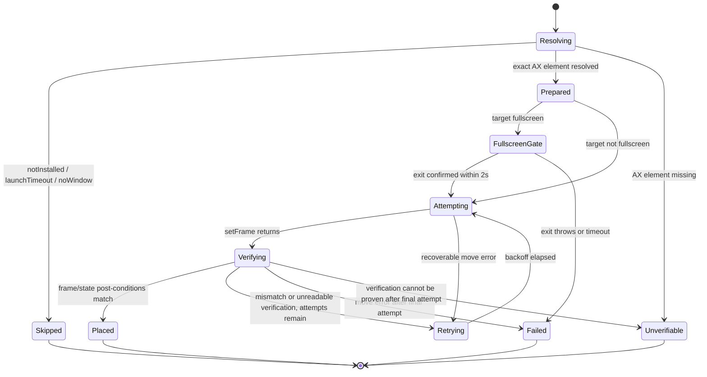
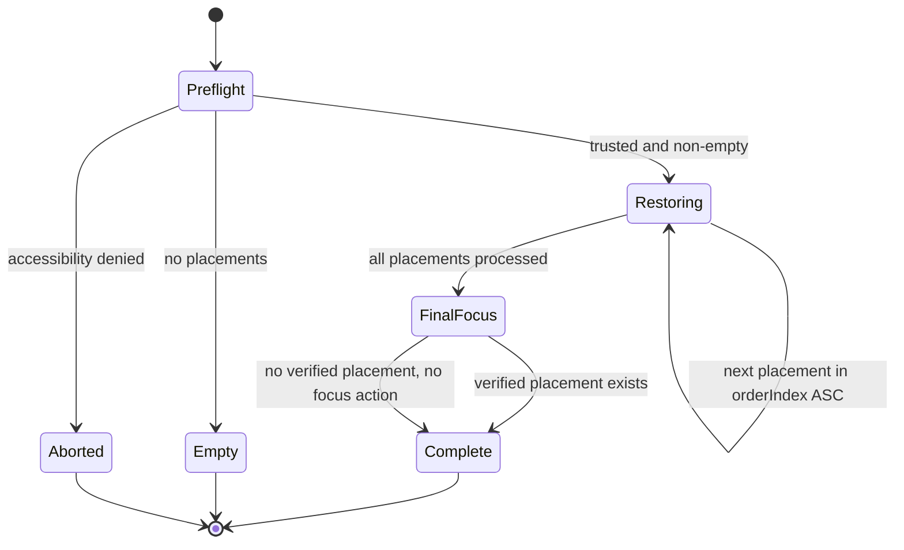
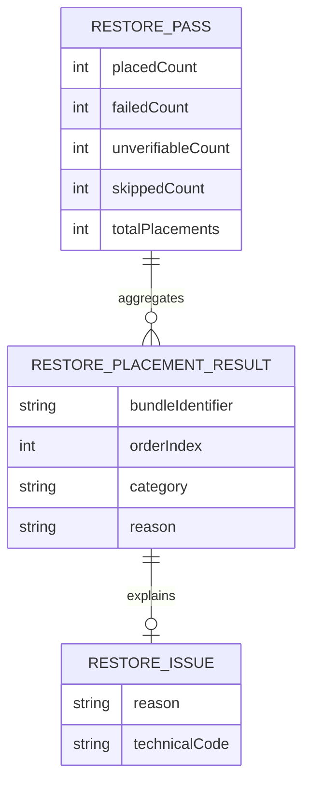

# Domain Model: Verified Workspace Restoration Enhancement (US-WORK-011)

- **Feature**: `workspace-restore-verification`
- **Stage**: BA Pipeline — Stage 4: Domain Modeling
- **Baseline**: Enhancement to signed-off `workspace-snapshot-restoration` v1.0
- **Scope**: P0 manual restore from Menu Bar/Settings; reusable core/service seam

## 1. Actors & RBAC

FlowSnap is a local single-user macOS application. There is one touched role:

| Role | Create/trigger restore | View summary | Edit/delete workspace | Share/export |
|---|---:|---:|---:|---:|
| Local macOS user | Yes | Yes | Existing behavior | No |

There are no guests, remote tenants, administrators, or cross-user access rules.
The enhancement never expands access to another user's windows or data.

## 2. Entities and value objects

### `RestorePlacementResult`

One immutable result for one `WindowPlacement`, carrying the bundle identifier,
`orderIndex`, category (`placed`, `failed`, `unverifiable`, or `skipped`), and a
typed reason for non-placed outcomes.

### `WindowVerificationResult`

An immutable post-condition snapshot:

```swift
struct WindowVerificationResult {
    let frameMatches: Bool
    let isMinimized: Bool
    let isFullscreen: Bool

    var isPlacementVerified: Bool {
        frameMatches && !isMinimized && !isFullscreen
    }
}
```

`isPlacementVerified` proves geometry and exposed AX state only; it never proves
membership in the Space currently visible to the user.

### `MoveOutcome`

The internal result of a placement operation sequence:

```swift
enum MoveOutcome {
    case moved
    case failed(Error)
    case unverifiable
}
```

The orchestration maps this internal result to `RestorePlacementResult` and
`RestoreSummary`; callers do not need to know retry mechanics.

### `RestoreVerificationPolicy`

Named immutable policy values:

```swift
enum RestoreVerificationPolicy {
    static let frameTolerance: CGFloat = 30
    static let maxAttempts = 3
    static let retryBackoff: [Duration] = [.milliseconds(100), .milliseconds(200)]
    static let fullscreenTimeout: Duration = .seconds(2)
    static let fullscreenPollInterval: Duration = .milliseconds(100)
}
```

These values are P0 contract values, not user settings.

## 3. State machines

### 3.1 Per-placement lifecycle



`ResolvedWindow.element == nil` transitions directly to `Unverifiable`; no
resolve-by-frame fallback is allowed in P0. Fullscreen failure occurs before any
placement attempt.

### 3.2 Restore pass lifecycle



There is no P0 cancellation transition. Pass-level AX denial remains
`RestoreError.accessibilityDenied`; placement-level issues never abort the pass.

## 4. Business rules & algorithms

**BR-WRV-001 — Verification is the source of truth.** A placement is `placed`
only if actual frame and exposed AX state satisfy all verification predicates.
AX `setFrame` success alone is insufficient.

**BR-WRV-002 — Frame tolerance.** For target and actual `CGRect`s, each of
`origin.x`, `origin.y`, `width`, and `height` must differ by no more than
`RestoreVerificationPolicy.frameTolerance` (30 points).

**BR-WRV-003 — State predicates.** A verified placement must have
`frameMatches == true`, `isMinimized == false`, and `isFullscreen == false`.
Display intersection is diagnostic only and cannot satisfy verification.

**BR-WRV-004 — Exact AX target.** An operation requires the `AXUIElement` paired
with the resolved snapshot. A missing element yields
`.unverifiablePlacement` and no `setFrame` call.

**BR-WRV-005 — Bounded retry.** Each placement has at most three total attempts.
Move errors and verification mismatches use 100ms after attempt 1 and 200ms
after attempt 2. No delay follows attempt 3.

**BR-WRV-006 — Non-recoverable stop.** AX target disappearance, an explicit
fullscreen transition timeout, or another error classified non-recoverable ends
the placement without blind retries. The technical error is logged locally.

**BR-WRV-007 — Fullscreen preparation gate.** For a fullscreen target, invoke
the synchronous throwing `exitFullScreen`, poll `isFullScreen` every ~100ms for
at most 2 seconds, and call `setFrame` only after a confirmed false state. A
throw or timeout yields `.fullscreenTransitionTimeout` and zero placement
attempts.

**BR-WRV-008 — Sequential ordering.** Process placements in ascending
`orderIndex`, one at a time. Do not activate or reveal individual apps during
the loop.

**BR-WRV-009 — Final focus.** After all placements, choose the verified result
with the lowest `orderIndex`. Perform at most one best-effort reveal/focus for
that target. If no result is verified, perform no reveal/focus. Reveal/focus
does not alter placement classification.

**BR-WRV-010 — Typed outcome accounting.** For `n` placements,
`placedCount + failedCount + unverifiableCount + skippedCount == n`. The summary
retains separate issue collections for failed, unverifiable, and skipped items;
`skipped` is not a catch-all.

**BR-WRV-011 — Failure reason taxonomy.** P0 distinguishes `.moveFailed`,
`.unverifiablePlacement`, `.fullscreenTransitionTimeout`, `.notInstalled`,
`.launchTimeout`, and `.noWindow`. Discovery/launch reasons are skipped before
placement; move and verification reasons are failed/unverifiable categories.

**BR-WRV-012 — Privacy-safe diagnostics.** Local logs may include bundle ID,
phase, reason, attempt, and technical error/code. Never log window title,
window content, UI text, screenshots, or other user data. Reuse an existing
logging abstraction when present.

**BR-WRV-013 — Additive compatibility.** No workspace JSON migration is needed.
Existing workspace placement data remains readable; in-memory summary/API
consumers are updated together.

**BR-WRV-014 — No P0 cancellation.** Restore cancellation and progress
propagation are deferred; bounded timing keeps this pass finite.

## 5. Workflow and edge-case resolution

1. Check Accessibility trust; abort before any move if denied.
2. Sort placements by `orderIndex` and resolve an exact AX element for each.
3. Launch missing apps using existing `ApplicationLaunching` behavior and retain
   `.notInstalled`, `.launchTimeout`, or `.noWindow` before placement.
4. Unminimize only the target window. If fullscreen, pass the fullscreen gate.
5. Attempt move and verify frame/state; retry recoverable failures/mismatches
   within the bounded policy.
6. Record a typed per-placement result and continue to the next placement.
7. Choose one final verified target for best-effort reveal/focus.
8. Publish the aggregate summary to the existing banner and preserve its
   auto-dismiss behavior.

Edge cases:

- **Silent AX ignore:** success return + old frame becomes a verification
  mismatch; retries occur; final result is `.unverifiablePlacement` and is not
  counted as placed.
- **Unreadable frame:** `frame(of:) == nil` is never success; after allowed
  attempts it is unverifiable.
- **Minimized after move:** frame match plus minimized state fails verification;
  retry while recoverable, then fail/unverify per observed cause.
- **Fullscreen remains true:** no `setFrame` is attempted; timeout reason is
  recorded.
- **Missing exact element:** no move and no frame-based guess.
- **Several apps fail:** remaining placements still run; counters and issue
  groups expose partial restore.
- **Cross-Space window:** geometry/state verification may succeed, but summary
  never claims current-Space visibility. Any reveal/focus is best-effort.
- **Repeated restore click:** existing `restoringID` guard prevents concurrent
  passes; no new cancellation state is introduced.

## 6. Data model, deletion, and privacy



These are ephemeral in-memory value objects. They are not persisted, hard- or
soft-deleted, and have no retention/purge schedule. `Workspace` JSON remains
the only durable data and is unchanged by this P0. Logs follow the existing
local log retention policy and contain no window/user content.

## 7. UX, NFR, accessibility, and observability

- **Feedback:** Reuse `RestoreSummaryBanner`; show placed, failed,
  unverifiable, and skipped groups and reasons. Keep current auto-dismiss and
  non-blocking behavior, including partial failures.
- **Loading:** Existing restore-in-progress state disables duplicate actions;
  no new screen or cancellation control is introduced.
- **Performance:** Fullscreen polling ≤2s per target at ~100ms intervals;
  placement retries add at most 300ms of backoff per placement, plus existing
  app launch timeout. Work is sequential and bounded by these budgets.
- **Security:** Use public AX/AppKit APIs only. Preserve existing trust
  preflight and exact-element seam; no private Space APIs or frame guessing.
- **i18n/l10n:** Preserve the current FlowSnap localization baseline; no new
  localization system is introduced in P0.
- **Accessibility:** Preserve existing banner semantics, keyboard behavior,
  VoiceOver labels, contrast, and sizing conventions. No new interactive
  surface is added.
- **Observability:** Local structured diagnostics at resolve/prepare/place/
  verify/final-focus phases using the existing logger abstraction; no telemetry
  or user-content capture.

## 8. Architecture seam and ADR

`WorkspaceManager` owns the deep restore orchestration and returns one aggregate
summary. `AccessibilityService` owns AX reads/writes and exposes the minimal
`isFullScreen` query. `WindowManager` remains the manipulation adapter and no
longer hides transition synchronization behind a fixed sleep. Verification and
retry stay behind the core restore interface so future hotkey/preset/group
callers reuse the same behavior.

See [`adr/0008-verified-workspace-restoration.md`](../../../adr/0008-verified-workspace-restoration.md)
for the architecture decision and trade-offs.
