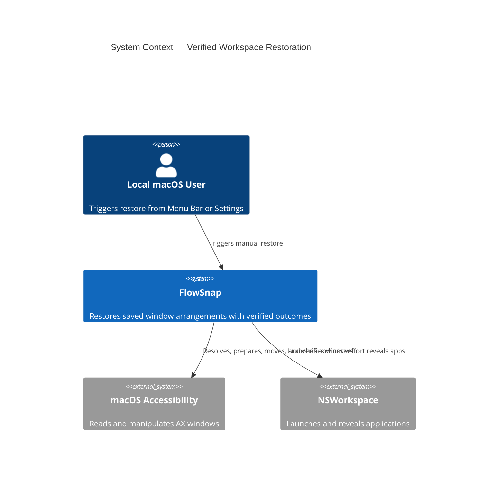
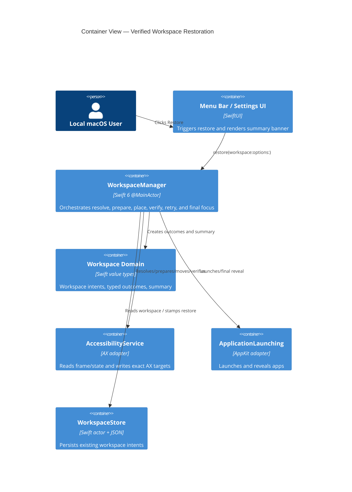

# Implementation Plan: Verified Workspace Restoration

**Feature Slug:** `workspace-restore-verification`  
**Date:** 2026-09-02  
**Spec:** [`spec.md`](spec.md)  
**Baseline:** SIGNED-OFF v1.0

## Summary

Harden manual workspace restore so success is based on verified AX post-
conditions rather than write-return values. Centralize fullscreen polling,
exact-element placement, bounded retry, typed summary accounting, and one final
focus in the existing `WorkspaceManager` seam; preserve workspace JSON and the
existing banner.

## Technical Context

**Language/Version:** Swift 6.0  
**Primary Dependencies:** macOS Accessibility (`AXUIElement`), AppKit/
SwiftUI, existing FlowSnap modules; no new external dependency  
**Storage:** Existing actor-backed JSON workspace store; no schema change  
**Testing:** Swift Testing/XCTest via `xcodebuild test`, SwiftLint strict  
**Target Platform:** macOS 14+  
**Project Type:** Native desktop application / menu-bar utility  
**Performance Goals:** Fullscreen polling 100ms up to 2s; ≤3 placement attempts
with 100/200ms backoff; sequential deterministic restore  
**Constraints:** Swift 6 strict concurrency; public APIs only; no fixed 700ms
sync; no P0 cancellation; no user-content logging; files <800 LOC/functions
<50 LOC  
**Scale/Scope:** One local user; multi-app/multi-window workspaces; P0 manual
restore only

## Constitution Check

No `.specify/memory/constitution.md` exists. Apply repository governance from
`AGENTS.md`, `CONTEXT.md`, and ADR-0008:

- **Pass:** signed-off baseline and spec precede implementation.
- **Pass:** deep seam remains `WorkspaceManager`; AX is behind
  `AccessibilityService`; no duplicate Space mechanism.
- **Pass:** immutable result values, explicit errors, boundary validation, and
  strict concurrency are planned.
- **Pass:** TDD/test-plan-before-code, no private APIs, no autonomous git writes.
- **Pass:** P0 scope excludes picker app names, cancellation, and speculative
  Cross-Space APIs.

## Architecture Diagrams

### C4 Level 1 — System Context

### C4 Level 2 — Container View

### Module Boundary Map

| Module | Responsibility | Public Interface | Depends On |
|---|---|---|---|
| `WorkspaceManager` | Deep restore orchestration and aggregate result | `WorkspaceRestoring.restore` | AX, WindowManager, DisplayManager, Launcher, Store |
| `RestoreSummary` domain | Immutable counters/issues/reasons | `RestoreSummary`, `RestorePlacementResult` | Foundation |
| `AccessibilityService` | AX frame/state adapter | `isFullScreen`, `frame`, `setFrame`, `exitFullScreen` | ApplicationServices |
| `WindowManager` | Exact AX move adapter | `move(..., element:)` | AccessibilityService |
| `RestoreSummaryBanner` | Non-blocking grouped feedback | `View(summary:)` | SwiftUI, RestoreSummary |
| `ApplicationLaunching` | Launch and final reveal adapter | Existing protocol | NSWorkspace, AccessibilityService |

## Implementation phases

### Phase 0 — Research (complete)

Research decisions are recorded in [`research.md`](research.md).

### Phase 1 — Domain and interfaces

1. Extend summary/reason/result value types and compatibility computed views.
2. Add `RestoreVerificationPolicy` and pure frame/state verification helpers.
3. Add `AccessibilityService.isFullScreen` and update AX implementation/mocks.
4. Adjust `WindowManager` so fullscreen synchronization is observable by restore
   and the fixed 700ms sleep is removed.

### Phase 2 — Core restore slice

1. Refactor `WorkspaceManager+Restore` into resolve → prepare → place/verify.
2. Enforce exact AX element (nil → unverifiable, no frame fallback).
3. Add bounded retry and recoverable/non-recoverable error classification.
4. Process sequentially, aggregate typed counters, and perform one final focus.
5. Keep Cross-Space as a documented spike only.

### Phase 3 — UI and diagnostics

1. Update `RestoreSummaryBanner` grouping/details while preserving behavior.
2. Route allowed diagnostics through the existing logger abstraction.
3. Verify existing localization/accessibility semantics.

### Phase 4 — Tests and validation

1. Write P0 failing tests from the test plan before implementation.
2. Add silent-ignore, nil-frame, minimized/fullscreen, retry, timeout, ordering,
   summary, final-focus, privacy, and regression coverage.
3. Run build, full test suite, strict lint, and quickstart checks.

## Constitution Check (post-design)

All gates remain passing: no schema migration, no external dependency, no
private API, no new shallow wrapper, explicit failure handling, and testable
injected seams. Implementation can proceed after task decomposition.
