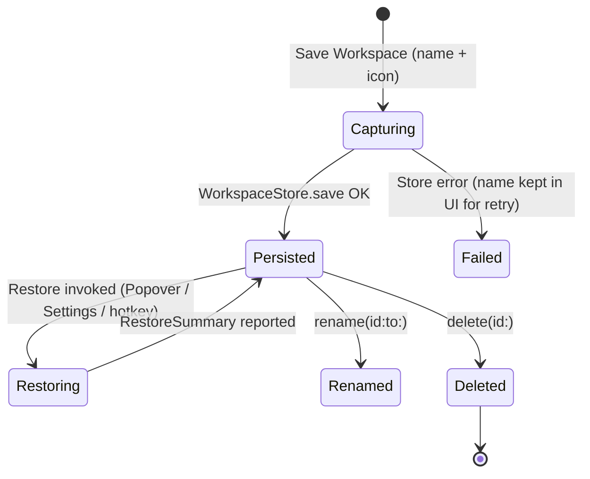
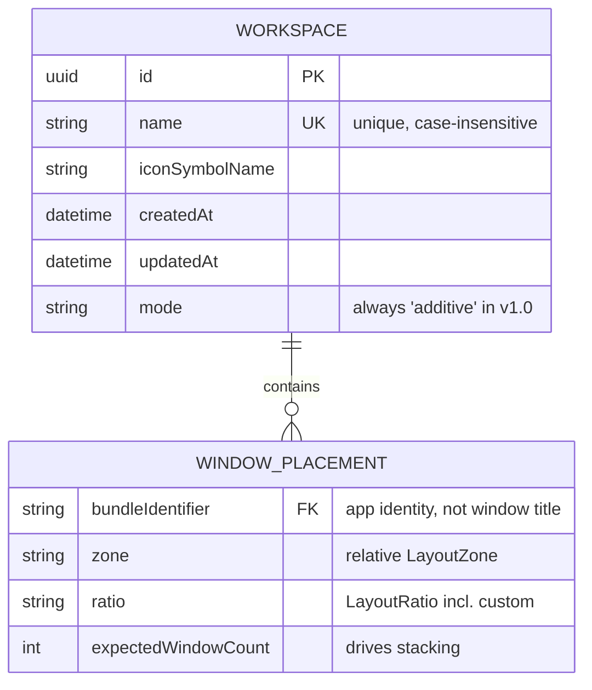

# Domain Model: Workspace Snapshot & Intent-Based Multi-Window Restoration (US-WORK-011)

- **Feature**: `workspace-snapshot-restoration`
- **Stage**: BA Pipeline — Stage 4: Domain Modeling
- **Anchors**: ASM-WORK-001 (auto-launch), ASM-WORK-002 (count-aware mapping), ASM-WORK-003 (additive restore)

---

## 1. Entities & Value Objects

### 1.1 `Workspace` (Aggregate Root Entity)

A named, intent-based snapshot of a multi-window arrangement. Stores intent, never pixels.

```swift
public struct Workspace: Identifiable, Codable, Hashable, Sendable {
    public let id: UUID
    public var name: String                       // user-facing, e.g. "Coding"
    public var iconSymbolName: String             // SF Symbol, e.g. "hammer.fill"
    public var createdAt: Date
    public var updatedAt: Date
    public var placements: [WindowPlacement]      // 1 per app, count-aware (ASM-WORK-002)
    public var mode: WorkspaceMode                // v1.0 always .additive (ASM-WORK-003)
}

public enum WorkspaceMode: String, Codable, Sendable {
    case additive      // v1.0 only value; .exclusive reserved for v1.1
}
```

### 1.2 `WindowPlacement` (Value Object)

Intent for one app: bundle identifier → relative zone/ratio region. No pixel coordinates.

```swift
public struct WindowPlacement: Codable, Hashable, Sendable {
    public let bundleIdentifier: String           // e.g. "com.apple.Terminal"
    public let zone: LayoutZone                   // relative region (LayoutEngine math)
    public let ratio: LayoutRatio                 // custom ratios & gaps supported (US-SNAP-008)
    public let expectedWindowCount: Int           // captured at save; drives stacking (ASM-WORK-02)
}
```

### 1.3 `WorkspaceStore` (Persistence Actor)

Actor-backed JSON store — hard rule from `00-tech-context.md`. Single writer to `workspaces.json`.

```swift
public actor WorkspaceStore {
    public init(fileURL: URL = defaultURL)        // ~/Library/Application Support/FlowSnap/workspaces.json
    public func loadAll() async throws -> [Workspace]
    public func save(_ workspace: Workspace) async throws      // upsert by id
    public func delete(id: UUID) async throws
    public func rename(id: UUID, to name: String) async throws
}
```

### 1.4 `WorkspaceManager` (Mapping Engine, @MainActor Observable)

Orchestrates save/restore. Depends on `WindowRegistry`, `AXAccessibilityService`, `LayoutEngine`, `DisplayManager`, `WorkspaceStore`.

```swift
@MainActor @Observable
public final class WorkspaceManager {
    public func captureCurrentArrangement(named: String, icon: String) async throws -> Workspace
    public func restore(_ id: UUID) async -> RestoreSummary
    public func deleteWorkspace(_ id: UUID) async
    public var workspaces: [Workspace]            // reactive list for Popover + SettingsView
}

public struct RestoreSummary: Sendable {
    public let restoredCount: Int                 // e.g. 2
    public let totalCount: Int                    // e.g. 3
    public let skipped: [SkippedApp]              // e.g. [SkippedApp(name: "VS Code", reason: .notRunning)]
}

public struct SkippedApp: Sendable {
    public let bundleIdentifier: String
    public let reason: SkipReason                 // .notInstalled, .launchTimeout, .noWindowAppeared
}
```

## 2. State Machines

### 2.1 Workspace Lifecycle



### 2.2 Restore Dispatch (per app, ASM-WORK-001)

```mermaid
stateDiagram-v2
    [*] --> CheckingApp: For each WindowPlacement
    CheckingApp --> ResolvingWindows: App running (WindowRegistry lookup)
    CheckingApp --> Launching: Not running → NSWorkspace.open
    Launching --> ResolvingWindows: First window observed via AX (≤10s)
    Launching --> Skipped: Not installed / timeout (~10s)
    ResolvingWindows --> Placing: ≥1 window found
    ResolvingWindows --> Skipped: 0 windows after wait
    Placing --> Done: Primary → zone; extras stacked in same zone (ASM-WORK-002)
    Skipped --> Done: Recorded in RestoreSummary
    Done --> [*]
```

## 3. Business Rules (BR-WORK-###)

| Rule ID | Title | Statement & Invariant |
| :--- | :--- | :--- |
| **BR-WORK-001** | Intent, Not Pixels | `WindowPlacement` stores only bundle-id → relative zone/ratio. Hard pixel coordinates are forbidden in `workspaces.json` so layouts stay portable across displays of any size. |
| **BR-WORK-002** | Count-Aware Mapping | Save captures `expectedWindowCount` per app. At restore, the primary window takes the placement zone; extra same-bundle-id windows are stacked/cascaded sequentially inside the same zone (ASM-WORK-002). |
| **BR-WORK-003** | Auto-Launch Missing Apps | If an app is not running at restore, launch via `NSWorkspace.open` (public API), wait ≤10s for first window via AX observation, then place it (ASM-WORK-001). |
| **BR-WORK-004** | Graceful Skip & Report | If an app is not installed, or launch/first-window times out, skip it and report in `RestoreSummary` ("Restored 2/3 — VS Code not running"). Never block or fail the whole restore. |
| **BR-WORK-005** | Additive Restore | Restore arranges only windows belonging to the workspace; all other windows remain untouched in v1.0 (ASM-WORK-003). `mode` field reserved for v1.1 `exclusive`. |
| **BR-WORK-006** | Actor-Backed Persistence | All reads/writes go through `WorkspaceStore` actor to `~/Library/Application Support/FlowSnap/workspaces.json`. No direct file I/O from UI or manager. Additive schema — no migration of US-SNAP-010 UserDefaults keys. |
| **BR-WORK-007** | Current-Display Restore | Restore maps placements onto the current display's `visibleBounds` via `DisplayManager`/`CoordinateTransformer` — never the display geometry captured at save time. |
| **BR-WORK-008** | Unique Workspace Names | `name` is unique among persisted workspaces; `WorkspaceStore.save` rejects duplicates (case-insensitive) with a typed error surfaced in the Save flow. |
| **BR-WORK-009** | Atomic Durable Writes | `WorkspaceStore` writes via temp-file + rename (atomic). Corrupt/unreadable JSON degrades to empty list + typed error, never a crash. |
| **BR-WORK-010** | Zero Private API | Restore uses only public APIs (`NSWorkspace.open`, AX). No CGS/undocumented frameworks (tech-context hard rule). |

## 4. ERD (Mermaid)



Persistence: one JSON document at `~/Library/Application Support/FlowSnap/workspaces.json` — `[Workspace]` array, additive schema, no UserDefaults migration.

## 5. UX States

| State | Surface | Behavior |
| :--- | :--- | :--- |
| Save Sheet | Popover / Settings | Name field + icon picker; Save disabled while name empty or duplicate (BR-WORK-008); inline error on store failure. |
| Workspace List | Popover / SettingsView | Reactive `workspaces` from `WorkspaceManager`; empty state with "Save current arrangement" CTA; swipe/button delete with confirmation. |
| Restoring | Popover / Settings | Progress indicator while dispatching; entry points per roadmap AC. |
| Restore Summary | Popover / Settings | "Restored 2/3 — VS Code not running" style report from `RestoreSummary`; auto-dismiss after a few seconds. |
| Store Error | Popover / Settings | Non-blocking alert on read/write failure; list falls back to empty, retry offered (BR-WORK-009). |
