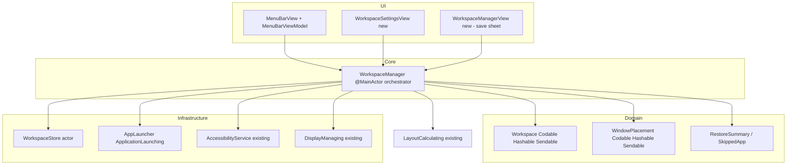
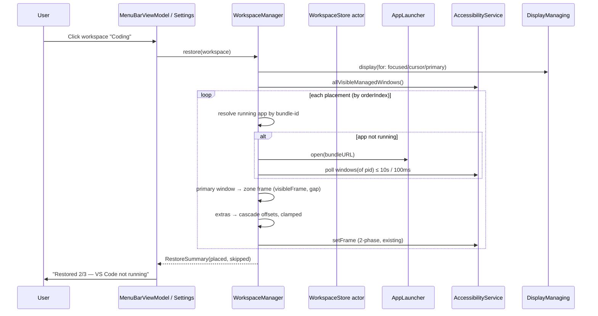

# Plan: Workspace Snapshot & Intent-Based Multi-Window Restoration (US-WORK-011)

**Feature Slug:** `workspace-snapshot-restoration`
**Baseline:** SIGNED-OFF v1.0 · **Spec:** spec.md · **Status:** pending Gate 2 approval

## 1. Component Architecture

## 2. Data Flow — Restore Sequence

## 3. Architecture Decision Records

### ADR-001: Replace `WindowPlacement.zoneID: UUID` with `zone: LayoutZone`

- **Status:** Accepted (pending Gate 2)
- **Context:** Sprint-0 stub used an opaque `UUID` zone reference that cannot map to the
  `LayoutZone` string enum that `LayoutEngine` consumes. The stub was never persisted anywhere.
- **Decision:** `WindowPlacement { bundleIdentifier: String, zone: LayoutZone, expectedWindowCount: Int, orderIndex: Int }`.
- **Consequences:** Zero-migration (nothing on disk references the stub). Direct Codable mapping
  to `LayoutZone` raw values. Portable across displays (normalized zones).

### ADR-002: Window enumeration via existing `AccessibilityService.allVisibleManagedWindows()`

- **Status:** Accepted (pending Gate 2)
- **Context:** Save needs all visible windows with bundle-ids; restore needs windows of a pid.
  `WindowManaging` only exposes `focusedWindow()`.
- **Decision:** `WorkspaceManager` depends on `AccessibilityService` (already a public Sendable
  protocol with `allVisibleManagedWindows()` and `windows(of:)`) instead of widening `WindowManaging`.
- **Consequences:** No protocol churn; tests use the existing `MockAccessibilityService`.
  Core now references the AX abstraction protocol — consistent with `DragToSnapCoordinator`.

### ADR-003: `WorkspaceStore` becomes an actor; layouts stubs removed

- **Status:** Accepted (pending Gate 2)
- **Context:** Stub is a `final class` with TODOs and a force-unwrap `.first!` (DoD violation).
  Roadmap mandates an actor-backed JSON store for workspaces.
- **Decision:** `actor WorkspaceStore` with async `loadWorkspaces()/saveWorkspaces()` +
  `loadWorkspace(id:)`, `deleteWorkspace(id:)`, `upsert`. Atomic write = write temp file in the
  same directory, then `rename`. Corrupt JSON → return empty + set `lastError` typed error.
  The unused `layouts.json` stub methods are deleted (never implemented, no callers).
- **Consequences:** All call sites become `await`. Force-unwrap eliminated. Directory creation
  is idempotent inside the actor.

### ADR-004: App launching behind `ApplicationLaunching` protocol

- **Status:** Accepted (pending Gate 2)
- **Context:** Auto-launch (ASM-WORK-001) must be unit-testable without spawning real apps.
- **Decision:** `protocol ApplicationLaunching: Sendable { func openApp(withBundleIdentifier: String) async -> Bool; func waitForFirstWindow(pid:pid_t, timeout:TimeInterval) async -> Bool }` —
  production impl wraps `NSWorkspace.shared.urlForApplication(withBundleIdentifier:)` +
  `NSWorkspace.shared.open` + AX polling; tests inject a mock.
- **Consequences:** Deterministic tests for timeout/skip paths; zero private API.

## 4. Module Placement (Deep Modules)

| Layer | File | Responsibility |
|---|---|---|
| Domain | `FlowSnap/Domain/Workspace/Workspace.swift` | Aggregate root (existing, add Sendable + schemaVersion) |
| Domain | `FlowSnap/Domain/Workspace/WindowPlacement.swift` | Value object (ADR-001 reshape) |
| Domain | `FlowSnap/Domain/Workspace/RestoreSummary.swift` | Restore outcome + `SkippedApp` reasons |
| Core | `FlowSnap/Core/Workspace/WorkspaceManager.swift` | Save/restore orchestration, zone inference, cascade math |
| Infrastructure | `FlowSnap/Infrastructure/Persistence/WorkspaceStore.swift` | Actor JSON persistence (ADR-003) |
| Infrastructure | `FlowSnap/Infrastructure/macOS/AppLauncher.swift` | NSWorkspace wrapper (ADR-004) |
| UI | `FlowSnap/UI/Workspace/WorkspaceSaveSheet.swift` | Name + icon capture |
| UI | `FlowSnap/UI/Workspace/WorkspaceListView.swift` | Popover list section |
| UI | `FlowSnap/UI/Settings/WorkspaceSettingsView.swift` | Settings tab (list/rename/delete/restore) |

## 5. Risks & Mitigations (from 04-risk-register.md)

- AX launch hang → hard 10s timeout, 100ms poll, self-terminating.
- Cross-display drift → normalized zones + current visibleFrame recompute (mandatory test E8).
- JSON corruption → atomic writes + typed error + empty-list degradation.
- Actor races → single actor owns file I/O; no shared mutable state.
- Cascade overflow → clamp offsets to zone bounds (test E9).
