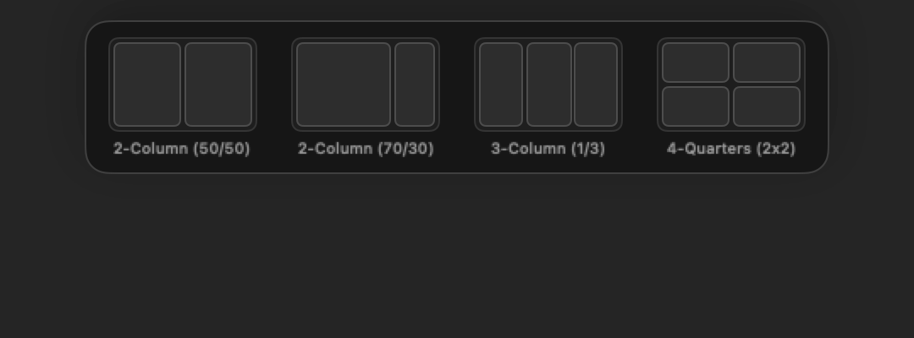
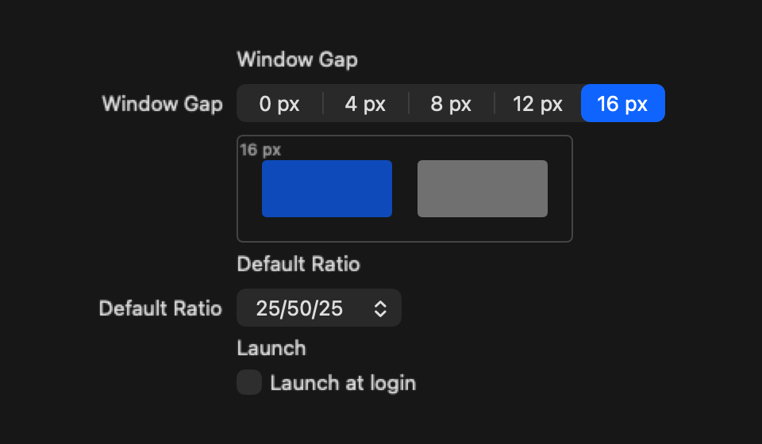
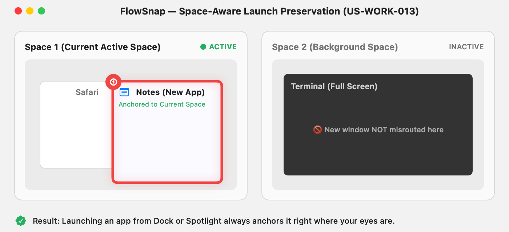
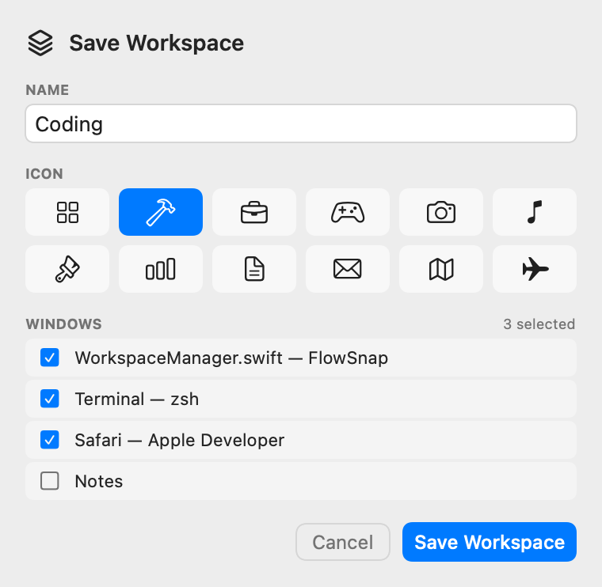
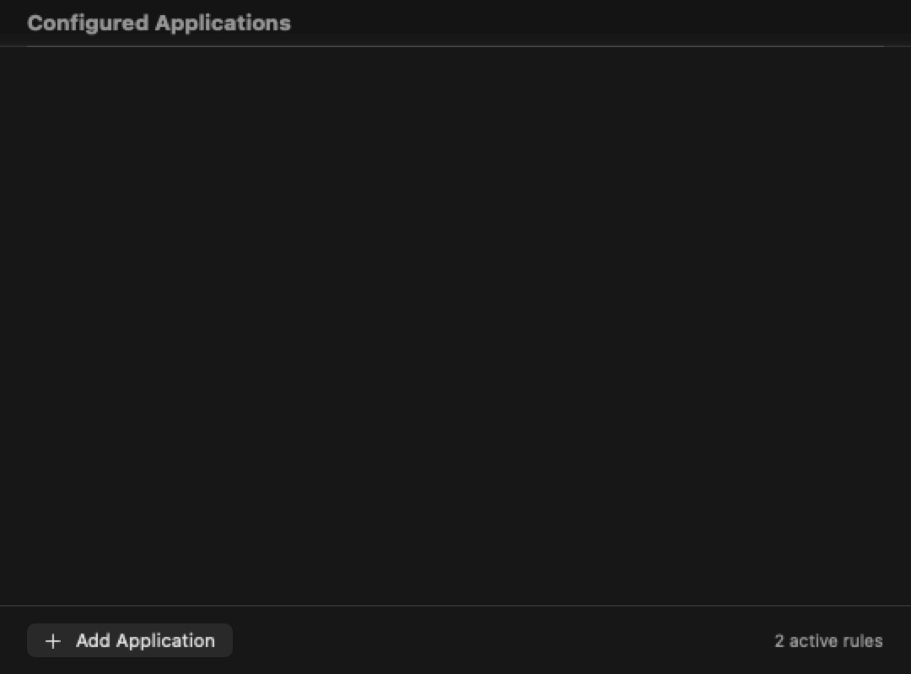
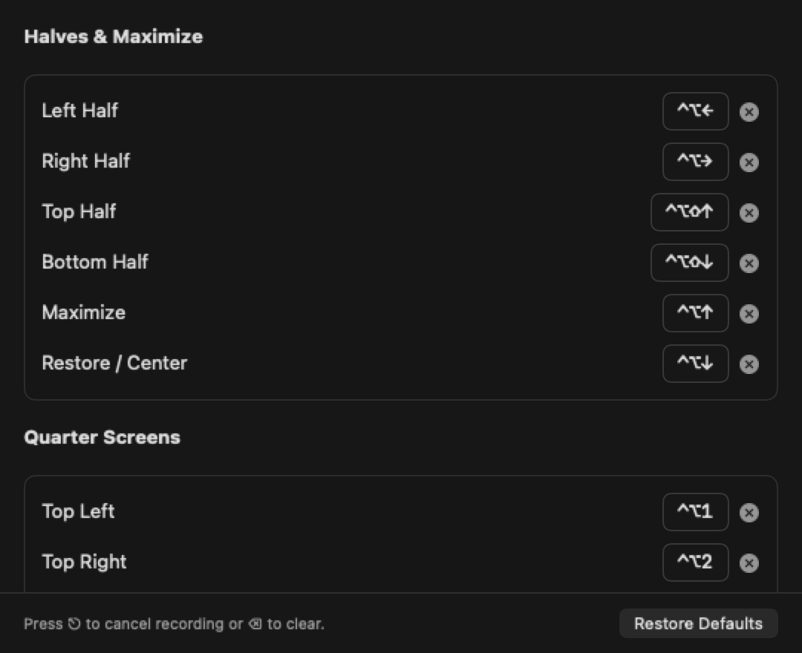
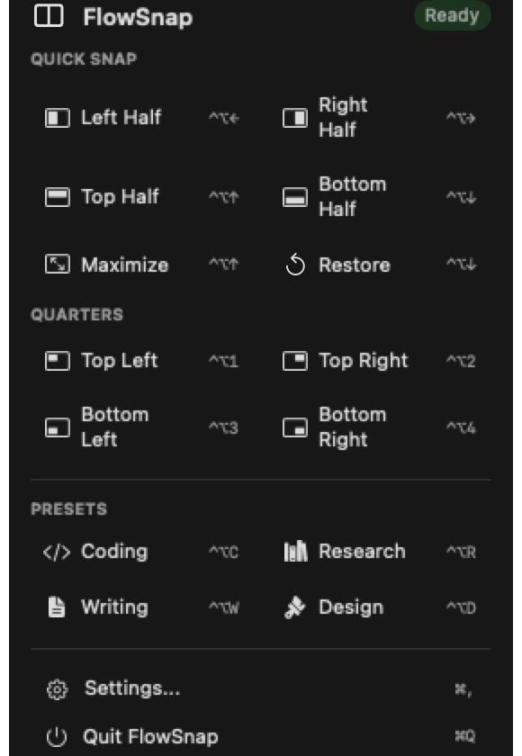

# FlowSnap 🪟⚡

<p align="center">
  <strong>Your Mac. Your Layout. Your Flow.</strong><br>
  <em>Ứng dụng quản lý cửa sổ và điều phối không gian làm việc (Workspace OS) Native cho macOS, xây dựng trên nền tảng Swift 6.</em>
</p>

<p align="center">
  <a href="README.md">🇬🇧 English</a> •
  <a href="https://github.com/ahauy/FlowSnap/releases/latest/download/FlowSnap.dmg"><strong>📥 Tải về (.dmg)</strong></a> •
  <a href="#tính-năng-nổi-bật">Tính năng</a> •
  <a href="#hướng-dẫn-cài-đặt--khởi-chạy">Cài đặt & Chạy</a> •
  <a href="#bảng-phím-tắt-mặc-định">Phím tắt</a> •
  <a href="#kiến-trúc-kỹ-thuật--tiêu-chuẩn-kỹ-nghệ">Kiến trúc</a> •
  <a href="#danh-mục-tài-liệu-tham-khảo">Tài liệu</a>
</p>

<p align="center">
  
  
  
  
  
  
</p>

<p align="center">
  <a href="https://github.com/ahauy/FlowSnap/releases/latest/download/FlowSnap.dmg">
    
  </a>
  <a href="https://github.com/ahauy/FlowSnap/releases/latest">
    
  </a>
</p>

<p align="center">
  📥 <strong>Tải về trực tiếp:</strong> <a href="https://github.com/ahauy/FlowSnap/releases/latest/download/FlowSnap.dmg"><strong>FlowSnap.dmg (Bản mới nhất v1.3.1)</strong></a> • <a href="https://github.com/ahauy/FlowSnap/releases/latest">Ghi chú phát hành</a><br>
  ⚡ <strong>Cài đặt nhanh 1 dòng lệnh Terminal:</strong> <code>/bin/bash -c "$(curl -fsSL https://raw.githubusercontent.com/ahauy/FlowSnap/main/scripts/install.sh)"</code><br>
  <em>~ Tương thích macOS 14.0 Sonoma trở lên (Apple Silicon & Intel) ~</em>
</p>

---

## 🌟 Vì sao cần FlowSnap?

Trải nghiệm quản lý cửa sổ mặc định trên macOS thường khiến người dùng phải kéo thả thủ công, dùng Split View gò bó hoặc liên tục vật lộn với Mission Control.

Đặc biệt, một trong những "nỗi đau" lớn nhất làm đứt gãy mạch tập trung là **tình trạng tự động nhảy Space**: khi bạn mở một ứng dụng mới, macOS thường tự ý đẩy bạn sang một Desktop/Space khác.

**FlowSnap** giải quyết triệt để vấn đề này với một nguyên tắc cốt lõi duy nhất:

> **Người dùng quyết định cửa sổ ở đâu. FlowSnap lo phần còn lại.**

FlowSnap kết hợp trải nghiệm trực quan của **Bảng chọn bố cục cạnh trên (Top-Edge Snap Flyout)** với hệ thống **Workspace theo ý định (Intent-Based Workspace)** được thiết kế tối ưu riêng cho hệ sinh thái Mac.

---

## ✨ Tính Năng Nổi Bật

### 1. 🪟 Bộ Chọn Bố Cục Cạnh Trên (Top-Edge Snap Layout Picker)

Chỉ cần kéo bất kỳ cửa sổ nào lên sát mép trên cùng màn hình, bảng chọn layout sẽ trượt xuống ngay tức khắc. Rê chuột vào các ô chia màn hình (50/50, 70/30, 3 cột, 4 góc) và thả tay để snap cửa sổ vào đúng vị trí mong muốn.

<p align="center">
  
</p>

---

### 2. ⚡ Kéo-Thả Snap Trực Quan Kèm HUD Preview Thời Gian Thực

Kéo cửa sổ vào các cạnh hoặc góc màn hình để kích hoạt khung hình mờ (HUD preview) hiển thị trước vùng đáp với hiệu ứng chuyển động lò xo (spring physics) siêu mượt. Thả chuột để snap; kéo ra xa để hủy lệnh.

<p align="center">
  
</p>

---

### 3. ↔️ Thay Đổi Kích Thước Thích Ứng (Collinear Dividers) & Window Gaps

Không còn cảnh phải chỉnh kích thước thủ công từng cửa sổ liền kề! FlowSnap tự động phát hiện đường biên phân cách chung (collinear shared dividers) giữa các cửa sổ đã chia. Khi kéo đường biên này, cả 2 cửa sổ sẽ đồng thời thay đổi kích thước mượt mà ở tần số quét 60 FPS.

Hỗ trợ tùy chỉnh khoảng đệm bên trong và bên ngoài (Inner / Outer Window Gaps) mang lại góc làm việc hiện đại, thoáng đãng.

<p align="center">
  
</p>

---

### 4. 🪐 Khóa Không Gian Hiện Tại (Current Space Anchoring)

Loại bỏ hoàn toàn cảm giác khó chịu khi bị macOS "văng" sang Space khác. FlowSnap liên tục theo dõi tiến trình khởi chạy của các ứng dụng và bảo đảm rằng cửa sổ mới mở luôn **xuất hiện ngay tại Space và Màn hình bạn đang làm việc** mà không cần can thiệp vào bất kỳ Private API nào của Apple.

<p align="center">
  
</p>

---

### 5. 🗂️ Quản Lý Không Gian Theo Ý Định (Intent-Based Workspaces) & Presets

Lưu lại toàn bộ bố cục nhiều cửa sổ của bạn thành các **Workspace** có tên gọi (ví dụ: _Coding_, _Research_, _Writing_). Workspaces lưu trữ theo **ý định hình học (intent)** thay vì tọa độ pixel cứng nhắc, giúp khôi phục hoàn hảo trên nhiều kích thước màn hình hoặc khi cắm thêm màn hình ngoài.

- **Bộ Preset mẫu tích hợp sẵn**: Cấu hình nhanh cho các luồng công việc phổ biến (Lập trình, Nghiên cứu tài liệu).
- **Nhóm cửa sổ liên kết (Linked Window Groups)**: Nhóm các cửa sổ liên quan để thu nhỏ hoặc di chuyển đồng bộ.

<p align="center">
  
</p>

---

### 6. 📌 Quy Tắc Riêng Cho Từng Ứng Dụng (Per-App Rules) & Smart Floating Stack

Thiết lập quy tắc riêng biệt cho từng ứng dụng dựa trên Bundle ID:

- **Floating (Cửa sổ nổi)**: Giữ các ứng dụng tiện ích nhỏ (Máy tính, Từ điển, Ghi chú) luôn nổi trên các cửa sổ đang chia lưới.
- **Remember Position (Ghi nhớ vị trí)**: Tự động ghi nhớ vị trí đóng gần nhất và kẹp an toàn trong vùng nhìn thấy của màn hình.
- **Assigned Layout (Bố cục cố định)**: Cố định vị trí cho các ứng dụng như Slack, Discord hay Spotify vào một ô màn hình cụ thể.
- **Smart Focus Stack**: Khi đóng ứng dụng nổi tạm thời, FlowSnap tự động trả tiêu điểm bàn phím (focus) về cửa sổ chính đang làm việc bên dưới.

<p align="center">
  
</p>

---

### 7. ⌨️ Phím Tắt Toàn Cục & Điều Khiển Nhanh Trên Menu Bar

Snap cửa sổ ngay lập tức thông qua phím tắt toàn hệ thống với độ trễ cực thấp (Carbon Event Hotkeys). Tích hợp giao diện bắt phím trực quan phát hiện xung đột và menu bar daemon tinh gọn.

<p align="center">
  
  
</p>

---

## 🏗️ Kiến Trúc Kỹ Thuật & Tiêu Chuẩn Kỹ Nghệ

FlowSnap được thiết kế theo tiêu chuẩn phần mềm cao cấp, ứng dụng triệt để kiến trúc hướng tên miền (Domain-Driven Design - DDD) và nguyên lý _Deep Modules_ (John Ousterhout).

```
FlowSnap/
├── Domain/           # Nghiệp vụ thuần túy, tính toán hình học, chuyển đổi tọa độ (Zero OS deps)
│   ├── Model/        # ManagedWindow, LayoutZone, Workspace, AppPolicyRule
│   ├── Services/     # SnapEngine, LayoutEngine, CollinearEdgeDetector
│   └── Ports/        # AccessibilityServing, DisplayManaging, GlobalHotkeyManaging
├── Core/             # Điều phối trạng thái & các dịch vụ nghiệp vụ trọng tâm
│   ├── Workspace/    # WorkspaceManager, PresetResolver, WindowGroupManager
│   ├── Policy/       # WindowPolicyManager, SmartFocusStack, FrameClampingHelper
│   └── Dispatcher/   # CommandDispatcher, LiveResizeThrottler
├── Infrastructure/   # Cầu nối tới các dịch vụ hệ thống của macOS
│   ├── Accessibility/# Adapter cho AXUIElement, vòng đời AXObserver
│   ├── Hotkey/       # Carbon RegisterEventHotKey daemon
│   ├── Display/      # AppKit NSScreen observer & cấu trúc màn hình
│   └── Persistence/  # Lưu trữ JSON nguyên tử & PreferencesStore UserDefaults
└── UI/               # Giao diện khai báo SwiftUI & các NSPanel chuyên dụng
    ├── SnapPreview/  # Panel hiển thị khung mờ preview không kích hoạt focus
    ├── LayoutPicker/ # Bảng chọn layout cạnh trên tương tác trực quan
    ├── MenuBar/      # NSStatusItem & popover điều khiển nhanh
    └── Settings/     # Cửa sổ cài đặt đa tab & bộ thu phím tùy biến
```

### Cam Kết Về Chất Lượng

- **100% Swift 6.0 Concurrency**: Cô lập Actor toàn diện, đồng bộ giao diện trên `@MainActor`, hợp đồng dữ liệu chuẩn `Sendable`. Triệt tiêu hoàn toàn lỗi Race Condition.
- **100% Zero Private APIs**: Kiểm tra tự động bằng kịch bản quét symbol (`audit-no-private-apis.sh`). Tuyệt đối không dùng API riêng (`CGS*`/`SLS*`). Sẵn sàng cho Hardened Runtime và Apple Notarization.
- **Hệ thống Kiểm thử Toàn diện**: **358 bài kiểm thử tự động** trong 55 test suites sử dụng Swift Testing (`@Test`) và XCTest cùng các đối tượng giả lập (Mock Doubles).
- **Hiệu Năng Cực Cao**: Phản hồi snap dưới **1ms**; kéo rê viền cửa sổ duy trì ổn định **60 FPS**; mức tiêu thụ CPU ở trạng thái chờ là **~0.0%**.

---

## 🚀 Hướng Dẫn Cài Đặt & Khởi Chạy

### Yêu Cầu Hệ Thống

- **macOS 14.0 (Sonoma)** hoặc **macOS 15.0+ (Sequoia)**
- Tương thích hoàn hảo Apple Silicon (M1/M2/M3/M4) và Intel (x86_64)

---

### Dành Cho Người Dùng: Tải & Cài Đặt

#### Cách 1: Cài Đặt 1 Dòng Lệnh Qua Terminal (Nhanh nhất ⚡)

Mở Terminal và dán câu lệnh duy nhất này để script tự động tải bản DMG mới nhất, cài vào `/Applications`, gỡ Gatekeeper và mở FlowSnap:

```bash
/bin/bash -c "$(curl -fsSL https://raw.githubusercontent.com/ahauy/FlowSnap/main/scripts/install.sh)"
```

---

#### Cách 2: Tải Trực Tiếp Cho macOS (.dmg) 📥

Bấm vào link bên dưới để trình duyệt bật ngay cửa sổ lưu file tải về:

<p align="center">
  <a href="https://github.com/ahauy/FlowSnap/releases/latest/download/FlowSnap.dmg">
    <strong>Tải về cho macOS (FlowSnap.dmg)</strong>
  </a><br>
  <em>~ Tương thích macOS 14.0 Sonoma trở lên (Apple Silicon & Intel) ~</em>
</p>

1. Trình duyệt của bạn sẽ tự động bật popup hỏi nơi lưu file **`FlowSnap.dmg`** (như cửa sổ Save file trong macOS).
2. Sau khi tải xong, nhấp đúp để mở file `.dmg` và kéo biểu tượng **FlowSnap** vào thư mục **Applications**.

---

#### Cách 3: Tự Đóng Gói File DMG Từ Mã Nguồn

Nếu bạn muốn tự tay biên dịch bản phát hành `.dmg`:

```bash
git clone https://github.com/ahauy/FlowSnap.git
cd FlowSnap
./scripts/build-dmg.sh
open build/FlowSnap-*.dmg
```

---

### Cách 2: Biên Dịch Từ Mã Nguồn (Xcode)

1. Cài đặt **Xcode 16+** và công cụ **XcodeGen**:

   ```bash
   brew install xcodegen
   ```

2. Sinh dự án Xcode và biên dịch:

   ```bash
   xcodegen generate
   xcodebuild -project FlowSnap.xcodeproj -scheme FlowSnap -destination 'platform=macOS' build
   ```

3. Mở ứng dụng FlowSnap:
   ```bash
   open $(find ~/Library/Developer/Xcode/DerivedData/FlowSnap-*/Build/Products/Debug -name "FlowSnap.app" | head -n 1)
   ```

---

### 🛡️ Cấp Quyền Trợ Năng (Accessibility Permission)

FlowSnap sử dụng Accessibility API chính thống của macOS để di chuyển và thay đổi kích thước các cửa sổ ứng dụng.

1. Khi mở ứng dụng lần đầu, nhấn nút **Open System Settings** trên thông báo.
2. Chuyển đến mục **Privacy & Security → Accessibility**.
3. Bật công tắc cho phép **FlowSnap**.

> [!TIP]
> **Khắc phục lỗi cache quyền:** Nếu sau khi build lại code mà macOS vẫn báo chưa cấp quyền (`Untrusted`), chạy lệnh sau trong Terminal để đặt lại cache quyền TCC:
>
> ```bash
> tccutil reset Accessibility com.flowsnap.app
> ```

---

## ⌨️ Bảng Phím Tắt Mặc Định

| Thao Tác                          | Phím Tắt Mặc Định | Mô Tả                                                |
| :-------------------------------- | :---------------: | :--------------------------------------------------- |
| **Chia Đôi Trái**                 |      `⌥ ⌃ ←`      | Snap cửa sổ vào nửa bên trái màn hình                |
| **Chia Đôi Phải**                 |      `⌥ ⌃ →`      | Snap cửa sổ vào nửa bên phải màn hình                |
| **Chia Đôi Trên**                 |      `⌥ ⌃ ↑`      | Snap cửa sổ vào nửa trên màn hình                    |
| **Chia Đôi Dưới**                 |      `⌥ ⌃ ↓`      | Snap cửa sổ vào nửa dưới màn hình                    |
| **Phóng To Cửa Sổ**               |      `⌥ ⌃ ↩`      | Phóng to cửa sổ vừa khít màn hình hiển thị           |
| **Khôi Phục Kích Thước**          |      `⌥ ⌃ ⌫`      | Trả cửa sổ về kích thước và vị trí trước khi snap    |
| **Căn Giữa Màn Hình**             |      `⌥ ⌃ C`      | Đưa cửa sổ vào chính giữa màn hình                   |
| **Chuyển Màn Hình Kế Tiếp**       |      `⌥ ⌃ ⇥`      | Đưa cửa sổ đang chọn sang màn hình tiếp theo         |
| **Chuyển Màn Hình Trước Đó**      |     `⌥ ⌃ ⇧ ⇥`     | Đưa cửa sổ đang chọn sang màn hình trước đó          |
| **Lưu Không Gian Làm Việc**       |      `⌥ ⌃ S`      | Mở hộp thoại lưu nhanh Workspace hiện tại            |
| **Khôi Phục Không Gian Làm Việc** |      `⌥ ⌃ R`      | Khôi phục hoặc chuyển đổi qua lại giữa các Workspace |

_Mọi phím tắt đều có thể tùy chỉnh hoặc tắt đi trong mục **Preferences → Shortcuts**._

---

## 🧪 FlowSnapLab (Công Cụ Kiểm Thử Tương Tác Dành Cho Lập Trình Viên)

Dự án FlowSnap đi kèm target **FlowSnapLab** — một ứng dụng kiểm thử độc lập cho phép chẩn đoán quyền trợ năng, kiểm tra tọa độ hiển thị và thử nghiệm các thuật toán chia màn hình trực tiếp.

Để chạy FlowSnapLab:

```bash
xcodebuild -project FlowSnap.xcodeproj -scheme FlowSnapLab -destination 'platform=macOS' build
open $(find ~/Library/Developer/Xcode/DerivedData/FlowSnap-*/Build/Products/Debug -name "FlowSnapLab.app" | head -n 1)
```

---

## 📚 Danh Mục Tài Liệu Tham Khảo

- 📖 [**Product Roadmap & Requirements**](docs/PRODUCT_BACKLOG_ROADMAP.md) — Đặc tả toàn bộ 12 Epic và triết lý sản phẩm.
- 🧩 [**Chỉ mục Đặc Tả Kỹ Thuật (Feature Specs)**](docs/features/README.md) — Tài liệu kỹ thuật chi tiết cho từng tính năng đã hoàn thiện.
- 🖼️ [**Hướng Dẫn Sử Dụng (User Guides)**](docs/user-guides/README.md) — Hướng dẫn trực quan kèm ảnh chụp màn hình.
- 📐 [**Quyết Định Kiến Trúc (ADR)**](adr/) — Các biên bản quyết định kiến trúc nền tảng (ADR-0001 đến ADR-0010).
- 🧪 [**Hướng Dẫn Kiểm Thử Nhanh (Run & Test Guide)**](docs/RUN_AND_TEST.md) — Tổng hợp các lệnh terminal thao tác nhanh.
- 💬 [**Từ Điển Ngôn Ngữ Chung (Ubiquitous Language)**](CONTEXT.md) — Bảng quy ước thuật ngữ chuyên ngành toàn dự án.

---

## 🤝 Đóng Góp Phát Triển (Contributing)

Mọi đóng góp, báo cáo lỗi hoặc đề xuất tính năng mới đều luôn được hoan nghênh!

1. Fork dự án về tài khoản của bạn.
2. Tạo nhánh tính năng mới (`git checkout -b feature/tinh-nang-moi`).
3. Đảm bảo toàn bộ test case đều vượt qua: `xcodebuild -project FlowSnap.xcodeproj -scheme FlowSnapTests test`.
4. Commit thay đổi theo chuẩn conventional commits.
5. Tạo Pull Request mô tả rõ thay đổi của bạn.

---

## 👤 Tác Giả

**Vũ Tuấn Hậu** ([@ahauy](https://github.com/ahauy))

---

## 📄 Giấy Phép (License)

Dự án được phát hành theo giấy phép **MIT License** — xem chi tiết tại file [LICENSE](LICENSE).
