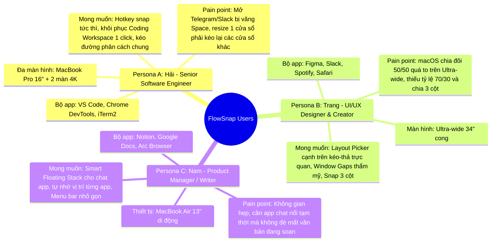
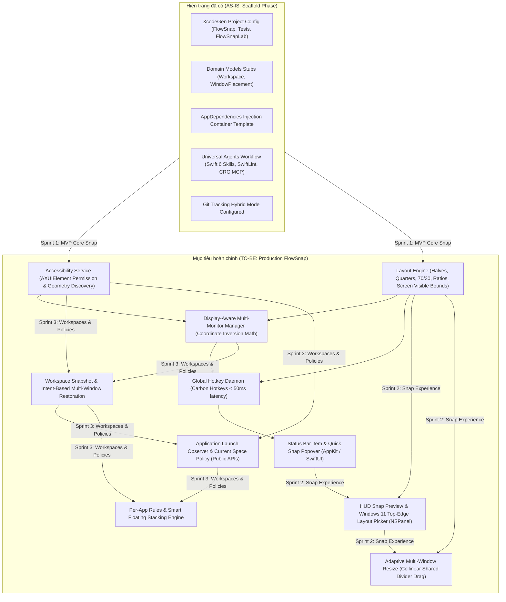
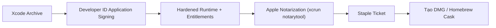

# 📋 FlowSnap — Product Backlog, Business Requirements & Execution Roadmap

> **Phiên bản:** 1.0.0  
> **Vai trò:** Senior Business Analyst (BA), Product Owner (PO) & macOS System Architect  
> **Trạng thái tài liệu:** Tài liệu sống (Living Document) — Quản lý tiến độ phát triển và điều phối tự động cho AI Agent  
> **Ký hiệu trạng thái:**
>
> - `[x]` **Hoàn thành (Done)** — Đã kiểm thử đầy đủ, pass chất lượng, tài liệu và test suite hoàn chỉnh.
> - `[/]` **Đang triển khai (In Progress)** — Đang phát triển hoặc đang trong giai đoạn phỏng vấn BA / Spec.
> - `[ ]` **Chưa triển khai (To Do / Backlog)** — Đã có đặc tả nghiệp vụ, sẵn sàng lên kế hoạch sprint.
> - `[!]` **Bị chặn / Cần làm rõ (Blocked / Review Needed)** — Phụ thuộc module khác hoặc cần quyết định kiến trúc/nghiệp vụ.
> - `[~]` **Dự kiến dài hạn (Deferred / Future Phase)** — Nghiệp vụ giai đoạn sau (V2.0+).

---

## 📑 Mục lục

- [📋 FlowSnap — Product Backlog, Business Requirements \& Execution Roadmap](#-flowsnap--product-backlog-business-requirements--execution-roadmap)
  - [📑 Mục lục](#-mục-lục)
  - [1. Tầm nhìn sản phẩm \& Chân dung người dùng](#1-tầm-nhìn-sản-phẩm--chân-dung-người-dùng)
    - [1.1. Tầm nhìn (Product Vision)](#11-tầm-nhìn-product-vision)
    - [1.2. Chân dung người dùng mục tiêu (User Personas)](#12-chân-dung-người-dùng-mục-tiêu-user-personas)
  - [2. Phân tích hiện trạng AS-IS vs TO-BE](#2-phân-tích-hiện-trạng-as-is-vs-to-be)
  - [3. Bảng ma trận ưu tiên MoSCoW \& RICE](#3-bảng-ma-trận-ưu-tiên-moscow--rice)
  - [4. Phân rã nghiệp vụ chi tiết \& Checklist công việc](#4-phân-rã-nghiệp-vụ-chi-tiết--checklist-công-việc)
    - [Sprint 0: Project Setup \& Architecture Baseline](#sprint-0-project-setup--architecture-baseline)
    - [EPIC 01: Accessibility Permission \& Focused Window Discovery](#epic-01-accessibility-permission--focused-window-discovery)
    - [EPIC 02: Core Layout Calculation \& Basic Snap Engine](#epic-02-core-layout-calculation--basic-snap-engine)
    - [EPIC 03: Display-Aware Coordinate System \& Multi-Monitor Support](#epic-03-display-aware-coordinate-system--multi-monitor-support)
    - [EPIC 04: Global Hotkeys \& Command Dispatcher Daemon](#epic-04-global-hotkeys--command-dispatcher-daemon)
    - [EPIC 05: Menu Bar Status Item \& Quick Snap Controls](#epic-05-menu-bar-status-item--quick-snap-controls)
    - [EPIC 06: Interactive Drag-to-Snap \& HUD Snap Preview Overlay](#epic-06-interactive-drag-to-snap--hud-snap-preview-overlay)
    - [EPIC 07: Windows 11-Style Top-Edge Snap Layout Picker](#epic-07-windows-11-style-top-edge-snap-layout-picker)
    - [EPIC 08: Adaptive Multi-Window Resize (Shared Collinear Divider) \& Gaps](#epic-08-adaptive-multi-window-resize-shared-collinear-divider--gaps)
    - [EPIC 09: SwiftUI Settings UI \& Custom Shortcut Management](#epic-09-swiftui-settings-ui--custom-shortcut-management)
    - [EPIC 10: Workspace Snapshots \& Intent-Based Multi-Window Restoration](#epic-10-workspace-snapshots--intent-based-multi-window-restoration)
    - [EPIC 11: Application Launch Observer \& Current Space Preservation](#epic-11-application-launch-observer--current-space-preservation)
    - [EPIC 12: Per-App Window Policies \& Smart Floating Stacking](#epic-12-per-app-window-policies--smart-floating-stacking)
  - [4.2. Giai đoạn 2: Advanced Ecosystem, Multi-Monitor Mastery \& Flow Continuity (Phase 2 Backlog)](#42-giai-đoạn-2-advanced-ecosystem-multi-monitor-mastery--flow-continuity-phase-2-backlog)
    - [EPIC 13: Advanced Multi-Monitor Topology \& Cross-Display Navigation (Hỗ trợ Màn hình rời Toàn diện)](#epic-13-advanced-multi-monitor-topology--cross-display-navigation-hỗ-trợ-màn-hình-rời-toàn-diện)
    - [EPIC 14: Stage Manager Co-existence \& Universal Fullscreen Escape (Tương thích Stage Manager \& Thoát Full Screen)](#epic-14-stage-manager-co-existence--universal-fullscreen-escape-tương-thích-stage-manager--thoát-full-screen)
    - [EPIC 15: Universal Always-On-Top Pinning \& Stage Manager Launch Co-existence (Ghim Cửa sổ Luôn Trên Cùng \& Hòa hợp Stage Manager)](#epic-15-universal-always-on-top-pinning--stage-manager-launch-co-existence-ghim-cửa-sổ-luôn-trên-cùng--hòa-hợp-stage-manager)
  - [5. Lộ trình phát hành theo Giai đoạn \& Sprint](#5-lộ-trình-phát-hành-theo-giai-đoạn--sprint)
  - [6. Quy chuẩn định nghĩa hoàn thành (Definition of Done - DoD)](#6-quy-chuẩn-định-nghĩa-hoàn-thành-definition-of-done---dod)
  - [7. Phân tích Kỹ thuật Chuyên sâu, Rủi ro Hệ thống \& Kế hoạch Phát hành](#7-phân-tích-kỹ-thuật-chuyên-sâu-rủi-ro-hệ-thống--kế-hoạch-phát-hành)
    - [7.1. Hệ tọa độ ngược giữa AppKit và Accessibility API](#71-hệ-tọa-độ-ngược-giữa-appkit-và-accessibility-api)
    - [7.2. Giới hạn macOS Spaces \& Nguyên tắc Zero Private API](#72-giới-hạn-macos-spaces--nguyên-tắc-zero-private-api)
    - [7.3. Ngân sách độ trễ \& Tối ưu hiệu năng (Performance Latency Budget)](#73-ngân-sách-độ-trễ--tối-ưu-hiệu-năng-performance-latency-budget)
    - [7.4. Kế hoạch Đóng gói \& Ký số macOS (Code Signing, Notarization \& Distribution)](#74-kế-hoạch-đóng-gói--ký-số-macos-code-signing-notarization--distribution)
  - [📝 Hướng Dẫn Vận Hành Cho AI Agent (`/command-continue-project`)](#-hướng-dẫn-vận-hành-cho-ai-agent-command-continue-project)

---

## 1. Tầm nhìn sản phẩm & Chân dung người dùng

### 1.1. Tầm nhìn (Product Vision)

> **"Your Mac. Your Layout. Your Flow."**  
> **Người dùng quyết định cửa sổ ở đâu. FlowSnap lo phần còn lại.**

Trải nghiệm quản lý cửa sổ mặc định của macOS yêu cầu người dùng phải kéo thả thủ công, dùng Split View gò bó hoặc vật lộn với Mission Control / Spaces. Đặc biệt, một ức chế lớn là khi mở một ứng dụng mới, macOS thường tự động đẩy người dùng sang một Space khác ngoài ý muốn làm đứt gãy mạch tập trung.

**FlowSnap** là tiện ích Native macOS kết hợp giữa:

1. **Snap Layouts trực quan kiểu Windows 11**: Kéo thả vào mép màn hình hoặc kéo lên cạnh trên để bật bộ chọn Layout Picker nhiều ô trực quan.
2. **Hệ điều hành không gian làm việc (Personal Workspace OS)**: Lưu lại bố cục nhiều cửa sổ theo **ý định (intent)** thay vì tọa độ pixel tĩnh, cho phép khôi phục không gian làm việc đa màn hình chỉ bằng một phím tắt.
3. **Bảo toàn mạch làm việc (Flow Preservation)**: Giữ ứng dụng mới mở luôn xuất hiện tại không gian làm việc hiện tại, hỗ trợ cửa sổ nổi tạm thời (Smart Floating Stack) mà không phá vỡ bố cục các ứng dụng đang làm việc bên dưới.

### 1.2. Chân dung người dùng mục tiêu (User Personas)



- **Persona A — Hải (Senior Software Engineer):** Sử dụng MacBook kết nối 2 màn hình ngoài 4K. Cần phím tắt snap cực nhanh, không có độ trễ. Rất bực bội khi mỗi lần mở app chat hay terminal thì bị macOS chuyển desktop sang Space khác. Cần tính năng khôi phục trọn gói bộ 3 app (VS Code + Chrome + Terminal) đúng tỷ lệ 60/25/15.
- **Persona B — Trang (UI/UX Designer & Creator):** Làm việc trên màn hình Ultra-wide 34". Cần các tỷ lệ chia không gian bất đối xứng (70/30, 3 cột ngang) và tính năng kéo đường phân cách chung (Adaptive multi-window resize) để các app liền kề tự co giãn đồng bộ. Thích giao diện tinh tế, có khoảng hở viền (Window Gap) đồng điệu phong cách Apple.
- **Persona C — Nam (Product Manager & Researcher):** Di chuyển liên tục với MacBook Air 13". Không gian màn hình hạn chế nên cần chế độ chia nửa 50/50 nhanh, gán app chat vào chế độ Floating để check tin nhắn xong là quay về văn bản mà không vỡ cửa sổ đang đọc.

---

## 2. Phân tích hiện trạng AS-IS vs TO-BE



---

## 3. Bảng ma trận ưu tiên MoSCoW & RICE

| Mã Epic         | Tên Nghiệp vụ / Tính năng                                 |     MoSCoW      | Reach | Impact | Confidence | Effort | RICE Score |        Mức ưu tiên         | Target Sprint |
| :-------------- | :-------------------------------------------------------- | :-------------: | :---: | :----: | :--------: | :----: | :--------: | :------------------------: | :-----------: |
| **EPIC-01**     | Trợ năng & Nhận diện Cửa sổ Trọng tâm (AX Discovery)      |  **Must-Have**  |  10   |  3.0   |    100%    |  1.0   |  **30.0**  |      **P0 (Blocker)**      |   Sprint 1    |
| **EPIC-02**     | Động cơ Tính toán Bố cục Snap Cơ bản (Core Layout Engine) |  **Must-Have**  |  10   |  3.0   |    100%    |  1.5   |  **20.0**  |     **P0 (Core USP)**      |   Sprint 1    |
| **EPIC-03**     | Nhận diện & Thao tác Cửa sổ Đa Màn hình (Multi-Monitor)   |  **Must-Have**  |   8   |  2.5   |    90%     |  1.5   |  **12.0**  |       **P0 (High)**        |   Sprint 1    |
| **EPIC-04**     | Phím tắt Toàn cục & Hệ thống Điều phối (Global Hotkeys)   |  **Must-Have**  |  10   |  3.0   |    95%     |  1.5   |  **19.0**  |       **P0 (Core)**        |   Sprint 1    |
| **EPIC-05**     | Menu Bar Status Item & Bảng Điều khiển Nhanh              |  **Must-Have**  |   9   |  2.0   |    100%    |  1.0   |  **18.0**  |     **P0 (Usability)**     |   Sprint 1    |
| **EPIC-06**     | Kéo Thả Cạnh Màn hình & Lớp Phủ Xem trước (HUD Preview)   | **Should-Have** |   8   |  2.0   |    90%     |  2.0   |  **7.2**   |    **P1 (Experience)**     |   Sprint 2    |
| **EPIC-07**     | Snap Layout Picker Cạnh Trên (Windows 11-style)           | **Should-Have** |   8   |  2.5   |    85%     |  2.5   |  **6.8**   |  **P1 (Differentiator)**   |   Sprint 2    |
| **EPIC-08**     | Tỷ lệ Tùy chỉnh (60/40, 70/30) & Window Gaps Thẩm mỹ      | **Should-Have** |   7   |  1.5   |    95%     |  1.5   |  **6.6**   |      **P1 (Visual)**       |   Sprint 2    |
| **EPIC-09**     | Kéo Đường Phân cách Chung (Adaptive Divider Resize)       | **Could-Have**  |   6   |  2.0   |    80%     |  3.0   |  **3.2**   |     **P2 (Advanced)**      |   Sprint 2    |
| **EPIC-10**     | Cài đặt SwiftUI & Tùy biến Phím tắt (Settings & Config)   | **Should-Have** |   8   |  1.5   |    95%     |  1.5   |  **7.6**   |     **P1 (Settings)**      |   Sprint 2    |
| **EPIC-11**     | Lưu & Khôi phục Bố cục Workspace theo Ý định (Workspaces) | **Should-Have** |   8   |  3.0   |    100%    |  2.5   |  **9.1**   |   **P1 (Hero Feature)**    |  Sprint 3 ✅  |
| **EPIC-12**     | Nhóm Cửa sổ & Workspace Presets (Coding, Research)        | **Should-Have** |   7   |  2.0   |    90%     |  1.5   |  **8.4**   |     **P1 (Value-Add)**     |   Sprint 3    |
| **EPIC-13**     | Phát hiện Mở Ứng dụng & Giữ ở Workspace Hiện tại          |  **Must-Have**  |   9   |  3.0   |    85%     |  2.5   |  **9.1**   |   **P0 (Hero Feature)**    |   Sprint 3    |
| **EPIC-14**     | Quy tắc Riêng theo Ứng dụng & Cửa sổ Nổi (Floating Stack) | **Should-Have** |   7   |  2.0   |    90%     |  2.0   |  **6.3**   |    **P1 (Flexibility)**    |   Sprint 3    |
| **US-SNAP-024** | Khởi động cùng macOS qua SMAppService (Launch at Login)   |  **Must-Have**  |  10   |  2.5   |    100%    |  1.0   |  **25.0**  | **P0 (Utility Essential)** |  Sprint 7 ⏳  |

---

## 4. Phân rã nghiệp vụ chi tiết & Checklist công việc

### Sprint 0: Project Setup & Architecture Baseline

_Mục tiêu: Thiết lập hạ tầng mã nguồn, cấu hình XcodeGen, bộ quy chuẩn kiến trúc Deep Modules và công cụ kiểm thử._

- [x] **SETUP-001: Khởi tạo project XcodeGen đa mục tiêu (`project.yml`)**
  - **AC:** Sinh project Xcode với 3 targets: `FlowSnap` (app chính), `FlowSnapTests` (unit tests), `FlowSnapLab` (môi trường thử nghiệm trực tiếp).
  - **Tasks:**
    - [x] Cấu hình `project.yml` với macOS deployment target 14.0+, Swift 6.0, Hardened Runtime.
    - [x] Tạo khung thư mục Deep Modules: `Domain/`, `Core/`, `Infrastructure/`, `UI/`, `App/`.

- [x] **SETUP-002: Tích hợp Universal Agents Workflow & SwiftLint**
  - **AC:** Kích hoạt bộ quy chuẩn Swift 6 strict concurrency, rules kiểm soát memory leak và boundary linter `.swiftlint.yml`.
  - **Tasks:**
    - [x] Nạp các skills chuyên biệt: `swift-patterns`, `swiftui-patterns`, `swift-concurrency`, `swift-protocol-di-testing`, `swift-actor-persistence`.
    - [x] Cấu hình `.swiftlint.yml` chặn force unwrap/try/cast, giới hạn độ dài hàm/tệp.

- [x] **SETUP-003: Code Intelligence MCP Server (`code-review-graph`)**
  - **AC:** AST SQLite graph được xây dựng và đăng ký vào `.agents/mcp_config.json`, hỗ trợ subagent truy vấn blast-radius tối ưu token.
  - **Tasks:**
    - [x] Chạy `uvx code-review-graph install -y` và `build` lập chỉ mục 48 tệp mã nguồn.
    - [x] Thiết lập `.gitignore` theo chế độ Hybrid Mode (bảo vệ private engine, theo dõi specs/docs).

---

### EPIC 01: Accessibility Permission & Focused Window Discovery

_Mục tiêu: Đảm bảo FlowSnap có đầy đủ quyền Trợ năng (Accessibility) của macOS và truy vấn chính xác thông tin hình học của cửa sổ đang active._

- [x] **US-SNAP-001: Trợ năng & Nhận diện Cửa sổ Trọng tâm (Accessibility & Focused Window Discovery)**
  - **Slug:** `accessibility-window-discovery`
  - **Effort:** S
  - **Context-budget:** single-session
  - **Priority:** Must-Have (P0)
  - **Depends-on:** _(none)_
  - **Blocks:** `US-SNAP-002`
  - **Mô tả:** Kiểm tra và hướng dẫn cấp quyền macOS Accessibility (AXUIElement), phát hiện và đọc thông tin hình học (frame, bounds, pid, title) của cửa sổ đang active.
  - **Acceptance Criteria (AC):**
    - [x] `AccessibilityService` kiểm tra `AXIsProcessTrustedWithOptions`; nếu chưa có quyền, mở popup hướng dẫn và liên kết trực tiếp tới System Settings > Privacy & Security > Accessibility.
    - [x] Khi đã được cấp quyền, hàm `focusedWindow()` truy vấn `kAXFocusedWindowAttribute` từ frontmost application và trả về thực thể `ManagedWindow`.
    - [x] Đọc chính xác thuộc tính vị trí (`kAXPositionAttribute`) và kích thước (`kAXSizeAttribute`).
    - [x] Lọc bỏ các cửa sổ hệ thống không hợp lệ (Spotlight, Notification Center, context menus) và phân loại đúng `WindowKind` (.normal vs .dialog/.sheet).
  - **Tasks:**
    - [x] `Domain`: Mở rộng `ManagedWindow.swift` chứa `CGWindowID`, `pid`, `title`, `frame: CGRect`, `isResizable: Bool`, `kind: WindowKind`.
    - [x] `Infrastructure`: Hiện thực hóa `AXAccessibilityService.swift` tuân thủ protocol `AccessibilityServing` (Sendable protocol).
    - [x] `Core`: Thêm `WindowRegistry.swift` (Actor) để lưu trữ danh sách cửa sổ đang theo dõi an toàn luồng.
    - [x] `FlowSnapLab`: Thêm nút kiểm tra "Check Permission" và hiển thị thông tin Focused Window thời gian thực trên lab view.
    - [x] `Tests`: Viết mock `MockAccessibilityService` và test cases kiểm thử trạng thái quyền và lọc window kind.
  - **Deliverables khi [x]:**
    - `.specify/features/accessibility-window-discovery/baseline.md` (SIGNED-OFF)
    - `docs/features/accessibility-window-discovery/README.md`
    - `docs/user-guides/accessibility-window-discovery.md`

---

### EPIC 02: Core Layout Calculation & Basic Snap Engine

_Mục tiêu: Xây dựng bộ não tính toán hình học bố cục (Layout Engine) không phụ thuộc phần cứng, hỗ trợ chia đôi, 4 góc, phóng to và khôi phục._

- [x] **US-SNAP-002: Động cơ Tính toán Bố cục Snap Cơ bản (Core Layout & Snap Engine)**
  - **Slug:** `core-layout-snap-engine`
  - **Effort:** M
  - **Context-budget:** single-session
  - **Priority:** Must-Have (P0)
  - **Depends-on:** `US-SNAP-001`
  - **Blocks:** `US-SNAP-003`
  - **Mô tả:** Tính toán hình học chính xác cho các phân vùng snap chuẩn (trái 50%, phải 50%, 4 góc 25%, maximize, restore về frame cũ) độc lập với tọa độ pixel.
  - **Acceptance Criteria (AC):**
    - [x] `LayoutEngine` tính toán chuẩn xác frame cho: Left Half (50%), Right Half (50%), Top Half (50%), Bottom Half (50%), và 4 góc (Top-Left, Top-Right, Bottom-Left, Bottom-Right - 25% mỗi góc).
    - [x] Tính toán Maximize chiếm 100% visible frame của màn hình (trừ Menu bar và Dock).
    - [x] Ghi nhớ frame trước khi snap vào `WindowRegistry` để hỗ trợ hành động Restore (khôi phục về vị trí ban đầu).
    - [x] Unit test đạt độ bao phủ 100% trên các kích thước màn hình phổ biến: 1440x900 (MacBook), 1920x1080 (FHD), 2560x1440 (2K), 3840x2160 (4K), và màn hình dọc (Portrait).
  - **Tasks:**
    - [x] `Domain`: Định nghĩa `LayoutZone.swift` enum (`leftHalf`, `rightHalf`, `topHalf`, `bottomHalf`, `topLeft`, `topRight`, `bottomLeft`, `bottomRight`, `maximize`).
    - [x] `Core`: Cài đặt `LayoutEngine.swift` thuần toán học, nhận `screenVisibleBounds: CGRect` và trả về `CGRect` đích.
    - [x] `Core`: Cài đặt `SnapEngine.swift` phối hợp giữa `LayoutEngine`, `AccessibilityService` và `WindowRegistry`.
    - [x] `FlowSnapLab`: Bổ sung các nút bấm `[Snap Left]`, `[Snap Right]`, `[Maximize]`, `[Restore]` để kiểm chứng trực quan.
    - [x] `Tests`: Bộ Swift Testing `@Test` kiểm tra toán học tọa độ với độ chính xác đến từng pixel.
  - **Deliverables khi [x]:**
    - `.specify/features/core-layout-snap-engine/baseline.md` (SIGNED-OFF)
    - `docs/features/core-layout-snap-engine/README.md`
    - `docs/user-guides/core-layout-snap-engine.md`

---

### EPIC 03: Display-Aware Coordinate System & Multi-Monitor Support

_Mục tiêu: Giải quyết bài toán hóc búa về sai lệch hệ tọa độ giữa macOS AppKit và Accessibility API trên thiết lập đa màn hình._

- [x] **US-SNAP-003: Nhận diện & Thao tác Cửa sổ trên Đa Màn hình (Display-Aware Multi-Monitor Manipulation)**
  - **Slug:** `display-aware-manipulation`
  - **Effort:** M
  - **Context-budget:** single-session
  - **Priority:** Must-Have (P0)
  - **Depends-on:** `US-SNAP-002`
  - **Blocks:** `US-SNAP-004`
  - **Mô tả:** Xác định chính xác màn hình đang chứa con trỏ/cửa sổ mục tiêu trên thiết lập đa màn hình (kể cả khác độ phân giải/Retina scale) và thực thi di chuyển/resize cửa sổ mượt mà.
  - **Acceptance Criteria (AC):**
    - [x] `DisplayManager` xác định đúng màn hình (`Display`) chứa trọng tâm của cửa sổ đang active.
    - [x] Thực hiện chuyển đổi hệ tọa độ ngược: AppKit (gốc tọa độ dưới-trái) sang Accessibility API (gốc tọa độ trên-trái của Primary Screen) chính xác 100%: $Y_{AX} = H_{Primary} - (Y_{AppKit} + Height)$.
    - [x] Hỗ trợ đa màn hình đặt cạnh nhau theo chiều ngang, chiều dọc hoặc xếp chéo với Retina scaling khác nhau (1x vs 2x).
    - [x] Lắng nghe sự kiện cắm/rút màn hình (`NSApplication.didChangeScreenParametersNotification`) và tự động cập nhật danh sách màn hình khả dụng.
  - **Tasks:**
    - [x] `Domain`: Định nghĩa `Display.swift` chứa `id: CGDirectDisplayID`, `bounds: CGRect`, `visibleFrame: CGRect`, `isPrimary: Bool`, `scaleFactor: CGFloat`.
    - [x] `Infrastructure`: Hiện thực hóa `DisplayManager.swift` đọc dữ liệu từ `NSScreen.screens` và mapping sang Domain model.
    - [x] `Core`: Hàm tiện ích chuyển đổi tọa độ `CoordinateTransformer.toAXCoordinates(from:onPrimary:)`.
    - [x] `Core`: Cập nhật `SnapEngine` sử dụng `DisplayManager` để áp dụng snap trên đúng màn hình mục tiêu.
    - [x] `Tests`: Test suite giả lập cấu hình 2 màn hình (Primary 1440x900, Secondary 4K bên phải/trên đỉnh).
  - **Deliverables khi [x]:**
    - `.specify/features/display-aware-manipulation/baseline.md` (SIGNED-OFF)
    - `docs/features/display-aware-manipulation/README.md`
    - `docs/user-guides/display-aware-manipulation.md`

---

### EPIC 04: Global Hotkeys & Command Dispatcher Daemon

_Mục tiêu: Xây dựng hệ thống phím tắt toàn cục phản hồi tức thì (< 50ms) ngay cả khi ứng dụng chạy ngầm không có cửa sổ chính._

- [x] **US-SNAP-004: Phím tắt Toàn cục & Hệ thống Điều phối Lệnh (Global Hotkeys & Command Dispatcher)**
  - **Slug:** `global-hotkeys-dispatcher`
  - **Effort:** M
  - **Context-budget:** single-session
  - **Priority:** Must-Have (P0)
  - **Depends-on:** `US-SNAP-003`
  - **Blocks:** `US-SNAP-005`
  - **Mô tả:** Đăng ký các phím tắt hệ thống toàn cục (⌃⌥←, ⌃⌥→, ⌃⌥↑, ⌃⌥↓, ⌃⌥1..4) và điều phối lệnh snap tức thì với độ trễ cực thấp (< 50ms).
  - **Acceptance Criteria (AC):**
    - [x] Đăng ký thành công các tổ hợp phím mặc định qua Carbon Event Hotkeys API:
      - `⌃⌥←` (Ctrl + Opt + Left): Snap Left 50%
      - `⌃⌥→` (Ctrl + Opt + Right): Snap Right 50%
      - `⌃⌥↑` (Ctrl + Opt + Up): Maximize
      - `⌃⌥↓` (Ctrl + Opt + Down): Restore vị trí ban đầu
      - `⌃⌥1 / 2 / 3 / 4`: Snap 4 góc (Top-Left, Top-Right, Bottom-Left, Bottom-Right)
    - [x] Độ trễ từ khi nhấn phím đến khi gửi lệnh di chuyển cửa sổ đạt dưới 50ms.
    - [x] Phím tắt hoạt động ổn định trên mọi ứng dụng (VS Code, Chrome, Terminal, Finder, Telegram...).
    - [x] `CommandDispatcher` xử lý lệnh bất đồng bộ, tuyệt đối không block Main Thread hoặc làm chậm phím gõ của người dùng.
  - **Tasks:**
    - [x] `Infrastructure`: Cài đặt `GlobalHotkeyManager.swift` sử dụng Carbon Event Handler (`RegisterEventHotKey`).
    - [x] `Core`: Cài đặt `CommandDispatcher.swift` dispatch các `SnapCommand` tới `SnapEngine`.
    - [x] `App`: Khởi tạo và liên kết hotkeys trong `AppDelegate.swift` khi ứng dụng hoàn tất khởi động.
    - [x] `Tests`: Kiểm thử CommandDispatcher với mock commands và event timing assertions.
  - **Deliverables khi [x]:**
    - `.specify/features/global-hotkeys-dispatcher/baseline.md` (SIGNED-OFF)
    - `docs/features/global-hotkeys-dispatcher/README.md`
    - `docs/user-guides/global-hotkeys-dispatcher.md`

---

### EPIC 05: Menu Bar Status Item & Quick Snap Controls

_Mục tiêu: Cung cấp điểm chạm người dùng thường trực trên thanh Menu Bar của macOS, cho phép thao tác chuột nhanh và truy cập Settings._

- [x] **US-SNAP-005: Menu Bar Item & Bảng Điều khiển Nhanh (Menu Bar Status Item & Quick Snap Controls)**
  - **Slug:** `menubar-quick-controls`
  - **Effort:** S
  - **Context-budget:** single-session
  - **Priority:** Must-Have (P0)
  - **Depends-on:** `US-SNAP-004`
  - **Blocks:** `US-SNAP-006`
  - **Mô tả:** Cung cấp biểu tượng Menu Bar thường trú trên macOS cho phép xem trạng thái ứng dụng, bấm chuột để snap nhanh cửa sổ active và mở Settings.
  - **Acceptance Criteria (AC):**
    - [x] Biểu tượng FlowSnap xuất hiện trên thanh Menu Bar (`NSStatusItem`) với icon monochrome thích ứng Dark/Light Mode.
    - [x] Ứng dụng chạy ở chế độ nền (Agent App: `LSUIElement = true`), không hiển thị icon dưới Dock.
    - [x] Nhấp chuột trái vào icon mở Menu/Popover hiển thị các nút thao tác nhanh: Snap Trái, Snap Phải, Maximize, 4 Góc kèm hiển thị phím tắt gợi ý.
    - [x] Có các mục chức năng hệ thống: Check for Updates, Settings..., Quit FlowSnap.
  - **Tasks:**
    - [x] `UI`: Thiết kế `MenuBarView.swift` bằng SwiftUI với các biểu tượng bố cục trực quan.
    - [x] `Infrastructure`: Tạo `MenuBarController.swift` quản lý vòng đời của `NSStatusItem` và `NSPopover`.
    - [x] `App`: Tích hợp vào `FlowSnapApp.swift` và cấu hình file `Info.plist` (`LSUIElement = YES`).
    - [x] `Tests`: Kiểm thử trạng thái menu bar controller và event handling.
  - **Deliverables khi [x]:**
    - `.specify/features/menubar-quick-controls/baseline.md` (SIGNED-OFF)
    - `docs/features/menubar-quick-controls/README.md`
    - `docs/user-guides/menubar-quick-controls.md`

---

### EPIC 06: Interactive Drag-to-Snap & HUD Snap Preview Overlay

_Mục tiêu: Mang lại trải nghiệm kéo thả trực quan mượt mà với lớp phủ xem trước vùng snap bán trong suốt trước khi người dùng nhả chuột._

- [x] **US-SNAP-006: Kéo Thả vào Cạnh Màn hình & Lớp Phủ Xem trước Snap (Drag-to-Snap & HUD Snap Preview)**
  - **Slug:** `drag-to-snap-preview`
  - **Effort:** M
  - **Context-budget:** single-session
  - **Priority:** Should-Have (P1)
  - **Depends-on:** `US-SNAP-005`
  - **Blocks:** `US-SNAP-007`
  - **Mô tả:** Theo dõi hành vi kéo cửa sổ sát cạnh/góc màn hình và hiển thị overlay bán trong suốt (HUD Snap Preview) mô phỏng vị trí trước khi thả chuột.
  - **Acceptance Criteria (AC):**
    - [x] Lắng nghe sự kiện di chuyển chuột toàn cục (`CGEventTap` / `NSEvent.addGlobalMonitorForEvents`) khi người dùng đang giữ kéo thanh tiêu đề cửa sổ.
    - [x] Khi con trỏ chuột chạm dải biên màn hình (ngưỡng edge threshold: cách mép 4px, giữ > 100ms), kích hoạt hiển thị vùng snap tương ứng.
    - [x] Hiển thị `SnapPreviewPanel` (NSPanel dạng non-activating, level `.floating`, bán trong suốt với hiệu ứng mờ kính Liquid Glass).
    - [x] Khi nhả chuột (`leftMouseUp`), cửa sổ lập tức snap vào vùng đã preview; nếu kéo chuột ra khỏi mép, preview tự biến mất mượt mà.
  - **Tasks:**
    - [x] `Infrastructure`: Cài đặt `MouseDragTracker.swift` bắt sự kiện drag cửa sổ qua NSEvent global monitor với 60fps throttling.
    - [x] `UI`: Cài đặt `SnapPreviewPanel.swift` (AppKit NSPanel tùy biến) bọc `SnapPreviewView` (SwiftUI).
    - [x] `Core`: Bổ sung `SnapDetector.swift` xác định vùng snap dựa trên tọa độ con trỏ và kích thước màn hình.
    - [x] `Tests`: Kiểm tra phát hiện vùng snap với các tọa độ con trỏ biên khác nhau.
  - **Deliverables khi [x]:**
    - `.specify/features/drag-to-snap-preview/baseline.md` (SIGNED-OFF)
    - `docs/features/drag-to-snap-preview/README.md`
    - `docs/user-guides/drag-to-snap-preview.md`

---

### EPIC 07: Windows 11-Style Top-Edge Snap Layout Picker

_Mục tiêu: Đưa tính năng được yêu thích nhất của Windows 11 lên Mac — kéo cửa sổ lên cạnh trên để mở khay chọn bố cục nhiều ô trực quan._

- [x] **US-SNAP-007: Snap Layout Picker Cạnh Trên Phong cách Windows 11 (Top-Edge Snap Layout Picker)**
  - **Slug:** `top-edge-layout-picker`
  - **Effort:** L
  - **Context-budget:** multi-session
  - **Priority:** Should-Have (P1)
  - **Depends-on:** `US-SNAP-006`
  - **Blocks:** `US-SNAP-008`
  - **Mô tả:** Khi kéo cửa sổ chạm mép trên cùng màn hình, hiển thị popup Layout Picker với nhiều ô chia (50/50, 70/30, 3 cột, 4 góc) cho phép thả trực tiếp vào ô mong muốn.
  - **Acceptance Criteria (AC):**
    - [x] Khi con trỏ kéo cửa sổ lên dải sát mép trên cùng (Top Edge), xuất hiện menu overlay `SnapLayoutPickerPanel` trượt xuống nhẹ nhàng.
    - [x] Khay picker hiển thị các mẫu bố cục: 2 cột (50/50), 2 cột bất đối xứng (70/30), 3 cột (A/B/C), và 4 góc (Top-Left, Top-Right, Bottom-Left, Bottom-Right).
    - [x] Highlight ô cụ thể khi con trỏ di chuyển vào ô đó bên trong picker; hiển thị preview mờ toàn màn hình tương ứng với ô đang chọn.
    - [x] Thả chuột trong ô nào thì cửa sổ snap chính xác vào ô đó; nếu kéo chuột ra khỏi khay picker thì picker thu gọn biến mất.
  - **Tasks:**
    - [x] `UI`: Thiết kế `SnapLayoutPickerView.swift` bằng SwiftUI với các khối layout card tương tác, animation phản hồi nhanh.
    - [x] `UI`: Cài đặt `SnapLayoutPickerPanel.swift` (NSPanel) định vị chính xác ở giữa cạnh trên của màn hình đang thao tác.
    - [x] `Core`: Bổ sung logic hit-testing trong `SnapEngine` để nhận biết zone được chọn trong khay picker.
    - [x] `Tests`: Kiểm thử zone hit-testing và animation state machine.
  - **Deliverables khi [x]:**
    - `.specify/features/top-edge-layout-picker/baseline.md` (SIGNED-OFF)
    - `docs/features/top-edge-layout-picker/README.md`
    - `docs/user-guides/top-edge-layout-picker.md`

---

### EPIC 08: Adaptive Multi-Window Resize (Shared Collinear Divider) & Gaps

_Mục tiêu: Đưa trải nghiệm xếp cửa sổ lên tầm Tiling Window Manager chuyên nghiệp — kéo đường phân cách chung để co giãn đồng thời nhiều cửa sổ bám cạnh mà không làm vỡ bố cục._

- [x] **US-SNAP-008: Tỷ lệ Bố cục Tùy chỉnh (60/40, 70/30) & Khoảng cách Cửa sổ (Custom Ratios & Window Gaps)**
  - **Slug:** `custom-ratios-window-gaps`
  - **Effort:** M
  - **Context-budget:** single-session
  - **Priority:** Should-Have (P1)
  - **Depends-on:** `US-SNAP-007`
  - **Blocks:** `US-SNAP-009`
  - **Mô tả:** Hỗ trợ chia màn hình theo tỷ lệ bất đối xứng (60/40, 70/30, 80/20) và cho phép cấu hình khoảng hở viền thẩm mỹ (Window Gap: 0px, 4px, 8px, 16px).
  - **Acceptance Criteria (AC):**
    - [x] `LayoutEngine` hỗ trợ tính toán tọa độ theo tỷ lệ tùy biến (60/40, 70/30, 80/20, 3 cột 25/50/25).
    - [x] Cấu hình khoảng hở viền (Window Gap: 0px, 4px, 8px, 12px, 16px) tự động bù trừ khoảng cách giữa các cửa sổ liền kề và mép ngoài màn hình.
    - [x] Lưu cấu hình Gap và Default Ratio vào `PreferencesStore` cục bộ.
  - **Tasks:**
    - [x] `Domain`: Thêm trường `gapSize: CGFloat` và `customRatio: LayoutRatio` vào cấu hình Layout.
    - [x] `Core`: Nâng cấp thuật toán `LayoutEngine` tính toán khoảng trừ padding giữa các zones.
    - [x] `Tests`: Test kiểm tra kích thước frame và khoảng cách viền chính xác từng pixel.
  - **Deliverables khi [x]:**
    - `.specify/features/custom-ratios-window-gaps/baseline.md` (SIGNED-OFF)
    - `docs/features/custom-ratios-window-gaps/README.md`
    - `docs/user-guides/custom-ratios-window-gaps.md`

- [x] **US-SNAP-009: Kéo Đường Phân cách Chung Đa Cửa sổ (Adaptive Multi-Window Divider Resize)**
  - **Slug:** `adaptive-divider-resize`
  - **Effort:** L
  - **Context-budget:** multi-session
  - **Priority:** Could-Have (P2)
  - **Depends-on:** `US-SNAP-008`
  - **Blocks:** `US-SNAP-010`
  - **Mô tả:** Cho phép kéo đường phân cách chung giữa các cửa sổ liền kề trong cùng layout để cùng lúc resize tất cả các cửa sổ có cạnh chung (collinear edge) mà không làm vỡ layout.
  - **Acceptance Criteria (AC):**
    - [x] Xây dựng cấu trúc dữ liệu `LayoutGraph` (BSP Tree / Constraint Graph) lưu mối quan hệ không gian giữa các cửa sổ đang thuộc cùng layout quản lý.
    - [x] Phát hiện cạnh chung trùng phương (Collinear Edge Detection): Khi con trỏ chuột hover vào khoảng phân cách giữa 2 hoặc 3 cửa sổ liền kề, đổi con trỏ thành resize cursor (`NSCursor.resizeLeftRight` hoặc `resizeUpDown`).
    - [x] Khi kéo đường phân cách chung: Resize đồng thời tất cả các cửa sổ có cạnh chạm vào đường đó (ví dụ kéo đường phân cách dọc sang phải thì VS Code rộng ra, cả Chrome và Terminal bên phải cùng thu hẹp lại).
    - [x] Tôn trọng kích thước tối thiểu (`minSize`) của từng ứng dụng, chặn không cho kéo đè làm mất cửa sổ.
  - **Tasks:**
    - [x] `Domain`: Xây dựng cấu trúc `LayoutNode` và `LayoutGraph` biểu diễn cây phân chia không gian.
    - [x] `Core`: Cài đặt thuật toán phát hiện cạnh chung `CollinearEdgeDetector.swift`.
    - [x] `Core`: Cơ chế Live Resize điều tiết tần suất gọi Accessibility API (Debounce/Throttle) để giữ 60fps không giật lag.
    - [x] `Tests`: Test case mô phỏng layout 3 cửa sổ dạng chữ T (T-junction resize).
  - **Deliverables khi [x]:**
    - `.specify/features/adaptive-divider-resize/baseline.md` (SIGNED-OFF)
    - `docs/features/adaptive-divider-resize/README.md`
    - `docs/user-guides/adaptive-divider-resize.md`

- [x] **US-SNAP-023: Điều Chỉnh Kích Thước Ngã Tư/Ngã Ba 2D (Cross-Junction & T-Junction 2D Divider Resize)**
  - **Slug:** `cross-junction-divider-resize`
  - **Effort:** M
  - **Context-budget:** single-session
  - **Priority:** Should-Have (P1)
  - **Depends-on:** `US-SNAP-009`
  - **Mô tả:** Khi có từ 3 cửa sổ trở lên tạo thành điểm giao nhau hình chữ T hoặc dấu thập chữ +, hiển thị handle điểm giao nhau với con trỏ `NSCursor.crosshair` và cho phép kéo tự do 2 chiều (2D Drag) để resize đồng thời cả trục ngang và trục dọc của 3 hoặc 4 cửa sổ trong một thao tác duy nhất.
  - **Acceptance Criteria (AC):**
    - [x] Phát hiện điểm giao nhau (T-Junction & Cross Junction) giữa đường phân cách dọc và ngang (`detectJunctions`).
    - [x] Vùng nhận diện điểm giao (Hit radius 14pt): Khi con trỏ chuột di chuyển vào bán kính 14pt của ngã tư/ngã ba, ưu tiên kích hoạt ngã tư thay vì đường thẳng đơn lẻ; đổi con trỏ thành `NSCursor.crosshair` và hiển thị handle phát sáng tinh tế.
    - [x] Kéo đồng thời 2D (2D Dragging): Cập nhật frame của cả 3 hoặc 4 cửa sổ tham gia giao điểm trên cả 2 trục X và Y đồng thời (`compute2DResizedFrames`).
    - [x] Clamping độc lập từng trục (Decoupled Per-Axis Clamping): Khi một cửa sổ đạt giới hạn `minSize` trên một trục (ví dụ trục X), chuyển động ngang dừng lại trong khi trục dọc (Y) vẫn tiếp tục co giãn mượt mà.
    - [x] Hoàn tác khi huỷ (Escape / Cancel): Khôi phục toàn bộ vị trí ban đầu của tất cả các cửa sổ tham gia.
  - **Deliverables khi [x]:**
    - `.specify/features/cross-junction-divider-resize/baseline.md` (SIGNED-OFF v1.0)
    - `docs/features/cross-junction-divider-resize/README.md`
    - `docs/user-guides/cross-junction-divider-resize.md`

---

### EPIC 09: SwiftUI Settings UI & Custom Shortcut Management

_Mục tiêu: Xây dựng trung tâm điều khiển cấu hình tiện dụng, cho phép người dùng tùy biến phím tắt và thiết lập trải nghiệm theo ý muốn._

- [x] **US-SNAP-010: Giao diện Cài đặt SwiftUI & Tùy biến Phím tắt (Settings UI & Shortcut Customization)**
  - **Slug:** `settings-shortcut-customization`
  - **Effort:** M
  - **Context-budget:** single-session
  - **Priority:** Should-Have (P1)
  - **Depends-on:** `US-SNAP-009`
  - **Blocks:** `US-WORK-011`
  - **Mô tả:** Xây dựng cửa sổ Settings trực quan bằng SwiftUI cho phép cấu hình khởi động cùng hệ thống, điều chỉnh Window Gap, gán phím tắt tùy biến và xem quyền hạn.
  - **Acceptance Criteria (AC):**
    - [x] Cửa sổ Settings chia thành 4 tabs rõ ràng: General (Launch at login qua `SMAppService`, Gaps), Shortcuts (ghi phím tắt mới), Applications (quy tắc riêng từng app), About.
    - [x] Cho phép người dùng nhấp vào từng hành động snap để bắt tổ hợp phím mới (`ShortcutRecorderField`), kiểm tra xung đột với phím tắt hệ thống macOS.
    - [x] Tùy chọn bật/tắt tính năng Drag-to-snap, chỉnh độ trễ kích hoạt preview.
    - [x] Dữ liệu cấu hình tự động lưu trữ và đồng bộ tức thì qua `PreferencesStore` (`UserDefaults`).
  - **Tasks:**
    - [x] `UI`: Cài đặt `SettingsView.swift`, `GeneralSettingsView.swift`, `ShortcutSettingsView.swift`.
    - [x] `UI`: Component `ShortcutRecorderField.swift` bắt `NSEvent` keydown và chuyển đổi sang biểu tượng phím tắt (`⌘`, `⌥`, `⌃`, `⇧`).
    - [x] `Persistence`: Cài đặt `PreferencesStore.swift` lưu trữ trạng thái với `@AppStorage` và Combine publisher.
    - [x] `Tests`: Unit test serialization phím tắt và migration cấu hình.
  - **Deliverables khi [x]:**
    - `.specify/features/settings-shortcut-customization/baseline.md` (SIGNED-OFF)
    - `docs/features/settings-shortcut-customization/README.md`
    - `docs/user-guides/settings-shortcut-customization.md`

- [ ] **US-SNAP-024: Tự động Khởi động cùng macOS qua SMAppService (Launch FlowSnap at Login Integration)**
  - **Slug:** `launch-at-login`
  - **Effort:** S
  - **Context-budget:** single-session
  - **Priority:** Must-Have (P0) / High (P1)
  - **Depends-on:** `US-SNAP-010` ✅
  - **Blocks:** _(none)_
  - **Mô tả:** Tích hợp trực tiếp với API hiện đại `SMAppService.mainApp` của macOS (macOS 13+ ServiceManagement) để biến FlowSnap thành Login Item thực thụ. Khi người dùng bật máy tính hoặc đăng nhập macOS, FlowSnap tự động khởi chạy ngầm trên Menu Bar, bảo đảm toàn bộ hệ thống phím tắt toàn cục và quản lý cửa sổ luôn sẵn sàng phục vụ mà không cần người dùng mở app thủ công. Thay thế cờ boolean `UserDefaults` tĩnh hiện tại bằng dịch vụ hệ thống thực tế và đồng bộ trạng thái hai chiều với System Settings của macOS.
  - **Acceptance Criteria (AC):**
    - [ ] **Đăng ký Khởi động (`SMAppService.mainApp.register()`):** Khi người dùng bật toggle "Launch FlowSnap at login" trong Settings > General, ứng dụng kích hoạt đăng ký qua `SMAppService.mainApp.register()`. Hệ thống macOS tự động ghi nhận FlowSnap vào danh sách _Login Items & Extensions_.
    - [ ] **Hủy Đăng ký Khởi động (`SMAppService.mainApp.unregister()`):** Khi người dùng tắt toggle, ứng dụng hủy đăng ký qua `SMAppService.mainApp.unregister()`.
    - [ ] **Đồng bộ Hai chiều với macOS System Settings (Two-Way Status Sync):** Kiểm tra trạng thái thực tế từ `SMAppService.mainApp.status` (`.enabled`, `.notRegistered`, `.requiresApproval`, `.notFound`) mỗi khi màn hình Settings hiển thị hoặc ứng dụng nhận focus (`NSApplication.didBecomeActiveNotification`), đảm bảo toggle luôn phản ánh đúng nếu người dùng tự ý thay đổi trong _macOS System Settings > General > Login Items_.
    - [ ] **Xử lý Quyền & Ngoại lệ (Permission & Error Handling):** Nếu trạng thái là `.requiresApproval` hoặc xảy ra lỗi do chính sách máy (MDM/Enterprise), hiển thị cảnh báo thân thiện và cung cấp nút mở trực tiếp cấu hình hệ thống (`x-apple.systempreferences:com.apple.LoginItems-Settings.extension`).
    - [ ] **Kiểm thử Tự động & Cô lập Môi trường (Testing & Protocol Abstraction):** Trừu tượng hóa `SMAppService` thông qua protocol `LaunchAtLoginManaging` để unit test có thể mock và kiểm thử 100% các nhánh trạng thái và lỗi mà không làm thay đổi cấu hình macOS thật của máy phát triển.
  - **Tasks:**
    - [ ] `Core`: Định nghĩa protocol `LaunchAtLoginManaging` và implementation `SystemLaunchAtLoginManager` bao bọc `SMAppService.mainApp`.
    - [ ] `Infrastructure`: Cập nhật `PreferencesStore` kết nối trực tiếp với `LaunchAtLoginManaging` thay vì chỉ lưu cờ `UserDefaults` tĩnh.
    - [ ] `UI`: Cập nhật `GeneralSettingsView` hiển thị toggle đồng bộ thời gian thực, badge trạng thái nếu bị chặn (`requiresApproval`) và liên kết mở nhanh System Settings.
    - [ ] `Tests`: Viết `LaunchAtLoginManagerTests` kiểm tra các luồng: register thành công, unregister, xử lý lỗi, đồng bộ status và observer.
  - **Deliverables khi [x]:**
    - `.specify/features/launch-at-login/baseline.md` (SIGNED-OFF v1.0)
    - `docs/features/launch-at-login/README.md`
    - `docs/user-guides/launch-at-login.md`
    - `.specify/features/launch-at-login/test-plan.md`

---

### EPIC 10: Workspace Snapshots & Intent-Based Multi-Window Restoration

_Mục tiêu: Bước chuyển dịch từ một tiện ích Snap thông thường thành một Workspace Operating Layer — ghi nhớ và khôi phục toàn bộ không gian làm việc theo ý định._

- [x] **US-WORK-011: Lưu & Khôi phục Bố cục Workspace theo Ý định (Workspace Snapshot & Intent Restoration)**
  - **Slug:** `workspace-snapshot-restoration`
  - **Effort:** M
  - **Context-budget:** single-session
  - **Priority:** Should-Have (P1)
  - **Depends-on:** `US-SNAP-010`
  - **Blocks:** `US-WORK-012`
  - **Mô tả:** Lưu trữ bố cục làm việc hiện tại thành một Workspace (lưu ý định bố trí ứng dụng - WindowPlacement, không lưu pixel cứng) và khôi phục lại khi cần.
  - **Acceptance Criteria (AC):**
    - [x] Người dùng chọn "Save Workspace", nhập tên định danh (ví dụ: "Coding", "Design", "Research") kèm icon.
    - [x] Thu thập trạng thái các cửa sổ đang mở: Lưu theo cấu trúc `WindowPlacement` (Bundle Identifier -> Vùng bố cục tương đối / Tỷ lệ zone), không lưu tọa độ pixel cứng để đảm bảo tính di động (portable across displays).
    - [x] Lưu trữ an toàn vào file JSON tại `~/Library/Application Support/FlowSnap/workspaces.json`.
    - [x] Khi kích hoạt "Restore Workspace", FlowSnap tự động tìm các cửa sổ của các app tương ứng (dù đang nằm ở đâu) và điều phối về đúng các vị trí đã định nghĩa trên màn hình hiện tại.
  - **Tasks:**
    - [x] `Domain`: Cập nhật `Workspace.swift` và `WindowPlacement.swift` với đầy đủ Codable, Hashable.
    - [x] `Persistence`: Cài đặt `WorkspaceStore.swift` sử dụng Swift Actor để đọc/ghi file JSON bất đồng bộ an toàn luồng.
    - [x] `Core`: Cài đặt `WorkspaceManager.swift` giải quyết thuật toán ánh xạ cửa sổ đang chạy vào các placement slots.
    - [x] `UI`: Thêm menu quản lý danh sách Workspace trong Popover và Settings.
    - [x] `Tests`: Kiểm tra khả năng khôi phục layout trên màn hình có kích thước khác so với lúc lưu.
  - **Deliverables khi [x]:**
    - `.specify/features/workspace-snapshot-restoration/baseline.md` (SIGNED-OFF)
    - `docs/features/workspace-snapshot-restoration/README.md`
    - `docs/user-guides/workspace-snapshot-restoration.md`

- [x] **US-WORK-012: Nhóm Cửa sổ & Workspace Presets (Window Groups & Named Presets)**
  - **Slug:** `window-groups-presets`
  - **Effort:** M
  - **Context-budget:** single-session
  - **Priority:** Should-Have (P1)
  - **Depends-on:** `US-WORK-011`
  - **Blocks:** `US-WORK-013`
  - **Mô tả:** Cung cấp sẵn các mẫu Workspace Presets thông dụng (Coding, Design, Research, Writing) và quản lý nhóm cửa sổ liên kết nhau.
  - **Acceptance Criteria (AC):**
    - [x] Cung cấp các Presets mẫu tích hợp sẵn:
      - **Coding Preset**: VS Code (60%), Chrome (25%), Terminal (15%)
      - **Research Preset**: Browser 1 (50%), Notes/Notion (25%), Browser 2 (25%)
      - **Writing Preset**: Document Editor (70%), Reference/Dictionary (30%)
    - [x] Cho phép gán phím tắt kích hoạt nhanh cho từng Workspace Preset (ví dụ: `⌃⌥C` khôi phục Coding).
    - [x] Khái niệm `WindowGroup`: Liên kết các cửa sổ trong một nhóm để di chuyển hoặc thu nhỏ (minimize) đồng thời.
  - **Tasks:**
    - [x] `Domain`: Mở rộng `WindowGroup.swift` và các preset factories.
    - [x] `Core`: Tích hợp xử lý phím tắt kích hoạt workspace trong `CommandDispatcher`.
    - [x] `UI`: Thẻ chọn Presets trong Settings với hình minh họa trực quan.
    - [x] `Tests`: Test load và apply preset mẫu với các mock applications.
  - **Deliverables khi [x]:**
    - `.specify/features/window-groups-presets/baseline.md` (SIGNED-OFF)
    - `docs/features/window-groups-presets/README.md`
    - `docs/user-guides/window-groups-presets.md`

---

### EPIC 11: Application Launch Observer & Current Space Preservation

_Mục tiêu: Giải quyết triệt để nỗi đau lớn nhất của người dùng Mac — giữ cho ứng dụng mới mở luôn xuất hiện tại không gian làm việc hiện tại thay vì bị văng sang Space khác._

- [x] **US-WORK-013: Phát hiện Mở Ứng dụng & Giữ ở Workspace Hiện tại (App Launch Observer & Current Space Policy)**
  - **Slug:** `app-launch-current-space-policy`
  - **Effort:** L
  - **Context-budget:** multi-session
  - **Priority:** Must-Have (P0)
  - **Depends-on:** `US-WORK-012` ✅
  - **Blocks:** `US-WORK-014`
  - **Mô tả:** Lắng nghe sự kiện mở ứng dụng qua NSWorkspace/EventBus và áp dụng chính sách để cửa sổ mới mở xuất hiện ngay trong không gian làm việc hiện tại, không làm văng người dùng sang Space khác.
  - **Acceptance Criteria (AC):**
    - [x] `WorkspaceObserver` lắng nghe `NSWorkspace.didLaunchApplicationNotification` và `NSWorkspace.didActivateApplicationNotification`.
    - [x] Khi phát hiện ứng dụng mới khởi chạy, đăng ký AX Observer để bắt chính xác thời điểm cửa sổ đầu tiên của ứng dụng được tạo ra (`kAXWindowCreatedNotification`).
    - [x] Áp dụng chính sách mặc định: Nếu cửa sổ mới mở không có vị trí chỉ định, tự động định vị cửa sổ tại màn hình hiện tại (`Current Display`) và không kích hoạt cơ chế chuyển Space của macOS (bằng cách điều chỉnh frame ngay khi window xuất hiện qua `AccessibilityService.setFrame`).
    - [x] Tuân thủ 100% Public APIs của macOS (tuyệt đối không sử dụng private/undocumented CGS APIs để tránh xung đột với các bản cập nhật macOS trong tương lai) — `scripts/audit-no-private-apis.sh` returns OK.
  - **Tasks:**
    - [x] `Infrastructure`: Cài đặt `WorkspaceObserver.swift` và `ApplicationObserver.swift` theo dõi tiến trình hệ thống (10 s timeout, 5 s dedup, auto-release on first window).
    - [x] `Core`: Cài đặt `WindowPolicyManager.swift` thực thi quy tắc `Current Space + Current Display` qua `DisplayManaging.visibleFrame` + `AccessibilityService.setFrame`.
    - [x] `Core`: Xử lý timing race condition bằng cơ chế quan sát bất đồng bộ có timeout (AXObserver C-callback bridges to `@MainActor` qua `Task { @MainActor in }`).
    - [x] `Tests`: Unit test event sequence của application launch observer (333/333 tests pass across 51 suites).
  - **Deliverables khi [x]:**
    - `.specify/features/app-launch-current-space-policy/baseline.md` (SIGNED-OFF)
    - `docs/features/app-launch-current-space-policy/README.md`
    - `docs/user-guides/app-launch-current-space-policy.md`

---

### EPIC 12: Per-App Window Policies & Smart Floating Stacking

_Mục tiêu: Trao toàn quyền tùy biến hành vi cho người dùng — quy định cửa sổ nào được nổi tạm thời, cửa sổ nào luôn bám vào một layout cố định._

- [x] **US-WORK-014: Quy tắc Riêng cho Từng Ứng dụng & Cửa sổ Nổi Thông minh (Per-App Rules & Smart Floating Stack)**
  - **Slug:** `per-app-rules-floating-stack`
  - **Effort:** M
  - **Context-budget:** single-session
  - **Priority:** Should-Have (P1)
  - **Depends-on:** `US-WORK-013`
  - **Blocks:** _(none)_
  - **Mô tả:** Cho phép người dùng thiết lập quy tắc chuyên biệt cho từng app (ví dụ Telegram luôn Floating, Spotify luôn nhớ vị trí, VS Code luôn snap 60% bên trái) và cơ chế Smart Window Stack khi có app tạm mở đè lên.
  - **Acceptance Criteria (AC):**
    - [x] Cung cấp các chính sách cửa sổ linh hoạt trong `WindowPolicy`:
      - `Current Space`: Luôn mở ở Space hiện tại
      - `Floating`: Cửa sổ nổi tự do, không bị ép vào layout dạng lưới
      - `Remember Position`: Luôn mở lại đúng vị trí frame đã đóng lần trước
      - `Assigned Layout`: Tự động snap vào một zone định sẵn (ví dụ: VS Code luôn mở Left 60%)
    - [x] Cơ chế `Smart Window Stack`: Khi mở một app dạng Floating (như Telegram/Slack), cửa sổ này hiển thị nổi phía trên mà không làm xáo trộn bố cục các cửa sổ đang chia đôi bên dưới.
    - [x] Khi đóng app nổi, tiêu điểm (focus) tự động trả lại cho ứng dụng làm việc gần nhất bên dưới một cách tự nhiên.
  - **Tasks:**
    - [x] `Domain`: Hoàn thiện `WindowPolicy.swift` với đầy đủ các rule types và options.
    - [x] `Core`: `WindowPolicyManager` áp dụng rule tương ứng mỗi khi nhận `windowCreated` event.
    - [x] `UI`: Thêm tab "Applications" trong Settings cho phép người dùng chọn app từ danh sách `/Applications` và gán policy.
    - [x] `Tests`: Kiểm tra priority rule precedence (App-specific rule ghi đè Default rule).
  - **Deliverables khi [x]:**
    - `.specify/features/per-app-rules-floating-stack/baseline.md` (SIGNED-OFF)
    - `docs/features/per-app-rules-floating-stack/README.md`
    - `docs/user-guides/per-app-rules-floating-stack.md`

---

## 4.2. Giai đoạn 2: Advanced Ecosystem, Multi-Monitor Mastery & Flow Continuity (Phase 2 Backlog)

_Mục tiêu: Đưa FlowSnap từ một tiện ích quản lý cửa sổ cơ bản trở thành hệ điều hành không gian làm việc chuyên nghiệp (Professional Workspace OS) — tối ưu hóa 100% cho thiết lập đa màn hình rời, tương thích hoàn hảo với Apple Stage Manager, và cung cấp các tiện ích nổi thao tác nhanh xuyên không gian._

### EPIC 13: Advanced Multi-Monitor Topology & Cross-Display Navigation (Hỗ trợ Màn hình rời Toàn diện)

_Mục tiêu: Xóa bỏ rào cản thao tác khi kết nối màn hình rời — hỗ trợ ném cửa sổ xuyên màn hình tức thì bằng phím tắt và tự động cân đối lại bố cục khi cắm/rút dây cáp display._

- [x] **US-DISP-015: Điều hướng & Ném Cửa sổ Xuyên Màn hình (Cross-Display Throw & Target-Aware Snap)**
  - **Slug:** `cross-display-window-throw`
  - **Effort:** M
  - **Context-budget:** single-session
  - **Priority:** Must-Have (P0)
  - **Depends-on:** `US-SNAP-003` ✅, `US-SNAP-004` ✅
  - **Blocks:** `US-DISP-016`
  - **Mô tả:** Cho phép người dùng sử dụng phím tắt (mặc định `⌃⌥⇧→` và `⌃⌥⇧←`) để "ném" ngay lập tức cửa sổ đang kích hoạt sang màn hình kế tiếp hoặc màn hình trước đó, đồng thời tự động co giãn và snap tương ứng theo độ phân giải của màn hình đích.
  - **Acceptance Criteria (AC):**
    - [x] Lắng nghe tổ hợp phím toàn cục `Move to Next Display` (`⌃⌥⇧→`) và `Move to Previous Display` (`⌃⌥⇧←`).
    - [x] Khi ném cửa sổ: Giữ nguyên tỉ lệ hình học tương đối (Relative Ratio Preserved) — ví dụ cửa sổ đang chiếm nửa trái (50% left) ở màn hình laptop sẽ tự động trở thành 50% nửa trái tại màn hình ngoài 4K/FHD đích.
    - [x] Tự động chuyển tiêu điểm chuột (mouse cursor focus) sang trung tâm của cửa sổ tại màn hình đích để người dùng tiếp tục thao tác phím/chuột không bị gián đoạn.
    - [x] Xử lý an toàn khi chỉ có 1 màn hình duy nhất (No-op không lỗi, không giật màn hình).
  - **Tasks:**
    - [x] `Core`: Cài đặt `DisplayNavigator.swift` tính toán màn hình kế tiếp/trước theo thứ tự tọa độ X (`NSScreen.screens` topology).
    - [x] `Core`: Cài đặt `RelativeFrameScaler.swift` chuyển đổi tỉ lệ phần trăm từ `sourceDisplay.visibleFrame` sang `targetDisplay.visibleFrame`.
    - [x] `Hotkeys`: Đăng ký hotkey mặc định trong `GlobalHotkeyManager` và cho phép tùy biến trong Settings.
    - [x] `Tests`: Kiểm tra chuyển đổi hình học đa màn hình (Retina 2x sang Non-Retina 1x, màn hình phụ tọa độ âm bên trái).
  - **Deliverables khi [x]:**
    - `.specify/features/cross-display-window-throw/baseline.md` (SIGNED-OFF v1.0)
    - `docs/features/cross-display-window-throw/README.md`
    - `docs/user-guides/cross-display-window-throw.md`
    - `adr/0010-cross-display-window-throw.md`

- [x] **US-DISP-016: Hồ sơ Không gian làm việc Đa màn hình & Tự động Cân đối khi Cắm/Rút cáp (Display Topology Profiles & Hot-Plug Rebalancer)**
  - **Slug:** `display-topology-profiles-hotplug`
  - **Effort:** L
  - **Context-budget:** multi-session
  - **Priority:** Must-Have (P0)
  - **Depends-on:** `US-DISP-015`, `US-WORK-011` ✅
  - **Blocks:** _(none)_
  - **Mô tả:** Nhận diện và ghi nhớ cấu hình Workspace riêng biệt theo từng thiết lập màn hình (Topology Fingerprint: Profile khi dùng màn hình Laptop vs Profile khi cắm màn hình rời KG270 M5 / 4K). Khi cắm hoặc rút dây màn hình, hệ thống tự động tái cấu trúc cửa sổ mà không làm mất hoặc kẹt cửa sổ ngoài tọa độ ảo.
  - **Acceptance Criteria (AC):**
    - [x] Lắng nghe sự kiện hệ thống `NSApplication.didChangeScreenParametersNotification` khi người dùng cắm hoặc rút màn hình rời.
    - [x] Tạo dấu vân tay cấu hình màn hình (`TopologyFingerprint` hash từ Model, Serial, Resolution của các màn hình đang kết nối).
    - [x] Khi rút màn hình rời: Toàn bộ các cửa sổ đang nằm ở màn hình ngoài được tự động kéo về màn hình chính (`Laptop Display`), co giãn vào trong `visibleFrame` an toàn qua `FrameClampingHelper`, không bị lọt ra ngoài mép màn hình.
    - [x] Khi cắm lại màn hình rời: Tự động khôi phục các cửa sổ về đúng màn hình ngoài theo Profile đã lưu trước đó.
  - **Tasks:**
    - [x] `Infrastructure`: Cài đặt `DisplayHotPlugObserver.swift` bắt thông báo thay đổi màn hình với debounce 600ms.
    - [x] `Core`: Bổ sung `TopologyProfileManager.swift` lưu trữ danh sách Workspaces theo từng `TopologyFingerprint`.
    - [x] `Persistence`: Lưu các profile topology vào `UserDefaults` / JSON local storage.
    - [x] `Tests`: Kiểm tra kịch bản giả lập ngắt kết nối màn hình phụ và khôi phục tọa độ an toàn.
  - **Deliverables:**
    - `.specify/features/display-topology-profiles-hotplug/baseline.md` (SIGNED-OFF v1.0)
    - `docs/features/display-topology-profiles-hotplug/README.md`
    - `docs/user-guides/display-topology-profiles-hotplug.md`
    - `adr/0011-display-topology-profiles-hotplug.md`

- [x] **US-DISP-017: Di chuyển Toàn bộ Không gian làm việc Xuyên Màn hình (Atomic Workspace Cross-Display Migration)**
  - **Slug:** `workspace-cross-display-migration`
  - **Effort:** M
  - **Context-budget:** single-session
  - **Priority:** High (P1)
  - **Depends-on:** `US-DISP-015` ✅, `US-WORK-011` ✅, `US-WORK-018` ✅
  - **Blocks:** _(none)_
  - **Mô tả:** Cho phép người dùng chuyển tức thì toàn bộ các cửa sổ thuộc Không gian làm việc (Workspace) đang mở từ màn hình hiện tại sang màn hình kế tiếp hoặc màn hình chỉ định bằng tổ hợp phím toàn cục (mặc định `⌃⌥⇧⌘→` và `⌃⌥⇧⌘←`) hoặc tùy chọn trong thanh menu Status Bar. Mọi tỷ lệ tương đối giữa các cửa sổ (Split Seam & Normalized Ratios) được bảo toàn nguyên vẹn trên màn hình đích mà không làm rã nhóm Stage Manager.
  - **Acceptance Criteria (AC):**
    - [x] Lắng nghe phím tắt toàn cục `Move Workspace to Next Display` (`⌃⌥⇧⌘→`) và `Move Workspace to Previous Display` (`⌃⌥⇧⌘←`), cho phép tùy chỉnh trong Preferences.
    - [x] Khi kích hoạt: Xác định chính xác danh sách các cửa sổ thuộc Workspace đang kích hoạt trên màn hình nguồn (`sourceDisplay`).
    - [x] Sử dụng `RelativeFrameScaler` để chuyển đổi đồng loạt tọa độ của tất cả cửa sổ trong Workspace từ `sourceDisplay.visibleFrame` sang `targetDisplay.visibleFrame`, bảo toàn hoàn hảo tỉ lệ chia tách (ví dụ 50/50, 70/30).
    - [x] Áp dụng thứ tự di chuyển 2 pha (2-phase move ordering: thu nhỏ trước - mở rộng sau) kết hợp độ trễ tối ưu giữa các cửa sổ (Staggered Window IPC) để giữ vững liên kết nhóm trong Stage Manager, ngăn ngừa hiện tượng văng cửa sổ ra dải phụ.
    - [x] Tự động chuyển tiêu điểm chuột và tiêu điểm dải phân cách (`AdaptiveDividerCoordinator`) sang màn hình đích, vô hiệu hóa hoàn toàn dải phân cách trên màn hình nguồn.
    - [x] Xử lý an toàn khi chỉ có 1 màn hình duy nhất hoặc không có Workspace nào đang active (No-op êm dịu, không giật màn hình).
  - **Tasks:**
    - [x] `Core`: Cài đặt `WorkspaceMigrator.swift` / bổ sung phương thức `migrateActiveWorkspace(to:in:)` trong `WorkspaceManager`.
    - [x] `Core`: Ánh xạ đa cửa sổ qua `RelativeFrameScaler` sang `targetDisplay.visibleFrame`.
    - [x] `Hotkeys`: Đăng ký hotkey mặc định `⌃⌥⇧⌘→` và `⌃⌥⇧⌘←` trong `GlobalHotkeyManager`.
    - [x] `UI`: Bổ sung menu item "Move Workspace to Next Display" vào thanh Quick Controls / StatusBar menu.
    - [x] `Tests`: Kiểm tra kịch bản chuyển Workspace 2 cửa sổ và 3 cửa sổ giữa màn hình Retina và màn hình ngoài với độ phân giải khác nhau (7/7 tests pass).
  - **Deliverables khi [x]:**
    - `.specify/features/workspace-cross-display-migration/baseline.md` (SIGNED-OFF v1.0)
    - `docs/features/workspace-cross-display-migration/README.md`
    - `docs/user-guides/workspace-cross-display-migration.md`
    - `adr/0014-workspace-cross-display-migration.md`

---

### EPIC 14: Stage Manager Co-existence & Universal Fullscreen Escape (Tương thích Stage Manager & Thoát Full Screen)

_Mục tiêu: Giải quyết triệt để 2 vấn đề xung đột cố hữu của macOS — giữ Stage Manager bật mà vẫn phục hồi được Workspace đa cửa sổ song song, đồng thời cho phép thoát Native Full Screen mượt mà trên mọi ứng dụng (kể cả Electron/VS Code)._

- [x] **US-WORK-018: Tương thích Stage Manager & Tự động Gom nhóm Cửa sổ khi Restore (Stage Manager Multi-Window Auto-Grouping)**
  - **Slug:** `stage-manager-auto-grouping`
  - **Effort:** L
  - **Context-budget:** multi-session
  - **Priority:** Must-Have (P0)
  - **Depends-on:** `US-WORK-011` ✅, `US-WORK-014` ✅
  - **Blocks:** _(none)_
  - **Mô tả:** Khi người dùng bấm "Restore" một Workspace (ví dụ 2 app 50/50) trong khi Stage Manager đang BẬT (`GloballyEnabled = 1`), FlowSnap tự động gom tất cả các app trong Workspace vào cùng một Sân khấu (Stage) duy nhất thay vì để macOS đẩy từng app vào dải thu nhỏ bên cạnh.
  - **Acceptance Criteria (AC):**
    - [x] Kiểm tra trạng thái Stage Manager qua `defaults read com.apple.WindowManager GloballyEnabled`.
    - [x] Khi Stage Manager = ON: Thay vì gọi `app.activate()` tuần tự từng app làm kích hoạt cơ chế đảo Stage của macOS, FlowSnap sử dụng cơ chế `Smart Stage Coordination`: kích hoạt App chính đầu tiên, sau đó đưa các app kế tiếp lên mặt phẳng hiển thị qua `kAXRaiseAction` và giả lập thao tác Shift-Group.
    - [x] Đảm bảo sau khi Restore hoàn tất: Cả 2-3 cửa sổ trong Workspace cùng hiển thị đồng thời trên một Stage duy nhất với tỷ lệ chính xác (50/50, 60/40), không có cửa sổ nào bị đẩy vào dải Stage Manager bên cạnh.
  - **Tasks:**
    - [x] `Infrastructure`: Cài đặt `StageManagerDetector.swift` đọc trạng thái cấu hình Stage Manager từ `com.apple.WindowManager`.
    - [x] `Core`: Cập nhật `WorkspaceManager+Restore.swift` nhánh xử lý `restoreWithStageManagerEnabled` sử dụng `kAXRaiseAction`.
    - [x] `Tests`: Test suite giả lập môi trường Stage Manager và xác nhận thứ tự gọi AXRaise không gây ra race condition (400 tests passing).
  - **Deliverables khi [x]:**
    - [x] Feature Spec: `.specify/features/stage-manager-auto-grouping/spec.md`
    - [x] Technical Plan: `.specify/features/stage-manager-auto-grouping/plan.md`
    - [x] Tasks Breakdown: `.specify/features/stage-manager-auto-grouping/tasks.md`
    - [x] Architecture Decision Record: `adr/0013-stage-manager-auto-grouping.md`
    - [x] Technical Docs: `docs/features/stage-manager-auto-grouping/README.md`
    - [x] End-User Guide: `docs/user-guides/stage-manager-auto-grouping.md` (kèm visual screenshots)
    - [x] Test Plan: `.specify/features/stage-manager-auto-grouping/test-plan.md`

- [x] **US-WORK-019: Thoát Toàn màn hình Đa nền tảng (Universal Fullscreen Escape for Electron/Native Apps)**
  - **Slug:** `universal-fullscreen-escape`
  - **Effort:** M
  - **Context-budget:** single-session
  - **Priority:** Must-Have (P0)
  - **Depends-on:** `US-SNAP-001` ✅
  - **Blocks:** `US-WORK-018` (Unblocked ✅)
  - **Mô tả:** Nâng cấp cơ chế thoát Native Full Screen trong `WindowManager` để có thể đưa bất kỳ ứng dụng nào (kể cả các app Electron/Chromium như Antigravity, VS Code, Brave) thoát khỏi chế độ Full Screen một cách tin cậy 100%, tự động trượt về Desktop Space để sẵn sàng hiển thị Workspace được khôi phục.
  - **Acceptance Criteria (AC):**
    - [x] Thay thế lệnh gán thuộc tính `AXFullscreen = false` (vốn bị lỗi `cannotComplete` trên Electron) bằng cơ chế tương tác trực tiếp với nút Zoom/Fullscreen (`kAXFullScreenButtonAttribute` + `kAXPressAction`).
    - [x] Nếu bấm nút không phản hồi: Tự động gửi phím tắt thoát Full Screen chuẩn của macOS (`⌃ + ⌘ + F`) trực tiếp tới PID của ứng dụng mục tiêu qua `CGEvent`.
    - [x] Lắng nghe sự kiện thoát Full Screen hoàn tất qua adaptive polling loop (100ms interval, tối đa 800ms) trước khi tiến hành `setFrame` cho cửa sổ.
    - [x] Màn hình tự động chuyển mượt mà về Desktop Space và hiển thị trọn vẹn Workspace.
  - **Tasks:**
    - [x] `Domain`: Khởi tạo `FullScreenEscapeTier.swift` và `FullScreenEscapeResult.swift`.
    - [x] `Infrastructure`: Triển khai `CGEventPosting` và `FullScreenEscapeCoordinator` 3 tầng (Tier 0 -> Tier 1 -> Tier 2) kèm adaptive polling loop.
    - [x] `Core`: Tích hợp `FullScreenEscapeCoordinating` vào `WindowManager.move` thay thế static 700ms sleep.
    - [x] `Tests`: Test suite hoàn chỉnh `FullScreenEscapeCoordinatorTests` & `WindowManagerTests` (392 tests passing).
  - **Deliverables khi [x]:**
    - `.specify/features/universal-fullscreen-escape/baseline.md` (SIGNED-OFF)
    - `docs/features/universal-fullscreen-escape/README.md`
    - `docs/user-guides/universal-fullscreen-escape.md`

---

### EPIC 15: Universal Always-On-Top Pinning & Stage Manager Launch Co-existence (Ghim Cửa sổ Luôn Trên Cùng & Hòa hợp Stage Manager)

_Mục tiêu: Cho phép ghim nổi bất kỳ ứng dụng nào luôn trên cùng (Always-on-Top) với cơ chế xếp lớp động (LIFO Z-Stacking), đồng thời loại bỏ xung đột Stage Manager của macOS — khi mở bất kỳ ứng dụng nào mới cũng tự động hòa vào Stage hiện tại mà không bị đẩy các ứng dụng cũ vào dải cánh gà._

- [x] **US-SNAP-021: Ghim Cửa sổ Luôn Trên Cùng & Hòa hợp Stage Manager khi Mở App (Universal Always-On-Top Pinning & Stage Manager Launch Co-existence)**
  - **Slug:** `always-on-top-window-pinning`
  - **Effort:** L
  - **Context-budget:** multi-session
  - **Priority:** Must-Have (P0)
  - **Depends-on:** `US-WORK-014` ✅, `US-WORK-018` ✅
  - **Blocks:** _(none)_
  - **Mô tả:** Nâng cấp toàn diện cơ chế kiểm soát cửa sổ nổi trên macOS: Cho phép bấm phím tắt toàn cục (mặc định `⌃⌥P`) để ghim cửa sổ của bất kỳ ứng dụng nào luôn luôn nổi trên mặt trước của mọi ứng dụng khác mà không bị chìm xuống dưới. Hỗ trợ ghim đa cửa sổ không giới hạn với cơ chế Z-Order động (cửa sổ ghim nào kích hoạt sau sẽ nổi trên các cửa sổ ghim trước). Đồng thời, tự động duy trì sự hiện diện của các cửa sổ hiện tại khi mở bất kỳ ứng dụng mới nào trong môi trường Stage Manager (không bị macOS cô lập app mới và đẩy app cũ vào cánh gà).
  - **Acceptance Criteria (AC):**
    - [x] **Lắng nghe phím tắt `Pin/Unpin Focused Window` (`⌃⌥P`):** Chuyển đổi trạng thái ghim/bỏ ghim cho cửa sổ đang có tiêu điểm (focused window) của bất kỳ ứng dụng bên thứ 3 nào.
    - [x] **Tầng hiển thị Always-On-Top:** Đặt mức ưu tiên hiển thị của cửa sổ được ghim thành Floating Level (thông qua Accessibility Layer / Window Server Coordination). Cửa sổ được ghim luôn nằm trên tất cả các cửa sổ thông thường khi click làm việc ở app nền.
    - [x] **Xếp lớp động đa cửa sổ ghim (Dynamic LIFO Z-Stacking):** Cho phép ghim tự do không giới hạn số lượng cửa sổ. Cửa sổ ghim nào được click/focus sau sẽ nằm trên các cửa sổ ghim trước đó; toàn bộ nhóm ghim luôn nằm trên các cửa sổ chưa ghim.
    - [x] **Phạm vi Space cục bộ (Space Scoping):** Cửa sổ được ghim cố định tại Desktop Space hiện tại, không tự động bám dính (sticky) sang Space khác khi người dùng chuyển Desktop Space.
    - [x] **An toàn hộp thoại hệ thống (System Modal Safety):** Cửa sổ ghim tự động nhường quyền ưu tiên, không che khuất các hộp thoại bảo mật hệ thống (Keychain, Touch ID, File Dialogs).
    - [x] **Hòa hợp Stage Manager khi mở ứng dụng mới (Stage Manager Launch Co-existence):** Khi bật Stage Manager, bất kỳ ứng dụng nào mở lên từ Dock / Finder / Spotlight / Raycast đều tự động cùng xuất hiện trên Stage hiện tại, ngăn chặn triệt để hành vi mặc định của macOS đẩy các cửa sổ đang làm việc vào dải cánh gà.
    - [x] **Cấu hình trong Settings:** Có tùy chọn bật/tắt tính năng Stage Manager Launch Co-existence (mặc định BẬT) và tùy biến phím tắt ghim trong FlowSnap Settings.
    - [x] **Chỉ báo trạng thái (Pin Badge Indicator):** Hiển thị chỉ báo danh sách cửa sổ ghim và nút bỏ ghim riêng lẻ hoặc bỏ ghim tất cả trong Menu Bar Status Item.
  - **Tasks:**
    - [x] `Core`: Xây dựng `WindowPinningCoordinator.swift` quản lý danh sách `CGWindowID` được ghim và duy trì Z-Stacking động.
    - [x] `Infrastructure`: Tích hợp `StageManagerLaunchCoordinator.swift` lắng nghe `NSWorkspace.didLaunchApplicationNotification` và điều phối `kAXRaiseAction` giữ Stage hiện tại.
    - [x] `Hotkeys`: Đăng ký phím tắt ghim cửa sổ toàn cục (`⌃⌥P`) trong `GlobalHotkeyManager`.
    - [x] `UI`: Cập nhật Menu Bar Status Item và Settings View với toggle Stage Manager Co-existence và Pin controls.
    - [x] `Tests`: Bộ test suite kiểm chứng toggle Pin/Unpin, LIFO stacking, và Launch Co-existence không gây leak hay race condition.
  - **Deliverables khi [x]:**
    - Feature Spec: `.specify/features/always-on-top-window-pinning/spec.md`
    - Technical Plan: `.specify/features/always-on-top-window-pinning/plan.md`
    - Tasks Breakdown: `.specify/features/always-on-top-window-pinning/tasks.md`
    - Architecture Decision Record: `adr/0015-always-on-top-window-pinning.md`
    - Technical Docs: `docs/features/always-on-top-window-pinning/README.md`
    - End-User Guide: `docs/user-guides/always-on-top-window-pinning.md`
    - Test Plan: `.specify/features/always-on-top-window-pinning/test-plan.md`

- [x] **US-SNAP-022: Quake-Style Quick Scratchpad & Instant Window Toggle (Triệu hồi & Ẩn/Hiện Cửa sổ Phụ Tức Thì Bằng Phím Tắt)**
  - **Slug:** `quake-scratchpad-instant-toggle`
  - **Effort:** M
  - **Context-budget:** multi-session
  - **Priority:** High (P1)
  - **Depends-on:** `US-SNAP-021` ✅
  - **Blocks:** _(none)_
  - **Mô tả:** Cơ chế Quake-style Scratchpad Overlay: Cho phép người dùng chọn bất kỳ cửa sổ nào (iTerm2, Ghi chú, Calculator, Finder,...) và gán làm Quick Scratchpad (qua Menu Bar hoặc phím tắt). Khi đang lướt Brave full màn hình (hoặc làm việc trên bất kỳ ứng dụng nào khác), nhấn phím tắt (ví dụ: `⌥Space` hoặc `⌃⌥P`): Cửa sổ Scratchpad lập tức nhảy lên trên cùng trước mặt người dùng và nhận tiêu điểm để gõ lệnh hoặc ghi chú ngay. Nhấn lại phím tắt đó (hoặc click ra ngoài / nhấn `ESC`): Cửa sổ đó tự động ẩn ngay xuống dưới / giấu đi, trả lại 100% không gian cho Brave mà không cần co nhỏ Brave 1 pixel nào.
  - **Acceptance Criteria (AC):**
    - [x] **Đăng ký Scratchpad Window:** Người dùng có thể chọn một cửa sổ đang có tiêu điểm và gán làm Quick Scratchpad từ Menu Bar FlowSnap hoặc phím tắt.
    - [x] **Instant Summon (Triệu hồi tức thì):** Nhấn phím tắt toàn cục (`⌥Space` hoặc shortcut tùy biến), cửa sổ Scratchpad lập tức nổi lên lớp trên cùng trước mặt người dùng, giữ nguyên kích thước/vị trí và nhận tiêu điểm bàn phím trong `< 50ms`.
    - [x] **Instant Dismiss (Ẩn nhanh tức thì):** Nhấn lại phím tắt triệu hồi, hoặc nhấn `ESC`, hoặc click chuột ra ngoài cửa sổ Scratchpad, FlowSnap tự động ẩn cửa sổ Scratchpad đi và hoàn trả tiêu điểm tức thì cho ứng dụng đang mở trước đó (Brave).
    - [x] **Zero-Shrink Preservation (Không co ứng dụng chính):** Ứng dụng nền (Brave, VS Code) giữ nguyên 100% kích thước và vị trí, hoàn toàn không bị co nhỏ hay xáo trộn bố cục.
    - [x] **Tương thích Stage Manager & Spaces:** Cửa sổ Scratchpad được triệu hồi trực tiếp trên Space và Stage hiện tại mà không kích hoạt hiệu ứng chuyển Space của macOS.
    - [x] **Tùy chỉnh trong Settings:** Có tùy chọn bật/tắt hành vi "Tự ẩn khi mất focus / ESC" (Dismiss on blur / ESC) và cho phép tùy biến phím tắt triệu hồi trong FlowSnap Settings.
    - [x] **Menu Bar Status & Quake Actions:** Menu Bar hiển thị trạng thái Scratchpad đang kích hoạt (kèm tên ứng dụng) và nút Clear / Detach Scratchpad.
  - **Tasks:**
    - [x] `Core`: Xây dựng `ScratchpadCoordinator.swift` quản lý trạng thái hiển thị/ẩn và lưu trữ tiến trình nền trước đó.
    - [x] `Infrastructure`: Tích hợp cơ chế summon / dismiss qua `AccessibilityService` và `NSWorkspace` activation.
    - [x] `Hotkeys`: Đăng ký phím tắt toàn cục `ShortcutAction.toggleScratchpad` trong `GlobalHotkeyManager`.
    - [x] `UI`: Bổ sung điều khiển Scratchpad trong `MenuBarView` và `SettingsView`.
    - [x] `Tests`: Bộ test suite kiểm chứng summon, dismiss, state restore, và switch focus an toàn.
  - **Deliverables khi [x]:**
    - Feature Spec: `.specify/features/quake-scratchpad-instant-toggle/spec.md`
    - Technical Plan: `.specify/features/quake-scratchpad-instant-toggle/plan.md`
    - Tasks Breakdown: `.specify/features/quake-scratchpad-instant-toggle/tasks.md`
    - Architecture Decision Record: `adr/0016-quake-scratchpad-instant-toggle.md`
    - Technical Docs: `docs/features/quake-scratchpad-instant-toggle/README.md`
    - End-User Guide: `docs/user-guides/quake-scratchpad-instant-toggle.md`
    - Test Plan: `.specify/features/quake-scratchpad-instant-toggle/test-plan.md`

---

## 5. Lộ trình phát hành theo Giai đoạn & Sprint

```
┌───────────────────────────────────────────────────────────────────────────────────┐
│                                FLOWSNAP ROADMAP                                   │
└───────────────────────────────────────────────────────────────────────────────────┘

[ Sprint 0 - Architecture Baseline & Setup ]  ──► [ COMPLETED ✅ ]
  ├── XcodeGen multi-target project (FlowSnap, Tests, FlowSnapLab)
  ├── Universal Agents Workflow (Swift 6 skills, rules, subagents)
  ├── SwiftLint architectural boundary linter (.swiftlint.yml)
  └── Code-Review-Graph Local MCP AST indexing (48 files, 150 nodes)

[ Sprint 1 - Core Snap Engine & Global Hotkeys (MVP 1) ]  ──► [ COMPLETED ✅ ]
  ├── [x] US-SNAP-001: Accessibility Permission & Focused Window Discovery
  ├── [x] US-SNAP-002: Core Layout Calculation & Basic Snap Engine (Halves, Quarters)
  ├── [x] US-SNAP-003: Multi-Monitor & Coordinate Inversion Manipulation
  ├── [x] US-SNAP-004: Carbon Global Hotkeys & Command Dispatcher (< 50ms)
  └── [x] US-SNAP-005: Menu Bar Status Item & Quick Snap Popover

[ Sprint 2 - Interactive Drag Experience & Custom Layouts (MVP 2) ]  ──► [ COMPLETED ✅ ]
  ├── [x] US-SNAP-006: Edge Drag-to-Snap & HUD Snap Preview (Liquid Glass Overlay)
  ├── [x] US-SNAP-007: Windows 11-Style Top-Edge Snap Layout Picker
  ├── [x] US-SNAP-008: Custom Grid Ratios (60/40, 70/30) & Window Gaps
  ├── [x] US-SNAP-009: Adaptive Multi-Window Resize (Collinear Shared Divider)
  └── [x] US-SNAP-010: SwiftUI Settings UI & Shortcut Customization

[ Sprint 3 - Workspaces & Per-App Workflow Policies (MVP 3) ]  ──► [ COMPLETED ✅ ]
  ├── [x] US-WORK-011: Workspace Snapshot & Intent-Based Restoration
  ├── [x] US-WORK-012: Window Groups & Built-in Workflow Presets
  ├── [x] US-WORK-013: Application Launch Observer & Current Space Policy (EPIC 11 ✅ complete)
  └── [x] US-WORK-014: Per-App Window Rules & Smart Floating Stacking (EPIC 12 ✅ complete)

[ GIAI ĐOẠN 2: ECOSYSTEM EXPANSION, MULTI-MONITOR & STAGE MANAGER (PHASE 2) ]  ──► [ COMPLETED ✅ ]
  ├── [Sprint 4: Multi-Monitor Excellence]  ──► [ COMPLETED ✅ ]
  │     ├── [x] US-DISP-015: Cross-Display Window Throw (⌃⌥⇧→ / ⌃⌥⇧←)
  │     ├── [x] US-DISP-016: Display Topology Profiles & Hot-Plug Rebalancer (EPIC 13 ✅)
  │     └── [x] US-DISP-017: Atomic Workspace Cross-Display Migration (⌃⌥⇧⌘→ / ⌃⌥⇧⌘←)
  ├── [Sprint 5: Stage Manager & Fullscreen Harmony]  ──► [ COMPLETED ✅ ]
  │     ├── [x] US-WORK-018: Stage Manager Multi-Window Auto-Grouping on Restore (EPIC 14 ✅ complete)
  │     └── [x] US-WORK-019: Universal Fullscreen Escape (Electron/Native Button & ⌃⌘F) ✅ complete
  └── [Sprint 6: Universal Always-On-Top & Scratchpad Harmony]  ──► [ COMPLETED ✅ ]
        ├── [x] US-SNAP-021: Universal Always-On-Top Window Pinning & Stage Manager Co-existence (⌃⌥P) ✅
        └── [x] US-SNAP-022: Quake-Style Quick Scratchpad & Instant Window Toggle (⌥Space) ✅

[ Sprint 7: Launch Automation & System Preferences (Active Backlog) ]  ──► [ READY FOR SPRINT ⏳ ]
  └── [ ] US-SNAP-024: Tự động Khởi động cùng macOS qua SMAppService (Launch at Login Integration)

[ Future Horizons (V3.0+) ]
  ├── US-FUTURE-001: Visual Canvas-based Interactive Layout Editor
  ├── US-FUTURE-002: Start-a-Workflow Automation (One-click launch & arrange)
  └── US-FUTURE-003: Cross-Machine Layout Config Export & Import (AirDrop/JSON)
```

---

## 6. Quy chuẩn định nghĩa hoàn thành (Definition of Done - DoD)

Một User Story chỉ được chuyển trạng thái sang `[x]` khi thỏa mãn đầy đủ 7 tiêu chuẩn kiểm soát chất lượng nghiêm ngặt:

1. **Tuân thủ Nghiệp vụ (100% Acceptance Criteria Met):**
   - Vượt qua toàn bộ các kịch bản thử nghiệm đã cam kết trong phần AC (bao gồm cả Happy Path và Edge Cases).
2. **Chuẩn mã nguồn Swift 6 & Kiến trúc Deep Modules:**
   - Hoàn toàn tuân thủ **Swift 6 Strict Concurrency** (zero warning liên quan đến Data Race, Actor Isolation hoặc Sendable).
   - Tuyệt đối không dùng force unwrap (`!`), force try (`try!`), hoặc force cast (`as!`).
   - Giới hạn tệp: `< 800 LOC`, hàm: `< 50 LOC`.
   - Vượt qua kiểm tra linter: `swiftlint lint --strict`.
3. **Kiểm thử Tự động (Automated Test Evidence):**
   - Unit tests viết bằng **Swift Testing (`@Test`)** hoặc XCTest với độ bao phủ toán học đạt `100%` trên `LayoutEngine`.
   - Tất cả test cases pass sạch sẽ: `xcodebuild test -scheme FlowSnapTests`.
4. **Không suy diễn & Bảo toàn Ngôn ngữ chung (Ubiquitous Language):**
   - Tên biến, struct, method bám sát các thuật ngữ trong `CONTEXT.md` và tài liệu kiến trúc.
   - Không tự ý thêm tính năng hoặc cấu hình ngoài phạm vi đã ký duyệt.
5. **Đánh giá Chéo Đối kháng (Dual-Pass Adversarial Review):**
   - Pass A: Đạt chuẩn bảo mật, an toàn bộ nhớ (`[weak self]`, ARC), tài nguyên hệ thống.
   - Pass B: Đạt độ trung thực 100% với đặc tả kỹ thuật và trải nghiệm người dùng macOS.
6. **Tài liệu Kỹ thuật Đầy đủ (Tech Documentation):**
   - Tệp `.specify/features/<slug>/baseline.md` đạt trạng thái `SIGNED-OFF v1.0`.
   - Có tệp tài liệu kỹ thuật tại `docs/features/<slug>/README.md`.
7. **Cẩm nang Người dùng Thực tế (User Guide with Verified Visuals):**
   - Tệp cẩm nang `docs/user-guides/<slug>.md` hoàn thiện với ảnh chụp giao diện thật hoặc sơ đồ luồng người dùng minh họa rõ ràng.

---

## 7. Phân tích Kỹ thuật Chuyên sâu, Rủi ro Hệ thống & Kế hoạch Phát hành

### 7.1. Hệ tọa độ ngược giữa AppKit và Accessibility API

Một trong những cạm bẫy lớn nhất trong lập trình cửa sổ trên macOS là sự không đồng nhất về gốc tọa độ giữa hai hệ thống:

```
AppKit (NSScreen):                          Accessibility API (AXUIElement):
Gốc (0,0) ở góc DƯỚI-TRÁI màn hình chính     Gốc (0,0) ở góc TRÊN-TRÁI màn hình chính

Y ↑                                         (0,0) ──────► X
  │                                           │
  │     [ Window ]                            │     [ Window ]
  │                                           ▼ Y
(0,0) ──────► X
```

**Công thức chuyển đổi chuẩn mực của FlowSnap:**
Để đưa cửa sổ về vị trí mong muốn qua Accessibility API:
$$Y_{AX} = H_{Primary} - (Y_{AppKit} + Height_{Window})$$
Trong đó:

- $H_{Primary}$ là chiều cao toàn phần của màn hình chính (`NSScreen.screens.first?.frame.height`).
- Điểm này phải được trừ trên chiều cao của **Màn hình Chính (Primary Screen)**, kể cả khi cửa sổ đang nằm trên màn hình phụ (Secondary Screen) có tọa độ âm hoặc lớn hơn.

FlowSnap đóng gói logic này vào một deep module duy nhất: `CoordinateTransformer.swift` để toàn bộ các module khác (`SnapEngine`, `SnapDetector`) không bao giờ phải xử lý toán đổi trục trực tiếp.

---

### 7.2. Giới hạn macOS Spaces & Nguyên tắc Zero Private API

macOS kiểm soát Spaces (Virtual Desktops) thông qua tiến trình `WindowServer` và không công khai Public API để ứng dụng bên thứ ba di chuyển cửa sổ giữa các Spaces (`moveWindowToSpace`).

Một số tiện ích nguồn mở sử dụng private framework `CoreGraphics` (như `CGSSetWindowSpaces`, `SLSGetWindowSpaces`). Tuy nhiên, cách tiếp cận này:

- ❌ Dễ vỡ khi Apple cập nhật macOS (đã từng làm tê liệt hàng loạt app trên macOS Sonoma và Sequoia).
- ❌ Vi phạm chính sách bảo mật của macOS, có nguy cơ bị hệ thống coi là phần mềm độc hại.
- ❌ Có thể gây sập `WindowServer`, làm logout người dùng tức thì.

**Chiến lược Zero Private API của FlowSnap:**

- **Tuyệt đối không dùng private APIs.**
- Thay vì cưỡng ép di chuyển cửa sổ xuyên Space, FlowSnap sử dụng cơ chế **Bảo toàn Ngữ cảnh Làm việc (Context Preservation)**:
  1. Giám sát sự kiện mở ứng dụng.
  2. Ngăn chặn hành vi tự chuyển Space của macOS bằng cách gán cửa sổ mới vào không gian hiển thị hiện tại ngay tại thời điểm khởi tạo (`kAXWindowCreatedNotification`).
  3. Duy trì các cửa sổ tạm thời ở trạng thái Floating hoặc gán vào vùng bố cục trống mà không kích hoạt Mission Control animation.

---

### 7.3. Ngân sách độ trễ & Tối ưu hiệu năng (Performance Latency Budget)

Một tiện ích quản lý cửa sổ phải mang lại cảm giác phản hồi **tức thì**. Nếu người dùng nhấn phím tắt mà mất 200ms cửa sổ mới di chuyển, trải nghiệm sẽ bị coi là nặng nề và thất bại.

| Thao tác                | Ngân sách tối đa (Budget) | Giải pháp kỹ thuật trong FlowSnap                                                                             |
| :---------------------- | :------------------------ | :------------------------------------------------------------------------------------------------------------ |
| **Hotkey to Snap**      | `< 50ms`                  | Carbon Global Hotkeys xử lý ở tầng C-callback, dispatch trực tiếp tới Actor không qua polling.                |
| **Mouse Drag Preview**  | `< 16ms` (60fps)          | `NSPanel` overlay sử dụng Core Animation layer-backed, tính toán tọa độ thuần toán học.                       |
| **Window Frame Resize** | `< 80ms`                  | Gọi trực tiếp `AXUIElementSetAttributeValue` cho Position và Size song song, debounce các sự kiện trung gian. |
| **Memory Footprint**    | `< 40MB RAM`              | Ứng dụng chạy nền thuần túy (Daemon/Agent), không load WebViews, UI SwiftUI tải theo nhu cầu (lazy).          |
| **CPU Idle**            | `0.0%`                    | Event-driven 100%. Tuyệt đối không có vòng lặp `while(true)` hoặc timer quét cửa sổ định kỳ.                  |

---

### 7.4. Kế hoạch Đóng gói & Ký số macOS (Code Signing, Notarization & Distribution)

Do FlowSnap sử dụng `AXUIElement` để can thiệp cửa sổ của các ứng dụng khác, FlowSnap **không thể phân phối qua Mac App Store** vì yêu cầu Sandbox của App Store cấm quyền Accessibility toàn hệ thống.

**Kế hoạch phân phối độc lập chuẩn mực:**



1. **Ký số (Code Signing):**
   - Sử dụng chứng chỉ **Developer ID Application** chính thức từ Apple Developer Program.
   - Bật **Hardened Runtime** (`ENABLE_HARDENED_RUNTIME = YES`).
   - File `FlowSnap.entitlements` chỉ yêu cầu các quyền hợp lệ:
     - `com.apple.security.accessibility`: Quyền điều khiển trợ năng.
2. **Công chứng với Apple (Notarization):**
   - Chạy lệnh tự động hóa:
     ```bash
     xcrun notarytool submit FlowSnap.dmg --keychain-profile "AC_PASSWORD" --wait
     xcrun stapler staple FlowSnap.dmg
     ```
   - Đảm bảo người dùng mở ứng dụng trên macOS Gatekeeper không bị cảnh báo "Ứng dụng không rõ nguồn gốc".
3. **Kênh phân phối (Distribution Channels):**
   - **Trang chủ chính thức / GitHub Releases**: Cung cấp file `.dmg` có giao diện kéo-thả vào `/Applications` chuyên nghiệp.
   - **Homebrew Cask**: Hỗ trợ cộng đồng developer cài đặt với 1 dòng lệnh:
     `brew install --cask flowsnap`
   - **Cơ chế Tự động Cập nhật (Auto-Update)**: Tích hợp framework mã nguồn mở chuẩn công nghiệp **Sparkle 2** hỗ trợ cập nhật phiên bản mới an toàn qua EdDSA signature.

---

## 📝 Hướng Dẫn Vận Hành Cho AI Agent (`/command-continue-project`)

> AI Agent đọc phần này để hiểu quy tắc tự động hóa thực thi tính năng.

1. **Xác định Task tiếp theo:**
   - Quét từ trên xuống dưới, tìm User Story đầu tiên có trạng thái `[/]` (ưu tiên tiếp tục việc dở dang).
   - Nếu không có `[/]`, bốc User Story đầu tiên có trạng thái `[ ]`.
   - Kiểm tra `Depends-on`: Nếu dependency chưa đạt `[x]`, dừng lại và cảnh báo người dùng.
2. **Kích hoạt Pipeline BA & Thực thi:**
   - Dựa vào `Effort` và `Context-budget`:
     - `Effort: S` + `single-session` ➔ Thực hiện Bounded BA / TDD nhanh.
     - `Effort: M` + `single-session` ➔ Thực hiện quy trình BA 8 giai đoạn chuẩn mực.
     - `Effort: L|XL` + `multi-session` ➔ Kích hoạt `wayfinder` lập bản đồ phân rã trước khi code.
3. **Đánh dấu Hoàn thành `[x]`:**
   - Chỉ được chuyển checkbox thành `[x]` khi toàn bộ Tiêu chuẩn DoD tại Mục 6 đã được thỏa mãn và có bằng chứng test pass.
