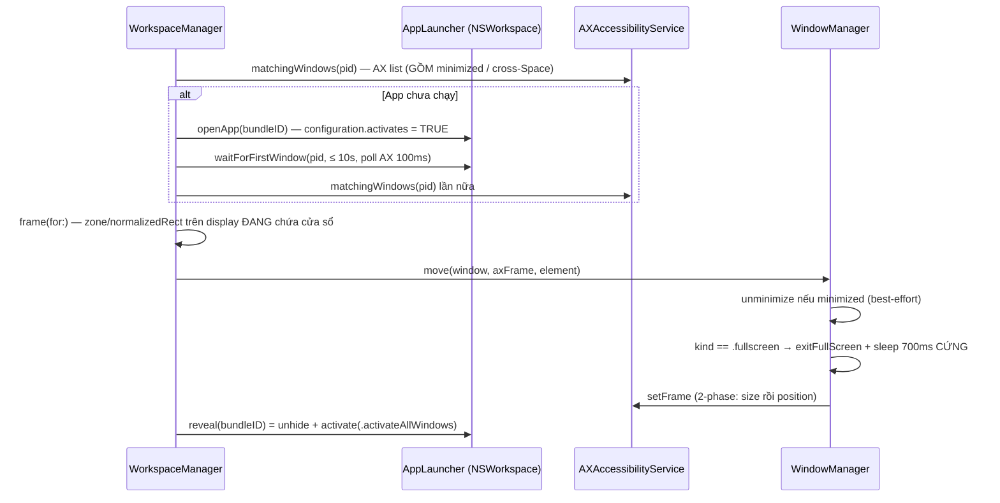

# 🔍 Root Cause Analysis — US-WORK-011: Workspace Snapshot & Restoration

> **Phạm vi:** PHÂN TÍCH CHỈ ĐỌC — không sửa bất kỳ file code nào; chỉ tạo đúng 1 file báo cáo này.
> **Nhánh:** `feat/window-groups-presets` • **Commit:** `352abaf` • **Ngày phân tích:** 02/09/2026.
> **Nguồn phát hiện:** 3 hiện tượng người dùng báo khi dùng Save / Restore Workspace (Settings + Menu bar), đối chiếu `docs/PRODUCT_BACKLOG_ROADMAP.md` → **US-WORK-011** (EPIC 10).

---

## 0. Cam kết trung thực & phương pháp

Mọi kết luận trong báo cáo được gắn nhãn rõ ràng để bạn biết độ chắc chắn của từng ý:

| Nhãn | Ý nghĩa |
| :--- | :--- |
| **[CODE]** | Xác nhận trực tiếp bằng đọc mã nguồn (kèm `file:dòng`) |
| **[SPEC]** | Đối chiếu tài liệu spec đã ký tại `.specify/features/workspace-snapshot-restoration/` |
| **[RUNTIME ⚠]** | Suy luận hành vi macOS lúc chạy — **chưa kiểm chứng được trong phiên này** (tôi không chạy được app). Mỗi giả thuyết kèm kịch bản kiểm chứng T1–T5 (§3.5, §4.4). |

**Điều tôi thẳng thắn không thể khẳng định khi chỉ đọc code:** hành vi activation / Space của macOS có khác biệt giữa Sonoma 14.x và Sequoia 15.x, và một số cơ chế (khôi phục cửa sổ theo Space cũ khi relaunch, `activate` có gom cửa sổ cross-Space hay không) là hành vi hệ thống không có trong tài liệu API. Vì vậy các kết luận [RUNTIME ⚠] **bắt buộc phải kiểm chứng tay trước khi viết code sửa** — tôi sẽ không giả vờ chắc chắn 100%.

---

## 1. US-WORK-011 đang hoạt động thế nào trong code hiện tại [CODE]

### 1.1. Luồng Save (liên quan hiện tượng 1)

1. `WorkspaceSaveSheet` → `WorkspaceViewModel.presentSaveSheet()` → `manager.eligibleWindows()` → danh sách cửa sổ lấy từ `allVisibleManagedWindows()` (`CGWindowList` `.optionOnScreenOnly`) — `AXAccessibilityService.swift:409–429`.
2. Người dùng tick cửa sổ → `capture(from:)` gom về **1 placement / app** (nhóm theo `bundleIdentifier` — `WorkspaceManager+Capture.swift:87–116`), suy ra zone bằng `ZoneInference` (max-IoU) + lưu `normalizedRect` (tỉ lệ, không lưu pixel — đúng spec intent-based).
3. `saveWorkspace` → `WorkspaceStore` (actor, JSON atomic).
4. Capture **loại trừ** cửa sổ fullscreen (chỉ nhận `kind.isSnappable == .normal` — `WindowKind.swift:30–32`, `WorkspaceManager+Capture.swift:171–200`).

### 1.2. Luồng Restore (trái tim của hiện tượng 2 & 3)

Điểm bấm Restore (menu bar hoặc Settings) → `WorkspaceViewModel.restore` → `WorkspaceManager.restoreWorkspace(id:)` với **`RestoreOptions.default` = có launch app vắng mặt + cascade** (`WorkspaceRestoring.swift:10–28`) → chạy **tuần tự từng placement**:



Kết quả tổng hợp thành `RestoreSummary` (placed / skipped + SkipReason) — hiển thị banner ở **cả** menu bar (`MenuBarView.swift:144–148`) lẫn Settings (`WorkspaceSettingsView.swift:201–224`).

**Những điểm code làm đúng spec [SPEC]:** intent-based không lưu pixel; best-effort không abort giữa chừng; auto-launch ≤ 10s (REQ-WORK-002, srs.md:45–46); cross-display có test riêng 1440×900 → 2560×1440; 2-phase setFrame; cascade có clamp chống rơi ra ngoài zone.

---

## 2. HIỆN TƯỢNG 1 — Tên cửa sổ trong picker khó đọc (muốn thấy tên ứng dụng)

### 2.1. Chuỗi bằng chứng [CODE]

| # | Bằng chứng | Vị trí |
| :-- | :--- | :--- |
| 1.1 | Picker render đúng `window.displayTitle` cho mỗi dòng | `FlowSnap/UI/Workspace/WorkspaceSaveSheet.swift:151` |
| 1.2 | `displayTitle` = nguyên văn `title` của cửa sổ; chỉ fallback `"Untitled window"` khi rỗng | `FlowSnap/Core/Workspace/WorkspaceCapturing.swift:56–61` |
| 1.3 | `title` đến từ `resolveTitle`: **ưu tiên tuyệt đối** `kAXTitleAttribute` — tức **tiêu đề tài liệu/cửa sổ** (VD: `index.html`, `Untitled 2`, `zsh — 80×24`) — chỉ khi rỗng mới fallback tên app | `FlowSnap/Infrastructure/Accessibility/AXAccessibilityService.swift:259–275` |
| 1.4 | Snapshot **đã mang sẵn** `bundleIdentifier` nhưng UI không dùng nó để hiển thị tên app | `FlowSnap/Core/Workspace/WorkspaceCapturing.swift:15–19, 43–54` |
| 1.5 | (Phụ) Đường CG fallback dùng nguồn tiêu đề khác (`kCGWindowName` → `kCGWindowOwnerName`) — hai đường không đồng nhất | `AXAccessibilityService.swift:447–451` |

### 2.2. Nguyên nhân gốc [CODE]

**Quyết định hiển thị ở UI layer sai trọng tâm**: dòng picker hiển thị *tiêu đề cửa sổ* (document title) thay vì *tên ứng dụng*. Dữ liệu để hiển thị tên app (`bundleIdentifier`, `pid`) đã có sẵn trong snapshot nhưng không được resolve sang tên app.

Nghiêm trọng hơn về ngữ nghĩa nghiệp vụ: workspace lưu **1 placement / app** (ASM-WORK-002 — `WorkspaceManager+Capture.swift:101–113`). Hiển thị title của "cửa sổ đầu tiên được gặp" của app đó vừa khó đọc, vừa gây hiểu nhầm rằng workspace lưu theo *cửa sổ* trong khi nó lưu theo *app*.

### 2.3. Mức độ & phân loại

UX bug (P2) — không mất chức năng, không mất dữ liệu. Theo `AGENTS.md`, đủ điều kiện **Micro-Task / Fast-Fix (< 30 dòng)** → fast-track TDD, không cần mở feature folder mới.

### 2.4. Hướng giải quyết đề xuất

1. **Khuyến nghị (sạch layering):** thêm trường `appLocalizedName: String?` vào `WindowGroupSnapshot` ngay lúc capture — dữ liệu có sẵn: `NSRunningApplication(processIdentifier: window.pid)?.localizedName`. Sau đó `WorkspaceSaveSheet.windowRow` hiển thị:
   - dòng chính: **tên app**;
   - dòng phụ (caption, secondary): window title — để phân biệt 2 cửa sổ cùng app.
2. **Không khuyến nghị:** resolve tên app bằng `NSWorkspace` ngay trong SwiftUI — UI sẽ chạm Infrastructure, khó test, chậm hơn (gọi hệ thống mỗi render).
3. **Impact khi implement:** `WindowGroupSnapshot` là Domain type → phải cập nhật test fixtures + snapshot renderer; theo governance cần ghi nhận scope change vào `CHANGELOG.md` của feature (đổi shape Domain model), không sửa signed-off docs.
4. **Câu hỏi cần PO chốt (zero-speculation):** app không resolve được tên (nil) hiển thị gì? Có muốn hiện thêm tên màn hình/display của cửa sổ trong dòng picker không?

---

## 3. HIỆN TƯỢNG 2 — Restore khi đã tắt hết app: chỉ mở 1 cửa sổ, các cửa sổ kia "bị ẩn"

### 3.1. Chuỗi bằng chứng [CODE]

| # | Bằng chứng | Vị trí |
| :-- | :--- | :--- |
| 2.1 | Restore chạy **tuần tự** từng placement; app vắng mặt được launch riêng lẻ, chờ riêng lẻ | `WorkspaceManager+Restore.swift:48–55, 86–97` |
| 2.2 | `openApp` set `configuration.activates = true` → **mỗi** app launch đều giành focus/activation | `FlowSnap/Infrastructure/macOS/AppLauncher.swift:86–88` |
| 2.3 | Sau mỗi lần đặt xong 1 app lại `reveal()`: unhide + `activate(.activateAllWindows)` → thêm 1 lần activation / app | `WorkspaceManager+Restore.swift:120–122` + `AppLauncher.swift:115–129` |
| 2.4 | `matchingWindows` **chủ ý** dùng AX window list — bao gồm cả cửa sổ minimized & đang nằm ở **Space khác** (comment tự thừa nhận) | `AXAccessibilityService.swift:143–162` (comment 148–155) |
| 2.5 | Di chuyển = `setFrame` qua AX → chỉ đổi vị trí/kích thước **trong đúng Space** cửa sổ đang đứng; **không tồn tại public API move cross-Space** (nguyên tắc Zero-Private-API của project) và code cũng không xử lý | `AXAccessibilityService.swift:207–220`; `WindowManager.swift:26–70`; backlog §7.2 |
| 2.6 | Toàn pipeline **không hề biết Space tồn tại**: `SpaceManaging.swift` chỉ là protocol stub, không có implementation, không được gọi ở đâu (grep toàn repo chỉ ra đúng 1 file định nghĩa) | `FlowSnap/Infrastructure/macOS/SpaceManaging.swift:8–22` |
| 2.7 | `reveal()` (activate) **không un-minimize**; un-minimize chỉ xảy ra bên trong `WindowManager.move` và là best-effort — app có thể từ chối | `WindowManager.swift:42–51`; `AppLauncher.swift:115–129` |
| 2.8 | Code **tự thừa nhận**: "A freshly launched app often restores its previous windows minimized or on another Space" | `AppLauncher.swift:131–141` (comment của `hasNormalWindow`) |
| 2.9 | AX `setFrame` trả **success cả khi cửa sổ không thể nhìn thấy** (ở Space khác / fullscreen) → `RestoreSummary` vẫn báo **placed** → banner hiện "thành công" trong khi user không thấy gì | `AXAccessibilityService.swift:207–220` (chỉ guard kết quả API) + `WindowManager.swift:68` |

### 3.2. Dựng lại hiện tượng từng bước (kịch bản nguyên nhân)

Khi bạn Cmd+Q hết mọi app rồi bấm Restore:

1. App 1 được launch (`activates = true`) — 2.2. **[RUNTIME ⚠]** macOS có thể khôi phục cửa sổ của app về trạng thái cũ của phiên trước: minimized, hoặc **Space cũ / fullscreen Space riêng** của app đó — 2.8 (chính code ghi nhận hiện tượng này).
2. FlowSnap đọc thấy cửa sổ (AX list bao gồm cả cross-Space/minimized — 2.4), tính zone frame **đúng toán học**, rồi `setFrame` — ghi thành công **nhưng trong đúng Space mà cửa sổ đang đứng** — 2.5. Cửa sổ ở Space khác = bạn không thấy, dù hệ thống báo success — 2.9.
3. `reveal()` activate app 1 → nếu System Settings *"When switching to an application, switch to a Space with open windows"* đang bật (mặc định), màn hình nhảy sang Space của app 1 — 2.3.
4. App 2 được launch… lặp lại. Mỗi launch/activate lại giành focus và kéo màn hình đi chỗ khác.
5. Kết thúc pass: **app cuối cùng trong `orderedPlacements` là app đang hiển thị trước mặt bạn**; các app trước đó hoặc nằm *sau* app cuối (cùng Space) hoặc nằm ở *Space khác / minimized* → "chỉ mở một trong số của workspace… các cửa sổ kia bị ẩn đi".
6. Khi bạn kéo từng cửa sổ về Space hiện tại, bấm Restore lần nữa → `matchingWindows` tìm thấy, `setFrame` lần này đặt đúng trên Space bạn đang xem → "nó mới hiện vào workspace". **Khớp chính xác từng chữ mô tả của bạn.**

### 3.3. Nguyên nhân gốc — chốt

> **Restore hiện tại là "best-effort ĐẶT TOẠ ĐỘ", không phải "đưa cửa sổ về trước mặt người dùng".** Ba gốc cộng dồn:
> - **Gốc A [CODE]:** pipeline không có khái niệm Space (2.5, 2.6) — `setFrame` không thể và không cố kéo cửa sổ cross-Space; thậm chí `matchingWindows` *chủ động* tìm cả cửa sổ ở Space khác để "đặt thành công" ở nơi không ai thấy.
> - **Gốc B [CODE]:** chiến lược activation tuần tự (launch `activates=true` + `reveal` mỗi app — 2.2, 2.3) khiến trạng thái nhìn thấy cuối cùng chỉ còn app cuối; các app trước bị chìm xuống hoặc ở lại Space của chúng.
> - **Gốc C [RUNTIME ⚠]:** macOS relaunch app bằng cách khôi phục cửa sổ cũ (minimized / Space cũ / fullscreen riêng) — hợp lý hoá bởi comment 2.8, cần T1–T3 kiểm chứng.
>
> Tình trạng "bị ẩn" bạn thấy = cửa sổ nằm ở **Space khác** hoặc **minimized trong Dock** (2.7: nếu AX un-minimize bị từ chối thì `reveal` không cứu được).

### 3.4. Hướng giải quyết đề xuất

**A. Ngắn hạn — surgical, ưu tiên cao (giải quyết được cả hiện tượng 3):**

1. **Reveal-before-move cho app vừa launch.** Hiện `reveal()` chạy *sau* move (`WorkspaceManager+Restore.swift:114–122`) với lý do "tránh flash ở vị trí cũ". Với app *mới launch* thì chưa có gì để flash — nên `reveal()` **trước** `place()` để cửa sổ thuộc Space người dùng đang xem rồi mới `setFrame`. Với app *đã chạy sẵn* giữ nguyên reveal-sau. ~5–10 dòng + test.
2. **Collect-focus cuối pass:** sau khi đặt xong toàn bộ, activate lại app có `orderIndex` thấp nhất (app "chính" của workspace) để trạng thái cuối ổn định, không "thắng bằng app cuối".
3. **Re-verify sau write:** đọc lại `kAXPosition/kAXSize` sau `setFrame`; nếu lệch > ~30pt hoặc cửa sổ không nằm trong `visibleFrame` của màn hình nào → đánh dấu summary (skip reason mới, VD `unverifiablePlacement`) thay vì báo **placed** (sửa 2.9 — hiện tại summary có thể "nói dối").

**B. Trung hạn — cần elicitation + design (theo workflow, không nhảy code):**

4. **Chiến lược "Bring to current Space"** cho từng app trước khi move: `unhide → un-minimize toàn bộ windows của app (kAXMinimized=false) → activate → setFrame` — và verify kết quả. Cần T4/T5 kiểm chứng hành vi `activate` trên macOS 14/15 trước.
5. **Song song hoá launch** các app vắng mặt bằng `TaskGroup` thay vì tuần tự (tổng thời gian từ n×10s xuống ≈10s, giảm churn focus). Lưu ý Swift 6 strict concurrency (`@MainActor`, `Sendable`).
6. **Ghi rõ giới hạn** vào user guide: với public API, FlowSnap không thể "teleport" cửa sổ cross-Space — mọi giải pháp đều là *activation-based*, không phải *move-based*.

### 3.5. Kịch bản kiểm chứng bắt buộc trước khi code [RUNTIME ⚠]

- **T1:** App A đang chạy, cửa sổ A ở Space 2. Đứng ở Space 1, restore workspace chứa A → cửa sổ có về Space 1 không? (Giả thuyết: KHÔNG — chỉ setFrame trong Space 2.)
- **T2:** Tắt hết app; trước khi tắt, 1 app đang fullscreen → restore → app đó relaunch có mở fullscreen riêng không? Summary banner (menu bar) báo gì?
- **T3:** Tắt hết app, không có Space lạ → restore → tất cả có về 1 Space không? (Nếu CÓ → xác nhận Gốc A+B; nếu KHÔNG → điều tra thêm.)
- **Công cụ:** Console.app lọc `[WorkspaceManager]`, `[AppLauncher]`, `[AXAccessibilityService]`; xem banner RestoreSummary; kiểm tra setting *"switch to a Space with open windows"* trong Desktop & Dock.

---

## 4. HIỆN TƯỢNG 3 — Restore khi đang ở fullscreen của một app: bị như hiện tượng 2

### 4.1. Chuỗi bằng chứng [CODE]

| # | Bằng chứng | Vị trí |
| :-- | :--- | :--- |
| 3.1 | Chỉ xử lý fullscreen của **cửa sổ đích**: nếu `window.kind == .fullscreen` → `exitFullScreen` + sleep 700ms **cứng** rồi mới setFrame | `WindowManager.swift:53–66` |
| 3.2 | Code tự thừa nhận: khi còn fullscreen, macOS *"returns success but silently ignores the AX frame writes"* | `WindowManager.swift:53–56` |
| 3.3 | `exitFullScreen` ghi `AXFullscreen`/`AXFullScreen` = false — **không có bước xác nhận lại** cửa sổ đã thoát fullscreen hay chưa | `AXAccessibilityService.swift:240–255` |
| 3.4 | Phát hiện fullscreen bằng attribute HOẶC heuristic (size ≈ screen && !resizable) → có thể phân loại sai → setFrame bị ignore mà vẫn báo "placed" | `AXAccessibilityService.swift:283–325` (checkFullScreen), `334+` (classifyKind); `WindowKind.swift:39–41` (isRestorable bao gồm .fullscreen) |
| 3.5 | Pipeline **không có khái niệm "user đang đứng ở fullscreen Space"**; `openApp(activates: true)` khi đang ở fullscreen Space sẽ buộc macOS rời Space đó hoặc mở cửa sổ mới ở desktop Space khác — không có code điều phối | toàn pipeline + 2.6 |
| 3.6 | `waitForFirstWindow` tính cả cửa sổ **fullscreen** là "đã có window" (`isRestorable` gồm `.fullscreen`) → restore được phép tiếp tục trên một cửa sổ đang fullscreen | `AppLauncher.swift:142–146` + `WindowKind.swift:39–41` |

### 4.2. Nguyên nhân gốc

1. **Gốc 1 [CODE + RUNTIME ⚠]:** Khi bạn đang trong fullscreen Space của app X, các app của workspace được launch sẽ mở ở **desktop Space khác**. FlowSnap đặt toạ độ xong nhưng không có bước nào đưa user và các cửa sổ về cùng một chỗ nhìn được → bạn thấy "chỉ 1 app" hoặc "không thấy gì" — cùng cơ chế Gốc A/B của hiện tượng 2 (đây là lý do hai hiện tượng giống nhau).
2. **Gốc 2 [CODE]:** sleep 700ms cứng sau `exitFullScreen` là heuristic — animation exit fullscreen thực tế 0.5–0.8s+ tuỳ máy; setFrame rơi vào lúc animation chưa xong → **write bị macOS ignore im lặng** (3.2) → cửa sổ trả về vị trí cũ.
3. **Gốc 3 [RUNTIME ⚠]:** Sau khi thoát fullscreen, cửa sổ quay về **Space cũ của nó** (Space trước khi vào fullscreen), không phải Space hiện tại → setFrame đặt đúng toạ độ nhưng trong Space khác → "bị ẩn".
4. **Gốc 4 [CODE — rủi ro phát hiện sai]:** heuristic `checkFullScreen` (3.4) có thể phân loại một cửa sổ fullscreen thành `.normal` (khi attribute không đọc được và `isResizable` đọc sai) → **không** exit fullscreen → mọi setFrame bị ignore → nhưng vì API báo success → summary vẫn ghi **placed**.

### 4.3. Hướng giải quyết đề xuất

1. **Thay sleep 700ms cứng bằng poll xác nhận thoát fullscreen:** đọc lại `kind`/frame mỗi 100ms, timeout ~2s (tái dùng đúng mẫu `waitForFirstWindow` — `AppLauncher.swift:101–109`). Micro-task, rủi ro thấp.
2. **Sau khi thoát fullscreen, activate app trước setFrame** (giống §3.4-A1) để cửa sổ thuộc Space người dùng đang xem.
3. **Re-verify sau write** (giống §3.4-A3) — đặc biệt quan trọng cho fullscreen vì ignore là "im lặng".
4. **Phát hiện "đang đứng ở fullscreen Space":** dùng `focusedManagedWindow()` — nếu `kind == .fullscreen` → có 2 lựa chọn UX (cần PO quyết định, zero-speculation):
   - **(khuyến nghị)** tự động exit fullscreen của app đang đứng trước khi restore (người dùng vừa chủ động bấm Restore nên ý định là "cho tôi cái layout của tôi");
   - hoặc hiển thị cảnh báo + nút "Exit Full Screen & Restore".
5. **Cập nhật RISK register / user guide** về giới hạn: fullscreen Space là do WindowServer quản; mọi thao tác phải đi qua exit-fullscreen + activation, không có API di chuyển trực tiếp.

### 4.4. Kịch bản kiểm chứng [RUNTIME ⚠]

- **T4:** App A fullscreen; từ menu restore workspace chứa A (đang chạy) + B (đã tắt) → A có được thoát fullscreen không? B mở ở Space nào? Sau pass, bạn đang đứng ở Space nào?
- **T5:** Restore khi workspace chứa app có cửa sổ ĐANG fullscreen → summary báo gì, cửa sổ về đâu, có bị "placed nhưng vô hình" không?

---

## 5. Đối chiếu Spec — đây là "spec gap", không phải "làm lệch spec" [SPEC]

| Khu vực | Spec đã ký nói gì | Code | Kết luận |
| :--- | :--- | :--- | :--- |
| Launch app vắng mặt + chờ ≤ 10s | REQ-WORK-002 (srs.md:45–46) | Có, đúng | ✅ Khớp |
| Best-effort + RestoreSummary | REQ-WORK-005 | Có, đúng | ✅ Khớp |
| Cross-display (không lưu pixel) | BR-WORK-007 | Có + test bắt buộc | ✅ Khớp |
| Cửa sổ ở **Space khác** lúc restore | **Không đề cập** | Không xử lý | ❌ **Spec gap** |
| User đang đứng ở **fullscreen Space** | **Không đề cập** (chỉ có exit-fullscreen của cửa sổ đích ở tầng implement) | Chỉ xử lý một phần | ❌ **Spec gap** |
| Ràng buộc "sau restore mọi cửa sổ phải **thấy được** ở Space hiện tại" | **Không đề cập** | Không có verify nhìn-thấy-được | ❌ **Spec gap** |

→ Ba hiện tượng bạn gặp **không phải lỗi implement lệch spec** — đó là khoảng trống trong spec (đợt elicitation US-WORK-011 chưa hỏi về Spaces/fullscreen). Vì spec đã `SIGNED-OFF`, theo governance: bổ sung phạm vi vào **`.specify/features/workspace-snapshot-restoration/CHANGELOG.md`** (bump version, không sửa signed-off docs) **hoặc** chuyển phần "Current Space" sang phạm vi **US-WORK-013 — App Launch Observer & Current Space Policy** (đúng chủ đề, đang là Must-Have P0 kế tiếp trong roadmap, hiện `[ ]`).

---

## 6. Tổng hợp ưu tiên & lộ trình đề xuất

| Ưu tiên | Việc | Giải quyết hiện tượng | Phân loại workflow (AGENTS.md) |
| :--- | :--- | :--- | :--- |
| **P0** | Reveal-before-move (app vừa launch) + collect-focus cuối pass + re-verify frame sau write | 2 & 3 | Bounded Task (TDD với mock launcher/AX đã có sẵn: `MockApplicationLaunching`) |
| **P0** | Poll xác nhận thoát fullscreen thay cho sleep 700ms cứng | 3 | Micro-Task |
| **P1** | Tên app trong picker (`appLocalizedName` trong `WindowGroupSnapshot`) | 1 | Micro-Task (< 30 dòng) |
| **P1** | Kiểm chứng T1–T5 (§3.5, §4.4) + ghi kết quả vào CHANGELOG / risk register | 2 & 3 (gốc rễ) | Spike (research note) |
| **P2** | Song song hoá launch (TaskGroup) + un-minimize chủ động toàn bộ windows trước khi place | 2 | Bounded Task |
| **P2** | Bổ sung phạm vi "Current Space / fullscreen" vào CHANGELOG hoặc chuyển sang US-WORK-013 | gốc rễ | BA pipeline (intake-classifier) |

**Câu hỏi cần bạn (PO) chốt trước khi code — Zero-Speculation:**

1. Khi cửa sổ đang ở Space khác: tự động kéo về Space hiện tại (khuyến nghị) hay giữ nguyên vị trí Space và chỉ đặt toạ độ?
2. Khi bạn đang fullscreen app X: tự động exit fullscreen của X trước khi restore, hay giữ fullscreen và restore "phía sau"?
3. Có cần thêm skip-reason mới (VD `unverifiablePlacement` — placed nhưng không xác minh được nhìn thấy) hiển thị ở banner không?

---

## 7. Phụ lục

### 7.1. Bản đồ code US-WORK-011 đã đọc

| File | Vai trò |
| :--- | :--- |
| `FlowSnap/Core/Workspace/WorkspaceManager.swift` | Orchestrator @MainActor: CRUD + `restoreWorkspace` (guard 1 pass/lần) |
| `FlowSnap/Core/Workspace/WorkspaceManager+Capture.swift` | `eligibleWindows` / `capture` — nhóm theo app, suy zone |
| `FlowSnap/Core/Workspace/WorkspaceManager+Restore.swift` | Vòng lặp restore, launch, place, reveal |
| `FlowSnap/Core/Workspace/WorkspaceRestoring.swift` / `WorkspaceCapturing.swift` | Contracts + `WindowGroupSnapshot` / `RestoreOptions` |
| `FlowSnap/Infrastructure/macOS/AppLauncher.swift` | NSWorkspace launch + poll first window + reveal |
| `FlowSnap/Infrastructure/Accessibility/AXAccessibilityService.swift` | AX reads/writes: frame, title, kind, fullscreen, minimize |
| `FlowSnap/Core/Window/WindowManager.swift` | move: unminimize + exitFullScreen + setFrame |
| `FlowSnap/Infrastructure/macOS/SpaceManaging.swift` | Stub chưa dùng — minh chứng thiếu Space-awareness |
| `FlowSnap/UI/Workspace/WorkspaceSaveSheet.swift` / `WorkspaceListView.swift` / `WorkspaceViewModel.swift` | UI picker / danh sách / façade |
| `FlowSnap/UI/MenuBar/MenuBarView.swift` + `UI/Settings/WorkspaceSettingsView.swift` | Hai surface Restore + banner summary |

### 7.2. Giới hạn của báo cáo (nói thẳng)

- Tôi **không chạy được app** trong phiên này → mọi kết luận [RUNTIME ⚠] (hành vi Space khi relaunch, hành vi `activate` trên từng bản macOS, độ dài animation exit-fullscreen) cần T1–T5 kiểm chứng tay trước khi code. Nếu T3 cho kết quả ngược giả thuyết, ưu tiên điều tra lại Gốc C trước khi sửa.
- Số dòng tham chiếu lấy tại commit `352abaf`; nếu code đổi, đối chiếu lại theo tên hàm.
- Tôi không đánh giá được bằng mắt thường UI theo anti-slop (không có screenshot runtime) — phần đó thuộc `ui-ux-reviewer` khi implement.

### 7.3. Log tags để debug runtime

```
[WorkspaceManager]  — move failed / lastRestoredAt write failure
[AppLauncher]       — launch failed cho bundleID
[AXAccessibilityService] — exitFullScreen kết quả / fullscreen detected via heuristic
```

---

*Báo cáo tạo bởi Cline — phiên phân tích chỉ-đọc. Không có file code nào bị thay đổi; chỉ tạo đúng file `docs/ROOT_CAUSE_ANALYSIS_US-WORK-011.md` này.*


