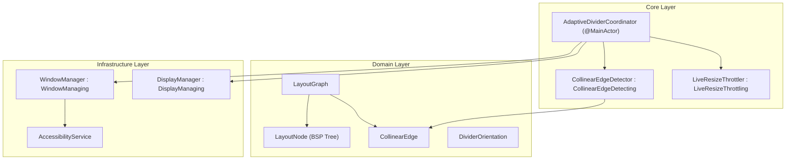

# Feature: Adaptive Multi-Window Divider Resize (US-SNAP-009)

- **Feature Slug**: `adaptive-divider-resize`
- **Epic**: `EPIC 08: Adaptive Multi-Window Resize (Shared Collinear Divider) & Gaps`
- **Sprint**: Sprint 2
- **Status**: Completed & Verified (`143/143` tests passing across 27 suites)
- **Specifications**: [baseline.md](file:///Users/vutuanhau/Documents/PROJECT/FlowSnap/.specify/features/adaptive-divider-resize/baseline.md) | [spec.md](file:///Users/vutuanhau/Documents/PROJECT/FlowSnap/.specify/features/adaptive-divider-resize/spec.md) | [plan.md](file:///Users/vutuanhau/Documents/PROJECT/FlowSnap/.specify/features/adaptive-divider-resize/plan.md) | [AdaptiveDividerContracts.swift](file:///Users/vutuanhau/Documents/PROJECT/FlowSnap/.specify/features/adaptive-divider-resize/contracts/AdaptiveDividerContracts.swift)

---

## 1. Overview & Business Value

When multiple windows are tiled on screen, users frequently need to adjust proportions between them. Traditionally, adjusting window sizes in multi-window layouts required resizing each window individually, resulting in awkward gaps, overlapping borders, or broken layouts.

`US-SNAP-009` introduces **Adaptive Multi-Window Divider Resizing** to FlowSnap. Users can hover their cursor over any shared partition boundary between 2 or more adjacent windows and drag the divider. FlowSnap detects collinear edges, transforms the mouse cursor, and simultaneously resizes all adjacent windows in unison while strictly preserving minimum window dimensions and 60fps responsiveness.

Key capabilities:
1. **Spatial Representation (`LayoutGraph`, `LayoutNode`)**: Binary Space Partitioning (BSP) tree and constraint graph modeling spatial adjacency.
2. **Collinear Edge Detection (`CollinearEdgeDetector`)**: Identifies shared boundaries across 2-window splits, 3-window T-junctions, and 4-window cross junctions.
3. **Cursor Affordance**: Automatically switches cursor to `NSCursor.resizeLeftRight` or `NSCursor.resizeUpDown` on hover within a $\pm 6	ext{pt}$ tolerance margin.
4. **Simultaneous Multi-Window Resizing**: Dragging a divider updates the width/height of all windows on both sides in real time.
5. **MinSize Protection**: Enforces minimum dimensions per window (e.g. 200x150 default or application-specific) to prevent window collapse.
6. **60fps Throttled Dispatch (`LiveResizeThrottler`)**: Limits AX UI updates to $\le 60	ext{fps}$ (~16.6ms intervals) to eliminate WindowServer IPC lag.

---

## 2. Tutorial: Using Adaptive Divider Resize

### Step 1: Discovering Shared Dividers
When windows are snapped adjacent to one another (e.g., Left Half and Right Half):
1. Move the mouse cursor over the vertical dividing line between the two windows.
2. The cursor immediately transforms into a horizontal resize cursor (`⬌` `NSCursor.resizeLeftRight`).

### Step 2: Live Dragging
1. Click and drag the divider left or right.
2. The left window expands while the right window contracts simultaneously in real time.
3. The configured window gap is preserved with zero pixel drift.

### Step 3: T-Junction Resizing
1. In a 3-window layout (1 left window spanning full height, 2 stacked right windows):
   - Dragging the **main vertical divider** simultaneously resizes the left window and **both** right windows.
   - Dragging the **horizontal divider** between the two right windows resizes the top and bottom right windows without affecting the left window.

---

## 3. How-To Guides

### How-To 1: Detect Dividers Programmatically
```swift
import FlowSnap

let detector = CollinearEdgeDetector(defaultMinWidth: 200, defaultMinHeight: 150)
let container = CGRect(x: 0, y: 0, width: 1440, height: 900)

let dividers = detector.detectDividers(
    in: managedWindows,
    containerFrame: container,
    gap: 8.0,
    tolerance: 6.0
)

for divider in dividers {
    print("Found \(divider.orientation) divider at \(divider.coordinate) spanning \(divider.span)")
}
```

### How-To 2: Compute Resized Frames
```swift
if let hitDivider = detector.hitTestDivider(at: mousePoint, in: dividers) {
    let resizedFrames = detector.computeResizedFrames(
        for: hitDivider,
        targetCoordinate: mousePoint.x,
        windows: managedWindows,
        containerFrame: container,
        gap: 8.0
    )
    // Apply resized frames to windows
}
```

---

## 4. Technical Reference

### 4.1 Domain Types

#### `CollinearEdge`
```swift
public struct CollinearEdge: Identifiable, Hashable, Sendable {
    public let id: UUID
    public let orientation: DividerOrientation
    public let coordinate: CGFloat
    public let span: ClosedRange<CGFloat>
    public let hitRect: CGRect
    public let leadingWindowIDs: [CGWindowID]
    public let trailingWindowIDs: [CGWindowID]
    public let minCoordinate: CGFloat
    public let maxCoordinate: CGFloat
}
```

#### `LayoutNode`
```swift
public indirect enum LayoutNode: Equatable, Sendable {
    case leaf(windowID: CGWindowID, frame: CGRect, minSize: CGSize?)
    case split(axis: DividerOrientation, ratio: CGFloat, gap: CGFloat, first: LayoutNode, second: LayoutNode)
}
```

### 4.2 Business Rules Implemented

| Rule ID | Rule Name | Specification |
| :--- | :--- | :--- |
| **BR-ADR-001** | Collinear Alignment | Windows are collinear along an edge if their bounding coordinates match within tolerance and orthogonal spans overlap. |
| **BR-ADR-002** | Composite Divider Union | Multiple adjacent windows sharing the same boundary line are united into a single continuous `CollinearEdge`. |
| **BR-ADR-003** | Cursor Affordance | Hovering within $\pm 6	ext{pt}$ displays `NSCursor.resizeLeftRight` or `NSCursor.resizeUpDown`. |
| **BR-ADR-004** | MinSize Boundary Preservation | Divider movement is clamped so no window shrinks below its minimum dimensions. |
| **BR-ADR-005** | 60fps Throttled Dispatch | Frame updates are throttled to $\le 60	ext{fps}$ (~16.6ms intervals) during live dragging. |
| **BR-ADR-006** | Zero Gap Drift | Total container size minus gaps equals sum of window dimensions at all times. |

---

## 5. Architecture & Design Rationale



---

## 6. Verification & Test Coverage Summary

- `LayoutGraphTests`: Leaf evaluation, vertical/horizontal BSP tree frame computation, graph mutation.
- `CollinearEdgeDetectorTests`: 2-window split, 3-window T-junction, 4-window cross junction, hit testing with tolerance, minSize clamping.
- `LiveResizeThrottlerTests`: Rate limiting, 16.6ms intervals, timestamp reset.
- `AdaptiveDividerCoordinatorTests`: Hover cursor switching, mouse down capture, live drag simultaneous resizing, mouse up state reset.
