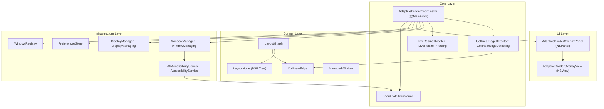
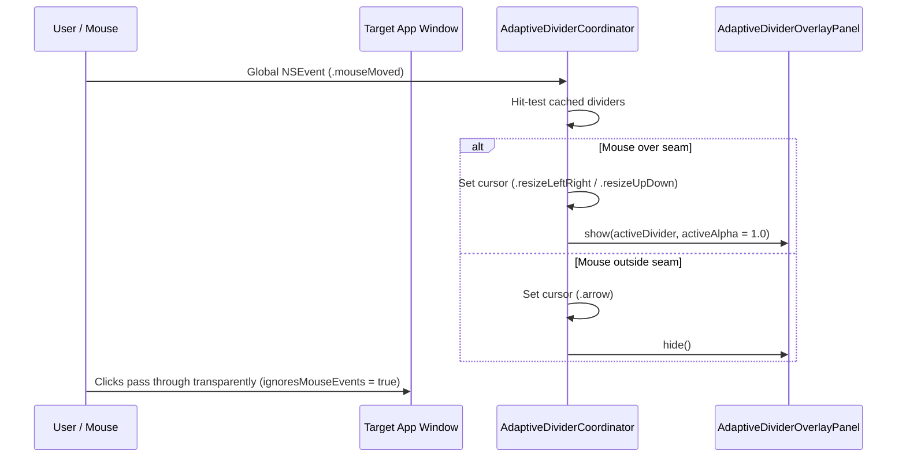
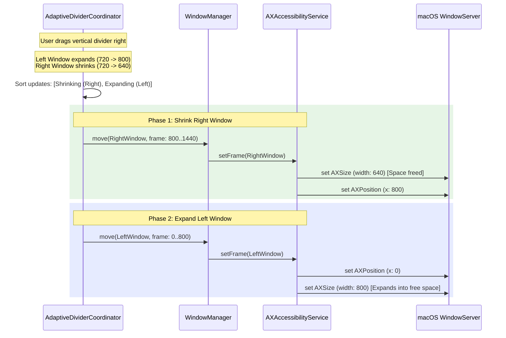
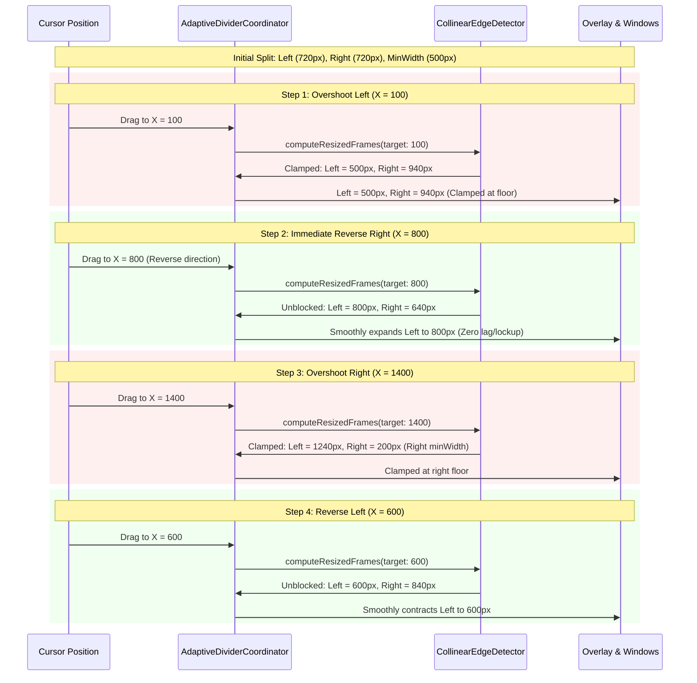
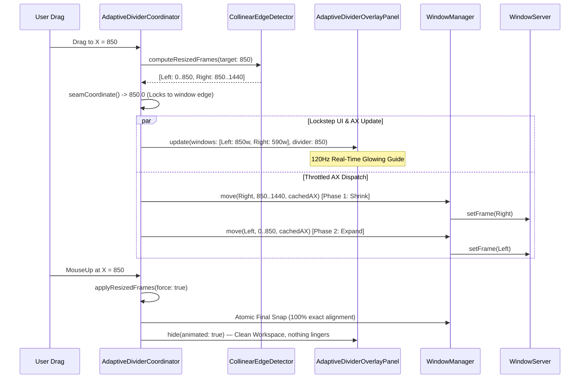
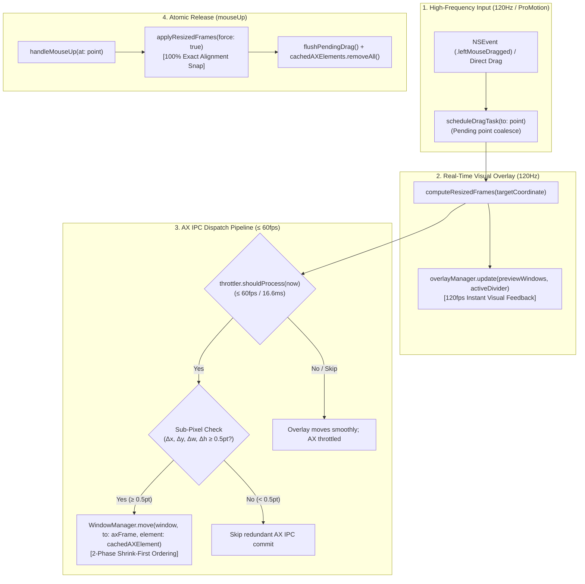
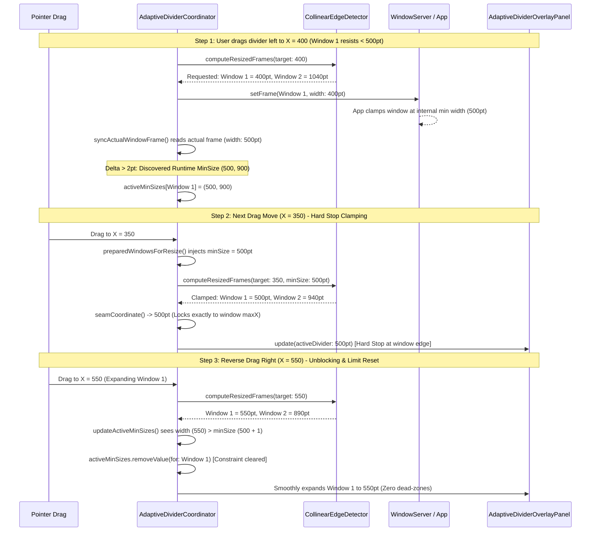

# Feature: Adaptive Multi-Window Divider Resize (US-SNAP-009)

- **Feature Slug**: `adaptive-divider-resize`
- **Epic**: `EPIC 08: Adaptive Multi-Window Resize (Shared Collinear Divider) & Gaps`
- **Sprint**: Sprint 2
- **Status**: Completed & Verified (`186/186` tests passing across 29 suites)
- **Specifications**: [baseline.md](file:///Users/vutuanhau/Documents/PROJECT/FlowSnap/.specify/features/adaptive-divider-resize/baseline.md) | [spec.md](file:///Users/vutuanhau/Documents/PROJECT/FlowSnap/.specify/features/adaptive-divider-resize/spec.md) | [plan.md](file:///Users/vutuanhau/Documents/PROJECT/FlowSnap/.specify/features/adaptive-divider-resize/plan.md) | [AdaptiveDividerContracts.swift](file:///Users/vutuanhau/Documents/PROJECT/FlowSnap/.specify/features/adaptive-divider-resize/contracts/AdaptiveDividerContracts.swift) | [test-plan.md](file:///Users/vutuanhau/Documents/PROJECT/FlowSnap/docs/features/adaptive-divider-resize/test-plan.md) | [CHANGELOG.md](file:///Users/vutuanhau/Documents/PROJECT/FlowSnap/.specify/features/adaptive-divider-resize/CHANGELOG.md)

---

## 1. Overview & Business Value

When multiple windows are tiled on screen, users frequently need to adjust proportions between them. Traditionally, adjusting window sizes in multi-window layouts required resizing each window individually, resulting in awkward gaps, overlapping borders, or broken layouts.

`US-SNAP-009` introduces **Adaptive Multi-Window Divider Resizing** to FlowSnap. Users can hover their cursor over any shared partition boundary between 2 or more adjacent windows and drag the divider. FlowSnap detects collinear edges, transforms the mouse cursor, and simultaneously resizes all adjacent windows in unison while strictly preserving minimum window dimensions, zero gap drift, and 120Hz ProMotion fluid responsiveness.

Key capabilities:

1. **Spatial Representation ([`LayoutGraph`](file:///Users/vutuanhau/Documents/PROJECT/FlowSnap/FlowSnap/Domain/Layout/LayoutGraph.swift), [`LayoutNode`](file:///Users/vutuanhau/Documents/PROJECT/FlowSnap/FlowSnap/Domain/Layout/LayoutNode.swift))**: Binary Space Partitioning (BSP) tree and constraint graph modeling spatial adjacency.
2. **Collinear Edge Detection ([`CollinearEdgeDetector`](file:///Users/vutuanhau/Documents/PROJECT/FlowSnap/FlowSnap/Core/Layout/CollinearEdgeDetector.swift))**: Identifies shared boundaries across 2-window splits, 3-window T-junctions, and 4-window cross junctions. Excludes non-resizable panels (e.g. System Settings).
3. **Cursor & Visual Affordance ([`AdaptiveDividerOverlayPanel`](file:///Users/vutuanhau/Documents/PROJECT/FlowSnap/FlowSnap/UI/Divider/AdaptiveDividerOverlayPanel.swift))**: Smooth glowing accent bars and automatic cursor switching to `NSCursor.resizeLeftRight` or `NSCursor.resizeUpDown` on hover within a $\pm 6\,\text{pt}$ tolerance margin.
4. **Lockstep Drag Synchronization ([`AdaptiveDividerCoordinator`](file:///Users/vutuanhau/Documents/PROJECT/FlowSnap/FlowSnap/Core/Layout/AdaptiveDividerCoordinator.swift))**: Synchronizes real-time visual overlay guidelines, derived seam coordinates, and WindowServer AX frames in strict lockstep, followed by an atomic snap on `mouseUp`.
5. **Bi-Directional Drag Elasticity & Unblocking**: Reversing drag direction after hitting minimum size floors immediately unclamps windows with zero dead-zones or hysteresis.
6. **Dynamic Runtime Minimum Size Clamping & Hard Stop Behavior**: Dynamically discovers application-enforced minimum dimensions at runtime via AX readback (`syncActualWindowFrame`), injecting active constraints into subsequent drag steps (`preparedWindowsForResize`) so the divider hits a physical hard stop locked to the window boundary, preventing divider detachment or window penetration.
7. **2-Phase Shrink-First AX Ordering**: Prevents WindowServer collision clamping and window overlap by shrinking windows before expanding windows.
8. **Hard Seam Clamping & Minimum Size Protection**: Derives invariant seam bounds to prevent divider inversion and window collapse below usable limits (380x260 default or application-reported minimums).
9. **Transparent Event Pass-Through**: Non-blocking overlay architecture (`ignoresMouseEvents = true`) with global event monitoring preserving native window clicks and app responsiveness.
10. **Multi-Window AX Coordinate Matching ([`AXAccessibilityService`](file:///Users/vutuanhau/Documents/PROJECT/FlowSnap/FlowSnap/Infrastructure/Accessibility/AXAccessibilityService.swift), [`CoordinateTransformer`](file:///Users/vutuanhau/Documents/PROJECT/FlowSnap/FlowSnap/Core/Display/CoordinateTransformer.swift))**: Geometric matching across multi-window processes and AppKit-to-AX coordinate spaces.
11. **AXUIElement Reference Caching at `mouseDown`**: Resolves `AXUIElement` handles once at drag initiation, eliminating redundant IPC lookups and window list scans during high-frequency drag moves.
12. **High-Frequency Drag Coalescing**: Coalesces rapid mouse events on 120Hz/ProMotion displays via a single scheduled `@MainActor Task`, eliminating Task queue backlog and drag lag.
13. **Sub-Pixel Frame Skipping**: Filters out redundant micro-movements ($< 0.5\,\text{pt}$) to prevent AX IPC churn while updating visual overlays at full 120Hz ProMotion framerate.
14. **60fps Throttled AX Dispatch ([`LiveResizeThrottler`](file:///Users/vutuanhau/Documents/PROJECT/FlowSnap/FlowSnap/Core/Layout/LiveResizeThrottler.swift))**: Decouples 120Hz visual guideline rendering from $\le 60\,\text{fps}$ (~16.6ms) WindowServer AX IPC commits, culminating in an atomic snap on `mouseUp`.

---

## 2. Tutorial: Using Adaptive Divider Resize

### Step 1: Discovering Shared Dividers

When windows are snapped adjacent to one another (e.g., Left Half and Right Half):

1. Move the mouse cursor over the vertical dividing line between the two windows.
2. The cursor immediately transforms into a horizontal resize cursor (`⬌` `NSCursor.resizeLeftRight`) and the divider seam illuminates with an accent glow.

### Step 2: Live Dragging & Bi-Directional Elasticity

1. Click and drag the divider left or right.
2. The left window expands while the right window contracts simultaneously in real time.
3. If an application hits its minimum size (configured minSize, 380x260pt default, or an application-enforced runtime minimum dimension), movement cleanly encounters a physical **Hard Stop**: the divider line and adjacent expanding windows halt strictly at the window boundary without detaching or penetrating inside window bounds.
4. Dragging back in the opposite direction immediately clears the runtime restriction, unblocking and resuming smooth expansion with zero dead-zones or sticking.
5. The configured window gap is preserved with zero pixel drift and zero window overlap.

### Step 3: Multi-Window T-Junction Resizing

1. In a 3-window layout (1 left window spanning full height, 2 stacked right windows):
   - Dragging the **main vertical divider** simultaneously resizes the left window and **both** right windows.
   - Dragging the **horizontal divider** between the two right windows resizes the top and bottom right windows without affecting the left window.

### Step 4: Cancelling a Drag Interaction

1. If you start dragging a divider and want to abandon the resize, press the `⎋` (Escape) key.
2. FlowSnap immediately restores all participating windows to their exact starting frames and resets the overlay.

---

## 3. How-To Guides

### How-To 1: Detect Collinear Dividers Programmatically

```swift
import FlowSnap

let detector = CollinearEdgeDetector(defaultMinWidth: 380, defaultMinHeight: 260)
let container = CGRect(x: 0, y: 0, width: 1440, height: 900)

let dividers = detector.detectDividers(
    in: managedWindows,
    containerFrame: container,
    gap: 8.0,
    tolerance: 6.0
)

for divider in dividers {
    print("Found \(divider.orientation) divider at \(divider.coordinate) spanning \(divider.span)")
    print("Valid drag range: [\(divider.minCoordinate) ... \(divider.maxCoordinate)]")
}
```

### How-To 2: Compute Clamped Resized Frames with Bi-Directional Elasticity

```swift
if let hitDivider = detector.hitTestDivider(at: mousePoint, in: dividers) {
    let resizedFrames = detector.computeResizedFrames(
        for: hitDivider,
        targetCoordinate: mousePoint.x,
        windows: managedWindows,
        containerFrame: container,
        gap: 8.0
    )
    // Frames are strictly clamped to minCoordinate/maxCoordinate bounds
    // Stateless evaluation ensures immediate response when drag direction reverses
}
```

### How-To 3: Execute Lockstep Live Updates with Atomic Final Snap

```swift
// 1. Live Drag: Update overlay preview and dispatch throttled frames
let targetCoordinate = (divider.orientation == .vertical) ? point.x : point.y
let resizedFrames = detector.computeResizedFrames(
    for: divider,
    targetCoordinate: targetCoordinate,
    windows: initialWindows.values,
    containerFrame: container,
    gap: gap
)

// Derive exact seam coordinate to prevent divider line detachment
let seamCoord = seamCoordinate(from: resizedFrames, for: divider, gap: gap)
let draggedDivider = seam(byMoving: divider, to: seamCoord, gap: gap)

// Update visual overlay at 120Hz
overlayManager.update(
    containerFrame: container,
    windows: previewWindows,
    dividers: overlayDividers,
    activeDivider: draggedDivider,
    isDragging: true
)

// Dispatch to WindowManager (with sub-pixel skipping)
await applyResizedFrames(resizedFrames, primaryHeight: primaryHeight, force: false)

// 2. Mouse Up: Execute atomic final snap
await applyResizedFrames(resizedFrames, primaryHeight: primaryHeight, force: true)
```

### How-To 4: Execute 2-Phase AX Dispatch (Shrink First, Expand Second)

```swift
// Apply updates with shrinking windows first to release screen space
let updates = resizedFrames.compactMap { id, frame -> (ManagedWindow, CGRect, Bool)? in
    guard let window = managedWindows.first(where: { $0.id == id }) else { return nil }
    let isShrinking = (frame.width * frame.height) <= (window.frame.width * window.frame.height)
    return (window, frame, isShrinking)
}

let sortedUpdates = updates.sorted { ($0.2 ? 0 : 1) < ($1.2 ? 0 : 1) }

for (window, targetFrame, _) in sortedUpdates {
    let axFrame = CoordinateTransformer.toAX(rect: targetFrame, primaryScreenHeight: screenHeight)
    try await windowManager.move(window, to: axFrame, element: cachedAXElements[window.id])
}
```

### How-To 5: Resolve AXUIElement Handles for Multi-Window Processes

```swift
// Convert AppKit frame to AX coordinate space and fuzzy match across AX windows
let targetAXFrame = CoordinateTransformer.toAX(rect: window.frame, primaryScreenHeight: primaryHeight)
let axWindows = accessibilityService.windows(of: window.pid)

let matchedElement = axWindows.first { element in
    guard let f = accessibilityService.frame(of: element) else { return false }
    return abs(f.origin.x - targetAXFrame.origin.x) < 30
        && abs(f.origin.y - targetAXFrame.origin.y) < 30
        && abs(f.size.width - targetAXFrame.size.width) < 30
        && abs(f.size.height - targetAXFrame.size.height) < 30
}
```

### How-To 6: Coalesce High-Frequency Drag Events on 120Hz Displays

```swift
// Overwrite pending point and schedule a single @MainActor Task
private func scheduleDragTask(to point: CGPoint) {
    pendingDragPoint = point
    guard !isDragScheduled else { return }
    isDragScheduled = true
    Task { @MainActor [weak self] in
        guard let self else { return }
        self.isDragScheduled = false
        guard let targetPoint = self.pendingDragPoint else { return }
        self.pendingDragPoint = nil
        guard self.isTracking else { return }
        await self.handleMouseDragged(to: targetPoint)
    }
}
```

### How-To 7: Discover Runtime Minimum Sizes and Apply Hard Stop Clamping

```swift
// 1. AX frame readback discovers application resistance in syncActualWindowFrame
let actualAppKitFrame = CoordinateTransformer.toAppKit(rect: actualAXFrame, primaryScreenHeight: primaryHeight)
if actualAppKitFrame.width > requested.width + 2 || actualAppKitFrame.height > requested.height + 2 {
    activeMinSizes[updatedWindow.id] = actualAppKitFrame.size
}

// 2. Inject dynamic minimum sizes into geometries for subsequent drag moves
let windowsToResize = preparedWindowsForResize(baseWindows)

// 3. CollinearEdgeDetector computes hard-clamped frames and seam bounds
let resizedFrames = detector.computeResizedFrames(
    for: divider,
    targetCoordinate: targetCoordinate,
    windows: windowsToResize,
    containerFrame: container,
    gap: gap
)

// 4. Derive seam coordinate locked to window edge (Hard Stop)
let seamCoord = seamCoordinate(from: resizedFrames, for: divider, gap: gap)
let hardStoppedDivider = seam(byMoving: divider, to: seamCoord, gap: gap)

// 5. Clear dynamic limits when dragging back in the expanding direction
updateActiveMinSizes(with: resizedFrames, orientation: divider.orientation)
```

---

## 4. Technical Reference

### 4.1 Domain Types

#### [`CollinearEdge`](file:///Users/vutuanhau/Documents/PROJECT/FlowSnap/FlowSnap/Domain/Layout/CollinearEdge.swift)

```swift
public struct CollinearEdge: Identifiable, Hashable, Sendable {
    public let id: UUID
    public let orientation: DividerOrientation
    public let coordinate: CGFloat
    public let span: ClosedRange<CGFloat>
    public let hitRect: CGRect
    public let leadingWindowIDs: [CGWindowID]
    public let trailingWindowIDs: [CGWindowID]
    public let minCoordinate: CGFloat
    public let maxCoordinate: CGFloat
}
```

#### [`LayoutNode`](file:///Users/vutuanhau/Documents/PROJECT/FlowSnap/FlowSnap/Domain/Layout/LayoutNode.swift)

```swift
public indirect enum LayoutNode: Equatable, Sendable {
    case leaf(windowID: CGWindowID, frame: CGRect, minSize: CGSize?)
    case split(axis: DividerOrientation, ratio: CGFloat, gap: CGFloat, first: LayoutNode, second: LayoutNode)
}
```

#### [`DividerOrientation`](file:///Users/vutuanhau/Documents/PROJECT/FlowSnap/FlowSnap/Domain/Layout/DividerOrientation.swift)

```swift
public enum DividerOrientation: String, Sendable, CaseIterable {
    case vertical
    case horizontal
}
```

#### [`AdaptiveDividerCoordinator`](file:///Users/vutuanhau/Documents/PROJECT/FlowSnap/FlowSnap/Core/Layout/AdaptiveDividerCoordinator.swift) State Interface

```swift
@MainActor
public final class AdaptiveDividerCoordinator: AdaptiveDividerCoordinating {
    public private(set) var isTracking: Bool
    public private(set) var managedWindows: [ManagedWindow]
    public private(set) var activeDivider: CollinearEdge?
    public private(set) var hoveredDivider: CollinearEdge?
    public private(set) var isResizing: Bool
    public private(set) var currentCursor: NSCursor

    /// Dynamic minimum size limits discovered at runtime when an application
    /// refuses to shrink below its OS minimum size.
    public private(set) var activeMinSizes: [CGWindowID: CGSize]
}
```

### 4.2 Business Rules Implemented

| Rule ID        | Rule Name                        | Specification                                                                                                                                                                                                                                                                                                                                             |
| :------------- | :------------------------------- | :-------------------------------------------------------------------------------------------------------------------------------------------------------------------------------------------------------------------------------------------------------------------------------------------------------------------------------------------------------- |
| **BR-ADR-001** | Collinear Alignment              | Windows are collinear along an edge if their bounding coordinates match within tolerance ($\pm 6\,\text{pt}$) and orthogonal spans overlap ($> 12\,\text{pt}$).                                                                                                                                                                                           |
| **BR-ADR-002** | Composite Divider Union          | Multiple adjacent windows sharing the same boundary line are united into a single continuous `CollinearEdge`. Span is the exact union of pairwise overlaps.                                                                                                                                                                                               |
| **BR-ADR-003** | Cursor & Visual Affordance       | Hovering within $\pm 6\,\text{pt}$ displays `NSCursor.resizeLeftRight` or `NSCursor.resizeUpDown` and illuminates glowing accent bars on the overlay.                                                                                                                                                                                                     |
| **BR-ADR-004** | MinSize Boundary Preservation    | Divider movement is strictly clamped so no window shrinks below its minimum dimensions ($380\times 260\,\text{pt}$ default or application-reported minimums).                                                                                                                                                                                             |
| **BR-ADR-005** | 60fps Throttled Dispatch         | WindowServer AX UI mutations are throttled to $\le 60\,\text{fps}$ (~16.6ms intervals) while visual overlay guidelines render at 120Hz ProMotion frequency.                                                                                                                                                                                               |
| **BR-ADR-006** | Zero Gap Drift                   | Total container size minus configured gaps equals the sum of window dimensions at all times during drag operations.                                                                                                                                                                                                                                       |
| **BR-ADR-007** | 2-Phase Shrink-First AX Ordering | Shrinking windows must be resized and moved before expanding windows. In `setFrame`, shrinking windows update size first then position; expanding windows update position first then size.                                                                                                                                                                |
| **BR-ADR-008** | Hard Seam Boundary Clamping      | `seamBounds` strictly enforces lower/upper bounds. If tight bounds invert (`upper < lower`), the range locks to `origin...origin`. Out-of-bounds mouse coordinates are clamped with zero window overlap.                                                                                                                                                  |
| **BR-ADR-009** | Transparent Event Pass-Through   | Overlay panel is configured with `ignoresMouseEvents = true` so native mouse events pass through to underlying applications. Divider events are captured via global `NSEvent` monitoring.                                                                                                                                                                 |
| **BR-ADR-010** | Multi-Window AX Resolution       | Windows belonging to multi-window processes are resolved by converting AppKit frames to AX coordinates and performing fuzzy bounding box matching ($\Delta < 30\,\text{pt}$).                                                                                                                                                                             |
| **BR-ADR-011** | AXUIElement Reference Caching    | `AdaptiveDividerCoordinator` captures and caches `AXUIElement` references on `mouseDown` across all participating windows, eliminating redundant IPC lookups and window list scans during live drag.                                                                                                                                                      |
| **BR-ADR-012** | High-Frequency Drag Coalescing   | Rapid drag events on 120Hz/ProMotion displays are coalesced using `scheduleDragTask(to:)` into a single active `@MainActor Task`, preventing async task queue backlog and drag latency spikes.                                                                                                                                                            |
| **BR-ADR-013** | Sub-Pixel Frame Skipping         | Live drag frame movements with delta $< 0.5\,\text{pt}$ across `dx, dy, dw, dh` skip redundant `setFrame` AX IPC calls to prevent WindowServer churn, while visual overlay guides render at full 120Hz.                                                                                                                                                   |
| **BR-ADR-014** | OS Minimum Size Edge Attachment  | When a participating window hits its OS-enforced minimum size, the divider line coordinate locks directly to the window's boundary (`maxX`/`minX`), ensuring the divider never detaches or penetrates.                                                                                                                                                    |
| **BR-ADR-015** | Bi-Directional Drag Elasticity   | Reaching a minimum size boundary in one direction does not lock or dead-zone the drag session. Reversing drag direction immediately expands the window smoothly across $[ \text{minCoordinate} \dots \text{maxCoordinate} ]$.                                                                                                                             |
| **BR-ADR-016** | Lockstep Drag Synchronization    | Visual overlay guidelines, calculated seam coordinates, and WindowServer AX updates update in lockstep on every coalesced drag task, culminating in an atomic forced snap on `mouseUp`.                                                                                                                                                                   |
| **BR-ADR-017** | Non-Resizable Window Exclusion   | Managed windows with `isResizable == false` (e.g., macOS System Settings) are excluded from `CollinearEdgeDetector`, preventing invalid divider generation on fixed utility panels.                                                                                                                                                                       |
| **BR-ADR-018** | Dynamic Runtime MinSize & Stop   | When an application refuses to shrink below its internal OS minimum (actual frame exceeds requested frame by $> 2\,\text{pt}$ in `syncActualWindowFrame`), `activeMinSizes[window.id]` records the limit dynamically. Subsequent drag steps clamp against this dynamic limit, creating a hard stop where the divider locks to the window's boundary edge. |
| **BR-ADR-019** | Dynamic Constraint Reset/Expand  | When the user drags in the expanding direction (`frame.width > minSize.width + 1` or `height > minSize.height + 1`), `updateActiveMinSizes` removes the dynamic limit from `activeMinSizes`, restoring full bi-directional elasticity with zero sticking or dead-zones.                                                                                   |

---

## 5. Architecture & Design Rationale



### 5.1 Defect Resolution Deep-Dive

#### 1. Event Pass-Through Architecture

- **Problem**: When [`AdaptiveDividerOverlayPanel`](file:///Users/vutuanhau/Documents/PROJECT/FlowSnap/FlowSnap/UI/Divider/AdaptiveDividerOverlayPanel.swift) was ordered front at `.floating + 1`, mouse clicks and window activation for underlying applications were intercepted by the transparent panel.
- **Solution**:
  - `AdaptiveDividerOverlayPanel` sets `ignoresMouseEvents = true` on initialization, making the entire overlay window completely click-transparent to WindowServer.
  - Event tracking is driven by [`AdaptiveDividerCoordinator`](file:///Users/vutuanhau/Documents/PROJECT/FlowSnap/FlowSnap/Core/Layout/AdaptiveDividerCoordinator.swift) using global `NSEvent` monitors (`.mouseMoved`, `.leftMouseDown`, `.leftMouseDragged`, `.leftMouseUp`, and `.keyDown` for `⎋` Escape).
  - Native window outlines are rendered directly without drawing intrusive full-screen desktop container borders.



#### 2. 2-Phase Shrink-First AX Ordering

- **Problem**: When simultaneously resizing adjacent tiled windows, moving expanding windows first caused WindowServer to constrain or clamp their frames against the still-occupying neighbor, producing visual stutter, collision glitches, and momentary window overlap.
- **Solution**:
  - **Coordinator Level**: In `applyResizedFrames`, updates are sorted so shrinking windows (`newArea <= currentArea`) are dispatched to [`WindowManager`](file:///Users/vutuanhau/Documents/PROJECT/FlowSnap/FlowSnap/Core/Window/WindowManager.swift) first, freeing up desktop real estate before expanding windows grow into the space.
  - **Service Level**: In [`AXAccessibilityService.setFrame(_:for:)`](file:///Users/vutuanhau/Documents/PROJECT/FlowSnap/FlowSnap/Infrastructure/Accessibility/AXAccessibilityService.swift):
    - _Shrinking_: Sets `kAXSizeAttribute` first, then `kAXPositionAttribute`.
    - _Expanding_: Sets `kAXPositionAttribute` first, then `kAXSizeAttribute`.



#### 3. Hard Seam Clamping & Dynamic Minimum Size Floors

- **Problem**: Extreme mouse drag coordinates (e.g. mouse yanking to `-1000` or `+2000`) caused divider coordinate inversion, window overlap, and jumping. Additionally, pre-existing narrow windows (e.g. 80/20 splits) would jump by over 100px if forced to a rigid default minimum size.
- **Solution**:
  - [`CollinearEdgeDetector.seamBounds`](file:///Users/vutuanhau/Documents/PROJECT/FlowSnap/FlowSnap/Core/Layout/CollinearEdgeDetector.swift) computes invariant `minCoordinate` and `maxCoordinate` based on container bounds, gap spacing, and window minimum dimensions. If space is tight (`upper < lower`), it returns `origin...origin` to prevent inversion.
  - `floorWidth(of:)` and `floorHeight(of:)` check `window.minSize` against default minimums ($380\times 260\,\text{pt}$). If a window starts narrower than the default floor, its current dimension is retained as the floor (`min(max(reported, 1), max(window.frame.width, 1))`), stopping unwanted jumps.
  - In [`AdaptiveDividerCoordinator`](file:///Users/vutuanhau/Documents/PROJECT/FlowSnap/FlowSnap/Core/Layout/AdaptiveDividerCoordinator.swift), the dragged divider ID and invariant bounds are pinned for the entire drag session (`seam(byMoving:to:gap:)`).

#### 4. AX Coordinate Matching & Multi-Window Resolution

- **Problem**: Applications with multiple windows under the same PID (e.g., Safari or Chrome with multiple windows) frequently received frame updates on the wrong window because AXUIElement handles were resolved arbitrarily or failed to match AppKit bottom-left coordinate systems.
- **Solution**:
  - Standardized coordinate transformations via [`CoordinateTransformer`](file:///Users/vutuanhau/Documents/PROJECT/FlowSnap/FlowSnap/Core/Display/CoordinateTransformer.swift).
  - In [`AXAccessibilityService.windowElement(for:)`](file:///Users/vutuanhau/Documents/PROJECT/FlowSnap/FlowSnap/Infrastructure/Accessibility/AXAccessibilityService.swift), candidate AX windows for the process are matched against the AppKit target frame converted to AX space with a $\pm 30\,\text{pt}$ geometric tolerance window.
  - Deterministic window ID resolution using `CGWindowListCopyWindowInfo` and geometry matching in `resolveWindowID(for:frame:)`.

---

### 5.2 Bi-Directional Drag Unblocking Deep-Dive

- **Problem**: When a user dragged a shared divider past a window's minimum width (e.g., dragging left to $X=100$ when Window 1's minimum width is $500\,\text{pt}$), the resize engine clamped Window 1 at $500\,\text{pt}$. However, if the drag calculation retained clamped state or evaluated coordinates relative to previous frames, reversing direction to the right ($X=100 \to X=800$) failed to unblock, leaving the divider frozen at the minimum boundary until the mouse was released.
- **Solution**:
  - **Stateless Geometric Clamping**: In [`CollinearEdgeDetector.computeResizedFrames`](file:///Users/vutuanhau/Documents/PROJECT/FlowSnap/FlowSnap/Core/Layout/CollinearEdgeDetector.swift), calculations are evaluated relative to the baseline `initialWindows` captured at `mouseDown`, rather than cumulatively mutating intermediate frames.
  - **Independent Coordinate Evaluation**: On every drag event, the target coordinate is evaluated afresh against the invariant $[ \text{minCoordinate} \dots \text{maxCoordinate} ]$ range:
    $$X_{\text{effective}} = \max(\text{minCoord}, \min(\text{maxCoord}, X_{\text{target}}))$$
  - When the cursor reverses direction from $X=100$ back to $X=800$, $X_{\text{effective}}$ immediately evaluates to $800\,\text{pt}$, expanding Window 1 from $500\,\text{pt}$ to $800\,\text{pt}$ and contracting Window 2 from $940\,\text{pt}$ to $640\,\text{pt}$ with zero sticking or lag.
  - **Non-Resizable Window Exclusion**: Windows reporting `isResizable == false` (e.g. macOS System Settings) are filtered out at the detector level, ensuring non-resizable windows never create artificial lockups on adjacent resizable windows.



---

### 5.3 Lockstep Drag Synchronization & Seam Edge Attachment Deep-Dive

- **Problem**: When live dragging, if visual overlays, divider guide lines, and actual window frames updated asynchronously or diverged:
  1. The glowing divider guideline could detach from the window seam or penetrate inside window bounds if an application resisted shrinking (e.g. hitting internal minimum size limits).
  2. The visual overlay could show one split while WindowServer lagged behind or displayed misaligned borders.
- **Solution**:
  - **Derived Seam Coordinates (`seamCoordinate`)**: Rather than drawing the divider at raw mouse coordinates, `AdaptiveDividerCoordinator.seamCoordinate(from:for:gap:)` derives the divider line coordinate directly from the computed window frames:
    $$\text{seam} = \begin{cases} \frac{\max(\text{leadingMaxX}) + \min(\text{trailingMinX})}{2} & \text{if both sides exist} \\ \max(\text{leadingMaxX}) + \frac{\text{gap}}{2} & \text{if leading only} \\ \min(\text{trailingMinX}) - \frac{\text{gap}}{2} & \text{if trailing only} \end{cases}$$
    If a window hits its OS minimum boundary, the calculated seam locks precisely to the window boundary, guaranteeing that the divider line never detaches or penetrates inside window bounds.
  - **Lockstep Pipeline on Every Drag Task**:
    1. Input: `scheduleDragTask(to:)` captures coalesced pointer location.
    2. Geometry: `computeResizedFrames` generates clamped preview rects for all participating windows.
    3. Visual Sync: `overlayManager.update` renders the updated preview frames and active glowing seam simultaneously.
    4. WindowServer AX Dispatch: `applyResizedFrames` dispatches 2-phase shrink-first moves to `WindowManager`, passing pre-cached `AXUIElement` handles.
    5. Actual Frame Sync: `syncActualWindowFrame` verifies actual WindowServer bounds against requested bounds. If the OS constraints prevent resizing, the coordinator synchronizes its internal state immediately.
  - **Atomic Final Snap on `mouseUp`**:
    - When the user releases the mouse (`handleMouseUp`), `applyResizedFrames` is invoked with `force: true`.
    - This bypasses sub-pixel skip filters and forces an atomic commit of the exact mathematical frame coordinates to WindowServer, guaranteeing 100% pixel-perfect final alignment across all windows and the overlay.



---

### 5.4 120Hz ProMotion Drag Optimization Deep-Dive

To achieve fluid 120Hz ProMotion tracking without lagging, WindowServer IPC saturation, or frame stutter, FlowSnap employs a 3-tier optimization pipeline:



#### 1. AXUIElement Reference Caching at `mouseDown`

- **Problem**: Dynamically resolving `AXUIElement` handles during active dragging triggered `CGWindowListCopyWindowInfo` system queries and hierarchical AX element traversals on every move event. Across multiple windows on high-DPI displays, this introduced 2–5ms IPC latency per frame, causing pointer lag.
- **Solution**:
  - In `handleMouseDown(at:)`, `AdaptiveDividerCoordinator` pre-resolves all participating windows once via `accessibilityService.windowElement(for: w)` and stores them in `cachedAXElements: [CGWindowID: AXUIElement]`.
  - During live dragging and `cancelResize()`, the cached `AXUIElement` reference is passed directly to `windowManager.move(updatedWindow, to: axFrame, element: element)` and `syncActualWindowFrame`, bypassing dynamic lookups entirely (0ms lookup cost).
  - References are purged cleanly on `stop()`, `handleMouseUp()`, and `endSession()`.

#### 2. High-Frequency Drag Coalescing (`scheduleDragTask`)

- **Problem**: ProMotion displays emit up to 120 pointer events per second. Spawning unbounded asynchronous `@MainActor Task` blocks for every `NSEvent.leftMouseDragged` created task scheduling backlog, causing delayed frame delivery and rubber-banding.
- **Solution**:
  - `AdaptiveDividerCoordinator.scheduleDragTask(to:)` maintains `pendingDragPoint = point` and an `isDragScheduled` boolean gate.
  - When rapid drag events arrive while an existing task is queued, they overwrite `pendingDragPoint` without spawning redundant tasks.
  - The scheduled `@MainActor Task` resets `isDragScheduled = false`, grabs the latest `targetPoint`, and executes `handleMouseDragged(to: targetPoint)`.
  - `flushPendingDrag()` cleanly resets pending state on mouse up or cancellation.

#### 3. Sub-Pixel Frame Skipping (< 0.5pt Delta Filtering)

- **Problem**: Sub-pixel pointer micro-movements ($< 0.5\,\text{pt}$) frequently generated redundant AX `setFrame` calls, causing unnecessary layout passes in target applications while providing zero perceptible geometry change.
- **Solution**:
  - FlowSnap tracks `lastCommittedFrames: [CGWindowID: CGRect]`.
  - In `applyResizedFrames`, FlowSnap checks the absolute delta across all dimensions (`dx, dy, dw, dh`). If all deltas are $< 0.5\,\text{pt}$ and the update is not flagged as `force`, the expensive `windowManager.move` call is skipped.
  - The visual overlay guideline (`AdaptiveDividerOverlayPanel`) still updates at full 120Hz ProMotion framerate, delivering immediate visual continuity without WindowServer overload.
  - On `handleMouseUp`, `applyResizedFrames` runs with `force: true` to execute an atomic snap, guaranteeing 100% pixel-perfect final alignment.

---

### 5.5 Dynamic Runtime Minimum Size Limit Clamping & Hard Stop Behavior Deep-Dive

#### Problem Analysis

In macOS, applications (such as Xcode, Safari, Spotify, or Electron-based tools) often enforce internal minimum window dimensions at runtime. These constraints present distinct technical challenges:

1. **Undeclared Ahead of Time**: Many applications do not advertise their actual minimum dimensions via static accessibility attributes until an AX resize request (`kAXSizeAttribute`) is actively constrained by WindowServer.
2. **Layout & Content Dependency**: Minimum dimensions can vary dynamically depending on sidebar states, open inspector panes, or web content minimum viewport widths.

When a user dragged a shared divider past an unannounced runtime minimum size:

- **Divider Detachment & Penetration**: If FlowSnap computed divider guidelines solely from pointer coordinates, the glowing line detached from the physical seam and penetrated into the resisting window's bounds.
- **Asymmetrical Expansion & Gaps**: Neighboring windows expanded into vacant desktop space while the resisting window halted, distorting layout geometry and window gaps.
- **Sticky Dead-Zones on Reversal**: If the coordinator cached clamped coordinates without clearing dynamic constraints when reversing direction, the divider remained frozen at the minimum boundary until the pointer traversed the entire overshoot distance.

#### Solution Architecture: Closed-Loop Runtime Clamping & Hard Stop

FlowSnap implements a closed-loop feedback architecture between WindowServer AX frame readbacks and the geometry engine:



#### Core Mechanisms

1. **Runtime Discovery via Frame Readback ([`AdaptiveDividerCoordinator.syncActualWindowFrame`](file:///Users/vutuanhau/Documents/PROJECT/FlowSnap/FlowSnap/Core/Layout/AdaptiveDividerCoordinator.swift))**:
   - Following `windowManager.move`, FlowSnap queries the actual accessibility frame via `service.frame(of: axElement)`.
   - If `actualAppKitFrame.width > requested.width + 2` or `actualAppKitFrame.height > requested.height + 2`, the application has resisted shrinking.
   - FlowSnap dynamically records `activeMinSizes[updatedWindow.id] = actualAppKitFrame.size` and immediately synchronizes `updatedWindow.frame` and `lastCommittedFrames` to match actual screen reality.

2. **Dynamic Limit Injection (`preparedWindowsForResize`)**:
   - On all subsequent drag moves, `preparedWindowsForResize` injects `activeMinSizes` into `ManagedWindow.minSize`:
     $$\text{effectiveMinSize} = \max(\text{declaredMinSize}, \text{dynamicMinSize})$$
   - This passes directly into [`CollinearEdgeDetector.seamBounds`](file:///Users/vutuanhau/Documents/PROJECT/FlowSnap/FlowSnap/Core/Layout/CollinearEdgeDetector.swift), restricting `[minCoordinate ... maxCoordinate]` to the true physical limit.

3. **Seam Coordinate Hard Stop Edge Locking (`seamCoordinate`)**:
   - `seamCoordinate(from:for:gap:)` computes the divider coordinate directly from the clamped window edges:
     $$\text{seam} = \frac{\max(\text{leadingMaxX}) + \min(\text{trailingMinX})}{2}$$
   - When the shrinking window hits its dynamic minimum size floor, `leadingMaxX` halts. The glowing divider line locks flush against the window boundary edge, completely preventing divider penetration or detachment.

4. **Dynamic Limit Clearing on Expand (`updateActiveMinSizes`)**:
   - When the user reverses drag direction, `updateActiveMinSizes(with:orientation:)` monitors whether the resized frame exceeds the dynamic minimum dimension by $> 1\,\text{pt}$.
   - Once the user expands back past the limit, `activeMinSizes.removeValue(forKey: id)` purges the dynamic constraint, restoring full elastic range without hysteresis.

5. **Lifecycle State Cleanliness**:
   - Dynamic minimum size constraints are completely purged on `handleMouseDown`, `handleMouseUp`, `cancelResize`, and `stop()`, ensuring subsequent resize sessions always start from clean baseline geometries.

---

## 6. Verification & Test Coverage Summary

All functionality, defect fixes, and 120Hz ProMotion optimizations are rigorously covered across **186 tests in 29 test suites**:

- [`AdaptiveDividerCoordinatorTests`](file:///Users/vutuanhau/Documents/PROJECT/FlowSnap/FlowSnapTests/Core/AdaptiveDividerCoordinatorTests.swift):
  - `runtimeMinSizeLimitsClampAndClearOnExpand`: Verifies discovery of runtime minimum size limits via frame readback, hard stop divider clamping, and dynamic constraint clearing when reversing into expansion.
  - `biDirectionalResizingUnblockedAfterReachingMinimumWidth`: Verifies bi-directional unblocking when reversing drag direction after hitting size floors (e.g. left overshoot to 100, reverse to 800, right overshoot to 1400, reverse to 600).
  - `realTimeOverlayAndWindowFramesUpdateInLockstepOnDrag`: Verifies real-time overlay guidelines, active divider coordinates, and WindowManager frame updates in lockstep during drag, followed by atomic final snap on `mouseUp`.
  - `windowFramesAndOverlayUpdateInLockstepOnDrag`: Verifies window frames and visual overlay update in lockstep across multiple drag tasks.
  - `twoPhaseSetFrameOrderingMovesShrinkingWindowBeforeExpandingWindow`: Verifies shrink-first move dispatch ordering.
  - `hardSeamClampingEliminatesWindowOverlapUnderExtremeDrag`: Verifies zero window overlap and strict clamping at -1000px and +2000px drag positions.
  - `dragBeyondMinimumClamps`: Verifies minSize floor enforcement.
  - `cancelResizeRestoresFrames`: Verifies `⎋` Escape cancellation and frame restoration to WindowManager.
  - `hoverAfterCancelRepresentsOverlay`: Verifies state cache invalidation after cancellation.
  - `overlayUpdatesOnEveryDragEventEvenWhenCommitsAreThrottled`: Verifies 120Hz overlay responsiveness with throttled 60fps AX IPC commits.
  - `mouseDownCachesAXUIElementsAndEliminatesRedundantIPC`: Verifies `AXUIElement` caching at `mouseDown` (lookup call count stays flat during subsequent dragging).
  - `subPixelDragSkipsRedundantAXUpdates`: Verifies sub-pixel ($< 0.5\,\text{pt}$) dragging updates visual overlay but skips WindowManager moves, while $\ge 0.5\,\text{pt}$ commits to WindowManager.
  - `dividerLineNeverDetachesOrPenetratesWhenHittingOSMinimumSize`: Verifies seam coordinate matches window edge when OS minimum size is hit.
  - `untrustedAccessibilityBlocksHoverAndTracking` / `trustedAccessibilityAllowsHoverAndTracking`: Verifies accessibility trust gating.
- [`AdaptiveDividerOverlayPanelTests`](file:///Users/vutuanhau/Documents/PROJECT/FlowSnap/FlowSnapTests/UI/AdaptiveDividerOverlayPanelTests.swift):
  - `panelInitialization`: Verifies `ignoresMouseEvents == true`, floating level, and non-activating style mask.
  - `windowOutlinesRenderWithoutDesktopContainerBorder`: Verifies individual window outline rendering.
  - `directMouseDragEventsNotifyRegisteredCallbacks`: Verifies drag callbacks and coordinate translation.
  - `multiMonitorBoundaryIsolation`: Verifies secondary display frame isolation.
- [`CollinearEdgeDetectorTests`](file:///Users/vutuanhau/Documents/PROJECT/FlowSnap/FlowSnapTests/Core/CollinearEdgeDetectorTests.swift):
  - `nonResizableWindowsExcludedFromDividerDetection`: Verifies windows with `isResizable == false` (e.g. System Settings) are excluded from divider detection.
  - Collinear edge pair detection, composite divider merging, hit testing with tolerance, and `computeResizedFrames` hard clamping with zero gap drift.
- [`LiveResizeThrottlerTests`](file:///Users/vutuanhau/Documents/PROJECT/FlowSnap/FlowSnapTests/Core/LiveResizeThrottlerTests.swift):
  - Rate limiting, 16.6ms frame interval throttling, and reset on drag completion.
- [`AccessibilityServiceTests`](file:///Users/vutuanhau/Documents/PROJECT/FlowSnap/FlowSnapTests/Infrastructure/AccessibilityServiceTests.swift):
  - `allVisibleManagedWindowsHonorsIsTrustedAndProvidesResizableStatus`: Verifies accessibility service correctly extracts and provides window resizability status.
