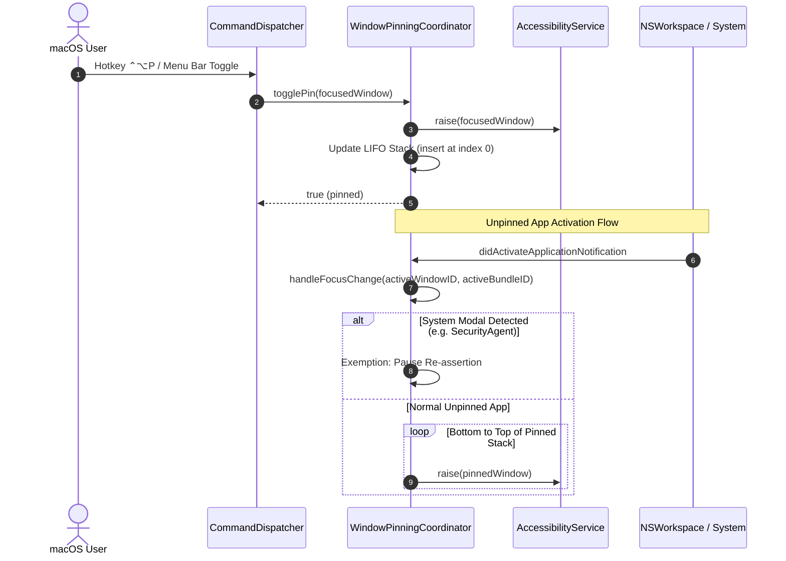

# Universal Always-On-Top Window Pinning & Stage Manager Launch Co-existence (US-SNAP-021)

## 1. Overview

Power users frequently need reference materials (e.g. video streams, documentation, calculator, sticky notes, chat windows) to stay visible above other windows regardless of which background app has focus, while maintaining seamless window integration when launching new apps in macOS Stage Manager.

Before US-SNAP-021:

- macOS does not provide a native Always-On-Top toggle for third-party windows.
- Users had to rely on dangerous hacks or private CGS APIs (`CGSSetWindowLevel`) which break system integrity, introduce security risks, or corrupt Mission Control and Spaces state.
- In macOS Stage Manager, newly launched apps would isolate into separate stages or eject existing windows to the side strip.

**US-SNAP-021 delivers Universal Always-On-Top Window Pinning & Stage Manager Launch Co-existence**:

1. **Zero Private APIs**: Uses pure, public Accessibility APIs (`kAXRaiseAction`) to actively maintain pinned windows above unpinned ones without window server corruption or SIP compromises (ADR-0015).
2. **Dynamic LIFO Z-Stacking**: Supports multiple pinned windows where the most recently pinned or focused pinned window stays topmost, while all pinned windows remain strictly above unpinned background windows.
3. **Focus Change Re-assertion**: Automatically re-asserts pinned windows from bottom to top upon focus change to an unpinned application, preserving true user focus without stealing keyboard events.
4. **System Modal Safety Exemption**: Automatically pauses re-assertion when system-critical modal authentication dialogs appear (e.g. `com.apple.SecurityAgent`, `com.apple.CoreAuthUI`, Touch ID, Keychain) so security prompts are never obscured.
5. **Stage Manager Launch Co-existence**: Seamlessly merges newly launched applications into the active Stage using `ApplicationObserver` and `kAXRaiseAction` without ejecting companion windows into the sidebar.
6. **Accessible Controls & Feedback**: Global hotkey (`⌃⌥P`), Menu Bar status dropdown with active pinned window items and individual unpin buttons, and a settings toggle for Stage Manager launch co-existence.

---

## 2. Architectural Design

---

## 3. Key Components & Seams

| Component / File                                                                                                                                                                                                                            | Layer  | Purpose                                                                                                                     |
| :------------------------------------------------------------------------------------------------------------------------------------------------------------------------------------------------------------------------------------------ | :----- | :-------------------------------------------------------------------------------------------------------------------------- |
| [`PinnedWindowRecord.swift`](file:///Users/vutuanhau/Documents/PROJECT/FlowSnap/FlowSnap/Domain/Window/PinnedWindowRecord.swift)                                                                                                            | Domain | Value type representing a pinned window (`id`, `pid`, `bundleIdentifier`, `title`, `pinnedAt`).                             |
| [`WindowPinningCoordinating.swift`](file:///Users/vutuanhau/Documents/PROJECT/FlowSnap/FlowSnap/Domain/Window/WindowPinningCoordinating.swift)                                                                                              | Domain | Contract interface defining pin management, LIFO state, and focus re-assertion hooks.                                       |
| [`StageManagerLaunchCoordinating.swift`](file:///Users/vutuanhau/Documents/PROJECT/FlowSnap/FlowSnap/Domain/StageManager/StageManagerLaunchCoordinating.swift)                                                                              | Domain | Contract interface for Stage Manager launch cohesion coordination.                                                          |
| [`WindowPinningCoordinator.swift`](file:///Users/vutuanhau/Documents/PROJECT/FlowSnap/FlowSnap/Core/Policy/WindowPinningCoordinator.swift)                                                                                                  | Core   | Deep module managing LIFO stack, workspace activation listeners, system modal exemption, and `kAXRaiseAction` re-assertion. |
| [`StageManagerLaunchCoordinator.swift`](file:///Users/vutuanhau/Documents/PROJECT/FlowSnap/FlowSnap/Infrastructure/StageManager/StageManagerLaunchCoordinator.swift)                                                                        | Infra  | Orchestrates launch observation via `ApplicationObserver` and re-raises previous stage windows upon new window creation.    |
| [`CommandDispatcher.swift`](file:///Users/vutuanhau/Documents/PROJECT/FlowSnap/FlowSnap/Core/Commands/CommandDispatcher.swift)                                                                                                              | Core   | Dispatches `.togglePinFocusedWindow` command with debouncing.                                                               |
| [`ShortcutAction.swift`](file:///Users/vutuanhau/Documents/PROJECT/FlowSnap/FlowSnap/Domain/Hotkeys/ShortcutAction.swift)                                                                                                                   | Domain | Declares `.togglePinFocusedWindow` (`⌃⌥P` default).                                                                         |
| [`GeneralSettingsView.swift`](file:///Users/vutuanhau/Documents/PROJECT/FlowSnap/FlowSnap/UI/Settings/GeneralSettingsView.swift)                                                                                                            | UI     | Provides user toggle for `isStageManagerLaunchCoexistenceEnabled`.                                                          |
| [`MenuBarViewModel.swift`](file:///Users/vutuanhau/Documents/PROJECT/FlowSnap/FlowSnap/UI/MenuBar/MenuBarViewModel.swift) & [`MenuBarView.swift`](file:///Users/vutuanhau/Documents/PROJECT/FlowSnap/FlowSnap/UI/MenuBar/MenuBarView.swift) | UI     | Displays pinned windows list and quick unpin actions in menu bar dropdown.                                                  |

---

## 4. Verification & Testing

- **Automated Test Suite**:
  - [`WindowPinningCoordinatorTests.swift`](file:///Users/vutuanhau/Documents/PROJECT/FlowSnap/FlowSnapTests/Core/Policy/WindowPinningCoordinatorTests.swift):
    - `TC-PIN-001`: Pin toggling and initial raise assertion.
    - `TC-PIN-002`: Dynamic LIFO stack ordering with multiple pinned windows.
    - `TC-PIN-003`: Re-assertion from bottom to top upon focus change to unpinned window.
    - `TC-PIN-004`: LIFO promotion when focusing an already pinned window.
    - `TC-PIN-005`: System modal safety exemption (`com.apple.SecurityAgent`, `com.apple.CoreAuthUI`).
    - `TC-PIN-006`: Automatic cleanup on application termination.
    - `TC-PIN-007`: Auto-purge of dead/invalid windows failing to raise.
    - `TC-PIN-008`: Unpin individual and unpin all functionality.
  - [`StageManagerLaunchCoordinatorTests.swift`](file:///Users/vutuanhau/Documents/PROJECT/FlowSnap/FlowSnapTests/Infrastructure/StageManagerLaunchCoordinatorTests.swift):
    - `TC-PIN-009`: Preserves stage co-existence by re-raising existing windows upon app launch.
- **Regression Suite**: 423/423 unit and integration tests passing across 68 test suites.

---

## 5. References & Artifacts

- [ADR-0015: Always-On-Top Window Pinning & Stage Manager Co-existence](file:///Users/vutuanhau/Documents/PROJECT/FlowSnap/adr/0015-always-on-top-window-pinning.md)
- [Elicitation Interview Record](file:///Users/vutuanhau/Documents/PROJECT/FlowSnap/.specify/features/always-on-top-window-pinning/01-elicitation.md)
- [Domain Model & Rules](file:///Users/vutuanhau/Documents/PROJECT/FlowSnap/.specify/features/always-on-top-window-pinning/03-domain-model.md)
- [Feature Specification](file:///Users/vutuanhau/Documents/PROJECT/FlowSnap/.specify/features/always-on-top-window-pinning/spec.md)
- [User Stories & Acceptance Scenarios](file:///Users/vutuanhau/Documents/PROJECT/FlowSnap/.specify/features/always-on-top-window-pinning/05-user-stories.md)
- [End-User Guide](file:///Users/vutuanhau/Documents/PROJECT/FlowSnap/docs/user-guides/always-on-top-window-pinning.md)
