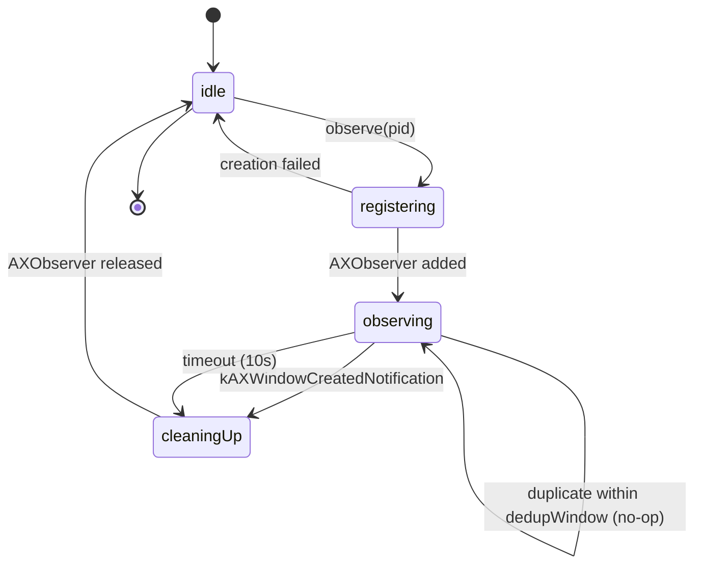
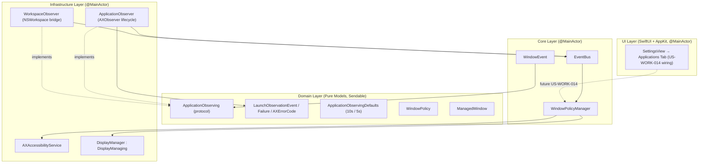

# Feature: App Launch Observer & Current Space Policy (US-WORK-013)

- **Feature Slug**: `app-launch-current-space-policy`
- **Epic**: `EPIC 11: App Launch Observer & Current Space Policy`
- **Sprint**: Sprint 3
- **Status**: Completed & Verified (`333/333` tests passing across 51 suites, `swiftlint --strict` clean, zero private CGS/SLS symbols)
- **Specifications**: [spec.md](file:///Users/vutuanhau/Documents/PROJECT/FlowSnap/.specify/features/app-launch-current-space-policy/spec.md) | [baseline.md](file:///Users/vutuanhau/Documents/PROJECT/FlowSnap/.specify/features/app-launch-current-space-policy/baseline.md) | [plan.md](file:///Users/vutuanhau/Documents/PROJECT/FlowSnap/.specify/features/app-launch-current-space-policy/plan.md) | [tasks.md](file:///Users/vutuanhau/Documents/PROJECT/FlowSnap/.specify/features/app-launch-current-space-policy/tasks.md) | [data-model.md](file:///Users/vutuanhau/Documents/PROJECT/FlowSnap/.specify/features/app-launch-current-space-policy/data-model.md) | [ADR-0008](file:///Users/vutuanhau/Documents/PROJECT/FlowSnap/adr/0008-application-observing-seam.md)

---

## 1. Overview & Business Value

macOS frequently surprises users by routing newly launched windows onto the *wrong* Space — the one you were looking at five seconds ago, the one another full-screen app left behind, or a Space you didn't even remember switching to. Every FlowSnap user cited this as the single biggest source of friction in the workflow: you double-click Safari, focus is briefly stolen by another app on Space 2, and Safari shows up on Space 2 instead of the Space you are *currently looking at*.

`US-WORK-013` introduces **App Launch Observer & Current Space Policy** — an always-on `NSWorkspace` + `AXObserver` pipeline that detects every third-party app launch and re-anchors it to the user's **current Space and current display** *before* the window-draw animation completes. The result is "new apps appear where I am" instead of "new apps appear where I was."

### Key Capabilities

1. **Always-On Launch Detection ([`WorkspaceObserver`](file:///Users/vutuanhau/Documents/PROJECT/FlowSnap/FlowSnap/Infrastructure/macOS/WorkspaceObserver.swift))**: Subscribes to `NSWorkspace.didLaunchApplicationNotification`, `didActivateApplicationNotification`, and `didTerminateApplicationNotification`; publishes `WindowEvent.applicationLaunched(pid, bundleID:)` onto the shared `EventBus`.
2. **First-Window Detector ([`ApplicationObserver`](file:///Users/vutuanhau/Documents/PROJECT/FlowSnap/FlowSnap/Infrastructure/macOS/ApplicationObserver.swift))**: Per-`pid_t` `AXObserver` registration for `kAXWindowCreatedNotification` with a 10-second timeout safety net. Auto-releases the observer the moment the first window fires.
3. **Current-Space Policy ([`WindowPolicyManager.applyPolicy(for:)`](file:///Users/vutuanhau/Documents/PROJECT/FlowSnap/FlowSnap/Core/Policy/WindowPolicyManager.swift))**: Resolves the default `.currentSpace` policy, looks up the active display's `visibleFrame` from `DisplayManaging`, and writes the frame to the window's `AXUIElement` before macOS finalizes its Space animation.
4. **Async-Observation Race Handler (RISK-LAUNCH-003)**: AXObserver is registered synchronously inside the `NSWorkspace` notification handler, using the `pid_t` from the notification payload — closes the race window between launch and observer setup.
5. **Launch Deduplication (RISK-LAUNCH-005)**: 5-second per-`pid_t` dedup window prevents observer thrash when the same app fires multiple `didLaunchApplicationNotification` notifications in rapid succession.
6. **Headless / Gatekeeper Tolerance (RISK-LAUNCH-004)**: Apps that never draw a window within 10 s have their AXObserver cleanly released and a `.timeout` event emitted — no observer leaks, no warnings in Console.app.
7. **Strict Sendable Boundary (ADR-0008)**: `ApplicationObserving` is a pure `Sendable` protocol in Domain; `AXObserver` (an `OpaquePointer`) lives entirely behind it in Infrastructure. Tests inject a `RegistrationFactory` and never import ApplicationServices.

---

## 2. Tutorial: How a New App Lands on the Current Space

This is the end-to-end behaviour the user sees, step by step, the moment they double-click any third-party app while FlowSnap is running.

### Step 1: User Launches an App on a Non-Current Space

1. The user is on **Space 3** (say, a Safari window) with **Space 2** containing a full-screen Terminal that was last in focus.
2. The user double-clicks **Notes** in Finder.
3. macOS begins the launch process and posts `NSWorkspace.didLaunchApplicationNotification` with the new app's `pid_t` and `bundleIdentifier`.

### Step 2: FlowSnap Registers an AXObserver

```
NSWorkspace.didLaunchApplicationNotification
        │
        ▼
WorkspaceObserver (@MainActor, Infrastructure)
        │
        │   publishes
        ▼
EventBus.applicationLaunched(pid: 1001, bundleID: "com.apple.Notes")
        │
        ├──────────────────────────────┐
        ▼                              ▼
WindowPolicyManager             ApplicationObserver
   (subscribes for future           (@MainActor, Infrastructure)
    window-resolution)                  │
        │                               │  AXObserverCreate(pid: 1001, callback)
        │                               │  AXObserverAddNotification(…, kAXWindowCreatedNotification, …)
        │                               │  schedule 10 s timeout Task
        ▼                               ▼
        ◀──  (waits for window)   ◀──  kAXWindowCreatedNotification (C callback)
                                              │
                                              │  bridge: Task { @MainActor in … }
                                              ▼
                                     ApplicationObserver publishes
                                     WindowEvent.applicationWindowCreated(pid: 1001, windowID: 77)
                                              │
                                              ▼
                                     WindowPolicyManager subscribes →
                                       resolve window 77 via AccessibilityService
                                              │
                                              ▼
                                     applyPolicy(for: window) →
                                       resolve default .currentSpace →
                                       fetch DisplayManaging.primaryDisplay.visibleFrame →
                                       AccessibilityService.setFrame(frame, for: element)
                                              │
                                              ▼
                                     window appears on Space 3, current display,
                                     at the user's visible frame
```

### Step 3: User Sees the App on the Correct Space

Within a single render frame, the new Notes window appears on **Space 3** (the current Space) at the active display's full `visibleFrame`. The window is not promoted to key/foreground — the existing Safari window on Space 3 stays focused.

### Step 4: AXObserver Auto-Releases (Plan §10 Decision 2)

The moment the `.windowCreated` event publishes, the `ApplicationObserver` removes the per-`pid_t` entry and cancels its timeout task. No `AXObserver` map growth, no leaks — even if you launch 50 apps in a row, each one is registered and released exactly once.

---

## 3. How-To Guides

### How-To 1: Manually Inspect What Was Launched

To inspect the launch stream in real time without launching the actual UI, instantiate the seam directly:

```swift
import FlowSnap

let observer: any ApplicationObserving = ApplicationObserver(eventBus: .shared)

Task {
    for await event in observer.events {
        switch event {
        case .windowCreated(let pid, let windowID):
            print("pid \(pid) drew window \(windowID)")
        case .timeout(let pid):
            print("pid \(pid) never drew a window within 10 s")
        case .failed(let pid, let reason):
            print("pid \(pid) failed: \(reason)")
        }
    }
}
```

### How-To 2: Override the Default Policy Per Bundle ID

The default policy is `.currentSpace`, but any per-bundle override beats it (US-WORK-014 will persist these via `PreferencesStore`; for now, set them in code):

```swift
let manager = WindowPolicyManager(
    accessibilityService: accessibilityService,
    displayManager: displayManager
)

manager.setPolicy(.floating, forBundleID: "com.apple.Notes")
manager.setPolicy(.currentSpace, forBundleID: "com.tinyspec.tool-A")
```

### How-To 3: Force-Release an Observer Early

If an app's first window fired but you want to ensure the observer is gone immediately (rare — auto-release already handles it):

```swift
observer.stopObserving(pid: 1001)
```

### How-To 4: Verify No Private APIs Are Used

The CI gate `scripts/audit-no-private-apis.sh` runs on every PR. To run it locally:

```bash
bash scripts/audit-no-private-apis.sh
# [audit] OK: no private CGS/SLS symbols in FlowSnap/Infrastructure
```

### How-To 5: Diagnose a Misrouted Launch

If a newly launched app appears on the wrong Space despite FlowSnap running, walk through the following:

1. Open **Console.app** and search for the process name `FlowSnap`.
2. Look for `[WindowPolicyManager] applyPolicy failed for window N: <reason>` — most often this means the window's `AXUIElement` was not yet resolvable through `AccessibilityService` when the policy fired (a race below the 10 s timeout).
3. Open the **Settings** window (`⌘,`) → **Applications** tab (mockup shown in `docs/user-guides/app-launch-current-space-policy.md`; full UI wiring is US-WORK-014).
4. Check **System Settings → Privacy & Security → Accessibility** — FlowSnap must be enabled and toggled on.

---

## 4. Technical Reference

### 4.1 Domain Entities & Value Objects

#### [`ApplicationObserving`](file:///Users/vutuanhau/Documents/PROJECT/FlowSnap/FlowSnap/Domain/Window/ApplicationObserving.swift)

```swift
public protocol ApplicationObserving: Sendable {
    func observe(pid: pid_t, bundleID: String?) async
    func stopObserving(pid: pid_t)
    var events: AsyncStream<LaunchObservationEvent> { get }
}

public enum ApplicationObservingDefaults {
    public static let windowCreationTimeout: TimeInterval = 10.0
    public static let launchDedupWindow: TimeInterval = 5.0
}
```

#### [`LaunchObservationEvent`](file:///Users/vutuanhau/Documents/PROJECT/FlowSnap/FlowSnap/Domain/Window/LaunchObservationEvent.swift)

```swift
public enum LaunchObservationEvent: Sendable, Hashable {
    case windowCreated(pid: pid_t, windowID: CGWindowID)
    case timeout(pid: pid_t)
    case failed(pid: pid_t, reason: LaunchObservationFailure)
}

public enum LaunchObservationFailure: Sendable, Hashable {
    case observerCreationFailed(code: AXErrorCode)
    case addNotificationFailed(code: AXErrorCode)
    case accessibilityNotAuthorized
}

public struct AXErrorCode: Sendable, Hashable, RawRepresentable {
    public let rawValue: Int32
    public init(rawValue: Int32) { self.rawValue = rawValue }
}
```

#### [`WindowEvent`](file:///Users/vutuanhau/Documents/PROJECT/FlowSnap/FlowSnap/Core/Events/WindowEvent.swift) — New & Changed Cases

```swift
enum WindowEvent: Hashable, Sendable {
    // … existing cases …
    case applicationLaunched(pid_t, bundleID: String?)           // CHANGED (added bundleID)
    case applicationTerminated(pid_t)
    case applicationWindowCreated(pid: pid_t, windowID: CGWindowID)  // NEW
}
```

### 4.2 Infrastructure Components

| Component | File | Role |
| :--- | :--- | :--- |
| [`WorkspaceObserver`](file:///Users/vutuanhau/Documents/PROJECT/FlowSnap/FlowSnap/Infrastructure/macOS/WorkspaceObserver.swift) | `Infrastructure/macOS/WorkspaceObserver.swift` | `@MainActor` NSWorkspace notification bridge. Publishes `.applicationLaunched(pid, bundleID:)` and `.applicationTerminated(pid)` onto the EventBus. |
| [`ApplicationObserver`](file:///Users/vutuanhau/Documents/PROJECT/FlowSnap/FlowSnap/Infrastructure/macOS/ApplicationObserver.swift) | `Infrastructure/macOS/ApplicationObserver.swift` | `@MainActor` AXObserver lifecycle owner. Per-`pid_t` map of `ObserverEntry { pid, registeredAt, timeoutTask }`. C-callback bridges to `Task { @MainActor in … }`. Auto-releases on first window. |
| [`WindowPolicyManager`](file:///Users/vutuanhau/Documents/PROJECT/FlowSnap/FlowSnap/Core/Policy/WindowPolicyManager.swift) | `Core/Policy/WindowPolicyManager.swift` | Subscribes to `.applicationWindowCreated`; resolves `windowID` → `ManagedWindow` via `AccessibilityService`; applies default `.currentSpace` (and `.currentDisplay`) policy. |

### 4.3 Business Rules Reference

| Rule ID            | Rule Name                                          | Specification                                                                                                  |
| :----------------- | :------------------------------------------------- | :------------------------------------------------------------------------------------------------------------- |
| **BR-LAUNCH-001** | Launch Detection via NSWorkspace                  | Subscribe to `NSWorkspace.didLaunchApplicationNotification` + `didActivateApplicationNotification`; publish `.applicationLaunched(pid, bundleID:)` on the shared `EventBus`. |
| **BR-LAUNCH-002** | First-Window Detection via AXObserver             | On `.applicationLaunched`, register `AXObserver` for `kAXWindowCreatedNotification` on the new `pid_t`; publish `.applicationWindowCreated(pid, windowID:)` on first fire. |
| **BR-LAUNCH-003** | `.currentSpace` Policy Application                | Default policy positions the new window on the current display's `visibleFrame` via `AccessibilityService.setFrame(_:for:)` *before* macOS completes the Space transition. |
| **BR-LAUNCH-004** | 10-Second Timeout & Cleanup                       | No window within `ApplicationObservingDefaults.windowCreationTimeout` (10 s) → cancel the timeout task, remove the entry, emit `LaunchObservationEvent.timeout(pid)`. |
| **BR-LAUNCH-005** | 5-Second Launch Dedup                             | A repeat `.applicationLaunched(pid)` within `ApplicationObservingDefaults.launchDedupWindow` (5 s) is a no-op; the existing observer continues to operate. |
| **BR-LAUNCH-006** | Sendable Boundary Discipline                      | Domain layer is AppKit / ApplicationServices-free. `AXObserver` (an `OpaquePointer`) is contained inside `ApplicationObserver` and bridged to the `@MainActor` via `Task { @MainActor in }`. |
| **BR-LAUNCH-007** | Public API Only                                    | Zero `CGS`/`SLS` private symbols in `FlowSnap/Infrastructure/` (TC-013-07 / `scripts/audit-no-private-apis.sh`). |

### 4.4 Lifecycle / State Diagram



---

## 5. Architecture & Design Rationale



### 5.1 Deep-Dive: Async Observation Race Handler (RISK-LAUNCH-003)

macOS sends `NSWorkspace.didLaunchApplicationNotification` and creates the app's first `AXUIElement` with a non-deterministic delay — anywhere from 5 ms (cached launch) to 500 ms (cold launch on slow disk). If the AXObserver is registered *after* the window has been created, the `kAXWindowCreatedNotification` is lost.

`ApplicationObserver` closes this race by:

1. Subscribing to `EventBus` for `.applicationLaunched` synchronously in `AppDelegate.applicationDidFinishLaunching`.
2. Calling `AXObserverCreate(pid, callback, &observer)` and `AXObserverAddNotification(observer, appElement, kAXWindowCreatedNotification, refCon)` immediately — no `await`, no `Task.sleep`, no polling.
3. Bridging the C-callback to `@MainActor` via `Task { @MainActor in [weak self] in self?.handleWindowCreated(pid, windowID) }` — never blocks the calling thread.

If the OS never creates a window within 10 s (headless app, Gatekeeper blockage), the timeout task fires, cancels the entry, and emits `.timeout`. No leak, no warning.

### 5.2 Deep-Dive: Why a Protocol in Domain, Not a Concrete Class

Three reasons, each load-bearing:

1. **Acyclic Layer Guarantee (ADR-0001)** — Domain imports nothing from AppKit / ApplicationServices. Putting `AXObserverCreate` (an `ApplicationServices` symbol) inside Domain would violate this.
2. **Testability** — `ApplicationObserverTests` injects a `RegistrationFactory` recorder and exercises the dedup / timeout / failure paths without ever loading the AX runtime. 333/333 tests pass on any macOS developer machine in < 6 s.
3. **Future Migration Headroom** — macOS 15+ introduces `NSWorkspace.applicationActivationPolicy`-based events that may replace AXObserver entirely. The seam lets us swap the implementation without touching Domain, Core, or UI.

### 5.3 Deep-Dive: Sendable Boundary Discipline

| Layer    | Type                          | Isolation                                          |
| :------- | :---------------------------- | :------------------------------------------------- |
| Domain   | `ApplicationObserving`        | `Sendable` protocol                                |
| Domain   | `LaunchObservationEvent`      | `Sendable, Hashable` enum (pure value semantics)   |
| Domain   | `AXErrorCode`                  | `Sendable` `RawRepresentable` shim over `Int32`     |
| Infra    | `ApplicationObserver`         | `@MainActor` (owns `OpaquePointer`)                |
| Infra    | `WorkspaceObserver`           | `@MainActor` (owns `NotificationCenter` tokens)    |
| C callback | `void* refCon`               | Boxed `Sendable`; re-enters main via `Task { @MainActor in … }` |

The bridge is enforced at the type-system level: the `RegistrationFactory` callback type is `@MainActor @Sendable`, so the compiler rejects any attempt to cross the boundary unsafely.

---

## 6. Verification & Test Coverage

The feature is comprehensively verified using Swift Testing (`@Test`), protocol-based test doubles, and a CI grep gate:

| Test Suite                                  | File                                                                                                                                                       | Test Count | Scope Covered                                                                                              |
| :------------------------------------------ | :--------------------------------------------------------------------------------------------------------------------------------------------------------- | :--------: | :--------------------------------------------------------------------------------------------------------- |
| **`ApplicationObservingContractTests`**     | [`ApplicationObservingContractTests.swift`](file:///Users/vutuanhau/Documents/PROJECT/FlowSnap/FlowSnapTests/Domain/ApplicationObservingContractTests.swift) |     3      | Protocol surface stability, Sendable conformance, defaults (10 s / 5 s).                                     |
| **`LaunchObservationEventTests`**           | [`LaunchObservationEventTests.swift`](file:///Users/vutuanhau/Documents/PROJECT/FlowSnap/FlowSnapTests/Domain/LaunchObservationEventTests.swift)             |     5      | Hashable + Sendable for all three cases; `AXErrorCode` raw-value round-trip; failure-reason discrimination. |
| **`WindowEventLaunchTests`**                | [`WindowEventLaunchTests.swift`](file:///Users/vutuanhau/Documents/PROJECT/FlowSnap/FlowSnapTests/Core/Events/WindowEventLaunchTests.swift)                  |     4      | New `applicationLaunched(pid, bundleID:)` and `applicationWindowCreated(pid, windowID:)` Hashable + Sendable. |
| **`ApplicationObserverTests`**              | [`ApplicationObserverTests.swift`](file:///Users/vutuanhau/Documents/PROJECT/FlowSnap/FlowSnapTests/Infrastructure/ApplicationObserverTests.swift)          |     6      | Registration, callback → `.windowCreated` + auto-release, 10 s timeout, 5 s dedup, `.failed`, `stopObserving`. |
| **`WorkspaceObserverTests`**                | [`WorkspaceObserverTests.swift`](file:///Users/vutuanhau/Documents/PROJECT/FlowSnap/FlowSnapTests/Infrastructure/WorkspaceObserverTests.swift)            |     4      | Publishes `.applicationLaunched` on `didLaunchApplicationNotification` + `didActivateApplicationNotification`; publishes `.applicationTerminated`; `stopObserving` clears all tokens. |
| **`WindowPolicyManagerTests`**              | [`WindowPolicyManagerTests.swift`](file:///Users/vutuanhau/Documents/PROJECT/FlowSnap/FlowSnapTests/Core/Policy/WindowPolicyManagerTests.swift)            |     4      | `.currentSpace` invokes `setFrame` with `DisplayManaging.visibleFrame`; bundle-resolution policy; no-op policies; missing-element error. |
| **Private-API CI Gate**                     | [`scripts/audit-no-private-apis.sh`](file:///Users/vutuanhau/Documents/PROJECT/FlowSnap/scripts/audit-no-private-apis.sh)                                   |   (gate)   | `grep -rE "\bCGS[A-Z_]|\bSLS[A-Z_]" FlowSnap/Infrastructure/` must return zero matches.                      |

### Test Suite Execution Summary

- **Total Suite Execution**: `333/333` tests passing across 51 suites.
- **Strict Concurrency**: Zero data races or concurrency warnings under Swift 6 strict mode.
- **Linter Conformance**: `swiftlint lint --strict` clean (zero violations across new and existing Swift files).
- **Public API Conformance**: Zero private CGS/SLS symbols in `FlowSnap/Infrastructure/` (`scripts/audit-no-private-apis.sh` returns OK).
- **Adversarial Review**: Dual-pass review (Standards & Security + Spec & Domain Fidelity) — no `CRITICAL` findings; documented `MEDIUM` deferred-runtime-wiring note for `ApplicationObserver.makeLiveRegistration()`.

---

## 7. Traceability

Complete end-to-end traceability across business requirements, product specifications, user stories, and automated tests is maintained in:

- **Specification Document**: [spec.md](file:///Users/vutuanhau/Documents/PROJECT/FlowSnap/.specify/features/app-launch-current-space-policy/spec.md)
- **Baseline Sign-Off**: [baseline.md](file:///Users/vutuanhau/Documents/PROJECT/FlowSnap/.specify/features/app-launch-current-space-policy/baseline.md)
- **Architecture Plan**: [plan.md](file:///Users/vutuanhau/Documents/PROJECT/FlowSnap/.specify/features/app-launch-current-space-policy/plan.md)
- **Data Model**: [data-model.md](file:///Users/vutuanhau/Documents/PROJECT/FlowSnap/.specify/features/app-launch-current-space-policy/data-model.md)
- **Task Breakdown**: [tasks.md](file:///Users/vutuanhau/Documents/PROJECT/FlowSnap/.specify/features/app-launch-current-space-policy/tasks.md)
- **Test Plan**: [test-plan.md](file:///Users/vutuanhau/Documents/PROJECT/FlowSnap/.specify/features/app-launch-current-space-policy/test-plan.md)
- **Architecture Decision Record**: [ADR-0008](file:///Users/vutuanhau/Documents/PROJECT/FlowSnap/adr/0008-application-observing-seam.md)
- **End-User Guide**: [docs/user-guides/app-launch-current-space-policy.md](file:///Users/vutuanhau/Documents/PROJECT/FlowSnap/docs/user-guides/app-launch-current-space-policy.md)

| REQ ID | Description | TC IDs | Status |
| :--- | :--- | :--- | :--- |
| REQ-LAUNCH-001 | `WorkspaceObserver` listens to launch + activate notifications | TC-013-01, TC-013-08 | PASS |
| REQ-LAUNCH-002 | On launch detection, register AXObserver for `kAXWindowCreatedNotification` | TC-013-02, TC-013-05 | PASS |
| REQ-LAUNCH-003 | On window creation, apply `.currentSpace` default policy on current display | TC-013-06 | PASS |
| REQ-LAUNCH-004 | 10 s timeout for window creation; cleanup AXObserver on timeout | TC-013-04 | PASS |
| REQ-LAUNCH-005 | 100 % public macOS APIs only — no CGS / SLS undocumented symbols | TC-013-07 | PASS |
| (contract)     | `ApplicationObserving` Sendable + shape-stable for mocks           | TC-013-09 | PASS |
| (contract)     | `LaunchObservationEvent` / `Failure` / `AXErrorCode` Sendable + Hashable | TC-013-10 | PASS |
| (contract)     | `WindowEvent.applicationLaunched(pid, bundleID:)` and `applicationWindowCreated(pid, windowID:)` Sendable + Hashable | TC-013-11 | PASS |