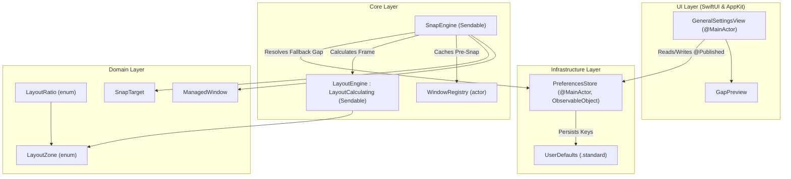
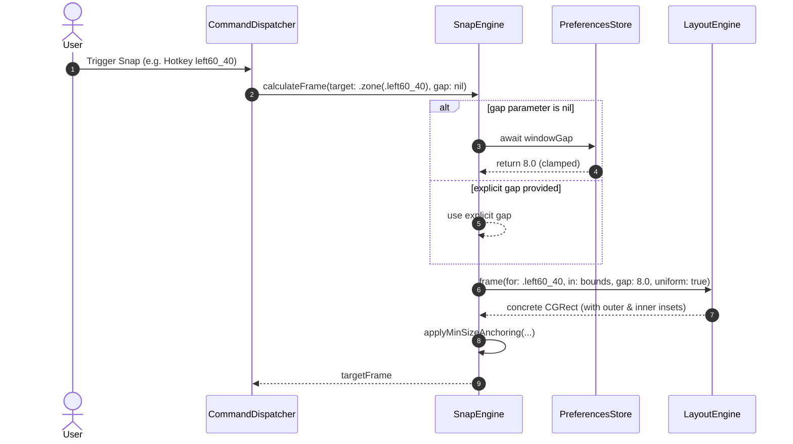

# Feature: Custom Ratios & Window Gaps (US-SNAP-008)

- **Feature Slug**: `custom-ratios-window-gaps`
- **Epic**: `EPIC 08: Adaptive Multi-Window Resize & Gaps`
- **Sprint**: Sprint 2
- **Status**: Completed & Verified (`106/106` tests passing)
- **Specifications**: [baseline.md](file:///Users/vutuanhau/Documents/PROJECT/FlowSnap/.specify/features/custom-ratios-window-gaps/baseline.md) | [spec.md](file:///Users/vutuanhau/Documents/PROJECT/FlowSnap/.specify/features/custom-ratios-window-gaps/spec.md) | [plan.md](file:///Users/vutuanhau/Documents/PROJECT/FlowSnap/.specify/features/custom-ratios-window-gaps/plan.md) | [contracts.md](file:///Users/vutuanhau/Documents/PROJECT/FlowSnap/.specify/features/custom-ratios-window-gaps/contracts/contracts.md)

---

## 1. Overview & Business Value

Standard 50/50 splits and 4-quarter quadrants provide a solid foundation for basic window tiling, but modern multi-monitor and ultra-wide setups require flexible, asymmetric partition splits (e.g. 60/40, 70/30, 80/20, or 25/50/25 3-column layouts) tailored to specific workflows like coding, referencing documentation, or terminal multitasking. Additionally, users desire clean visual separation (window gaps) between tiled windows and display edges without introducing screen overflow or clipping borders.

`US-SNAP-008` extends the core layout and snapping subsystems with:

1. **New Discrete Asymmetric & 3-Column Ratios**: First-class support for `60/40`, `70/30`, `80/20`, and center-weighted `25/50/25` partition ratios in [`LayoutZone`](file:///Users/vutuanhau/Documents/PROJECT/FlowSnap/FlowSnap/Domain/Layout/LayoutZone.swift) and [`LayoutRatio`](file:///Users/vutuanhau/Documents/PROJECT/FlowSnap/FlowSnap/Domain/Layout/LayoutRatio.swift).
2. **Hybrid Window Gap Geometry (`LayoutEngine`)**: Configurable gap insets (`{0, 4, 8, 12, 16}` px) supporting both legacy inner gutters and uniform outer-edge display insets with strict odd-pixel flooring guarantees ([`BR-CRW-001`](file:///Users/vutuanhau/Documents/PROJECT/FlowSnap/.specify/features/custom-ratios-window-gaps/baseline.md#L28-L30), [`BR-CRW-003`](file:///Users/vutuanhau/Documents/PROJECT/FlowSnap/.specify/features/custom-ratios-window-gaps/baseline.md#L36-L38)).
3. **Actor-Backed Preferences Store (`PreferencesStore`)**: Centralized, thread-safe user preference management for gap values and default multi-window ratios, backed by `UserDefaults` and exposing `@Published` bindings for SwiftUI views.
4. **Dynamic Snap Fallback (`SnapEngine`)**: Seamless gap resolution hierarchy where operations automatically inherit the user's global gap setting unless explicitly overridden.
5. **Interactive Settings UI (`GeneralSettingsView`)**: Native segmented gap picker and default ratio selector with real-time layout visual preview.

---

## 2. Tutorial: Getting Started with Custom Ratios & Gaps

_This section provides a learning-oriented walkthrough to understand how custom ratios and window gaps operate in FlowSnap._

### Step 1: Understanding the Layout Ratio Models

FlowSnap defines multi-window partition splits through the [`LayoutRatio`](file:///Users/vutuanhau/Documents/PROJECT/FlowSnap/FlowSnap/Domain/Layout/LayoutRatio.swift) enum:

```swift
import FlowSnap

// Select a predefined layout ratio
let ratio: LayoutRatio = .sixtyForty

// Inspect the corresponding ordered zones
print(ratio.zones) // [.left60_40, .right40_60]
```

Each [`LayoutZone`](file:///Users/vutuanhau/Documents/PROJECT/FlowSnap/FlowSnap/Domain/Layout/LayoutZone.swift) case represents a normalized coordinate bounding box where $x, y, w, h \in [0.0, 1.0]$:

- `.left60_40` $\rightarrow (x: 0.0, y: 0.0, w: 0.60, h: 1.0)$
- `.right40_60` $\rightarrow (x: 0.60, y: 0.0, w: 0.40, h: 1.0)$
- `.left70_30` $\rightarrow (x: 0.0, y: 0.0, w: 0.70, h: 1.0)$
- `.center50` $\rightarrow (x: 0.25, y: 0.0, w: 0.50, h: 1.0)$

### Step 2: Calculating Concrete Frames with Gaps

To compute concrete pixel frames for a display's visible bounds, use [`LayoutEngine`](file:///Users/vutuanhau/Documents/PROJECT/FlowSnap/FlowSnap/Core/Layout/LayoutEngine.swift):

```swift
import CoreGraphics
import FlowSnap

let engine = LayoutEngine()
let displayBounds = CGRect(x: 0, y: 0, width: 1920, height: 1080)
let gap: CGFloat = 8

// Calculate left 60% partition with an 8px uniform gap
let leftFrame = engine.frame(
    for: .left60_40,
    in: displayBounds,
    gap: gap,
    uniform: true
)

// Calculate right 40% partition with an 8px uniform gap
let rightFrame = engine.frame(
    for: .right40_60,
    in: displayBounds,
    gap: gap,
    uniform: true
)

print("Left: \(leftFrame)")   // (x: 8.0, y: 0.0, width: 1137.0, height: 1072.0)
print("Right: \(rightFrame)") // (x: 1153.0, y: 0.0, width: 759.0, height: 1072.0)
```

Notice how:

1. `leftFrame.origin.x` is shifted inward by the 8px gap ($x = 8$).
2. The gutter between `leftFrame.maxX` (1145) and `rightFrame.minX` (1153) is exactly $8\text{px}$.
3. The right margin from `rightFrame.maxX` (1912) to screen edge (1920) is exactly $8\text{px}$.
4. $1137 + 759 + 3 \times 8 = 1920\text{px}$, fulfilling [`BR-CRW-001`](file:///Users/vutuanhau/Documents/PROJECT/FlowSnap/.specify/features/custom-ratios-window-gaps/baseline.md#L28-L30) with zero overflow.

---

## 3. How-To Guides

_This section provides task-oriented recipes for common integration and usage scenarios._

### How-To 1: Configure Window Gaps in Settings UI

Users can configure their preferred window gap and default ratio via [`GeneralSettingsView`](file:///Users/vutuanhau/Documents/PROJECT/FlowSnap/FlowSnap/UI/Settings/GeneralSettingsView.swift).

To integrate the settings view into an AppKit / SwiftUI preferences panel:

```swift
import SwiftUI
import FlowSnap

struct SettingsContainerView: View {
    @ObservedObject var store: PreferencesStore

    var body: some View {
        GeneralSettingsView(store: store)
    }
}
```

When a user selects a gap option (e.g. `12 px`), [`PreferencesStore.setWindowGap(_:)`](file:///Users/vutuanhau/Documents/PROJECT/FlowSnap/FlowSnap/Infrastructure/Persistence/PreferencesStore.swift#L37-L41) automatically clamps the input to the nearest valid value in `{0, 4, 8, 12, 16}`, persists it to `UserDefaults`, and notifies all active subscribers.

### How-To 2: Perform Asymmetric Snapping via `SnapEngine`

To snap a managed window to a `60/40` or `80/20` partition while respecting the user's persisted preferences:

```swift
import FlowSnap

func snapWindowToSixtyForty(
    window: ManagedWindow,
    display: Display,
    snapEngine: SnapEngine
) async {
    // Calling calculateFrame with gap: nil automatically falls back
    // to the preferencesStore.windowGap value.
    if let targetFrame = await snapEngine.calculateFrame(
        for: .zone(.left60_40),
        window: window,
        availableFrame: display.visibleFrame,
        gap: nil
    ) {
        print("Calculated target frame: \(targetFrame)")
        // Dispatch frame to AccessibilityService or WindowManager
    }
}
```

### How-To 3: Programmatically Set and Clamp Custom Gaps

If programmatically updating user preferences from custom commands or scripts:

```swift
import FlowSnap

@MainActor
func updatePreferences(store: PreferencesStore) {
    // Setting an unlisted value (e.g. 10) automatically rounds down to 8
    store.setWindowGap(10)
    assert(store.windowGap == 8)

    // Set default multi-window layout ratio
    store.setDefaultRatio(.eightyTwenty)
}
```

### How-To 4: Handle Odd-Pixel Display Dimensions

Odd-pixel display resolutions (e.g., $1441 \times 901$) can introduce rounding discrepancies. [`LayoutEngine`](file:///Users/vutuanhau/Documents/PROJECT/FlowSnap/FlowSnap/Core/Layout/LayoutEngine.swift) applies the odd-pixel flooring policy ([`BR-LAYOUT-002`](file:///Users/vutuanhau/Documents/PROJECT/FlowSnap/.specify/features/custom-ratios-window-gaps/baseline.md#L30)):

```swift
let engine = LayoutEngine()
let oddBounds = CGRect(x: 0, y: 0, width: 1441, height: 901)
let gap: CGFloat = 4

let left = engine.frame(for: .left60_40, in: oddBounds, gap: gap, uniform: true)
let right = engine.frame(for: .right40_60, in: oddBounds, gap: gap, uniform: true)

// Invariant: left.width + right.width + 3 * gap == bounds.width
let totalCalculated = left.width + right.width + (3 * gap)
assert(totalCalculated == oddBounds.width) // Exactly 1441.0
```

---

## 4. Technical Reference

_This section provides formal specifications, API signatures, business rules, and contracts._

### 4.1 Domain Types

#### `LayoutZone` (`FlowSnap/Domain/Layout/LayoutZone.swift`)

| Enum Case       | `normalizedRect`         | Description                                       |
| :-------------- | :----------------------- | :------------------------------------------------ |
| `left60_40`     | `(0.0, 0.0, 0.60, 1.0)`  | Left 60% column                                   |
| `right40_60`    | `(0.60, 0.0, 0.40, 1.0)` | Right 40% column                                  |
| `left70_30`     | `(0.0, 0.0, 0.70, 1.0)`  | Left 70% column (replacement for `leftTwoThirds`) |
| `leftTwoThirds` | `(0.0, 0.0, 0.70, 1.0)`  | `@available(*, deprecated, renamed: "left70_30")` |
| `rightOneThird` | `(0.70, 0.0, 0.30, 1.0)` | Right 30% column                                  |
| `left80_20`     | `(0.0, 0.0, 0.80, 1.0)`  | Left 80% column                                   |
| `right20_80`    | `(0.80, 0.0, 0.20, 1.0)` | Right 20% column                                  |
| `left25`        | `(0.0, 0.0, 0.25, 1.0)`  | Left 25% column in 3-column layout                |
| `center50`      | `(0.25, 0.0, 0.50, 1.0)` | Center 50% column in 3-column layout              |
| `right25`       | `(0.75, 0.0, 0.25, 1.0)` | Right 25% column in 3-column layout               |

#### `LayoutRatio` (`FlowSnap/Domain/Layout/LayoutRatio.swift`)

```swift
public enum LayoutRatio: String, CaseIterable, Sendable, Codable, Hashable {
    case equal               // [.leftHalf, .rightHalf]
    case sixtyForty          // [.left60_40, .right40_60]
    case seventyThirty       // [.left70_30, .rightOneThird]
    case eightyTwenty        // [.left80_20, .right20_80]
    case threeColumn25_50_25 // [.left25, .center50, .right25]

    public var zones: [LayoutZone] { get }
}
```

### 4.2 Core Protocols & Services

#### `LayoutCalculating` (`FlowSnap/Core/Layout/LayoutCalculating.swift`)

```swift
public protocol LayoutCalculating: Sendable {
    func frame(
        for zone: LayoutZone,
        in availableFrame: CGRect,
        gap: CGFloat,
        uniform: Bool
    ) -> CGRect

    func frames(
        for windows: [ManagedWindow],
        in availableFrame: CGRect,
        layout: Layout,
        gap: CGFloat
    ) -> [CGWindowID: CGRect]
}
```

#### `PreferencesStore` (`FlowSnap/Infrastructure/Persistence/PreferencesStore.swift`)

```swift
@MainActor
public final class PreferencesStore: ObservableObject {
    public static let allowedGaps: [CGFloat] = [0, 4, 8, 12, 16]
    public static let defaultGap: CGFloat = 4
    public static let defaultRatio: LayoutRatio = .equal

    @Published public private(set) var windowGap: CGFloat
    @Published public private(set) var defaultRatio: LayoutRatio

    public init(defaults: UserDefaults = .standard)
    public func setWindowGap(_ newValue: CGFloat)
    public func setDefaultRatio(_ newValue: LayoutRatio)
    public static func clampGap(_ value: CGFloat) -> CGFloat
}
```

### 4.3 Business Rules Implemented

| Rule ID        | Rule Name                | Specification                                                                                                                                                                                                                                                      |
| :------------- | :----------------------- | :----------------------------------------------------------------------------------------------------------------------------------------------------------------------------------------------------------------------------------------------------------------- |
| **BR-CRW-001** | Ratio Contract           | Sum of all zone widths + total gaps MUST equal total available width. Zero overflow or underflow.                                                                                                                                                                  |
| **BR-CRW-002** | Gap Clamping             | Gap values MUST be clamped to $\{0, 4, 8, 12, 16\}$. Unlisted values round down to nearest valid value. Default is $4\text{px}$.                                                                                                                                   |
| **BR-CRW-003** | Uniform Gap Symmetry     | When `uniform=true`, gaps are subtracted from both outer display edges ($x_{\text{origin}} = x_0 + \text{gap}$) and inner gutters ($W_{\text{eff}} = W_{\text{total}} - 3 \times \text{gap}$ for 2-column, $W_{\text{total}} - 4 \times \text{gap}$ for 3-column). |
| **BR-CRW-004** | Legacy Gap Compatibility | When `uniform=false` (default), outer edges are unpadded and legacy inner-only gap logic is preserved.                                                                                                                                                             |
| **BR-CRW-005** | Deprecation Alias        | `LayoutZone.leftTwoThirds` is deprecated with `@available(*, deprecated, renamed: "left70_30")` without runtime breaking changes.                                                                                                                                  |
| **BR-CRW-006** | Preferences Persistence  | User gap preference and default ratio persist in `PreferencesStore` (`UserDefaults`). Defaults on fresh install: gap $4\text{px}$, ratio `.equal`.                                                                                                                 |
| **BR-CRW-007** | Minimum Size Anchoring   | Frames adjusted for gaps still respect `window.minSize` clamping and anchor to outer zone boundaries.                                                                                                                                                              |

---

## 5. Architecture & Design Rationale

_This section provides an understanding-oriented analysis of the system architecture, component relationships, concurrency guarantees, and trade-offs._

### 5.1 System Architecture Diagram



### 5.2 Dynamic Gap Resolution Flow



### 5.3 Architectural Decisions & Trade-offs

1. **Discrete Enum Cases vs. Free-Form Floating Ratios (ADR-0004)**:
   - _Decision_: Defined explicit cases (`.left60_40`, `.left80_20`, etc.) instead of a generic `LayoutZone.custom(ratio: CGFloat)`.
   - _Rationale_: Swift enums allow exhaustive compile-time checking across all switch statements, eliminating runtime validation bugs and simplifying serialization/hotkey binding.
2. **Hybrid Gap Protocol Signature**:
   - _Decision_: Extended [`LayoutCalculating.frame(for:in:gap:uniform:)`](file:///Users/vutuanhau/Documents/PROJECT/FlowSnap/FlowSnap/Core/Layout/LayoutCalculating.swift#L18-L23) with a default parameter `uniform: Bool = false`.
   - _Rationale_: Maintains 100% backward compatibility for existing callers while allowing `SnapEngine` to opt into uniform outer-edge insets when gap $> 0$.
3. **Actor-Compatible MainActor Preferences Store**:
   - _Decision_: Implemented `PreferencesStore` as `@MainActor final class: ObservableObject`.
   - _Rationale_: Provides seamless two-way data binding for SwiftUI views while ensuring thread-safe access from async tasks via Swift 6 concurrency.

---

## 6. Verification & Test Coverage Summary

All **106 tests across 21 test suites** pass with 100% success rate under Xcode strict concurrency:

- [`PreferencesStoreTests`](file:///Users/vutuanhau/Documents/PROJECT/FlowSnap/FlowSnapTests/Infrastructure/PreferencesStoreTests.swift):
  - `firstLaunchDefaults`: Asserts default gap is $4\text{px}$ and default ratio is `.equal`.
  - `clampGap_RoundsDownToAllowedSet`: Validates boundary and arbitrary input down-clamping (`{0, 4, 8, 12, 16}`).
  - `setWindowGap_PersistsClampedValue` & `setDefaultRatio_Persists`: Verifies `UserDefaults` persistence and `@Published` state synchronization.
  - `restoresPersistedValuesOnReinit`: Validates state reconstruction across app restarts.
- [`LayoutEngineTests`](file:///Users/vutuanhau/Documents/PROJECT/FlowSnap/FlowSnapTests/Core/LayoutEngineTests.swift) & [`LayoutEngineOddPixelTests`](file:///Users/vutuanhau/Documents/PROJECT/FlowSnap/FlowSnapTests/Core/LayoutEngineOddPixelTests.swift):
  - Verifies exact pixel dimensions and 0px overlap/underflow for 60/40, 70/30, 80/20, and 25/50/25 splits on 1080p, 1440p, 4K, and odd-dimension screens ($1441 \times 901$).
  - Validates uniform gap math with outer and inner insets.
- [`SnapEngineTests`](file:///Users/vutuanhau/Documents/PROJECT/FlowSnap/FlowSnapTests/Core/SnapEngineTests.swift):
  - `gapFallsBackToPreferencesStoreWhenNotProvided`: Confirms `SnapEngine` uses `PreferencesStore.windowGap` when `gap` is `nil`.
  - `explicitGapOverridesPreferencesStore`: Confirms caller-supplied gap takes precedence over stored preferences.
- [`LayoutZoneTests`](file:///Users/vutuanhau/Documents/PROJECT/FlowSnap/FlowSnapTests/Domain/LayoutZoneTests.swift):
  - Verifies normalized coordinate bounds for all new enum cases and deprecated `leftTwoThirds` aliasing.
