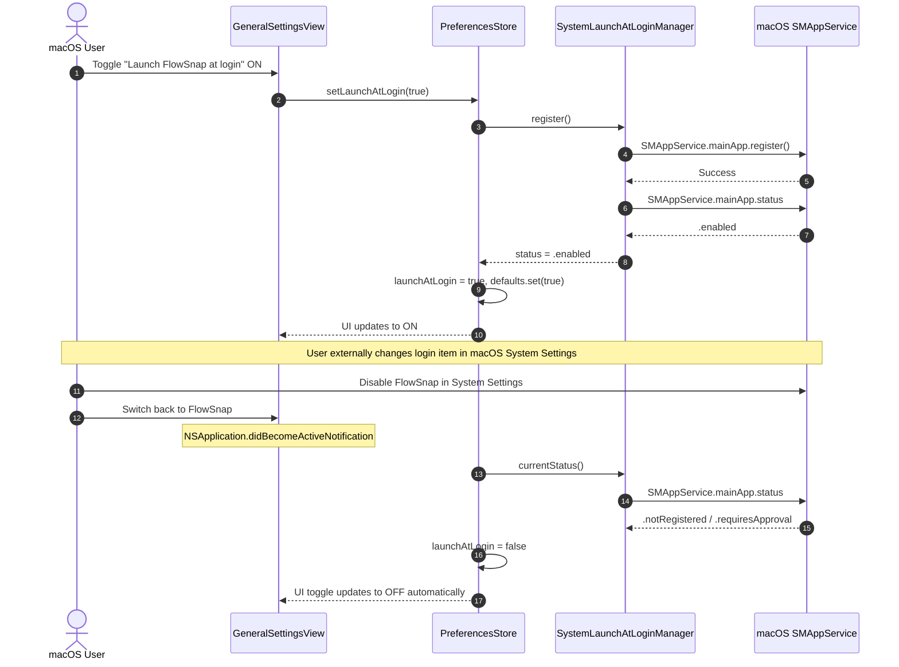

# Launch FlowSnap at Login Integration (`SMAppService`) (US-SNAP-024)

## 1. Overview

FlowSnap is a native macOS productivity tool that must run continuously in the background menu bar so that global hotkeys and window snapping shortcuts remain responsive at all times.

Before US-SNAP-024:

- FlowSnap persisted an inert boolean `launchAtLogin` flag in `UserDefaults` without interacting with macOS system service management.
- Users had to manually launch FlowSnap after every reboot or login session.
- Changes made by the user in macOS System Settings > Login Items & Extensions were never synchronized into the app.

**US-SNAP-024 delivers Launch at Login via `SMAppService.mainApp`**:

1. **Modern System Registration**: Uses Apple's modern `SMAppService.mainApp` API (macOS 13+) to register/unregister FlowSnap as a genuine macOS Login Item without helper daemon bundles.
2. **Two-Way Synchronization**: Polls and updates status upon store initialization, settings screen appearance, and `NSApplication.didBecomeActiveNotification`.
3. **Approval Required Detection**: Detects `.requiresApproval` status if the user or MDM policy disabled login items, displaying an inline warning card and providing a direct button link to macOS System Settings.
4. **Resilient Error Recovery**: Gracefully handles uninstalled development builds (where `SMAppService` reports `.notFound` or throws) without crashing.
5. **Protocol Abstraction for Testing**: Completely abstracts system calls behind `LaunchAtLoginManaging`, enabling 100% deterministic test coverage via `MockLaunchAtLoginManager`.

---

## 2. Architectural Design



---

## 3. Core Components

### `LaunchAtLoginManaging` (`FlowSnap/Domain/Services/LaunchAtLoginManaging.swift`)

Protocol abstracting the ServiceManagement lifecycle:

```swift
@MainActor
public protocol LaunchAtLoginManaging: AnyObject, Sendable {
    func currentStatus() -> LaunchAtLoginStatus
    func register() throws
    func unregister() throws
    func openSystemSettings()
}
```

### `SystemLaunchAtLoginManager` (`FlowSnap/Infrastructure/Services/SystemLaunchAtLoginManager.swift`)

Concrete implementation connecting FlowSnap to `SMAppService.mainApp` and opening `x-apple.systempreferences:com.apple.LoginItems-Settings.extension`.

### `PreferencesStore` (`FlowSnap/Infrastructure/Persistence/PreferencesStore.swift`)

Owns login item state coordination:

- `@Published public private(set) var launchAtLogin: Bool`
- `@Published public private(set) var launchAtLoginStatus: LaunchAtLoginStatus`
- Automatically synchronizes with system on `NSApplication.didBecomeActiveNotification`.

---

## 4. Verification Evidence

- All 8 test cases in `LaunchAtLoginManagerTests` pass cleanly:
  - Initial status derivation (`.enabled`, `.notRegistered`)
  - Registration toggle on / Unregistration toggle off
  - Registration error recovery
  - Two-way sync on app activation
  - `.requiresApproval` handling & system settings opening
  - Explicit status refresh
- Total project test suite: **470 tests in 70 suites passing (100%)**.
