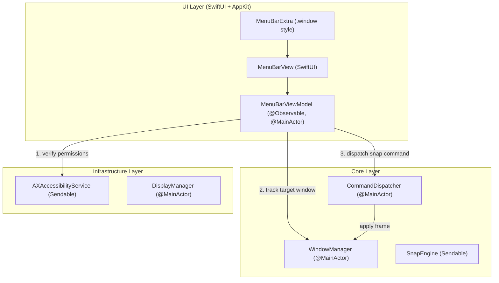

# Feature: Menu Bar Status Item & Quick Snap Controls (US-SNAP-005)

- **Feature Slug**: `menubar-quick-controls`
- **Epic**: `EPIC 05: Menu Bar Status Item & Quick Snap Controls`
- **Sprint**: Sprint 1
- **Status**: Completed & Verified (`61/61` tests passing)

---

## 1. Background & Business Value

FlowSnap is a resident macOS utility designed for frictionless window management. While global hotkeys cater to keyboard-first workflows, the Menu Bar Status Item provides an intuitive visual control center for mouse users, permission monitoring, and application settings.

`US-SNAP-005` establishes:

1. **Background Agent App (`LSUIElement = true`)**: The application operates silently in the background without occupying space in the macOS Dock.
2. **Interactive Quick Snap Controls**: Instant access to Halves (Left, Right, Top, Bottom), Full/Restore (Maximize, Restore), and Quarters (Top-Left, Top-Right, Bottom-Left, Bottom-Right) with visual geometric SF Symbols and shortcut badges.
3. **Accessibility Permission Status Banner**: If permissions are missing or revoked, an interactive warning banner surfaces with a direct 1-click link to macOS System Settings (_Privacy & Security > Accessibility_). The banner automatically hides once permission is granted.
4. **Target Window Focus & Auto-Dismiss (`BR-MENU-002`, `BR-MENU-003`)**: Resolves the last active application window before menu opening, executes the snap command via `CommandDispatcher`, automatically dismisses the popover, and returns focus to the snapped target window.
5. **System Management**: Standard macOS menu items for Settings (`⌘,`) and Quit (`⌘Q`).

---

## 2. Architecture & Data Flow

---

## 3. Quick Snap Actions Matrix

| Action           | SnapTarget                                | Icon Name                                      | Shortcut Badge |
| :--------------- | :---------------------------------------- | :--------------------------------------------- | :------------: |
| **Left Half**    | `.left` (`LayoutZone.leftHalf`)           | `rectangle.lefthalf.inset.filled`              |     `⌃⌥←`      |
| **Right Half**   | `.right` (`LayoutZone.rightHalf`)         | `rectangle.righthalf.inset.filled`             |     `⌃⌥→`      |
| **Top Half**     | `.top` (`LayoutZone.topHalf`)             | `rectangle.tophalf.inset.filled`               |     `⌃⌥↑`      |
| **Bottom Half**  | `.bottom` (`LayoutZone.bottomHalf`)       | `rectangle.bottomhalf.inset.filled`            |     `⌃⌥↓`      |
| **Maximize**     | `.maximize` (`LayoutZone.maximize`)       | `arrow.up.left.and.arrow.down.right.rectangle` |     `⌃⌥↑`      |
| **Restore**      | `.restore`                                | `arrow.counterclockwise.rectangle`             |     `⌃⌥↓`      |
| **Top-Left**     | `.topLeft` (`LayoutZone.topLeft`)         | `rectangle.inset.topleft.filled`               |     `⌃⌥1`      |
| **Top-Right**    | `.topRight` (`LayoutZone.topRight`)       | `rectangle.inset.topright.filled`              |     `⌃⌥2`      |
| **Bottom-Left**  | `.bottomLeft` (`LayoutZone.bottomLeft`)   | `rectangle.inset.bottomleft.filled`            |     `⌃⌥3`      |
| **Bottom-Right** | `.bottomRight` (`LayoutZone.bottomRight`) | `rectangle.inset.bottomright.filled`           |     `⌃⌥4`      |

---

## 4. Key Components & Implementation

### 4.1 `MenuBarAction` (`FlowSnap/Domain/MenuBar/MenuBarAction.swift`)

- Domain enum defining 10 snap actions, icon names, shortcut badges, and target mapping.

### 4.2 `MenuBarViewModel` (`FlowSnap/UI/MenuBar/MenuBarViewModel.swift`)

- `@Observable @MainActor` state store.
- Evaluates `accessibilityService.isTrusted` and coordinates with `CommandDispatcher` and `WindowManager`.
- Provides `triggerSnap(_:)` with auto-dismiss callback `dismissHandler`.

### 4.3 `MenuBarView` (`FlowSnap/UI/MenuBar/MenuBarView.swift`)

- Native SwiftUI view designed with macOS ergonomics and Anti-AI-Slop standards:
  - Header: FlowSnap branding + live "Ready" capsule badge.
  - Permission Alert Banner: Orange accent, instructional copy, and "Grant Permission" CTA.
  - Quick Snap 2-column grid cards.
  - System Footer with Settings and Quit triggers.

---

## 5. Verification & Testing

- **Unit Test Suite**: `FlowSnapTests/UI/MenuBarViewModelTests.swift` (5 tests passing)
- **Total Test Suite**: `61/61` tests passing across 14 suites.
