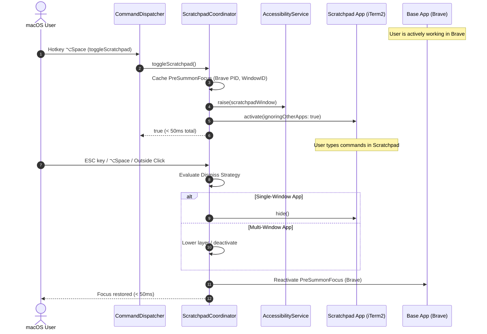

# Quake-Style Quick Scratchpad & Instant Window Toggle (US-SNAP-022)

## 1. Overview

Power users frequently need rapid, temporary access to a secondary utility window (such as a terminal like iTerm2, quick notes, calculator, or reference browser) while working full-screen or tiled in a primary application (e.g. Brave, VS Code).

Before US-SNAP-022:

- macOS does not offer a native Quake-style overlay or scratchpad toggle.
- Opening utility apps often triggered unwanted Desktop Space switches or broke window tile geometry.
- Dismissing auxiliary windows required tedious mouse clicks or cycling through multiple `⌘Tab` applications, disrupting cognitive focus.

**US-SNAP-022 delivers Quake-Style Quick Scratchpad & Instant Window Toggle**:

1. **Instant Assignment (`⌃⌥Space`)**: Allows designating any active focused window as the quick scratchpad via global hotkey or Menu Bar status item.
2. **Instant Summon with Zero-Shrink (< 50ms)**: Pressing `⌥Space` immediately brings the Scratchpad window to the frontmost layer and gives it keyboard focus in `< 50ms`, while preserving 100% of the underlying application's geometry.
3. **Hybrid Dismiss Mechanism (`ASM-SCRATCH-001`)**:
   - Single-window app: Hides the application process cleanly via `NSRunningApplication.hide()`.
   - Multi-window app: Lowers the Scratchpad layer and deactivates without hiding the entire application process, preventing unintentional closing of companion windows.
4. **Accurate Pre-Summon Focus Restoration**: On dismiss, focus is immediately and seamlessly returned to the application and window that held focus prior to summoning.
5. **Dual Dismiss Triggers (ESC & Blur Configuration)**: Pressing `ESC` dismisses the Scratchpad when active. An independent toggle in Settings enables click-outside auto-dismiss (`dismissOnBlur`).
6. **Safe Lifecycle Detach (`ASM-SCRATCH-003`)**: Automatically unbinds and cleans up when the Scratchpad process quits or its window closes, avoiding zombie references.

---

## 2. Architectural Design

---

## 3. Key Components & Seams

| Component / File                                                                                                                                                                                                                            | Layer  | Purpose                                                                                                          |
| :------------------------------------------------------------------------------------------------------------------------------------------------------------------------------------------------------------------------------------------ | :----- | :--------------------------------------------------------------------------------------------------------------- |
| [`ScratchpadRecord.swift`](file:///Users/vutuanhau/Documents/PROJECT/FlowSnap/FlowSnap/Domain/Window/ScratchpadRecord.swift)                                                                                                                | Domain | Sendable model capturing assigned scratchpad identity (`windowID`, `pid`, `bundleID`, `appName`, `windowTitle`). |
| [`ScratchpadState.swift`](file:///Users/vutuanhau/Documents/PROJECT/FlowSnap/FlowSnap/Domain/Window/ScratchpadState.swift)                                                                                                                  | Domain | State enum representing `.unassigned`, `.visible(record:)`, and `.hidden(record:)`.                              |
| [`PreSummonFocus.swift`](file:///Users/vutuanhau/Documents/PROJECT/FlowSnap/FlowSnap/Domain/Window/PreSummonFocus.swift)                                                                                                                    | Domain | Value type snapshotting the frontmost process and window before summoning.                                       |
| [`ScratchpadCoordinating.swift`](file:///Users/vutuanhau/Documents/PROJECT/FlowSnap/FlowSnap/Domain/Window/ScratchpadCoordinating.swift)                                                                                                    | Domain | Contract interface defining assignment, toggle, summon, dismiss, and detach operations.                          |
| [`ScratchpadCoordinator.swift`](file:///Users/vutuanhau/Documents/PROJECT/FlowSnap/FlowSnap/Core/Policy/ScratchpadCoordinator.swift)                                                                                                        | Core   | Deep module managing overlay lifecycle, hybrid dismiss, focus restoration, and event monitors.                   |
| [`CommandDispatcher.swift`](file:///Users/vutuanhau/Documents/PROJECT/FlowSnap/FlowSnap/Core/Commands/CommandDispatcher.swift)                                                                                                              | Core   | Dispatches `.toggleScratchpad` and `.assignScratchpad` commands with debouncing.                                 |
| [`PreferencesStore.swift`](file:///Users/vutuanhau/Documents/PROJECT/FlowSnap/FlowSnap/Infrastructure/Persistence/PreferencesStore.swift)                                                                                                   | Infra  | Persists `isScratchpadDismissOnBlurEnabled` and `isScratchpadDismissOnEscEnabled`.                               |
| [`GeneralSettingsView.swift`](file:///Users/vutuanhau/Documents/PROJECT/FlowSnap/FlowSnap/UI/Settings/GeneralSettingsView.swift)                                                                                                            | UI     | Provides UI toggles for Scratchpad dismiss on ESC and dismiss on blur.                                           |
| [`MenuBarViewModel.swift`](file:///Users/vutuanhau/Documents/PROJECT/FlowSnap/FlowSnap/UI/MenuBar/MenuBarViewModel.swift) & [`MenuBarView.swift`](file:///Users/vutuanhau/Documents/PROJECT/FlowSnap/FlowSnap/UI/MenuBar/MenuBarView.swift) | UI     | Displays current Scratchpad status and quick actions (Toggle, Assign, Detach).                                   |

---

## 4. Verification & Testing

- **Automated Test Suite**:
  - [`ScratchpadCoordinatorTests.swift`](file:///Users/vutuanhau/Documents/PROJECT/FlowSnap/FlowSnapTests/Core/Scratchpad/ScratchpadCoordinatorTests.swift):
    - `TC-SCRATCH-001`: Assign focused window as Scratchpad.
    - `TC-SCRATCH-002`: Re-assigning replaces prior Scratchpad cleanly.
    - `TC-SCRATCH-003`: Detach transitions state to `.unassigned`.
    - `TC-SCRATCH-004`: Instant summon (< 50ms) caches `PreSummonFocus` and activates.
    - `TC-SCRATCH-005`: Hybrid dismiss for single-window app hides process.
    - `TC-SCRATCH-006`: Hybrid dismiss for multi-window app preserves companion windows.
    - `TC-SCRATCH-007`: Accurate focus restoration to recorded pre-summon app.
    - `TC-SCRATCH-008`: Safe fallback when pre-summon process terminates.
    - `TC-SCRATCH-009`: ESC key dismiss when active.
    - `TC-SCRATCH-010`: Dismiss on blur when outside click occurs.
    - `TC-SCRATCH-011`: Safe lifecycle detach on app termination.
    - `TC-SCRATCH-012`: Auto-purge on dead window UIElement failure.
- **Regression Suite**: 436/436 unit and integration tests passing across 69 test suites (100% pass rate).

---

## 5. References & Artifacts

- [ADR-0016: Quake-Style Quick Scratchpad & Instant Window Toggle Architecture](file:///Users/vutuanhau/Documents/PROJECT/FlowSnap/adr/0016-quake-scratchpad-instant-toggle.md)
- [Elicitation Record](file:///Users/vutuanhau/Documents/PROJECT/FlowSnap/.specify/features/quake-scratchpad-instant-toggle/01-elicitation.md)
- [Domain Model & Rules](file:///Users/vutuanhau/Documents/PROJECT/FlowSnap/.specify/features/quake-scratchpad-instant-toggle/03-domain-model.md)
- [Feature Specification](file:///Users/vutuanhau/Documents/PROJECT/FlowSnap/.specify/features/quake-scratchpad-instant-toggle/spec.md)
- [Technical Architecture Plan](file:///Users/vutuanhau/Documents/PROJECT/FlowSnap/.specify/features/quake-scratchpad-instant-toggle/plan.md)
- [End-User Guide](file:///Users/vutuanhau/Documents/PROJECT/FlowSnap/docs/user-guides/quake-scratchpad-instant-toggle.md)
