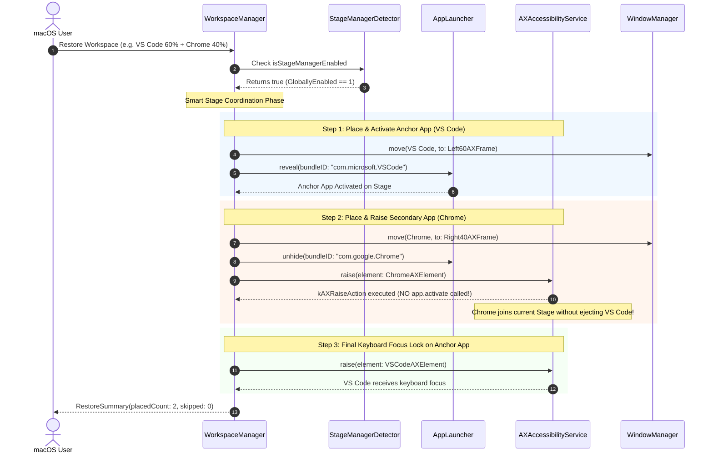

# Stage Manager Multi-Window Auto-Grouping (US-WORK-017)

## 1. Overview

macOS Stage Manager (introduced in macOS 13 Ventura) groups application windows into stages. Calling `app.activate(options: [.activateAllWindows])` for a newly placed application signals macOS WindowServer to create or switch to a new stage, which automatically **ejects previously active windows into the Stage Manager thumbnail strip (sidebar)** on the left edge of the screen.

When users restored a multi-window workspace in previous FlowSnap releases, sequential activation caused only the last application in the workspace to remain on the stage, while the other apps were cast off to the side.

This feature introduces **Smart Stage Coordination**:

1. Dynamically detects if Stage Manager is enabled via `com.apple.WindowManager` key `GloballyEnabled` (< 1ms latency, zero private APIs).
2. Designates the first placement in the workspace as the **Anchor App** and activates it via `launcher.reveal()`.
3. Positions secondary applications and brings their windows onto the active stage via `AccessibilityServing.raise(_:)` (`kAXRaiseAction`), **strictly omitting `app.activate()`** to prevent macOS from swapping stages.
4. Locks final keyboard focus onto the primary Anchor window so users can type immediately.

---

## 2. Architectural Design

---

## 3. Key Components & Seams

| Component / File                                                                                                                                        | Layer          | Purpose                                                                            |
| :------------------------------------------------------------------------------------------------------------------------------------------------------ | :------------- | :--------------------------------------------------------------------------------- |
| [`StageManagerDetecting.swift`](file:///Users/vutuanhau/Documents/PROJECT/FlowSnap/FlowSnap/Domain/StageManager/StageManagerDetecting.swift)            | Domain         | Clean `Sendable` protocol defining `isStageManagerEnabled: Bool`.                  |
| [`StageManagerDetector.swift`](file:///Users/vutuanhau/Documents/PROJECT/FlowSnap/FlowSnap/Infrastructure/StageManager/StageManagerDetector.swift)      | Infrastructure | Queries `com.apple.WindowManager GloballyEnabled` via `CFPreferencesCopyAppValue`. |
| [`AccessibilityServing.swift`](file:///Users/vutuanhau/Documents/PROJECT/FlowSnap/FlowSnap/Infrastructure/Accessibility/AccessibilityService.swift)     | Infrastructure | Protocol interface exposing `raise(window:)` and `raise(_:)`.                      |
| [`AXAccessibilityService.swift`](file:///Users/vutuanhau/Documents/PROJECT/FlowSnap/FlowSnap/Infrastructure/Accessibility/AXAccessibilityService.swift) | Infrastructure | Executes `kAXRaiseAction` via `AXUIElementPerformAction`.                          |
| [`AppLauncher.swift`](file:///Users/vutuanhau/Documents/PROJECT/FlowSnap/FlowSnap/Infrastructure/macOS/AppLauncher.swift)                               | Infrastructure | Exposes `unhide(bundleID:)` without forcing stage changes.                         |
| [`WorkspaceManager.swift`](file:///Users/vutuanhau/Documents/PROJECT/FlowSnap/FlowSnap/Core/Workspace/WorkspaceManager.swift)                           | Core           | Injected with `stageManagerDetector: any StageManagerDetecting`.                   |
| [`WorkspaceManager+Restore.swift`](file:///Users/vutuanhau/Documents/PROJECT/FlowSnap/FlowSnap/Core/Workspace/WorkspaceManager+Restore.swift)           | Core           | Implements Smart Stage Coordination and final keyboard focus lock.                 |
| [`AppDependencies.swift`](file:///Users/vutuanhau/Documents/PROJECT/FlowSnap/FlowSnap/App/AppDependencies.swift)                                        | App            | Configures DI container wiring.                                                    |

---

## 4. Verification & Testing

- **Unit Tests**:
  - [`StageManagerDetectorTests.swift`](file:///Users/vutuanhau/Documents/PROJECT/FlowSnap/FlowSnapTests/Infrastructure/StageManagerDetectorTests.swift): Verifies preference reading and fallback behavior.
  - [`WorkspaceManagerStageManagerTests.swift`](file:///Users/vutuanhau/Documents/PROJECT/FlowSnap/FlowSnapTests/Core/Workspace/WorkspaceManagerStageManagerTests.swift):
    - `TC-SMA-003`: Multi-window restore with Stage Manager active reveals only Anchor, raises Secondary, and locks focus on Anchor.
    - `TC-SMA-004`: Multi-window restore with Stage Manager inactive reveals all placed applications (backward compatible).
    - `TC-SMA-005`: Single-app workspace with Stage Manager active reveals Anchor.
    - `TC-SMA-006`: Hidden secondary app is unhidden and raised without full activation.
- **Regression Suite**: 400/400 unit and integration tests passing across 65 test suites.

---

## 5. References & Artifacts

- **ADR**: [`adr/0013-stage-manager-auto-grouping.md`](file:///Users/vutuanhau/Documents/PROJECT/FlowSnap/adr/0013-stage-manager-auto-grouping.md)
- **Specification**: [`.specify/features/stage-manager-auto-grouping/spec.md`](file:///Users/vutuanhau/Documents/PROJECT/FlowSnap/.specify/features/stage-manager-auto-grouping/spec.md)
- **Architecture Plan**: [`.specify/features/stage-manager-auto-grouping/plan.md`](file:///Users/vutuanhau/Documents/PROJECT/FlowSnap/.specify/features/stage-manager-auto-grouping/plan.md)
- **Tasks**: [`.specify/features/stage-manager-auto-grouping/tasks.md`](file:///Users/vutuanhau/Documents/PROJECT/FlowSnap/.specify/features/stage-manager-auto-grouping/tasks.md)
- **Test Plan**: [`.specify/features/stage-manager-auto-grouping/test-plan.md`](file:///Users/vutuanhau/Documents/PROJECT/FlowSnap/.specify/features/stage-manager-auto-grouping/test-plan.md)
