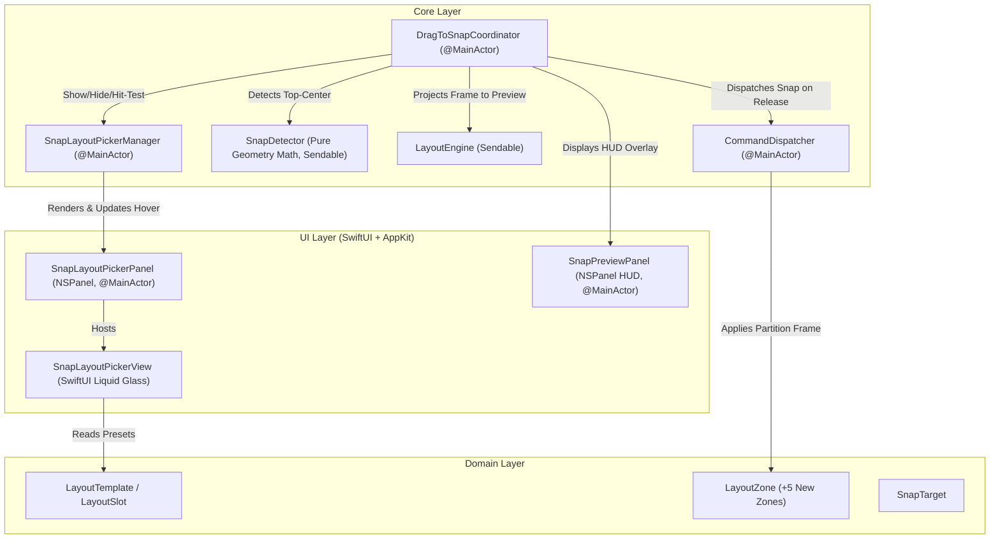

# Feature: Top-Edge Snap Layout Picker (US-SNAP-007)

- **Feature Slug**: `top-edge-layout-picker`
- **Epic**: `EPIC 07: Windows 11-Style Top-Edge Snap Layout Picker`
- **Sprint**: Sprint 2
- **Status**: Completed & Verified (`86/86` tests passing)

---

## 1. Background & Business Value

In addition to fast drag-to-edge/corner snapping, users often desire multi-window complex partition layouts without memorizing distinct hotkeys. `US-SNAP-007` implements a Windows 11-style interactive Top-Edge Snap Layout Picker flyout:

1. **Top-Center Activation Zone**: Dragging a window into the top-center 40% region ($0.3 \times W \le x \le 0.7 \times W$, $y \le 24\text{px}$) triggers a compact, floating layout picker palette containing 4 standard multi-window layout templates.
2. **4 Standard Layout Templates**:
   - **2 Columns Equal (50/50)**: `[leftHalf, rightHalf]`
   - **2 Columns Asymmetric (70/30)**: `[leftTwoThirds (70%), rightOneThird (30%)]`
   - **3 Columns Equal (1/3 each)**: `[leftThird (33.3%), centerThird (33.4%), rightThird (33.3%)]`
   - **4 Quarters (2x2)**: `[topLeft, topRight, bottomLeft, bottomRight]`
3. **Synchronized HUD Slot Preview**: Hovering over any slot inside the picker immediately highlights that target partition on the screen with the `SnapPreviewPanel` HUD overlay.
4. **Release-to-Snap**: Releasing the mouse button over any layout slot immediately snaps the window to that target zone and dismisses the picker.
5. **Fluid Move-Away Cancellation**: Dragging the window away from the top edge smoothly dismisses the layout picker and full-screen HUD preview.

---

## 2. Architecture & Data Flow

---

## 3. Supported Layout Zones & Partitions

| Layout Zone                      | Normalized Rect `(x, y, w, h)`                | Description                       |
| :------------------------------- | :-------------------------------------------- | :-------------------------------- |
| **`leftTwoThirds`**              | `(0.0, 0.0, 0.70, 1.0)`                       | Left 70% width of visible screen  |
| **`rightOneThird`**              | `(0.70, 0.0, 0.30, 1.0)`                      | Right 30% width of visible screen |
| **`leftThird`**                  | `(0.0, 0.0, 0.3333, 1.0)`                     | Left 33.3% equal column           |
| **`centerThird`**                | `(0.3333, 0.0, 0.3334, 1.0)`                  | Center 33.4% equal column         |
| **`rightThird`**                 | `(0.6667, 0.0, 0.3333, 1.0)`                  | Right 33.3% equal column          |
| **`leftHalf`**                   | `(0.0, 0.0, 0.50, 1.0)`                       | Left 50% split                    |
| **`rightHalf`**                  | `(0.50, 0.0, 0.50, 1.0)`                      | Right 50% split                   |
| **`topLeft` / `topRight`**       | `(0, 0.5, 0.5, 0.5)` / `(0.5, 0.5, 0.5, 0.5)` | 2x2 Quarter quadrants             |
| **`bottomLeft` / `bottomRight`** | `(0, 0, 0.5, 0.5)` / `(0.5, 0, 0.5, 0.5)`     | 2x2 Quarter quadrants             |

---

## 4. Key Components & Implementation Details

### 4.1 `SnapLayoutPickerManager` (`FlowSnap/UI/LayoutPicker/SnapLayoutPickerManager.swift`)

- Implements `SnapLayoutPickerManaging` on `@MainActor`.
- Positions the flyout panel horizontally centered at the top edge of the active display with a 150ms slide-and-fade animation.
- Performs coordinate hit-testing translating global screen coordinates into slot relative bounds.

### 4.2 `SnapLayoutPickerPanel` & `SnapLayoutPickerView` (`FlowSnap/UI/LayoutPicker/`)

- Non-activating, floating `NSPanel` (`level = .floating + 1`) with translucent Liquid Glass material background and 14px continuous rounded corners.
- SwiftUI view rendering 4 cards with slot border geometry and subtle accent fill transitions on hover.

### 4.3 `LayoutEngine` (`FlowSnap/Core/Layout/LayoutEngine.swift`)

- Extended with exact pixel arithmetic for asymmetric (70/30) and 3-column splits, ensuring 0 pixel gaps and proper menu bar / Dock offsets across varying monitor resolutions.

---

## 5. Verification & Testing

- **LayoutEngineTests**: `FlowSnapTests/Core/LayoutEngineTests.swift` (covers 70/30 and 3-column splits on 1080p, 1440p, 4K).
- **SnapDetectorTests**: `FlowSnapTests/Core/SnapDetectorTests.swift` (validates top-center zone trigger vs maximize edge snap).
- **SnapLayoutPickerManagerTests**: `FlowSnapTests/UI/SnapLayoutPickerManagerTests.swift` (presentation positioning, dismissal, hit-testing).
- **DragToSnapCoordinatorTests**: `FlowSnapTests/Core/DragToSnapCoordinatorTests.swift` (top-center summon, hover HUD projection, release snap, and move-away dismissal).
- **Snapshot Renderer**: `FlowSnapTests/UI/SnapLayoutPickerSnapshotRenderer.swift` (automated PNG screenshot generation).
- **Total Test Suite**: `86/86` tests passing across 20 test suites.
