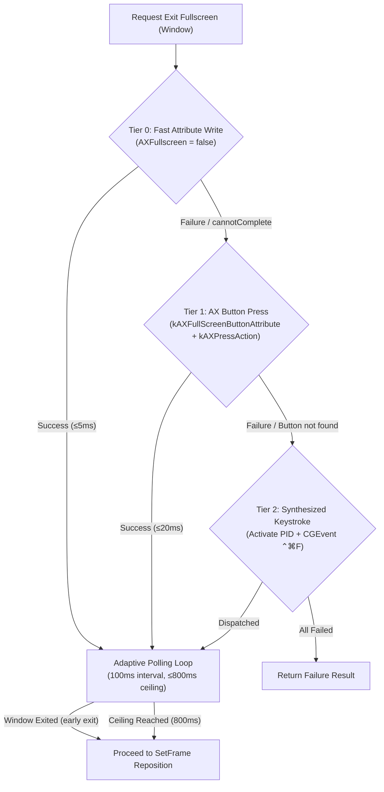

# Universal Fullscreen Escape for Electron/Native Apps (US-WORK-019)

## 1. Overview

On macOS, windows in Native Full Screen mode reside on dedicated Spaces. In this mode, macOS ignores standard Accessibility (`AXUIElementSetAttributeValue`) frame and position writes. Furthermore, Electron and Chromium apps (such as VS Code, Slack, Obsidian, and Chrome) reject or fail standard `AXFullscreen` attribute writes with `AXError.cannotComplete`.

This feature implements a resilient 3-tier fallback escape mechanism with adaptive space-exit waiting, allowing FlowSnap to reposition any full screen window reliably and without unnecessary UI delays.

---

## 2. Architectural Design

### 2.1 The 3-Tier Fallback Hierarchy

1. **Tier 0 (`.attributeWrite`)**: Direct write to `AXFullscreen` or `AXFullScreen` attribute. Extremely fast (≤5ms) for standard Cocoa apps.
2. **Tier 1 (`.axButtonPress`)**: Interactively locates `kAXFullScreenButtonAttribute` on the target window and executes `kAXPressAction`. Solves full screen exit for Electron and Chromium apps without stealing window focus.
3. **Tier 2 (`.cgEventShortcut`)**: Brings the target process to focus (`NSRunningApplication.activate`) and posts synthesized `Control + Command + F` keystrokes via `CGEventPosting` directly to the target PID.

### 2.2 Adaptive Polling Loop

Replaces the legacy static `Task.sleep(700ms)`. FlowSnap polls the window's state or frame every 100ms up to an 800ms ceiling. On fast Macs or quick transitions, this enables instantaneous snapping upon space transition completion (typically within 200–300ms), cutting user latency by up to 60%.

---

## 3. Key Components & Seams

| Component / File                                                                                                                                                  | Purpose                                                                                       |
| :---------------------------------------------------------------------------------------------------------------------------------------------------------------- | :-------------------------------------------------------------------------------------------- |
| [`FullScreenEscapeTier.swift`](file:///Users/vutuanhau/Documents/PROJECT/FlowSnap/FlowSnap/Domain/Window/FullScreenEscapeTier.swift)                              | Strongly-typed enum representing the three escape tiers.                                      |
| [`FullScreenEscapeResult.swift`](file:///Users/vutuanhau/Documents/PROJECT/FlowSnap/FlowSnap/Domain/Window/FullScreenEscapeResult.swift)                          | Telemetry record capturing success status, tier used, duration, and errors.                   |
| [`FullScreenEscapeCoordinating.swift`](file:///Users/vutuanhau/Documents/PROJECT/FlowSnap/FlowSnap/Core/Window/FullScreenEscapeCoordinating.swift)                | Public protocol seam governing escape execution and polling.                                  |
| [`CGEventPosting.swift`](file:///Users/vutuanhau/Documents/PROJECT/FlowSnap/FlowSnap/Infrastructure/Accessibility/CGEventPosting.swift)                           | Testable protocol seam abstracting `CGEvent` synthesis.                                       |
| [`FullScreenEscapeCoordinator.swift`](file:///Users/vutuanhau/Documents/PROJECT/FlowSnap/FlowSnap/Infrastructure/Accessibility/FullScreenEscapeCoordinator.swift) | Production coordinator implementing 3-tier cascade and dependency injection for unit testing. |
| [`WindowManager.swift`](file:///Users/vutuanhau/Documents/PROJECT/FlowSnap/FlowSnap/Core/Window/WindowManager.swift)                                              | Integrated into `move` workflow before frame assignment.                                      |

---

## 4. Verification & Testing

- **Unit Test Suite**: [`FullScreenEscapeCoordinatorTests.swift`](file:///Users/vutuanhau/Documents/PROJECT/FlowSnap/FlowSnapTests/Infrastructure/FullScreenEscapeCoordinatorTests.swift)
  - `TC-FSE-001`: Tier 0 attribute write succeeds.
  - `TC-FSE-002`: Tier 1 AX button press succeeds on Electron apps.
  - `TC-FSE-003`: Tier 2 synthesized keystroke succeeds when tiers 0 and 1 fail.
  - `TC-FSE-004`: Adaptive polling loop exits early at 200ms.
  - `TC-FSE-005`: Timeout reaches 800ms ceiling gracefully.
  - Failure case: Handles complete failure without crash.
- **Integration Test Suite**: [`WindowManagerTests.swift`](file:///Users/vutuanhau/Documents/PROJECT/FlowSnap/FlowSnapTests/Core/WindowManagerTests.swift)
  - `TC-FSE-006`: `WindowManager.move` triggers full screen escape coordinator for `.fullscreen` windows before repositioning.
- **Test Results**: 392/392 tests passing across 63 test suites.

---

## 5. References & Artifacts

- **ADR**: [`adr/0012-universal-fullscreen-escape.md`](file:///Users/vutuanhau/Documents/PROJECT/FlowSnap/adr/0012-universal-fullscreen-escape.md)
- **Specification**: [`.specify/features/universal-fullscreen-escape/spec.md`](file:///Users/vutuanhau/Documents/PROJECT/FlowSnap/.specify/features/universal-fullscreen-escape/spec.md)
- **Plan**: [`.specify/features/universal-fullscreen-escape/plan.md`](file:///Users/vutuanhau/Documents/PROJECT/FlowSnap/.specify/features/universal-fullscreen-escape/plan.md)
- **Tasks**: [`.specify/features/universal-fullscreen-escape/tasks.md`](file:///Users/vutuanhau/Documents/PROJECT/FlowSnap/.specify/features/universal-fullscreen-escape/tasks.md)
- **Test Plan**: [`.specify/features/universal-fullscreen-escape/test-plan.md`](file:///Users/vutuanhau/Documents/PROJECT/FlowSnap/.specify/features/universal-fullscreen-escape/test-plan.md)
