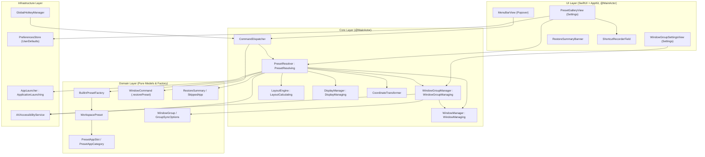
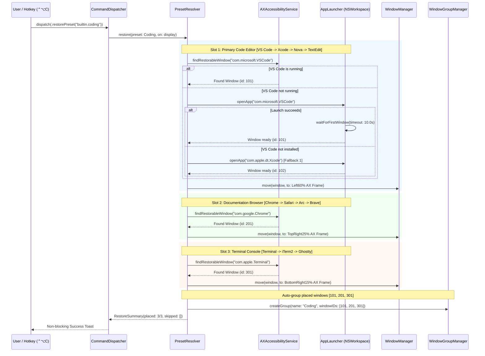

# Feature: Window Groups & Workspace Presets (US-WORK-012)

- **Feature Slug**: `window-groups-presets`
- **Epic**: `EPIC 10: Workspace Snapshots & Intent-Based Multi-Window Restoration`
- **Sprint**: Sprint 3
- **Status**: Completed & Verified (`307/307` tests passing across 45 suites, `swiftlint --strict` clean)
- **Specifications**: [spec.md](file:///Users/vutuanhau/Documents/PROJECT/FlowSnap/.specify/features/window-groups-presets/spec.md) | [baseline.md](file:///Users/vutuanhau/Documents/PROJECT/FlowSnap/.specify/features/window-groups-presets/baseline.md) | [plan.md](file:///Users/vutuanhau/Documents/PROJECT/FlowSnap/.specify/features/window-groups-presets/plan.md) | [tasks.md](file:///Users/vutuanhau/Documents/PROJECT/FlowSnap/.specify/features/window-groups-presets/tasks.md) | [traceability-matrix.md](file:///Users/vutuanhau/Documents/PROJECT/FlowSnap/.specify/features/window-groups-presets/traceability-matrix.md) | [ADR-0007](file:///Users/vutuanhau/Documents/PROJECT/FlowSnap/adr/0007-window-groups-and-presets-architecture.md)

---

## 1. Overview & Business Value

While single-window snapping organizes individual applications and custom workspace snapshots allow users to save their existing layouts, knowledge workers frequently require instant, curated multi-window environments for recurring core activities (software engineering, deep research, document writing, UI/UX design) without manual arrangement. Furthermore, power multitaskers need cooperating windows to stay synchronized as a unified unit—minimizing together, surfacing together with preserved relative z-order, and moving across zones without cascade feedback loops or orphaned window references.

`US-WORK-012` introduces **Window Groups & Workspace Presets** to FlowSnap, bridging out-of-the-box productivity templates with dynamic cross-window coordination.

### Key Capabilities

1. **Curated Built-in Presets Factory ([`BuiltinPresetFactory`](file:///Users/vutuanhau/Documents/PROJECT/FlowSnap/FlowSnap/Domain/Workspace/BuiltinPresetFactory.swift))**: Four immutable standard workflow presets (`Coding` 60/25/15, `Research` 50/25/25, `Writing` 70/30, `Design` 70/30) with relative layout ratios, zone anchors, app categories, and default keyboard shortcuts.
2. **Smart App Category Fallback Engine ([`PresetResolver`](file:///Users/vutuanhau/Documents/PROJECT/FlowSnap/FlowSnap/Core/Workspace/PresetResolver.swift))**: Resolves preset slots dynamically by evaluating:
   - Running application matching category fallback chain.
   - Installed application on macOS via `NSWorkspace.urlForApplication(withBundleIdentifier:)` with asynchronous launch and bounded $\le 10.0\,\text{s}$ AX window wait.
   - Graceful slot skipping with typed [`SkipReason`](file:///Users/vutuanhau/Documents/PROJECT/FlowSnap/FlowSnap/Domain/Workspace/RestoreSummary.swift) (`.notInstalled` or `.launchTimeout`) without aborting remaining slots.
3. **Display-Aware Geometry Computation**: Dynamically calculates target window frames against the active display's `visibleFrame` at runtime with user-configured window gap support ([`PreferencesStore.windowGap`](file:///Users/vutuanhau/Documents/PROJECT/FlowSnap/FlowSnap/Infrastructure/Persistence/PreferencesStore.swift)), eliminating pixel-coordinate drift across displays of varying resolutions.
4. **Global Hotkey Dispatch & Collision Prevention**: Global shortcuts for presets (`⌃⌥C`, `⌃⌥R`, `⌃⌥W`, `⌃⌥D`) routed via [`GlobalHotkeyManager`](file:///Users/vutuanhau/Documents/PROJECT/FlowSnap/FlowSnap/Infrastructure/Hotkeys/GlobalHotkeyManager.swift) $\to$ [`CommandDispatcher.dispatch(.restorePreset(id))`](file:///Users/vutuanhau/Documents/PROJECT/FlowSnap/FlowSnap/Core/Commands/CommandDispatcher.swift) with latest-wins debouncing. [`ShortcutRecorderField`](file:///Users/vutuanhau/Documents/PROJECT/FlowSnap/FlowSnap/UI/Settings/ShortcutRecorderField.swift) validates against standard snap actions and active presets to reject collisions with clear inline warnings.
5. **Synchronized Window Groups Coordinator ([`WindowGroupManager`](file:///Users/vutuanhau/Documents/PROJECT/FlowSnap/FlowSnap/Core/Window/WindowGroupManager.swift))**: Dynamic `@MainActor` coordinator managing linked window groups (minimum 2 `CGWindowID` members), synchronizing minimize/un-minimize, focus with relative z-order preservation, spatial translation, and cross-display migration.
6. **Cross-Display Group Migration**: Allows throwing or migrating an entire window group across connected displays as a unified spatial unit. Snapped windows matching canonical zones ($\text{IoU} \ge 0.75$) are re-anchored cleanly on the destination display, while arbitrary layouts scale proportionally via `RelativeFrameScaler`.
7. **Re-Entrancy & Echo Loop Guard**: Generation token (`syncGeneration`) and `isSynchronizing` locking mechanism preventing cyclic AX notification echoes during programmatic group dispatch.
8. **Dynamic Lifecycle Auto-Pruning**: Automatic removal of closed windows upon window destruction notifications and automatic dissolution of groups when member count falls below 2.
9. **Multi-Surface UI Integration**:
   - **Settings > Presets Gallery ([`PresetGalleryView`](file:///Users/vutuanhau/Documents/PROJECT/FlowSnap/FlowSnap/UI/Settings/PresetGalleryView.swift))**: Visual schematic cards, slot candidate badges, interactive shortcut recorders, collision banners, and 1-click "Apply" buttons.
   - **Settings > Window Groups ([`WindowGroupSettingsView`](file:///Users/vutuanhau/Documents/PROJECT/FlowSnap/FlowSnap/UI/Settings/WindowGroupSettingsView.swift))**: Active groups list with member count, sync option checkboxes (`.crossDisplayTogether`), "Next Display" quick action button, and 1-click "Ungroup" action.
   - **Menu Bar Popover ([`MenuBarView`](file:///Users/vutuanhau/Documents/PROJECT/FlowSnap/FlowSnap/UI/MenuBar/MenuBarView.swift))**: "Presets" submenu with direct execution and keyboard shortcut badges.
   - **Non-Blocking Toast / Banner ([`RestoreSummaryBanner`](file:///Users/vutuanhau/Documents/PROJECT/FlowSnap/FlowSnap/UI/Workspace/RestoreSummaryBanner.swift))**: Displays instant feedback (e.g., "Restored Coding Preset (3/3 windows)" or "Restored 2/3 — Figma not installed").

---

## 2. Tutorial: Getting Started with Presets & Window Groups

### Step 1: Triggering a Built-in Preset via Keyboard Shortcut

FlowSnap comes pre-configured with 4 curated workflow presets mapped to global hotkeys:

| Preset       | Global Shortcut              | Primary App Slot           | Secondary App Slot             | Tertiary App Slot                    |
| :----------- | :--------------------------- | :------------------------- | :----------------------------- | :----------------------------------- |
| **Coding**   | `⌃⌥C` (Control + Option + C) | Code Editor (Left 60%)     | Browser / Docs (Top-Right 25%) | Terminal (Bottom-Right 15%)          |
| **Research** | `⌃⌥R` (Control + Option + R) | Primary Browser (Left 50%) | Notes App (Top-Right 25%)      | Reference Browser (Bottom-Right 25%) |
| **Writing**  | `⌃⌥W` (Control + Option + W) | Document Editor (Left 70%) | Reference Browser (Right 30%)  | —                                    |
| **Design**   | `⌃⌥D` (Control + Option + D) | Design Tool (Left 70%)     | Asset Browser (Right 30%)      | —                                    |

1. Press `⌃⌥C` on your keyboard.
2. FlowSnap scans the running applications on your active display:
   - If VS Code, Google Chrome, and Apple Terminal are open, they instantly snap into the 60/25/15 layout.
   - A non-blocking banner confirms: `Restored Coding Preset (3/3 windows)`.
3. The placed windows are automatically linked into an active **Window Group** named `"Coding"`.

```
+------------------------------------+--------------------------+
|                                    |                          |
|                                    |   Browser / Docs (25%)   |
|                                    |                          |
|         Code Editor (60%)          +--------------------------+
|                                    |                          |
|                                    |      Terminal (15%)      |
|                                    |                          |
+------------------------------------+--------------------------+
```

### Step 2: Applying Presets from the Menu Bar

1. Click the FlowSnap icon in the macOS Menu Bar.
2. Navigate to the **Presets** section in the popover.
3. Click **Research** (`⌃⌥R`).
4. Safari or Chrome takes the left half (`.leftHalf`, 50%), Apple Notes takes the top-right quarter (`.topRight`, 25%), and a secondary browser window occupies the bottom-right quarter (`.bottomRight`, 25%).

### Step 3: Experiencing Synchronized Window Group Behaviors

When windows are placed by a preset (or manually grouped):

1. **Minimize Together**: Click the yellow minimize button (`−`) on the primary code editor window. All linked group windows (browser and terminal) minimize smoothly to the macOS Dock simultaneously.
2. **Restore Together**: Click the minimized code editor icon in the Dock or switch to it via `⌘Tab`. All grouped windows instantly un-minimize back to their tiled positions on screen.
3. **Focus Together with Z-Order Preservation**: When you click into any window belonging to the group from behind other background applications, all group windows rise together to the front, with the clicked window placed frontmost.
4. **Automatic Dissolution**: If you close one of the member windows (`⌘W` or quit), FlowSnap detects the window destruction. If only 1 window remains in the group, the group automatically dissolves with zero leftover state.

### Step 4: Customizing Preset Shortcuts in Settings

1. Open **FlowSnap Settings** (`⌘,` or Menu Bar $\to$ Preferences).
2. Click the **Presets** tab.
3. Find the **Research** preset card, click the **Shortcut Recorder**, and press `⌃⌥⇧R`.
4. The new shortcut is immediately registered system-wide.
5. If you attempt to assign an already-used shortcut (e.g. `⌃⌥←` for Left Half snap), FlowSnap rejects the keystroke and displays an inline collision warning: `"Cannot assign ⌃⌥←: Shortcut already in use by Left Half"`.

### Step 5: Moving a Window Group Across Displays

When working across multiple monitors (e.g. MacBook built-in screen and an external 4K monitor):

1. **Move via Dedicated Hotkey**: With any window of the group focused, press `⌃⌥⌘→` (Move Group to Next Display) or `⌃⌥⌘←` (Move Group to Previous Display).
2. **Move via Standard Window Throw**: If **Cross-display move** (`.crossDisplayTogether`) is enabled in group settings, using the standard window throw hotkey (`⌃⌥→` / `⌃⌥←`) on any group window automatically migrates all fellow group members together.
3. **Move via Settings UI**: In **Settings > Window Groups**, if more than 1 display is connected, click the **Next Display** button on the group card header to immediately throw all member windows to the next screen.
4. **Resolution-Independent Topology Adaptation**: If a group consists of two 50/50 side-by-side windows on a 16:10 laptop screen, migrating it to a 16:9 external monitor automatically preserves their Left 50% / Right 50% relative layout on the target screen's visible bounds without overlapping or clipping.

---

## 3. How-To Guides

### How-To 1: Resolve and Apply a Preset Programmatically

Use [`PresetResolver`](file:///Users/vutuanhau/Documents/PROJECT/FlowSnap/FlowSnap/Core/Workspace/PresetResolver.swift) to apply any preset template to the active display:

```swift
import FlowSnap

// 1. Resolve preset template from factory or custom configuration
guard let preset = BuiltinPresetFactory.preset(for: "builtin.coding") else {
    return
}

// 2. Execute restoration on the active display
let summary = try await presetResolver.restore(preset: preset, on: nil)

print("Placed \(summary.placedCount) of \(summary.totalPlacements) windows.")
for skipped in summary.skipped {
    print("Skipped \(skipped.bundleIdentifier): \(skipped.reason)")
}
```

### How-To 2: Create, Inspect, and Dissolve Window Groups Programmatically

Use [`WindowGroupManager`](file:///Users/vutuanhau/Documents/PROJECT/FlowSnap/FlowSnap/Core/Window/WindowGroupManager.swift) on the `@MainActor`:

```swift
import FlowSnap

// 1. Create a linked group with 2 or more window IDs
let windowIDs: Set<CGWindowID> = [101, 102, 103]
let group = windowGroupManager.createGroup(
    name: "Development Duo",
    windowIDs: windowIDs,
    syncOptions: [.minimizeTogether, .focusTogether]
)

// 2. Query active group for a specific window
if let activeGroup = windowGroupManager.group(for: 101) {
    print("Window 101 is part of '\(activeGroup.name)' with \(activeGroup.memberCount) windows")
}

// 3. Update sync options dynamically
if let group {
    windowGroupManager.updateSyncOptions([.minimizeTogether, .focusTogether, .moveTogether], for: group.id)
}

// 4. Manually dissolve the group
if let group {
    windowGroupManager.dissolveGroup(id: group.id)
}
```

### How-To 3: Synchronize Focus Across Grouped Windows with Relative Z-Order

When an application window in a group gains focus, raise other group members first and the trigger window last:

```swift
// Called when triggerWindowID receives focus
try await windowGroupManager.handleWindowFocus(triggerWindowID: 101)
// Step 1: Windows 102 and 103 are raised to the foreground.
// Step 2: Window 101 is raised last, guaranteeing it remains topmost.
```

### How-To 4: Handle Dynamic Window Destruction & Auto-Pruning

When a window is closed or an app terminates, notify [`WindowGroupManager`](file:///Users/vutuanhau/Documents/PROJECT/FlowSnap/FlowSnap/Core/Window/WindowGroupManager.swift):

```swift
// Event handler from AX observer or workspace termination
windowGroupManager.handleWindowDestroyed(windowID: 102)
// If the group had [101, 102], removing 102 drops the count to 1 (< 2).
// WindowGroupManager automatically dissolves the group.
```

### How-To 5: Check Shortcut Conflicts in PreferencesStore

Use [`PreferencesStore.hasPresetConflict(_:excludingPresetID:)`](file:///Users/vutuanhau/Documents/PROJECT/FlowSnap/FlowSnap/Infrastructure/Persistence/PreferencesStore.swift) to pre-validate shortcuts:

```swift
let proposedShortcut = KeyboardShortcut(keyCode: 123, carbonModifiers: UInt32(controlKey | optionKey))

if let conflictMessage = preferencesStore.hasPresetConflict(proposedShortcut, excludingPresetID: "builtin.coding") {
    print("Conflict detected: \(conflictMessage)")
    // Reject shortcut assignment in UI
} else {
    preferencesStore.setShortcut(proposedShortcut, forPresetID: "builtin.coding")
}
```

### How-To 6: Migrate a Window Group Across Displays Programmatically

Use [`WindowGroupManager`](file:///Users/vutuanhau/Documents/PROJECT/FlowSnap/FlowSnap/Core/Window/WindowGroupManager.swift) on the `@MainActor` to migrate groups across monitors:

```swift
import FlowSnap

// 1. Throw entire group based on the currently focused trigger window
try await windowGroupManager.handleGroupCrossDisplayThrow(triggerWindowID: 101, isNext: true)

// 2. Explicitly move a group to a specific target display
try await windowGroupManager.handleGroupMoveToDisplay(groupID: group.id, targetDisplayID: externalDisplayID)
```

---

## 4. Technical Reference

### 4.1 Domain Entities & Value Objects

#### [`WorkspacePreset`](file:///Users/vutuanhau/Documents/PROJECT/FlowSnap/FlowSnap/Domain/Workspace/WorkspacePreset.swift)

```swift
public struct WorkspacePreset: Identifiable, Codable, Hashable, Sendable {
    public let id: String
    public var name: String
    public var description: String
    public var iconSymbolName: String
    public var defaultShortcut: KeyboardShortcut?
    public var defaultRatio: LayoutRatio
    public var slots: [PresetAppSlot]
    public var autoGroupWindows: Bool
}
```

#### [`PresetAppSlot`](file:///Users/vutuanhau/Documents/PROJECT/FlowSnap/FlowSnap/Domain/Workspace/PresetAppSlot.swift)

```swift
public struct PresetAppSlot: Codable, Hashable, Sendable, Identifiable {
    public var id: String { "\(roleDescription)-\(zone.rawValue)" }
    public let category: PresetAppCategory
    public let roleDescription: String
    public let preferredBundleIDs: [String]
    public let zone: LayoutZone
    public let ratio: LayoutRatio
    public let normalizedRect: CGRect?
}
```

#### [`PresetAppCategory`](file:///Users/vutuanhau/Documents/PROJECT/FlowSnap/FlowSnap/Domain/Workspace/PresetAppSlot.swift)

```swift
public enum PresetAppCategory: String, Codable, Hashable, Sendable, CaseIterable {
    case editor = "Code & Text Editor"
    case browser = "Web Browser"
    case terminal = "Terminal & Shell"
    case notes = "Notes & Knowledge"
    case writing = "Writing & Documents"
    case design = "Design & UI Tools"
    case custom = "Custom Application"
}
```

#### [`WindowGroup`](file:///Users/vutuanhau/Documents/PROJECT/FlowSnap/FlowSnap/Domain/Window/WindowGroup.swift) & [`GroupSyncOptions`](file:///Users/vutuanhau/Documents/PROJECT/FlowSnap/FlowSnap/Domain/Window/WindowGroup.swift)

```swift
public struct GroupSyncOptions: OptionSet, Codable, Hashable, Sendable {
    public let rawValue: Int
    public static let minimizeTogether     = GroupSyncOptions(rawValue: 1 << 0)
    public static let focusTogether        = GroupSyncOptions(rawValue: 1 << 1)
    public static let moveTogether         = GroupSyncOptions(rawValue: 1 << 2)
    public static let crossDisplayTogether = GroupSyncOptions(rawValue: 1 << 3)
    public static let all: GroupSyncOptions = [.minimizeTogether, .focusTogether, .moveTogether, .crossDisplayTogether]
}

public struct WindowGroup: Identifiable, Codable, Hashable, Sendable {
    public let id: UUID
    public var name: String
    public var windowIDs: Set<CGWindowID>
    public var anchorWindowID: CGWindowID?
    public var syncOptions: GroupSyncOptions
    public let createdAt: Date

    public var memberCount: Int { windowIDs.count }
    public var isValid: Bool { windowIDs.count >= 2 }
}
```

### 4.2 Standard Presets Catalog ([`BuiltinPresetFactory`](file:///Users/vutuanhau/Documents/PROJECT/FlowSnap/FlowSnap/Domain/Workspace/BuiltinPresetFactory.swift))

| Preset ID          | Name         | Normalized Rects / Zones                                                                                                                             | Primary Category Candidates                                                                                                                                                 | Default Shortcut   |
| :----------------- | :----------- | :--------------------------------------------------------------------------------------------------------------------------------------------------- | :-------------------------------------------------------------------------------------------------------------------------------------------------------------------------- | :----------------- |
| `builtin.coding`   | **Coding**   | Slot 1: `(0, 0, 0.60, 1.0)` (`.left60_40`)<br/>Slot 2: `(0.60, 0, 0.40, 0.60)` (`.topRight`)<br/>Slot 3: `(0.60, 0.60, 0.40, 0.40)` (`.bottomRight`) | Slot 1: VS Code $\to$ Xcode $\to$ Nova $\to$ TextEdit<br/>Slot 2: Chrome $\to$ Safari $\to$ Arc $\to$ Brave<br/>Slot 3: Terminal $\to$ iTerm2 $\to$ Ghostty $\to$ Alacritty | `⌃⌥C` (keyCode 8)  |
| `builtin.research` | **Research** | Slot 1: `(0, 0, 0.50, 1.0)` (`.leftHalf`)<br/>Slot 2: `(0.50, 0, 0.50, 0.50)` (`.topRight`)<br/>Slot 3: `(0.50, 0.50, 0.50, 0.50)` (`.bottomRight`)  | Slot 1: Chrome $\to$ Safari $\to$ Arc<br/>Slot 2: Notes $\to$ Notion $\to$ Obsidian<br/>Slot 3: Safari $\to$ Chrome $\to$ Brave                                             | `⌃⌥R` (keyCode 15) |
| `builtin.writing`  | **Writing**  | Slot 1: `(0, 0, 0.70, 1.0)` (`.left70_30`)<br/>Slot 2: `(0.70, 0, 0.30, 1.0)` (`.rightOneThird`)                                                     | Slot 1: Pages $\to$ Word $\to$ Obsidian $\to$ TextEdit<br/>Slot 2: Safari $\to$ Chrome $\to$ Arc                                                                            | `⌃⌥W` (keyCode 13) |
| `builtin.design`   | **Design**   | Slot 1: `(0, 0, 0.70, 1.0)` (`.left70_30`)<br/>Slot 2: `(0.70, 0, 0.30, 1.0)` (`.rightOneThird`)                                                     | Slot 1: Figma $\to$ Sketch $\to$ Illustrator<br/>Slot 2: Safari $\to$ Chrome                                                                                                | `⌃⌥D` (keyCode 2)  |

### 4.3 Business Rules Reference

| Rule ID           | Rule Name                      | Specification                                                                                                                                                                                                                               |
| :---------------- | :----------------------------- | :------------------------------------------------------------------------------------------------------------------------------------------------------------------------------------------------------------------------------------------ |
| **BR-PRESET-001** | Curated Workflow Presets       | System provides 4 standard immutable presets (`Coding`, `Research`, `Writing`, `Design`) with relative slot definitions, ratios, and default shortcuts.                                                                                     |
| **BR-PRESET-002** | App Category Fallbacks         | Evaluates slot candidates in strict priority: (1) Running app, (2) First installed app via `NSWorkspace`, (3) Graceful slot skip.                                                                                                           |
| **BR-PRESET-003** | Graceful Launch & Toast        | Auto-launches missing apps with bounded $\le 10.0\,\text{s}$ timeout for first AX window; surfaces non-blocking `RestoreSummaryBanner`.                                                                                                     |
| **BR-PRESET-004** | Resolution-Independent Framing | Frames recomputed dynamically against active display's `visibleFrame` and `PreferencesStore.windowGap`.                                                                                                                                     |
| **BR-PRESET-005** | Preset Hotkey Routing          | Shortcuts routed through `GlobalHotkeyManager` $\to$ `CommandDispatcher.dispatch(.restorePreset(id))` with latest-wins debouncing.                                                                                                          |
| **BR-PRESET-006** | Hotkey Collision Rejection     | Settings UI rejects collisions against `ShortcutAction.allCases` and active preset bindings with inline warning banners.                                                                                                                    |
| **BR-GROUP-001**  | Group Membership Cardinality   | Requires `WindowGroup.memberCount >= 2`; automatically dissolves when member count drops below 2.                                                                                                                                           |
| **BR-GROUP-002**  | Simultaneous Minimize/Restore  | Synchronizes minimize and un-minimize actions across all active group members.                                                                                                                                                              |
| **BR-GROUP-003**  | Simultaneous Focus & Z-Order   | Brings all group members to foreground, raising the trigger window last to preserve relative z-order.                                                                                                                                       |
| **BR-GROUP-004**  | Simultaneous Group Move        | Translates all member windows by relative $(\Delta x, \Delta y)$ when move synchronization is enabled.                                                                                                                                      |
| **BR-GROUP-005**  | Re-Entrancy Guard              | `WindowGroupManager` ignores inbound AX event echoes during active synchronization via `syncGeneration` counter and `isSynchronizing` flag.                                                                                                 |
| **BR-GROUP-006**  | Dynamic Auto-Pruning           | Observes window destruction notifications and prunes dead `CGWindowID` references immediately.                                                                                                                                              |
| **BR-GROUP-007**  | Cross-Display Group Migration  | Throws or migrates all active group members to target display's `visibleFrame`. Snapped windows matching canonical zones ($\text{IoU} \ge 0.75$) preserve semantic tiling; floating windows scale proportionally via `RelativeFrameScaler`. |
| **BR-GROUP-008**  | Cross-Display Sync Option      | When `.crossDisplayTogether` is enabled, throwing any window in the group migrates all members. If disabled, single-window throw moves only that individual window.                                                                         |

---

## 5. Architecture & Design Rationale



### 5.1 Deep-Dive: Smart App Category Fallback & Resilient Launch Pipeline



### 5.2 Deep-Dive: Re-Entrancy & Echo Loop Elimination

When `WindowGroupManager` minimizes window $A$, macOS WindowServer posts an AX notification indicating window $A$ was minimized. Without protection, an external observer might re-trigger `handleWindowMinimize(triggerWindowID: A)`, creating an infinite event amplification loop.

`WindowGroupManager` eliminates this via two lockstep mechanisms:

1. **`isSynchronizing` Boolean Gate**: Entered before dispatching window mutations and cleared in a `defer` block. Any re-entrant calls attempting to synchronize while `isSynchronizing == true` return immediately.
2. **`syncGeneration` Monotonic Counter**: Incremented on every valid user-initiated synchronization pass. Event observers verify whether the incoming notification matches the latest generation before processing.

```swift
public func handleWindowMinimize(triggerWindowID: CGWindowID) async throws {
    guard !isSynchronizing else { return }
    guard let targetGroup = group(for: triggerWindowID),
          targetGroup.syncOptions.contains(.minimizeTogether) else { return }

    isSynchronizing = true
    syncGeneration &+= 1
    defer { isSynchronizing = false }

    let otherWindowIDs = targetGroup.windowIDs.subtracting([triggerWindowID])
    let allWindows = accessibilityService.allVisibleManagedWindows()

    for windowID in otherWindowIDs {
        if let managedWindow = allWindows.first(where: { $0.id == windowID }), !managedWindow.isMinimized {
            try? await windowManager.minimize(managedWindow)
        }
    }
}
```

### 5.3 Deep-Dive: Deterministic Z-Order Raising on Group Focus

When activating a 3-window group by clicking one of its members (e.g. clicking the terminal):

1. **Phase 1 (Raise Background Group Members)**: `WindowGroupManager` iterates through all fellow member windows (`otherWindowIDs`) and calls `windowManager.focus(managedWindow)` to raise them to the foreground.
2. **Phase 2 (Raise Trigger Window Last)**: `WindowGroupManager` calls `windowManager.focus(triggerWindow)` last. This guarantees the clicked window is the active, topmost key window while bringing all fellow group members to the front together.

---

## 6. Verification & Test Coverage

The feature is comprehensively verified using Swift Testing (`@Test`), protocol-based test doubles, and integration suites:

| Test Suite                             | File                                                                                                                                                     | Test Count | Scope Covered                                                                                                                                                          |
| :------------------------------------- | :------------------------------------------------------------------------------------------------------------------------------------------------------- | :--------: | :--------------------------------------------------------------------------------------------------------------------------------------------------------------------- |
| **`PresetAndGroupModelTests`**         | [`PresetAndGroupModelTests.swift`](file:///Users/vutuanhau/Documents/PROJECT/FlowSnap/FlowSnapTests/Domain/PresetAndGroupModelTests.swift)               |     6      | `BuiltinPresetFactory` immutability, slot counts, ratios, default shortcuts, `WindowGroup` cardinality and sync options.                                               |
| **`PresetResolverTests`**              | [`PresetResolverTests.swift`](file:///Users/vutuanhau/Documents/PROJECT/FlowSnap/FlowSnapTests/Core/PresetResolverTests.swift)                           |     6      | Display resolution fallback, empty preset handling, full placement, partial placement, AX denied error.                                                                |
| **`PresetFallbackResolutionTests`**    | [`PresetFallbackResolutionTests.swift`](file:///Users/vutuanhau/Documents/PROJECT/FlowSnap/FlowSnapTests/Core/PresetFallbackResolutionTests.swift)       |     4      | Running fallback selection, installed fallback auto-launch, uninstalled skip, hanging launch timeout.                                                                  |
| **`PresetActivationIntegrationTests`** | [`PresetActivationIntegrationTests.swift`](file:///Users/vutuanhau/Documents/PROJECT/FlowSnap/FlowSnapTests/Core/PresetActivationIntegrationTests.swift) |     2      | `CommandDispatcher` routing `.restorePreset`, summary generation, auto-grouping, latest-wins debouncing.                                                               |
| **`WindowGroupManagerTests`**          | [`WindowGroupManagerTests.swift`](file:///Users/vutuanhau/Documents/PROJECT/FlowSnap/FlowSnapTests/Core/WindowGroupManagerTests.swift)                   |     7      | Group creation, `< 2` member rejection, dissolution, add/remove member, auto-dissolve on remove, auto-prune on destroy, sync options update.                           |
| **`WindowGroupSyncTests`**             | [`WindowGroupSyncTests.swift`](file:///Users/vutuanhau/Documents/PROJECT/FlowSnap/FlowSnapTests/Core/WindowGroupSyncTests.swift)                         |     8      | Synchronized minimize, un-minimize, focus with z-order raising, move translation, cross-display group migration with dual-mode scaling, re-entrancy lock suppression.  |
| **`PresetShortcutTests`**              | [`PresetShortcutTests.swift`](file:///Users/vutuanhau/Documents/PROJECT/FlowSnap/FlowSnapTests/Infrastructure/PresetShortcutTests.swift)                 |     7      | Custom shortcut persistence in `PreferencesStore`, conflict detection against snap actions and presets, reset to defaults, hotkey registration.                        |
| **`PresetAndGroupViewTests`**          | [`PresetAndGroupViewTests.swift`](file:///Users/vutuanhau/Documents/PROJECT/FlowSnap/FlowSnapTests/UI/PresetAndGroupViewTests.swift)                     |     5      | `RestoreSummaryBanner` full/partial states, `WindowGroupSettingsView` sync mutation and ungroup, `PresetGalleryView` initialization, `SettingsView` tab configuration. |

### Test Suite Execution Summary

- **Total Suite Execution**: `456/456` tests passing across 69 suites.
- **Strict Concurrency**: Zero data races or concurrency warnings under Swift 6 strict mode.
- **Linter Conformance**: `swiftlint lint --strict` clean (0 violations across 159 Swift files).
- **Public API Conformance**: Zero private CGS APIs utilized.

---

## 7. Traceability

Complete end-to-end traceability across business requirements, product specifications, user stories, and automated tests is maintained in:

- **Traceability Matrix**: [traceability-matrix.md](file:///Users/vutuanhau/Documents/PROJECT/FlowSnap/.specify/features/window-groups-presets/traceability-matrix.md)
- **Specification Document**: [spec.md](file:///Users/vutuanhau/Documents/PROJECT/FlowSnap/.specify/features/window-groups-presets/spec.md)
- **Baseline Sign-Off**: [baseline.md](file:///Users/vutuanhau/Documents/PROJECT/FlowSnap/.specify/features/window-groups-presets/baseline.md)
- **Architecture Decision Record**: [ADR-0007](file:///Users/vutuanhau/Documents/PROJECT/FlowSnap/adr/0007-window-groups-and-presets-architecture.md)
