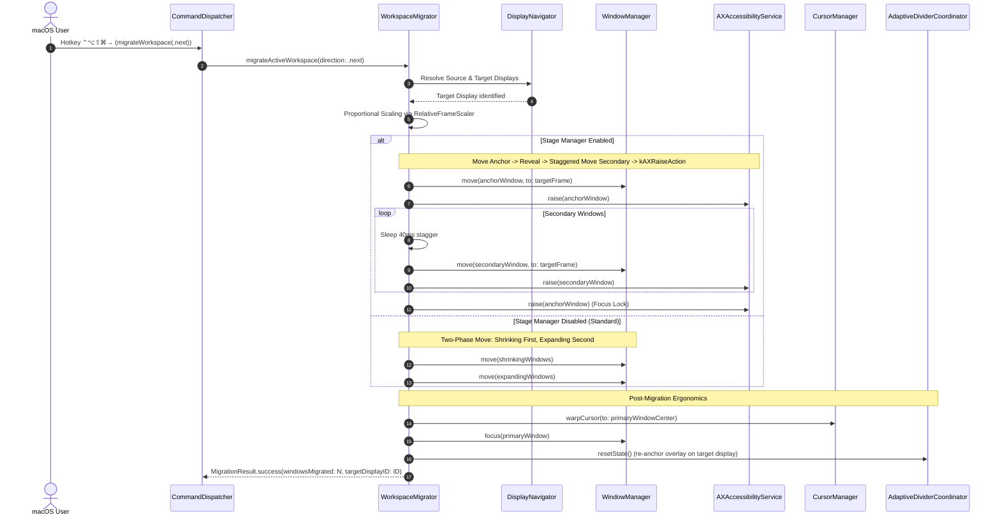

# Atomic Workspace Cross-Display Migration (US-DISP-017)

## 1. Overview

Power users frequently move entire multi-window workflows (e.g., IDE 60% + Browser 40%) between displays (e.g., Built-in Retina screen to an external 4K or Ultrawide monitor).
Before US-DISP-017:

- Windows had to be thrown across monitors individually via `⌃⌥⇧→`, followed by manual re-tiling on the destination display.
- On macOS Stage Manager, individual window throws fragmented the active stage group.
- Resizing jitter and displaced mouse pointers broke workflow continuity.

**US-DISP-017 delivers Atomic Workspace Cross-Display Migration**:

1. Single keystroke (`⌃⌥⇧⌘→` for Next Display, `⌃⌥⇧⌘←` for Previous Display) or Menu Bar action relocates all windows in the active workspace at once.
2. Geometric topology resolution automatically scales window positions proportionally to the target display's visible bounds (accounting for Menu Bar and Dock insets).
3. **Stage Manager Adaptation**: Preserves window grouping cohesion across displays using staggered IPC delays and `kAXRaiseAction` without triggering destructive stage swaps.
4. **2-Phase Move Order**: When Stage Manager is off, shrinking windows move before expanding windows, preventing desktop clutter and window overlapping during transit.
5. **Ergonomic Cursor Warping & Divider Reset**: Warps the cursor to the primary window center on the destination screen and resets the adaptive divider overlay.

---

## 2. Architectural Design

---

## 3. Key Components & Seams

| Component / File                                                                                                                                                                                                                            | Layer  | Purpose                                                                                       |
| :------------------------------------------------------------------------------------------------------------------------------------------------------------------------------------------------------------------------------------------ | :----- | :-------------------------------------------------------------------------------------------- |
| [`WorkspaceMigrating.swift`](file:///Users/vutuanhau/Documents/PROJECT/FlowSnap/FlowSnap/Domain/Workspace/WorkspaceMigrating.swift)                                                                                                         | Domain | Contract interface defining `migrateActiveWorkspace(direction:)` and result types.            |
| [`WorkspaceMigrator.swift`](file:///Users/vutuanhau/Documents/PROJECT/FlowSnap/FlowSnap/Core/Workspace/WorkspaceMigrator.swift)                                                                                                             | Core   | Deep module orchestrating display discovery, scaling, adaptive ordering, and handoff.         |
| [`WorkspaceManager+Migration.swift`](file:///Users/vutuanhau/Documents/PROJECT/FlowSnap/FlowSnap/Core/Workspace/WorkspaceManager+Migration.swift)                                                                                           | Core   | Forwarding extension on `WorkspaceManager` for client convenience.                            |
| [`RelativeFrameScaler.swift`](file:///Users/vutuanhau/Documents/PROJECT/FlowSnap/FlowSnap/Core/Display/RelativeFrameScaler.swift)                                                                                                           | Core   | Proportional mathematical scaler translating relative window geometry across screens.         |
| [`CommandDispatcher.swift`](file:///Users/vutuanhau/Documents/PROJECT/FlowSnap/FlowSnap/Core/Commands/CommandDispatcher.swift)                                                                                                              | Core   | Dispatches `.migrateWorkspace` commands with latest-wins debouncing.                          |
| [`AdaptiveDividerCoordinator.swift`](file:///Users/vutuanhau/Documents/PROJECT/FlowSnap/FlowSnap/Core/Layout/AdaptiveDividerCoordinator.swift)                                                                                              | Core   | Exposes `resetState()` to smoothly transition divider seam overlay to the target monitor.     |
| [`ShortcutAction.swift`](file:///Users/vutuanhau/Documents/PROJECT/FlowSnap/FlowSnap/Domain/Hotkeys/ShortcutAction.swift)                                                                                                                   | Domain | Declares `.moveWorkspaceNextDisplay` (`⌃⌥⇧⌘→`) and `.moveWorkspacePreviousDisplay` (`⌃⌥⇧⌘←`). |
| [`MenuBarViewModel.swift`](file:///Users/vutuanhau/Documents/PROJECT/FlowSnap/FlowSnap/UI/MenuBar/MenuBarViewModel.swift) & [`MenuBarView.swift`](file:///Users/vutuanhau/Documents/PROJECT/FlowSnap/FlowSnap/UI/MenuBar/MenuBarView.swift) | UI     | Provides quick-click menu item "Move Workspace to Next Display".                              |

---

## 4. Verification & Testing

- **Automated Test Suite**:
  - [`WorkspaceMigratorTests.swift`](file:///Users/vutuanhau/Documents/PROJECT/FlowSnap/FlowSnapTests/Core/Workspace/WorkspaceMigratorTests.swift):
    - `TC-MIG-001`: 2-window workspace migration across displays (Stage Manager off).
    - `TC-MIG-002`: 3-window migration with two-phase move ordering (shrinking before expanding).
    - `TC-MIG-003`: Multi-window migration with Stage Manager active (staggered delay + `kAXRaiseAction`).
    - `TC-MIG-004`: Single display safe no-op.
    - `TC-MIG-005`: No active workspace safe no-op.
    - `TC-MIG-006`: Cyclic navigation wrap-around between 3 displays.
    - `TC-MIG-007`: `CommandDispatcher` dispatches `.migrateWorkspace` with debouncing.
- **Regression Suite**: 413/413 unit and integration tests passing across 66 test suites.

---

## 5. References & Artifacts

- **ADR**: [`adr/0014-workspace-cross-display-migration.md`](file:///Users/vutuanhau/Documents/PROJECT/FlowSnap/adr/0014-workspace-cross-display-migration.md)
- **Specification**: [`.specify/features/workspace-cross-display-migration/spec.md`](file:///Users/vutuanhau/Documents/PROJECT/FlowSnap/.specify/features/workspace-cross-display-migration/spec.md)
- **Architecture Plan**: [`.specify/features/workspace-cross-display-migration/plan.md`](file:///Users/vutuanhau/Documents/PROJECT/FlowSnap/.specify/features/workspace-cross-display-migration/plan.md)
- **Data Model**: [`.specify/features/workspace-cross-display-migration/data-model.md`](file:///Users/vutuanhau/Documents/PROJECT/FlowSnap/.specify/features/workspace-cross-display-migration/data-model.md)
- **Tasks**: [`.specify/features/workspace-cross-display-migration/tasks.md`](file:///Users/vutuanhau/Documents/PROJECT/FlowSnap/.specify/features/workspace-cross-display-migration/tasks.md)
- **Test Plan**: [`.specify/features/workspace-cross-display-migration/test-plan.md`](file:///Users/vutuanhau/Documents/PROJECT/FlowSnap/.specify/features/workspace-cross-display-migration/test-plan.md)
