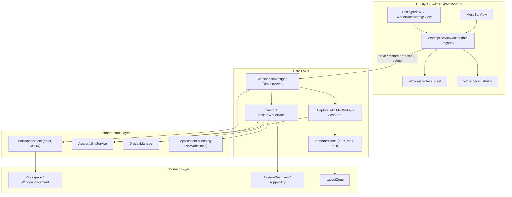

# Feature: Workspace Snapshot & Intent-Based Multi-Window Restoration (US-WORK-011)

- **Feature Slug**: `workspace-snapshot-restoration`
- **Epic**: `EPIC 10: Workspace Snapshots & Intent-Based Multi-Window Restoration`
- **Sprint**: Sprint 3
- **Status**: Completed & Verified (`265/265` tests passing, `swiftlint --strict` clean)

---

## 1. Background & Business Value

US-WORK-011 turns FlowSnap from a single-window snap utility into a **Workspace Operating Layer**: it remembers an entire multi-window working layout as an *intent* and brings it back with one click — even across displays of a different resolution, and even when some apps are not yet running.

Key capabilities:

1. **Intent-based capture, not pixels**: A workspace stores, per app, a `bundleIdentifier → LayoutZone` mapping plus the expected window count. No hard pixel coordinates are persisted, so a layout saved on a 1440×900 laptop restores correctly on a 2560×1440 monitor (mandatory cross-display test).
2. **One-tap restore with auto-launch**: Restore resolves each app by bundle id; if it is not running, FlowSnap launches it via public `NSWorkspace` APIs and waits up to 10s for its first normal window. Unresolvable apps are skipped with a human-readable reason and reported in a summary — restore never aborts mid-way.
3. **Count-aware multi-window mapping**: The primary window of an app is placed in its zone; extra windows of the same app cascade inside the same zone with clamping so nothing leaves the zone or the screen.
4. **Additive, non-destructive restore**: Only windows belonging to the workspace are moved; every other on-screen window is left untouched.
5. **Trustworthy persistence**: A Swift `actor` (`WorkspaceStore`) writes `~/Library/Application Support/FlowSnap/workspaces.json` atomically (temp file + rename). A corrupt file degrades to an empty list with a typed error instead of crashing.
6. **Two management surfaces**: A "Workspaces" section in the Menu Bar popover (save + restore) and a full "Workspaces" tab in Settings (save, restore, rename, delete).

---

## 2. Architecture & Data Flow

The `WorkspaceViewModel` owns only *transient* UI state (draft name/icon, picker selection, in-flight flags, inline error text) and mirrors the manager's published domain state. The `WorkspaceManager` remains the single domain contract; the views stay declarative.

---

## 3. Domain Model

| Type | File | Role |
| :--- | :--- | :--- |
| `Workspace` | `FlowSnap/Domain/Workspace/Workspace.swift` | Aggregate root: `id`, `name`, `icon`, `placements`, `createdAt`, `lastRestoredAt`. `Codable/Hashable/Sendable`. Name uniqueness is case-insensitive; `maxPlacementCount = 8`. |
| `WindowPlacement` | `FlowSnap/Domain/Workspace/WindowPlacement.swift` | Value object: `bundleIdentifier`, `zone: LayoutZone`, `expectedWindowCount`, `orderIndex`. No pixels. |
| `RestoreSummary` / `SkippedApp` / `SkipReason` | `FlowSnap/Domain/Workspace/RestoreSummary.swift` | Result of one restore pass: `placedCount`, `totalPlacements`, `skipped[]`. Skip reasons: `notInstalled`, `launchTimeout`, `noWindow`. |
| `WorkspaceDocument` | `FlowSnap/Domain/Workspace/WorkspaceDocument.swift` | Versioned JSON envelope (`schemaVersion`-aware, additive-forward). |
| `WorkspaceError` | `FlowSnap/Domain/Workspace/RestoreSummary.swift` | Typed errors: `invalidName`, `duplicateName`, `noEligibleWindows`, `accessibilityDenied`, `storeFailure`. |

---

## 4. Key Components & Implementation

### 4.1 `WorkspaceStore` (`FlowSnap/Infrastructure/Persistence/WorkspaceStore.swift`)

- Swift `actor` — serialises concurrent reads/writes (ADR-003).
- Atomic write: temp file in the *same* directory, then rename over the destination (never crosses a volume boundary).
- Corrupt file → moved once to `workspaces.corrupt.json` and surfaced as `WorkspaceStoreError.corruptFile`; the app degrades to an empty list rather than crashing (E7).
- Injectable directory for tests.

### 4.2 `WorkspaceManager` (`FlowSnap/Core/Workspace/`)

- `WorkspaceManager.swift` — `@MainActor ObservableObject`; published `workspaces`, `storeError`, `lastRestoreSummary`, `restoringID`. CRUD: `saveWorkspace`, `rename`, `setIcon`, `delete`, `addPlacements`, `removePlacement`, `setZone`, `suggestedName`.
- `WorkspaceManager+Capture.swift` — `eligibleWindows(for:)` (BR-WORK-001 filtering: excludes FlowSnap's own panels, non-normal kinds, bundle-id-less windows) and `capture(from:)` (group by bundle id, infer zone, record count + orderIndex).
- `WorkspaceManager+Restore.swift` — `restoreWorkspace(id:options:)`: pre-flight AX trust, one display-topology
  snapshot per pass, per-placement loop with auto-launch + 10s first-window wait, and a target frame computed
  against the `visibleFrame` of the display that currently contains the app's window (falling back to the
  primary display) — never against saved pixels (BR-WORK-007). Geometry comes from `placement.normalizedRect`
  when present (gap inset half-way between neighbours, `floor`-ed, 50pt minimum side) or else
  `LayoutEngine.frame(for:in:gap:)` with the *current* user gap; extra windows of the same app cascade by
  `cascadeOffset = 24` and are clamped inside the zone. Every move converts AppKit → AX via
  `CoordinateTransformer.toAX` (matching `CommandDispatcher` and `AdaptiveDividerCoordinator`), tolerates
  per-window AX failures, and reports a `RestoreSummary`. After a successful move it calls
  `launcher.reveal(bundleID:)` — un-hide + `activate(.activateAllWindows)` — so a hidden app or one whose
  windows sit on another Space is actually surfaced; the reveal runs last (never flash the app at its old
  position) and is best-effort (a refused activation does not downgrade a `placed` window).
- `ZoneInference.swift` — pure max-IoU match of a window's normalized frame against `LayoutZone` rects, deterministic tie-break by `LayoutZone.allCases` order (FR-2).

### 4.3 `ApplicationLaunching` (`FlowSnap/Infrastructure/macOS/AppLauncher.swift`)

- Protocol + `NSWorkspace` production implementation + AX first-window polling (ADR-004). Public APIs only; zero private API (BR-010). `reveal(bundleID:)` un-hides and activates an app after its window is placed, so a restored-but-hidden or cross-Space app becomes visible; it never throws (best-effort).

### 4.4 UI (`FlowSnap/UI/`)

- `Workspace/WorkspaceViewModel.swift` — thin, testable façade over the manager; owns save-sheet transient state and maps typed errors to inline messages (spec §5).
- `Workspace/WorkspaceSaveSheet.swift` — name field + curated SF Symbol grid + window picker; inline errors E1/E2/E3/E11; sheet stays open on validation failure.
- `Workspace/WorkspaceListView.swift` — shared rows with one-tap Restore; `showsDelete` adds the destructive affordance in Settings only.
- `Settings/WorkspaceSettingsView.swift` — full management tab: save, restore, inline rename, delete behind confirmation, plus restore-summary / error / store-error banners.
- Wired into `MenuBarView`/`MenuBarViewModel` (Workspaces section) and `SettingsView` (Workspaces tab). Both surfaces are optional and hide themselves when no `WorkspaceManager` is injected, so existing entry points stay source-compatible.

---

## 5. Verification & Testing

| Suite | File | Tests | Covers |
| :--- | :--- | :---: | :--- |
| `WorkspaceStore` | `FlowSnapTests/Infrastructure/WorkspaceStoreTests.swift` | 10 | Round-trip, missing→[], corrupt→typed error, atomic overwrite, upsert/delete |
| `WorkspaceManager Save` | `FlowSnapTests/Core/Workspace/WorkspaceManagerSaveTests.swift` | 13 | Zone inference, grouping, count capture, duplicate/empty name, no-eligible |
| `WorkspaceManager Restore` | `FlowSnapTests/Core/Workspace/WorkspaceManagerRestoreTests.swift` | 16 | Happy path, skip reasons, cascade clamping, fewer/more windows, AX-failure tolerance, summary |
| `WorkspaceManager Restore Reveal` | `FlowSnapTests/Core/Workspace/WorkspaceRestoreRevealTests.swift` | 4 | Reveal-after-place: placed → revealed; E4/E6 → never revealed; refused reveal keeps `placed` |
| `ZoneInference` | `FlowSnapTests/Core/Workspace/ZoneInferenceTests.swift` | 14 | Max-IoU match, deterministic tie-break, oversized windows |
| `Workspace Cross-Display` | `FlowSnapTests/Core/Workspace/WorkspaceCrossDisplayTests.swift` | 5 | **Mandatory E8**: save on 1440×900 → restore on 2560×1440 → frames match zone ratios, not saved pixels |
| `WorkspaceViewModel` | `FlowSnapTests/UI/WorkspaceViewModelTests.swift` | 13 | Save/restore/rename/delete flows via mocked manager, summary surfacing, error states |

- **Total Test Suite**: `265/265` tests passing across 36 suites.
- **Lint**: `swiftlint lint --strict` clean for all owned files.
- **Build**: `xcodebuild` succeeds with no warnings in owned files.

---

## 6. Traceability

See `.specify/features/workspace-snapshot-restoration/traceability-matrix.md` for the full BR → PRD → SRS → Story → Test mapping (10/10 business rules, 11/11 requirements, 3/3 assumptions, 10/10 risks traced; no orphans).
