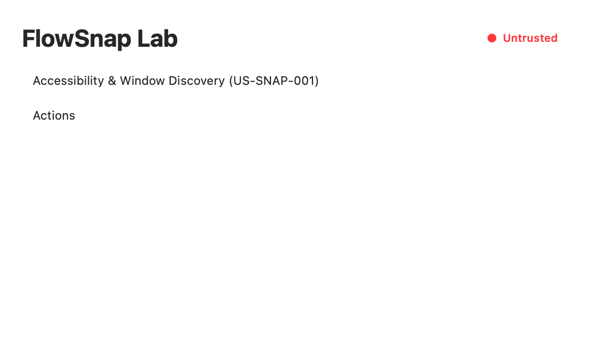
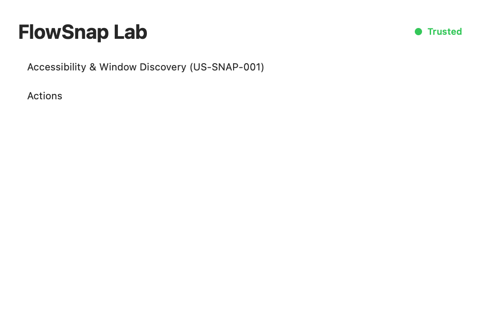

# User Guide: Accessibility Permission & Focused Window Discovery

Welcome to FlowSnap! This guide explains how FlowSnap uses macOS Accessibility permissions to manage windows safely and how you can verify your setup using FlowSnap Lab.

---

## 1. Granting Accessibility Permissions

FlowSnap requires macOS Accessibility permissions (`AXUIElement`) to detect which window is in front and adjust window positions.

### Step-by-Step Authorization:

1. When FlowSnap is launched for the first time, you will see an **"Untrusted"** indicator badge.
2. Click **① "Open Settings"** (highlighted in red below) to open macOS System Settings directly to **Privacy & Security > Accessibility**.

3. In the Accessibility list, find **FlowSnap** (or **FlowSnapLab**) and toggle the switch to **ON**.
4. Switch back to FlowSnap. The indicator will automatically change from **Untrusted (Red)** to **Trusted (Green)** within 1 second without restarting the app!

---

## 2. Testing Window Discovery in FlowSnap Lab

You can test window detection live using **FlowSnap Lab**:

1. Open **FlowSnapLab** from Xcode or your build folder.
2. Observe the status card:
   - **Permission Status**: Displays **Granted** in green.
   - **② Focused Window Details**: Inspects the real-time title, bundle ID, process ID, frame coordinates, and window kind of the foreground window.

3. Bring any standard application (such as Safari, Terminal, or VS Code) to the foreground:
   - FlowSnap will detect the window title and position.
   - Notice the classification: **Kind: normal | Snappable: YES**.
4. If you open a modal dialog or print sheet:
   - Notice the classification changes to **Kind: dialog** or **Kind: sheet** with **Snappable: NO**.
   - This ensures FlowSnap will never accidentally distort system alerts or modal save sheets.

---

## 3. Frequently Asked Questions (FAQ)

#### Q: Why does FlowSnap show "Untrusted" after rebuilding from Xcode?

macOS resets Accessibility trust whenever an ad-hoc signed app binary is recompiled or modified. Simply toggle the switch off and on again in **System Settings > Privacy & Security > Accessibility**.

#### Q: Does FlowSnap read my keystrokes or screen content?

**No.** FlowSnap only queries window frame geometry (position and size), window title, and process ID. FlowSnap does not inspect the contents of your documents or record keystrokes.
