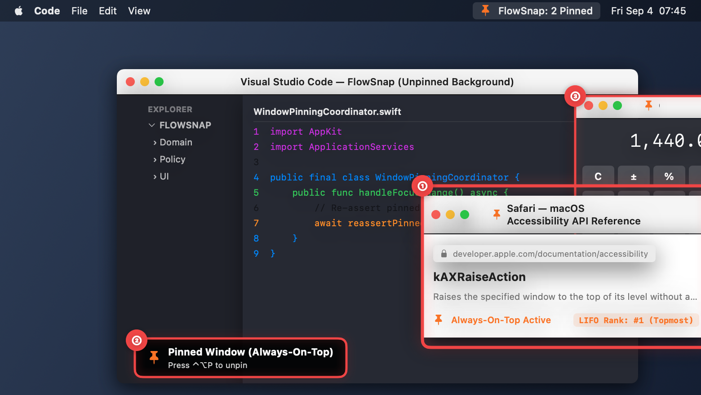
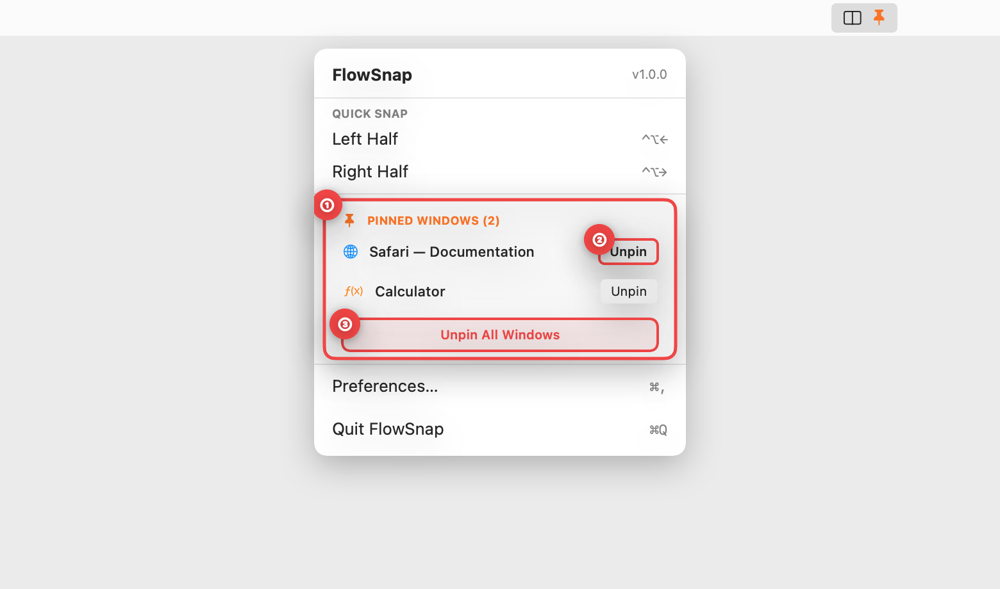
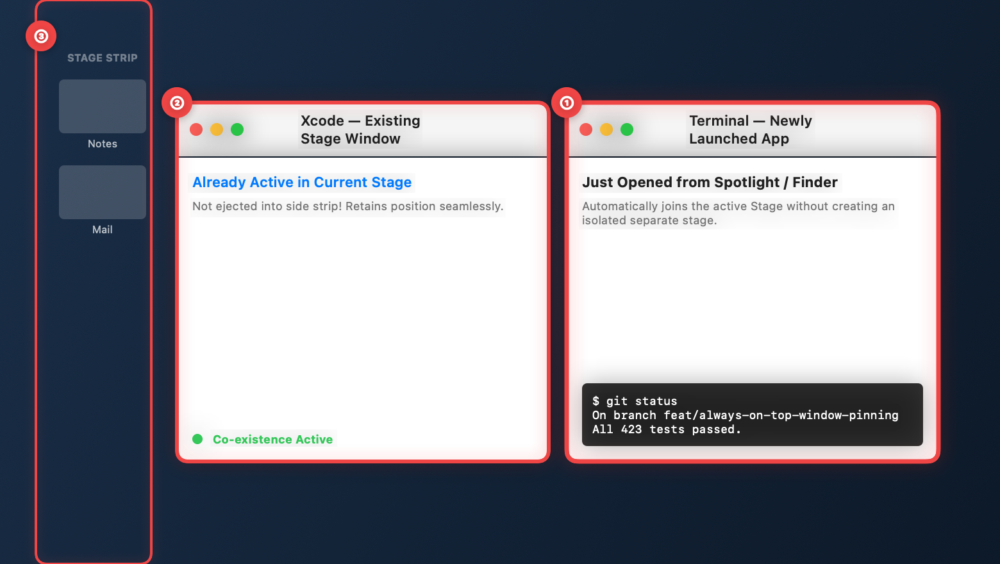
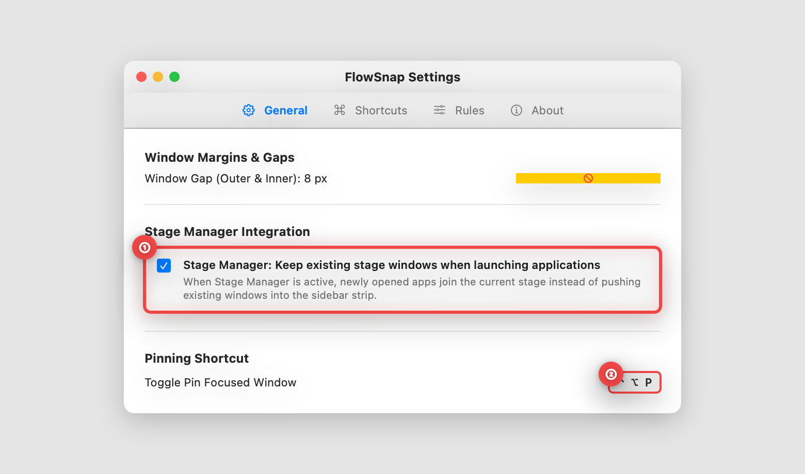

# 📖 User Guide: Universal Always-On-Top Window Pinning & Stage Manager Launch Co-existence (US-SNAP-021)

> **Target Audience:** FlowSnap Mac Users who need reference materials (videos, notes, documentation, chat) to stay visible above other windows, and Stage Manager power users who want newly launched apps to join active stages seamlessly.  
> **Applies to:** FlowSnap 1.0+ (macOS 14 Sonoma & macOS 15 Sequoia)  
> **Last Updated:** September 4, 2026  
> **Feature Status:** Built-in & Fully Automated

---

## 🎯 1. Overview (in Plain English)

Have you ever watched a video tutorial, referenced API documentation, or kept a quick calculator or chat window open, only to have it vanish behind your full-sized code editor or browser the instant you clicked on it?

- **The Old Problem:** macOS does not provide a native "Always on Top" toggle for third-party windows. Existing workarounds often relied on unofficial system extensions or dangerous terminal hacks (`CGSSetWindowLevel`) that risk crashing the window server, break Mission Control, or violate system security. Furthermore, in macOS Stage Manager, opening any new application typically isolates it into its own Stage and banishes your current windows into the left sidebar strip.
- **The FlowSnap Solution:** With **Universal Always-On-Top Window Pinning**, pressing `⌃⌥P` (or clicking in the FlowSnap Menu Bar) pins any focused window right at the front:
  - **Zero Private APIs**: FlowSnap strictly coordinates floating priority using public macOS Accessibility actions (`kAXRaiseAction`). No System Integrity Protection (SIP) modifications or unsafe system hooks are ever used.
  - **Dynamic Multi-Window Stacking (LIFO)**: Pin as many windows as you need. The window you click or pin last stays directly on top, and all pinned windows remain strictly above normal background windows.
  - **System Dialog Protection**: If macOS displays an authentication prompt (such as Touch ID, Keychain password, or Administrator approval), FlowSnap immediately pauses window raising so security prompts are never obscured.
  - **Stage Manager Launch Co-existence**: Newly opened apps join your current Stage automatically, keeping companion windows in place without sidebar exile.

```
┌──────────────────────────────────────────────────────────────────────────┐
│             FLOWSNAP ALWAYS-ON-TOP & CO-EXISTENCE ARCHITECTURE           │
├─────────────────────────────────────┬────────────────────────────────────┤
│ 📌 Dynamic LIFO Z-Stacking          │ 🛡️ Zero Private APIs (Pure AX)     │
│ • Most recent pinned window on top  │ • Uses public kAXRaiseAction       │
│ • Re-asserts on unpinned focus      │ • No SIP tampering or CGS hacks    │
├─────────────────────────────────────┼────────────────────────────────────┤
│ 🔒 System Modal Exemption           │ 🎛️ Stage Manager Launch Cohesion   │
│ • SecurityAgent & Touch ID safe     │ • Merges new app into active stage │
│ • Never obscures system prompts     │ • Toggleable in General Settings   │
└─────────────────────────────────────┴────────────────────────────────────┘
```

---

## 🚀 2. Step-by-Step Visual Walkthrough

### Step 1: Pinning Windows with Global Hotkey & Dynamic Stacking

Pin any active window instantly using the global keyboard shortcut `⌃⌥P` (Control + Option + P).



1. **① Frontmost Pinned Window (Topmost LIFO Rank)**:
   - When you press `⌃⌥P`, FlowSnap marks the focused window (e.g. _Safari — Documentation_) as Always-On-Top and elevates it visually.
   - Even when you click into the background code editor (VS Code), this window stays completely visible on top without stealing your keyboard focus or interrupting your typing.
2. **② Hotkey Status Notification (HUD)**:
   - A subtle, temporary notification appears in the corner confirming that the window has been pinned. Pressing `⌃⌥P` again on the window instantly unpins it.
3. **③ Dynamic Multi-Pin Stacking**:
   - You can pin multiple windows simultaneously (e.g. _Calculator_ alongside _Safari_).
   - Clicking between pinned windows elevates the active one to the topmost position, while ensuring both pinned tools stay floating above all unpinned workspace windows.

---

### Step 2: Quick Management via the FlowSnap Menu Bar

If you prefer using the mouse, manage all your pinned windows directly from the macOS menu bar.



1. **① PINNED WINDOWS Section**:
   - Click the FlowSnap icon in the menu bar to reveal the active pinned windows list.
   - Each entry clearly displays the application icon and window title.
2. **② Individual Unpin Button**:
   - Click **Unpin** next to any specific window to release it back to normal window behavior without affecting other pinned windows.
3. **③ Unpin All Windows**:
   - Click **Unpin All Windows** to release every pinned window simultaneously in a single click.

---

### Step 3: Stage Manager Launch Co-existence

Keep your active workspace together when launching new applications in macOS Stage Manager.



1. **① Newly Launched App Joins Active Stage**:
   - When opening a new application (e.g. _Terminal_) from Spotlight, Raycast, Finder, or the Dock, FlowSnap detects its first window creation.
   - Instead of isolating into an empty stage, the new application smoothly integrates into your current working Stage.
2. **② Existing Stage Windows Retained**:
   - Your existing workspace window (e.g. _Xcode_) stays open and active side-by-side with the new app.
   - FlowSnap eliminates the frustrating macOS default behavior of kicking companion windows away.
3. **③ Inactive Stages Untouched**:
   - Other inactive stages in the left sidebar strip remain organized and unaffected until you deliberately switch to them.

---

### Step 4: Settings & Launch Co-existence Configuration

Configure Stage Manager launch preferences and customize keyboard shortcuts in FlowSnap Settings.



1. **① Stage Manager Launch Co-existence Checkbox**:
   - Open **FlowSnap Settings** (`⌘,`) and navigate to the **General** tab.
   - Under **Stage Manager Integration**, toggle **"Stage Manager: Keep existing stage windows when launching applications"** on or off (enabled by default).
2. **② Global Shortcut Customization**:
   - In the **Shortcuts** tab under **Pinning & Focus**, you can customize the `⌃⌥P` shortcut to any combination that suits your mechanical keyboard or workflow preference.

---

## 💡 3. Tips & Best Practices

- **Zero Focus Stealing**: When working in a full-sized code editor while referencing a pinned browser, clicking inside your editor immediately receives keyboard events. FlowSnap re-asserts the pinned windows visually in the foreground without redirecting your keystrokes.
- **Space Scoping**: Pinned windows stay on the desktop Space where they were pinned. When you swipe to another virtual desktop, the pinned window will not follow or clutter your other workspaces.
- **Automatic Process Cleanup**: When you close or quit a pinned app (`⌘Q`), FlowSnap automatically removes its record from memory and updates the Menu Bar list immediately.
- **System Modal Safety**: When macOS requests administrative permission, Touch ID, or Keychain access (`SecurityAgent`), FlowSnap automatically suspends window raising so that critical password dialogs are never blocked.

---

## ❓ 4. Frequently Asked Questions (FAQ)

#### Q: Does FlowSnap require disabling System Integrity Protection (SIP) or use private CGS APIs?

**A:** No. FlowSnap is built for total system stability and security. It uses only public macOS Accessibility APIs (`kAXRaiseAction`) and standard workspace notification observers. It never injects code into system processes or modifies private window levels.

#### Q: Can I pin more than two windows at the same time?

**A:** Yes. There is no arbitrary limit on how many windows you can pin. FlowSnap maintains an orderly LIFO stack so clicking any pinned window brings it directly to the front of the pinned group.

#### Q: Can I disable Stage Manager Launch Co-existence if I prefer macOS standard behavior?

**A:** Yes. Open **FlowSnap Settings** (`⌘,`) > **General**, and uncheck **"Stage Manager: Keep existing stage windows when launching applications"**.
