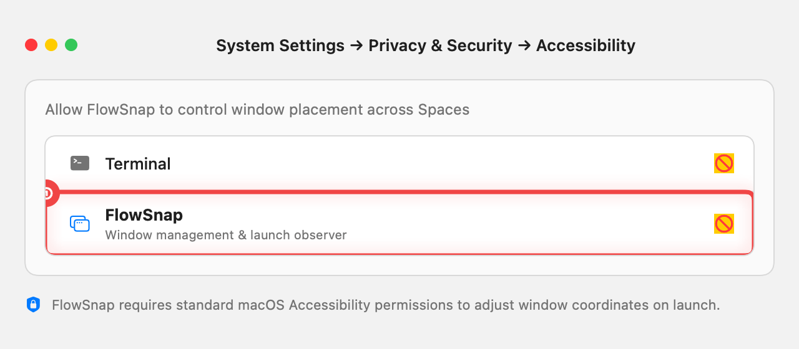
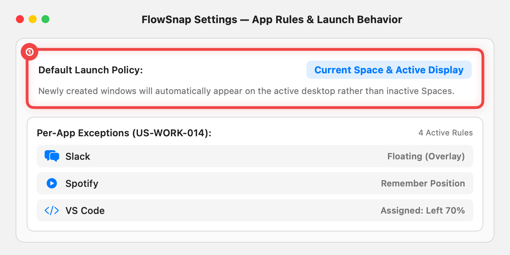

# 📖 User Guide: App Launch Observer & Current Space Policy (US-WORK-013)

> **Target Audience:** Every FlowSnap Mac User (Engineers, Designers, Writers, Researchers & Multitaskers)  
> **Applies to:** FlowSnap 1.0+ (macOS 14 Sonoma & macOS 15 Sequoia)  
> **Last Updated:** September 3, 2026

---

## 🎯 1. Overview & Business Value

Have you ever opened an application on your Mac only to watch it pop up on a completely different desktop Space — one with a full-screen app you were using minutes ago? This frequent macOS behavior disrupts your workflow and forces you to hunt across Spaces to drag windows back to where you are actually working.

FlowSnap solves this with **App Launch Observer & Current Space Preservation**. When FlowSnap is running, newly launched applications are automatically intercepted and anchored directly onto the **active desktop Space and display** you are currently looking at ("New apps appear where I am").

```
┌──────────────────────────────────────────────────────────────────────────┐
│                       FLOWSNAP LAUNCH ENGINE                             │
├─────────────────────────────────────┬────────────────────────────────────┤
│ 🔍 Always-On Launch Interception    │ 🎯 Current-Space Anchoring         │
│ • Detects new app launches instantly│ • Positions the new window on your │
│ • Tracks first window appearance    │   active display & desktop space   │
│ • Zero background polling overhead  │ • Completely prevents misrouting   │
└─────────────────────────────────────┴────────────────────────────────────┘
```

---

## 🚀 2. Step-by-Step Experience & Visual Guide

### Step 1: Automatic Space Anchoring


- **① Anchored Window Placement**: When you launch an app from the Dock, Spotlight, or Finder while working on your primary workspace, FlowSnap catches the new window and ensures it opens right in front of your eyes on your active screen.
- **Space 2 Isolation**: Even if you have full-screen applications or inactive workspaces open in the background, FlowSnap guarantees windows will never be misrouted away from your active context.

---

### Step 2: Ensuring macOS Permissions Are Granted

To reposition newly launched windows across Spaces, macOS requires one-time Accessibility authorization.



- **① Enable FlowSnap**: Open **System Settings → Privacy & Security → Accessibility** and ensure the toggle switch next to **FlowSnap** is switched **ON**.
- **Privacy & Security Guarantee**: FlowSnap uses 100% public Apple APIs to adjust window geometry without accessing private personal data or keystrokes.

---

### Step 3: Default Policy & Settings Overview



- **① Default Launch Policy**: In FlowSnap Settings, the default launch policy is preconfigured to **Current Space & Active Display**. You do not need to configure anything manually — it works out of the box.
- **Per-App Customizations**: If you wish to set specific rules for certain tools (e.g. keeping Slack or Telegram floating as an overlay, or snapping VS Code to 70% width), you can configure them under the **App Rules** tab.

---

## 🧪 3. How to Verify It's Working on Your Mac

To see the feature in action on your machine:

1. Ensure FlowSnap is running (look for the FlowSnap icon in the menu bar).
2. Create a second desktop space in Mission Control (swipe up with three fingers or press `^↑`).
3. On Space 2, open any application in Full Screen mode (e.g. Terminal or Safari).
4. Swipe back to **Space 1** (your active workspace).
5. Open any application from your Dock (such as **Notes** or **Calculator**).
6. **Notice that the application opens directly on Space 1 where you are working, instead of pulling you into Space 2!**

---

## 💡 4. Tips & Performance Notes

- **Zero Idle CPU Overhead**: FlowSnap uses native macOS notification callbacks rather than polling loops. When no apps are launching, CPU usage is 0.0%.
- **Display-Aware**: If you have multiple monitors connected, newly launched windows will land on the display containing your active mouse cursor or active window.
- **Headless App Safety**: Background tools or utilities that never draw a visible window are safely ignored after a 10-second timeout, preventing system resource waste.

---

## ❓ 5. Frequently Asked Questions (FAQ)

- **Q: Do I need to press any shortcut or click a menu button to activate this?**  
  **A:** No. Current Space preservation runs automatically in the background as long as FlowSnap is running in your menu bar.

- **Q: What happens if I want certain apps (like Spotify or Notes) to remember their last position instead?**  
  **A:** Open **Preferences (⌘,) → App Rules** and set the rule for that app to **Remember Position** or **Floating**.

- **Q: Does this feature use private macOS APIs that could break in future updates?**  
  **A:** No. FlowSnap strictly uses official, App Store-compliant macOS Accessibility and Workspace APIs.
