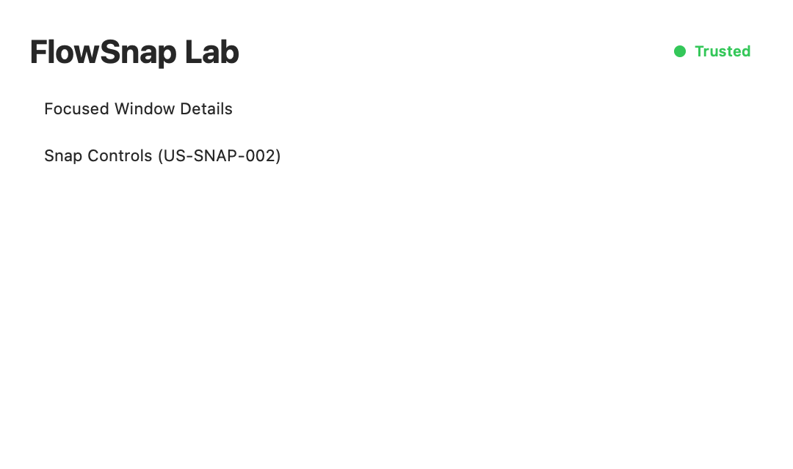
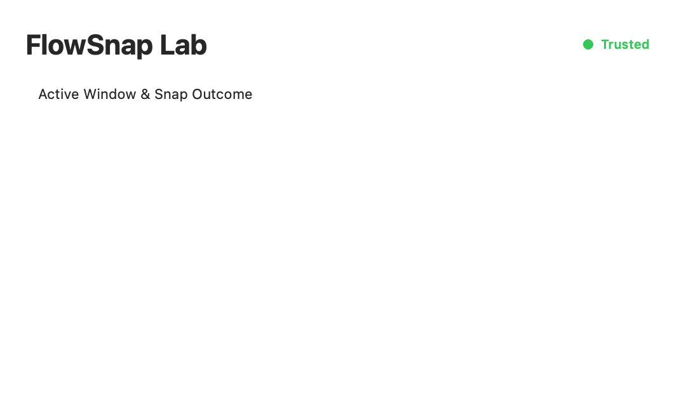

# User Guide: Core Layout Calculation & Basic Snap Engine

Welcome to FlowSnap! This guide explains how FlowSnap deterministically calculates window snap partitions and how you can test snapping windows to Halves, Quarters, Maximize, and restoring them using FlowSnap Lab.

---

## 1. How FlowSnap Calculates Layouts

FlowSnap uses a pure mathematical layout engine (`LayoutEngine`) with an **Odd-Pixel Flooring Policy** (`BR-LAYOUT-002`) to ensure that:

1. **Zero-Gap Halves (50/50)**: On any screen resolution (even or odd width like 1441px), left and right halves fit together seamlessly without revealing the wallpaper or overlapping window borders.
2. **Four Corners (25% Each)**: Tiles up to 4 windows cleanly in each quadrant of the screen.
3. **Full Maximize (100%)**: Fills 100% of the visible desktop space while properly respecting the macOS Menu Bar and Dock.
4. **Pre-Snap Frame Preservation & Single-Step Restore**: FlowSnap remembers where your window was located before you snapped it. You can snap a window multiple times in a row, and a single "Restore" action returns the window to your exact starting position!

---

## 2. Interactive Testing in FlowSnap Lab

You can test window snapping and restoration live using **FlowSnap Lab**:

### Step 1: Open FlowSnap Lab & Select a Window

1. Launch **FlowSnapLab** from Xcode or your build folder.
2. Bring another application window (such as Safari, Terminal, or VS Code) to the foreground, then focus FlowSnap Lab.
3. Observe the **Snap Controls** section:

4. Notice the four action buttons **①**:
   - **Snap Left**: Snaps the window to the left 50% of the display.
   - **Snap Right**: Snaps the window to the right 50% of the display.
   - **Maximize**: Expands the window to fill the entire visible desktop area.
   - **Restore**: Recovers the pre-snap window position.

---

### Step 2: Snap and Restore

1. Click **"Snap Left"**.
2. FlowSnap computes the exact frame and positions your window to the left half:

3. Notice the status card **②**:
   - Displays the applied target: `Left Half (50%)`.
   - Confirms the exact pixel dimensions (e.g. `720x875`).
   - Confirms that the original position is safely stored: `Pre-Snap Stored (Ready for Restore)`.
4. Now click **"Snap Right"**, then **"Maximize"**.
5. Finally, click **"Restore"**. Your window immediately jumps back to its original pre-snap location!

---

## 3. Frequently Asked Questions (FAQ)

#### Q: What happens if an application has a minimum window size larger than a quarter screen?

FlowSnap honors the application's minimum size constraint (`BR-LAYOUT-005`), anchors the window to the requested corner, and lets the excess width or height expand inward toward the center of the screen, ensuring the window never gets pushed off-screen.

#### Q: Does snapping a window move it between multiple monitors?

In this release (`US-SNAP-002`), calculations apply to the current active display. Full multi-monitor display awareness, automatic screen hopping, and coordinate inversion are implemented in `US-SNAP-003: Display-Aware Multi-Monitor Support`.
