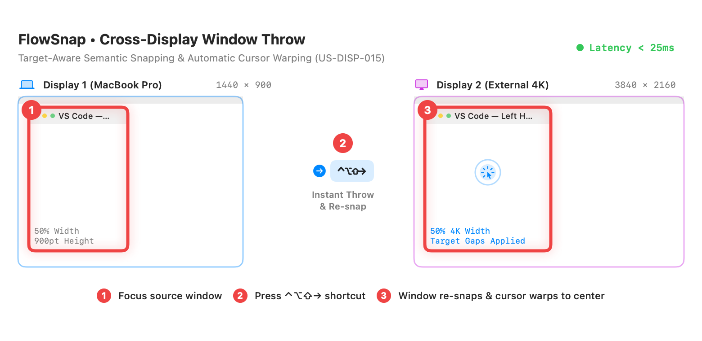
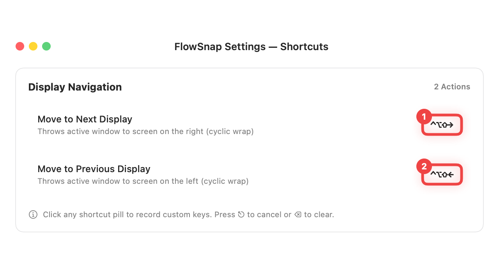
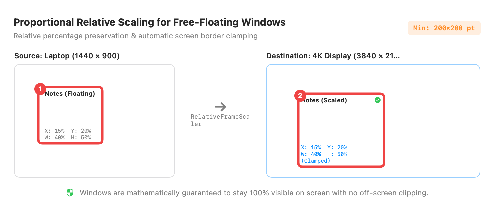

# 📖 User Guide: Cross-Display Window Throw (US-DISP-015)

> **Target Audience:** Every FlowSnap Mac User working with Multiple Monitors  
> **Applies to:** FlowSnap 1.0+ (macOS 14 Sonoma & macOS 15 Sequoia)  
> **Last Updated:** September 3, 2026

---

## 🎯 1. What This Feature Does (in Plain English)

When working across multiple displays (such as a MacBook connected to an external 4K monitor or an ultra-wide screen), moving windows between displays by dragging them across screen borders is cumbersome and disruptive:

- You have to click, hold, and drag a large window across the physical screen boundary.
- The window often ends up misaligned, oversized, or awkwardly cut off if the two monitors have different resolutions (e.g., 4K vs 1080p).
- You lose your mouse cursor on the other monitor and spend valuable seconds searching for where it landed.

**FlowSnap's Cross-Display Window Throw** makes this instantaneous, predictable, and effortless with global keyboard shortcuts:

```
┌──────────────────────────────────────────────────────────────────────────┐
│                     FLOWSNAP CROSS-DISPLAY THROW                         │
├─────────────────────────────────────┬────────────────────────────────────┤
│ ⚡ Instant Global Shortcuts         │ 📐 Proportional Scaling & Snapping │
│ • ⌃⌥⇧→ : Throw to Next Display      │ • Snapped windows stay snapped     │
│ • ⌃⌥⇧← : Throw to Previous Display  │ • Floating windows scale cleanly   │
├─────────────────────────────────────┼────────────────────────────────────┤
│ 🎯 Auto Cursor Warping              │ 🔄 Cyclic Modulo Navigation        │
│ • Mouse cursor instantly jumps to   │ • Moving past the last monitor     │
│   the center of the thrown window   │   wraps around to the first one    │
└─────────────────────────────────────┴────────────────────────────────────┘
```

---

## 🚀 2. Step-by-Step Instructions

### Step 1: Throw a Window to Adjacent Displays with Instant Cursor Warping



1. **① Select your active window**: Click into the window you wish to move (such as your code editor, browser, or terminal) on your current screen.
2. **② Press the throw shortcut**:
   - Press **`⌃⌥⇧→`** (`Ctrl + Option + Shift + Right Arrow`) to throw the window to the monitor on your right.
   - Press **`⌃⌥⇧←`** (`Ctrl + Option + Shift + Left Arrow`) to throw the window to the monitor on your left.
3. **③ Instant re-snapping & mouse cursor alignment**:
   - The window teleports to the destination screen immediately (under 25 milliseconds).
   - If the window was snapped to the **Left Half**, it cleanly snaps to the **Left Half** of the new monitor, automatically taking into account the new monitor's menu bar, dock, and your configured window gaps.
   - **Your mouse cursor automatically jumps to the center of the window**, so you can start typing or scrolling right away without hunting for your pointer.

---

### Step 2: Customize Display Navigation Shortcuts in Settings



1. Open FlowSnap **Preferences...** by clicking the FlowSnap menu bar icon and choosing **Preferences...** (or press **`⌘,`**).
2. Select the **Shortcuts** tab and scroll to the **Display Navigation** section:
   - **① Move to Next Display** (default: `⌃⌥⇧→`): Click the key combination badge to record a custom shortcut.
   - **② Move to Previous Display** (default: `⌃⌥⇧←`): Click to record your preferred alternative keys.
3. Press **`⎋`** (Escape) at any time to cancel recording, or press **`⌫`** (Delete) to restore the default shortcut.

---

### Step 3: Throw Free-Floating Windows with Proportional Scaling



1. **① Free-floating windows keep their relative proportions**:
   - If a window is not snapped (for example, a floating Notes or Terminal window occupying 40% width and 50% height on your MacBook screen), FlowSnap calculates its relative position and size percentages.
2. **② Safe destination placement & edge clamping**:
   - On the destination monitor (e.g., an external 3840×2160 4K display), the window expands proportionally to occupy the exact same 40% width and 50% height.
   - FlowSnap's built-in safety system ensures the window is never placed off-screen, maintaining a minimum size of 200×200 points and keeping all window controls visible.

---

## ⌨️ 3. Quick Shortcut Reference

| Action                       | Default Shortcut                               | Behavior                                                               |
| :--------------------------- | :--------------------------------------------- | :--------------------------------------------------------------------- |
| **Move to Next Display**     | `⌃⌥⇧→` (`Ctrl + Option + Shift + Right Arrow`) | Moves the focused window to the next monitor to the right (cyclic).    |
| **Move to Previous Display** | `⌃⌥⇧←` (`Ctrl + Option + Shift + Left Arrow`)  | Moves the focused window to the previous monitor to the left (cyclic). |

---

## 💡 4. Tips & Best Practices

- **Cyclic Wrap-Around**: If you have 2 or 3 monitors arranged side-by-side, pressing `⌃⌥⇧→` on your rightmost screen immediately cycles the window back to your leftmost screen. You never need to remember which screen is "first" or "last".
- **Works with Tiled & Floating Layouts**: Whether you are using side-by-side splits or floating scratchpads, FlowSnap automatically chooses the right strategy (semantic re-snap vs. proportional scaling).
- **Smooth Visual Continuity**: FlowSnap triggers a subtle ghost-morph outline so your eyes can naturally follow the window across physical screens.

---

## ❓ 5. Frequently Asked Questions (FAQ)

### Q: What happens if I only have one display connected?

**A:** FlowSnap detects that only 1 display is connected and safely ignores the command (`no-op`). There is zero screen flicker, zero audio error beep, and no delay.

### Q: Does this move windows across displays if they are arranged vertically in macOS Settings?

**A:** Yes! FlowSnap sorts displays primarily from left to right (`minX`), and secondarily from top to bottom (`minY`), providing a deterministic cyclic order across any multi-monitor arrangement.

### Q: Does this feature use private macOS APIs?

**A:** No. FlowSnap uses 100% public Apple APIs (`NSScreen`, `CGWarpMouseCursorPosition`, and `AXUIElement`), ensuring complete privacy, safety, and compatibility across macOS 14 Sonoma and macOS 15 Sequoia.
