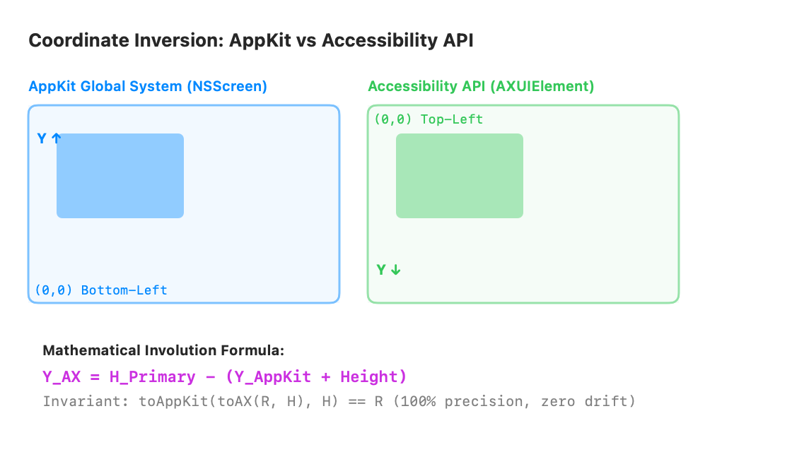
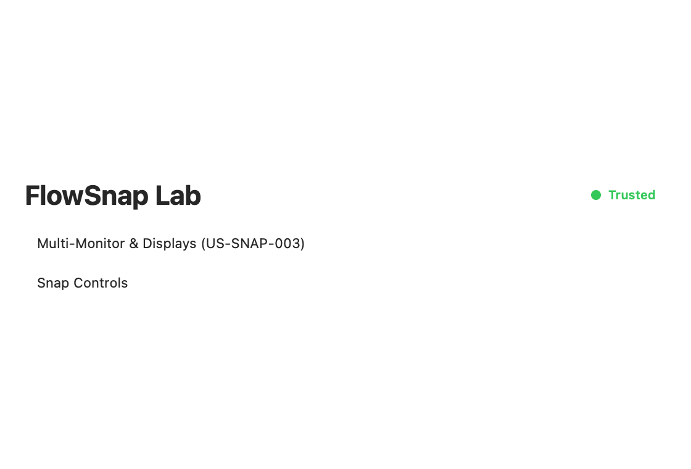

# User Guide: Display-Aware Multi-Monitor Manipulation (US-SNAP-003)

Welcome to FlowSnap's multi-monitor guide! This document explains how FlowSnap solves the challenging coordinate inversion between macOS AppKit and Accessibility APIs, determines target screens across multi-display setups, and enables seamless window snapping across external monitors.

---

## 1. The Multi-Monitor Coordinate Challenge

macOS uses two opposing coordinate spaces:

- **AppKit (`NSScreen`)**: Origin `(0, 0)` is at the **bottom-left** of the primary display; Y coordinates increase **upward**.
- **Accessibility API (`AXUIElement`)**: Origin `(0, 0)` is at the **top-left** of the primary display; Y coordinates increase **downward**.

When an external monitor is attached (arranged to the right, left, above, or below the primary display), coordinates can easily become negative or inverted. Without correct translation, windows snap onto the wrong screen or disappear into invisible coordinates.

### The Involution Invariant:

FlowSnap implements a pure mathematical involution (`CoordinateTransformer`) using the invariant formula:
$$Y_{AX} = H_{Primary} - (Y_{AppKit} + Height)$$
$$Y_{AppKit} = H_{Primary} - (Y_{AX} + Height)$$

Because applying this transformation twice yields the exact original rectangle with zero floating-point drift, window geometry is preserved with 100% precision.

---

## 2. Testing Multi-Monitor Controls in FlowSnap Lab

You can inspect connected displays and test cross-monitor window movements in **FlowSnap Lab**:

1. Launch **FlowSnapLab**.
2. Bring a target window to the front, then inspect FlowSnap Lab's **Multi-Monitor & Displays** section:

3. Notice the display metrics:
   - **Display 1 (Primary)**: Shows native resolution (e.g. `1440x900 @ 2x`) and primary screen height (`900pt`).
   - **Display 2 (External)**: Shows external screen resolution (e.g. `1920x1080 @ 1x`).
4. Click **"Move Window to Next Display (Left Half)"**:
   - FlowSnap calculates the window's current screen.
   - Finds the next display in sequence (`nextDisplay(after:)`).
   - Calculates the target frame within the new screen's `visibleFrame` (respecting Menu Bar and Dock).
   - Inverts the coordinates to AX space and moves the window instantly!

---

## 3. Key Multi-Monitor Behaviors

### 1. Windows Straddling Multiple Displays (`BR-DISP-002`)

If a window is stretched across two screens (e.g. 30% on Screen 1 and 70% on Screen 2), FlowSnap calculates the intersection area (`CGRectIntersection`) on each display. The snap operation is applied to the screen that contains the **maximum visible overlap area**. If a window is dragged completely off-screen, it falls back to the screen containing your mouse cursor.

### 2. Mirrored Displays Coalescing (`BR-DISP-005`)

When you connect a projector or TV in **Mirrored Mode**, FlowSnap automatically detects mirroring (`CGDisplayIsInMirrorSet`) and coalesces mirrored screens into a single logical master display. This prevents redundant or conflicting snap commands.

### 3. Screen Reconnection & Dynamic Layouts (`BR-DISP-004`)

Whenever you plug in or unplug a monitor, macOS emits `didChangeScreenParametersNotification`. FlowSnap listens to this notification and refreshes its internal display topology automatically without forcefully moving your existing windows until you trigger your next snap or restore command.
