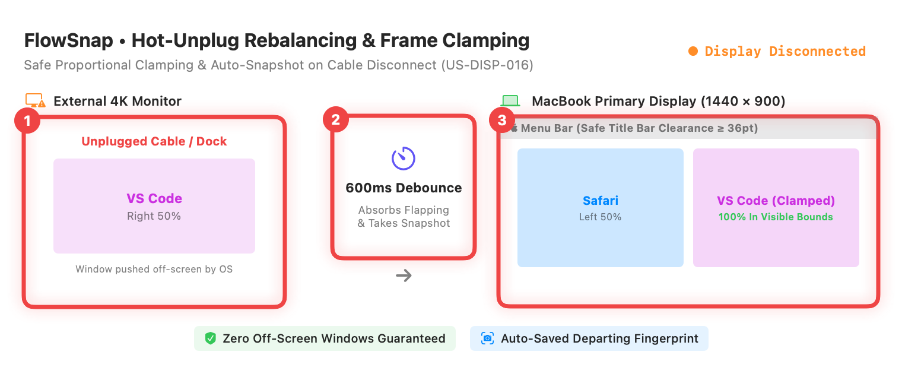
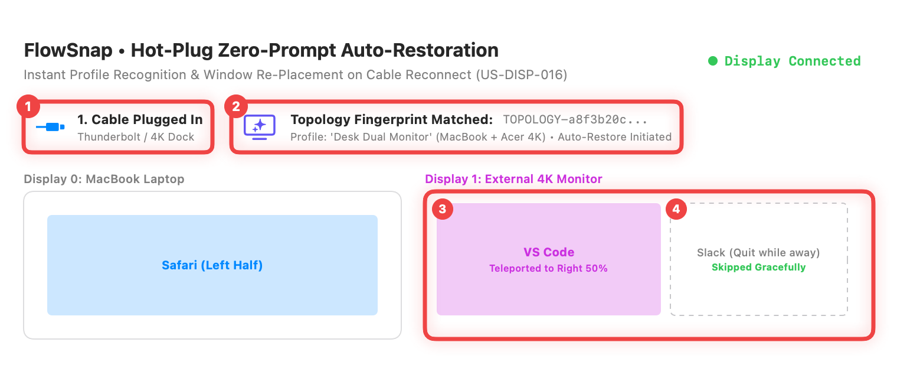
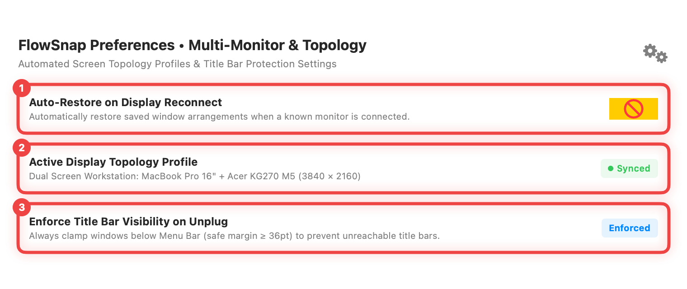

# 📖 User Guide: Display Topology Profiles & Hot-Plug Rebalancer (US-DISP-016)

> **Target Audience:** FlowSnap Mac Users working with External Monitors, Docks, or Multi-Screen Desks  
> **Applies to:** FlowSnap 1.0+ (macOS 14 Sonoma & macOS 15 Sequoia)  
> **Last Updated:** September 3, 2026

---

## 🎯 1. Overview (in Plain English)

When you unplug your MacBook from a desk monitor or plug it back in, macOS often treats your windows carelessly:

- Windows that were neatly arranged on your external screen get dumped into arbitrary, messy piles on your laptop screen.
- Window title bars can get shoved under the Apple Menu Bar or off the sides of your display, making them impossible to click or move without restarting apps.
- Every time you sit down at your desk and plug in your cable, you have to spend minutes manually dragging every window back to where it belongs.

**FlowSnap's Display Topology Profiles & Hot-Plug Rebalancer** handles this completely automatically and silently in the background:

```
┌──────────────────────────────────────────────────────────────────────────┐
│              FLOWSNAP DISPLAY TOPOLOGY & HOT-PLUG REBALANCER             │
├─────────────────────────────────────┬────────────────────────────────────┤
│ 🔌 Safe Hot-Unplug Clamping         │ ⚡ Zero-Prompt Auto-Restore        │
│ • Off-screen windows instantly clamp│ • Plugging back into your monitors │
│   inside the laptop screen bounds   │   returns all windows to their     │
│ • Guaranteed title bar clearance    │   exact screens and layout zones   │
│   (always visible below Menu Bar)   │ • Zero clicks or prompts required  │
├─────────────────────────────────────┼────────────────────────────────────┤
│ 🛡️ Hardware Flapping Absorption     │ 🔏 Unique Desk Fingerprint         │
│ • 600ms buffer absorbs rapid dock   │ • Uniquely recognizes each monitor │
│   connection / sleep pulses         │   setup across reboots and sleep   │
└─────────────────────────────────────┴────────────────────────────────────┘
```

---

## 🚀 2. Step-by-Step Instructions

### Step 1: Hot-Unplug Safe Clamping & Auto-Snapshot



1. **① Unplug your external monitor or dock**: Disconnect your USB-C, Thunderbolt, or HDMI display cable to take your MacBook on the go.
2. **② Automatic 600ms hardware stabilization & snapshot**: FlowSnap detects the disconnect, absorbs the brief hardware signal flicker, and takes a silent snapshot of your exact window arrangement before the monitor disappears.
3. **③ Safe window clamping on your laptop screen**:
   - Any window previously located on the external monitor (such as VS Code) is automatically pulled onto your laptop screen.
   - FlowSnap guarantees that the window is 100% visible, with the **title bar positioned safely below the Apple Menu Bar** (minimum 36pt safe margin) so you can easily drag, resize, or close it.

---

### Step 2: Hot-Plug Zero-Prompt Auto-Restoration



1. **① Reconnect to your desk workstation**: Plug your MacBook back into your monitor cable or dock.
2. **② Instant desk recognition**: FlowSnap reads the display setup and instantly matches your saved **Topology Profile** (e.g., `'Desk Dual Monitor'`).
3. **③ Zero-prompt window restoration**:
   - Your apps teleport back to their designated screens and layout zones (e.g., VS Code returns to the right 50% of your 4K display).
   - You don't have to click any popup buttons or confirm dialogs — your workspace simply puts itself back together.
4. **④ Closed app protection**: If you quit an app while away (such as Slack), FlowSnap gracefully skips it without causing errors or interrupting other apps.

---

### Step 3: Configure Multi-Monitor Preferences in Settings



1. Open FlowSnap **Preferences...** by clicking the FlowSnap menu bar icon and selecting **Preferences...** (or press **`⌘,`**).
2. Under the **Displays** section:
   - **① Auto-Restore on Display Reconnect**: Keep this switch turned **ON** for automatic, zero-prompt window restoration whenever a known monitor is connected.
   - **② Active Display Topology Profile**: View your currently active display profile and its detected resolution.
   - **③ Safe Title Bar Clamping**: Verify that title bar clearance protection is active to prevent windows from ever getting lost under the macOS Menu Bar.

---

## 💡 3. Tips & Helpful Workflows

- **Dual-Desk Setup**: If you have one monitor setup at the office and a different setup at home, FlowSnap automatically maintains separate profiles for each location and restores the correct one based on which screen you plug into.
- **Sleep & Wake Safe**: When waking your Mac from sleep while plugged into a dock, FlowSnap's 600ms buffer ensures that multi-port docks have finished turning on before restoring your windows.
- **Rearranging Profiles**: Whenever you arrange your windows into new layout zones on your external monitors, FlowSnap updates your profile automatically.

---

## ❓ 4. Frequently Asked Questions (FAQ)

- **Q: Does FlowSnap reopen apps that I quit while unplugged?**  
  **A:** No. FlowSnap respects your choices. If you quit an app while away from your desk, FlowSnap will not force it to reopen when you reconnect.

- **Q: What happens if I connect to a projector or a new monitor for the first time?**  
  **A:** FlowSnap recognizes it as a new display setup. As soon as you arrange your windows on that screen, FlowSnap saves a new profile for that display.

- **Q: Will this drain my laptop battery?**  
  **A:** Not at all. FlowSnap remains completely dormant until macOS sends a native display change event, takes less than 20 milliseconds to reposition windows, and immediately returns to sleep.
