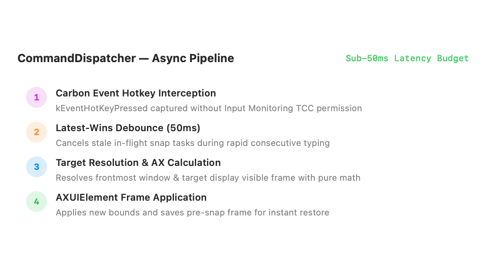
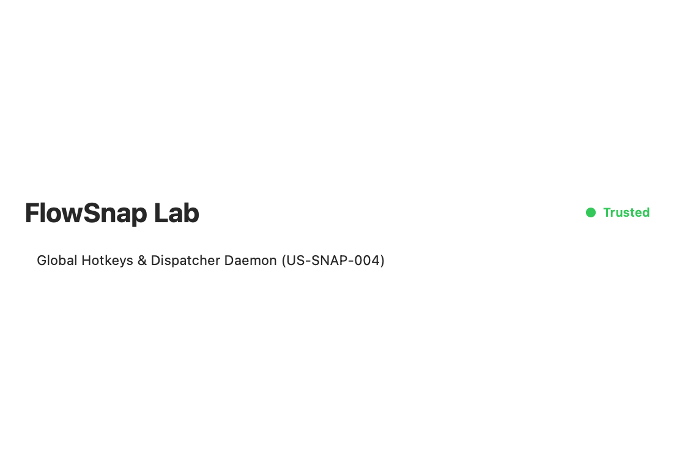

# User Guide: Global Hotkeys & Command Dispatcher (US-SNAP-004)

Welcome to the **FlowSnap Global Hotkeys Guide**! This document walks through FlowSnap's system-wide keyboard shortcuts, sub-50ms asynchronous command dispatcher, conflict resilience, and how to inspect and test hotkeys in FlowSnap Lab.

---

## 1. Overview & Default Hotkey Scheme

FlowSnap operates quietly in the background as a macOS daemon. You don't need to click buttons or keep a window open — simply press any of the standard `Control + Option` (`⌃⌥`) shortcuts to instantly manipulate the frontmost active window.

| Shortcut  | Action            | Target Layout Zone                                            |
| :-------- | :---------------- | :------------------------------------------------------------ |
| **`⌃⌥←`** | Snap Left         | Left 50% half of active screen                                |
| **`⌃⌥→`** | Snap Right        | Right 50% half of active screen                               |
| **`⌃⌥↑`** | Maximize          | Fills 100% of screen visible bounds (excluding Dock/Menu Bar) |
| **`⌃⌥↓`** | Restore           | Restores window to its original frame before snapping         |
| **`⌃⌥1`** | Snap Top-Left     | Top-left 25% corner quadrant                                  |
| **`⌃⌥2`** | Snap Top-Right    | Top-right 25% corner quadrant                                 |
| **`⌃⌥3`** | Snap Bottom-Left  | Bottom-left 25% corner quadrant                               |
| **`⌃⌥4`** | Snap Bottom-Right | Bottom-right 25% corner quadrant                              |

---

## 2. High-Performance Asynchronous Pipeline (< 50ms)

FlowSnap's command dispatch architecture is designed from the ground up for zero typing interruption and instant response:

1. **Carbon Event Hotkey Interception**: Low-level `RegisterEventHotKey` catches key combinations system-wide across all applications without requiring invasive Accessibility Input Monitoring permissions.
2. **Latest-Wins Debounce (50ms)**: If you rapidly hammer shortcuts (e.g. hitting `⌃⌥←` then immediately `⌃⌥→`), stale in-flight window repositioning requests are cancelled immediately to prevent window lag and queue build-up.
3. **Target Resolution & Pure Math**: FlowSnap resolves the frontmost window and the correct screen using `CoordinateTransformer` pure math involution.
4. **Instant AX Application**: The target frame is applied and the previous pre-snap frame is safely recorded in `WindowRegistry` for instant restore.

---

## 3. Testing Hotkeys in FlowSnap Lab

You can observe active shortcuts, registration health, and simulated dispatching directly in **FlowSnap Lab**:

1. Launch **FlowSnapLab** (`open /Users/vutuanhau/Library/Developer/Xcode/DerivedData/FlowSnap-*/Build/Products/Debug/FlowSnapLab.app`).
2. Bring another application (e.g. Safari, Notes, or Terminal) to the front to focus it.
3. Press any of the shortcuts (e.g. `⌃⌥←` or `⌃⌥↑`).
4. Inspect the **Global Hotkeys & Dispatcher Daemon** section in FlowSnap Lab:

- **Green Status Indicators**: Confirm all 8 default shortcuts are successfully registered and active in the system.
- **Latency Budget**: Shows sub-50ms execution verification.
- **Last Dispatched**: Real-time feedback displaying the last command executed and response timing.

---

## 4. Key Conflict Resilience & Edge Cases

### 1. Conflict Graceful Skip (`BR-HOTKEY-002`)

If another window manager (like Rectangle, Magnet, or Raycast) or an IDE has already bound one of the default keys, FlowSnap will not crash or block startup. It logs a warning, flags that specific binding as inactive, and continues registering all other shortcuts normally.

### 2. Idempotent Snapping (`BR-HOTKEY-004`)

Pressing `⌃⌥←` repeatedly while your window is already in the left half will deterministically reaffirm the left half without erratic movement or frame distortion.

### 3. Active Window Guard (`BR-HOTKEY-006`)

If a global hotkey is pressed while your mouse is on the desktop, Spotlight is open, or a system dialog is active with no snappable window, the command terminates cleanly as a safe no-op.
