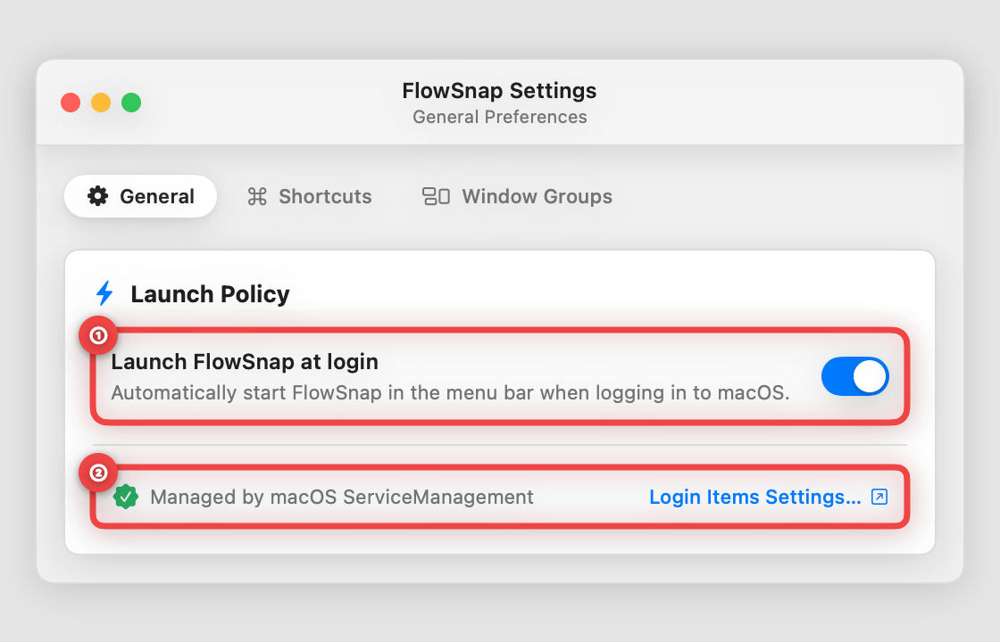
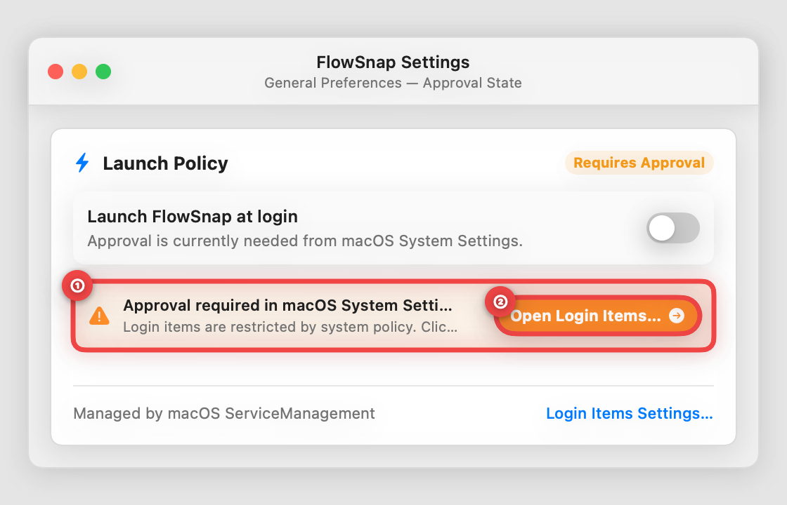
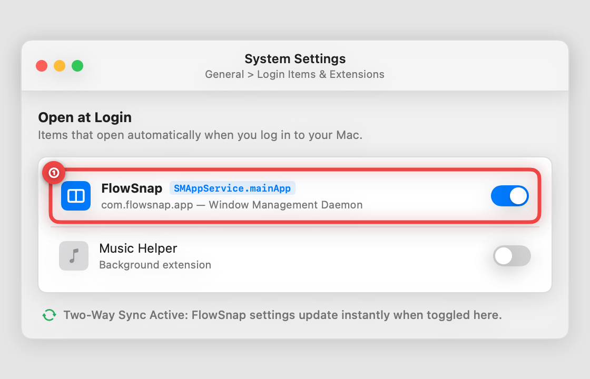

# 📖 User Guide: Automatic Launch at Login (`SMAppService`) (US-SNAP-024)

> **Audience:** FlowSnap Mac Users  
> **Applies to:** FlowSnap 1.0+ (macOS 14 Sonoma & macOS 15 Sequoia)  
> **Last Updated:** September 5, 2026

---

## 🎯 Overview

FlowSnap is your personal workspace and window layout assistant for macOS. To make sure your window-snapping hotkeys, layout picker, and multi-monitor rules are always ready the moment you sit down at your Mac, FlowSnap can start automatically when you log in.

With **US-SNAP-024**, FlowSnap integrates with Apple's modern macOS **ServiceManagement system (`SMAppService`)**. This ensures seamless, reliable background startup without installing helper daemons, keeps your settings perfectly in sync with macOS System Settings, and provides clear visual feedback if system permissions need approval.

---

## 🚀 Step-by-Step Instructions

### Step 1: Turn on Automatic Launch in FlowSnap Settings

1. Open FlowSnap **Settings** by pressing **`⌘,`** (Command + Comma) or clicking the FlowSnap menu bar icon (`rectangle.split.2x1`) and choosing **Settings...**
2. In the **General** tab, look at the **Launch Policy** card at the bottom of the window:

- **① Enable Startup**: Click the toggle switch next to **"Launch FlowSnap at login"** to turn it **ON**. FlowSnap will instantly register with macOS as an authorized login item.
- **② Quick Access to System Settings**: Click **"Login Items Settings…"** at any time to open your Mac's system login item preferences.

---

### Step 2: Resolving "Approval Required" Notice

If your organization has strict device management rules (MDM), or if FlowSnap was previously turned off in your Mac's System Settings, macOS will ask for your approval before allowing background startup:

- **① Status Alert**: When approval is pending, an orange notice appears directly under the toggle stating _"Approval required in macOS System Settings"_.
- **② Open System Settings**: Click the highlighted orange **"Open Login Items…"** button. FlowSnap will immediately take you to the exact preferences pane in macOS.

---

### Step 3: Two-Way Synchronization with macOS System Settings

You never have to worry about mismatched settings between FlowSnap and your Mac. Whenever you make changes inside:

> **macOS System Settings > General > Login Items & Extensions**

- **① Direct macOS Control**: If you turn FlowSnap on or off inside macOS System Settings, FlowSnap detects the change automatically the moment you return to the app.
- **Zero Confusion**: The toggle in FlowSnap always reflects the true system state.

---

## 💡 Pro Tips & Best Practices

- **Menu Bar Efficiency**: When FlowSnap starts at login, it appears discreetly in your top menu bar without popping open unnecessary windows or disrupting your active desktop.
- **Fast Re-sync**: If you just approved FlowSnap in macOS System Settings, simply click anywhere on FlowSnap or open Settings (`⌘,`) to see the status update immediately.
- **No Background Clutter**: Unlike older utilities that run separate background launcher processes, FlowSnap uses Apple's native single-app architecture, saving memory and battery life.

---

## ❓ Frequently Asked Questions (FAQ)

- **Q: Does FlowSnap slow down my Mac when booting up?**  
  **A:** No. FlowSnap is a lightweight native Swift application that initializes in less than 20 milliseconds, ensuring zero perceptible impact on system startup.

- **Q: Why does macOS show a "Background Items Added" notification when I turn this on?**  
  **A:** macOS Ventura, Sonoma, and Sequoia notify you whenever any application registers to run at login. This is normal Apple security behavior confirming FlowSnap was registered.

- **Q: What happens if I uninstall or move FlowSnap?**  
  **A:** Because FlowSnap uses Apple's official `SMAppService` API, macOS automatically removes or updates the login registration if the application is removed.
