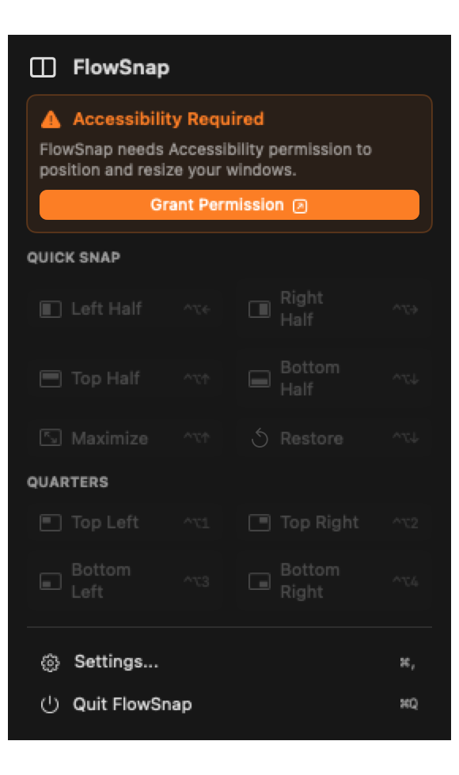

# User Guide: Menu Bar Status Item & Quick Snap Controls (US-SNAP-005)

Welcome to the **FlowSnap Menu Bar Quick Controls Guide**! This document walks through FlowSnap's status bar item, quick mouse-driven window snapping, contextual permission alerts, and application preferences.

---

## 1. Overview & Menu Bar Integration

FlowSnap runs as a lightweight, background macOS agent utility (`LSUIElement = true`). It avoids cluttering your Dock with an extra app icon, remaining accessible at all times directly from the macOS Menu Bar via the FlowSnap status icon (`rectangle.split.2x1`).

Clicking the Menu Bar icon presents a clean, native control panel:

- **Header Status Badge**: Displays a green **"Ready"** capsule badge when all macOS permissions are properly configured.
- **Quick Snap Matrix**: 10 mouse-clickable action buttons for Halves, Full/Restore, and Quarters with intuitive SF Symbol geometric icons and keyboard shortcut reference hints.
- **System Management Footer**: Dedicated buttons to access **Settings...** (`⌘,`) and cleanly **Quit FlowSnap** (`⌘Q`).

---

## 2. Step-by-Step: Snapping Windows via Mouse Controls

### Step 1: Click the FlowSnap Menu Bar Icon

Bring your target app window (e.g. Safari, Code Editor, or Terminal) to the foreground, then click the **FlowSnap icon** in the top menu bar.

### Step 2: Select a Desired Snap Zone

Click any button in the grid:

| Section            | Action           | Target Position                                 | Shortcut Reference |
| :----------------- | :--------------- | :---------------------------------------------- | :----------------: |
| **Halves**         | **Left Half**    | Snaps window to left 50% of the screen          |       `⌃⌥←`        |
|                    | **Right Half**   | Snaps window to right 50% of the screen         |       `⌃⌥→`        |
|                    | **Top Half**     | Snaps window to top 50% of the screen           |       `⌃⌥↑`        |
|                    | **Bottom Half**  | Snaps window to bottom 50% of the screen        |       `⌃⌥↓`        |
| **Full & Restore** | **Maximize**     | Expands window to fill 100% of visible screen   |       `⌃⌥↑`        |
|                    | **Restore**      | Restores window to its original size & position |       `⌃⌥↓`        |
| **Quarters**       | **Top Left**     | Snaps window to top-left 25% quadrant           |       `⌃⌥1`        |
|                    | **Top Right**    | Snaps window to top-right 25% quadrant          |       `⌃⌥2`        |
|                    | **Bottom Left**  | Snaps window to bottom-left 25% quadrant        |       `⌃⌥3`        |
|                    | **Bottom Right** | Snaps window to bottom-right 25% quadrant       |       `⌃⌥4`        |

### Step 3: Automatic Dismiss & Focus Restoration

As soon as you click a snap button:

1. FlowSnap immediately executes the window repositioning and resizing.
2. The menu dropdown automatically closes (_Auto-Dismiss_).
3. Focus seamlessly returns to your snapped application window.

---

## 3. Resolving Accessibility Permission Warnings

If FlowSnap detects that macOS Accessibility permission is not yet granted (or has been revoked in system settings), the menu bar displays an interactive warning banner:

1. **Safety Lock**: Quick snap buttons become disabled to prevent failed system actions.
2. **Contextual Banner**: An orange banner appears explaining:
   > ⚠️ **Accessibility Required**  
   > _FlowSnap needs Accessibility permission to position and resize your windows._
3. **1-Click Deep Link**: Click **[Grant Permission ↗]** to directly open macOS **System Settings > Privacy & Security > Accessibility**.
4. **Instant Activation**: As soon as you toggle the permission switch to **On**, the warning banner disappears and the menu returns to the **Ready** state.

---

## 4. Settings & Application Management

- **Settings... (`⌘,`)**: Opens the FlowSnap preferences window to configure custom shortcuts, window gaps, and multi-monitor rules.
- **Quit FlowSnap (`⌘Q`)**: Gracefully shuts down the application and unregisters all Carbon global hotkey listeners.
