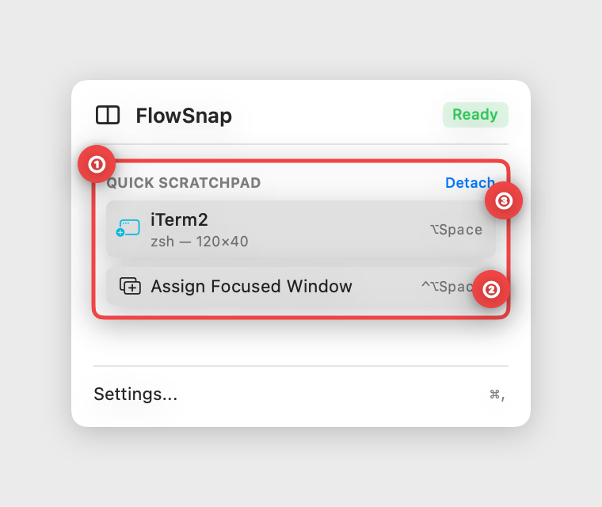
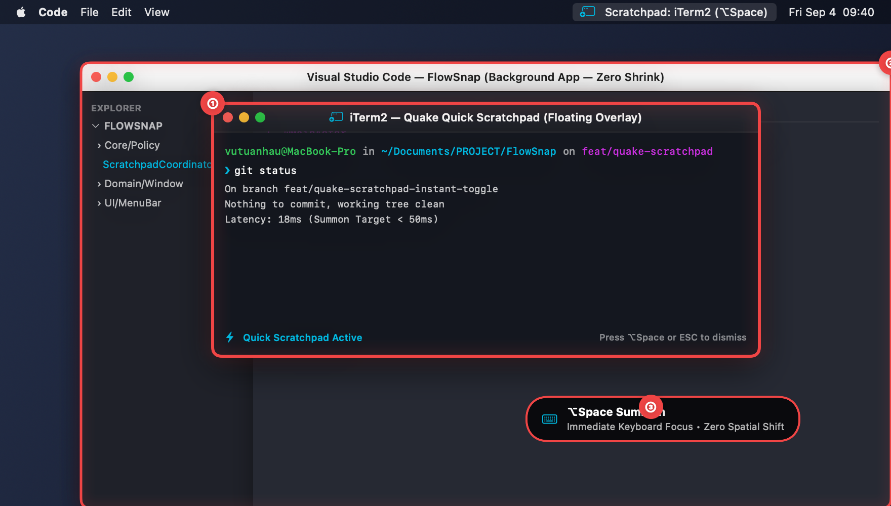
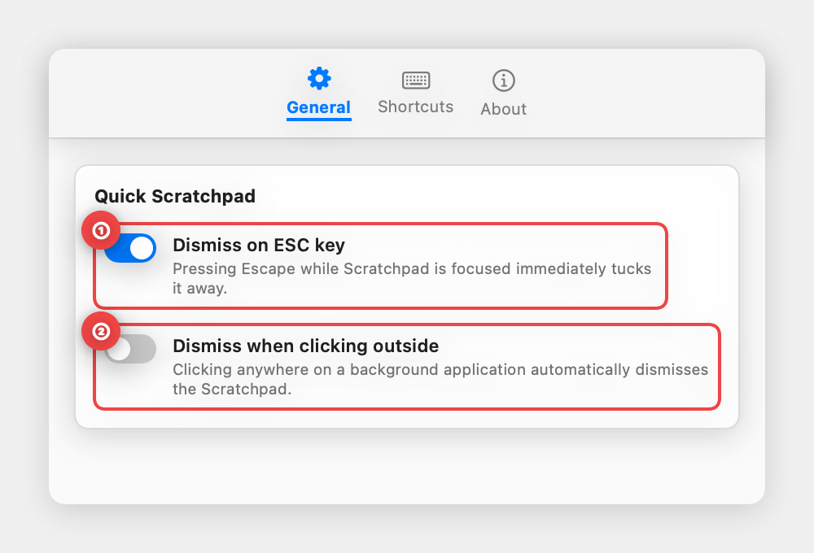

# 📖 User Guide: Quake-Style Quick Scratchpad & Instant Window Toggle (US-SNAP-022)

> **Target Audience:** Developers, researchers, writers, and power users who need instant, temporary access to a secondary utility window (terminal, quick notes, calculator, translation dictionary) without breaking their full-screen or tiled desktop layout.  
> **Applies to:** FlowSnap 1.0+ (macOS 14 Sonoma & macOS 15 Sequoia)  
> **Last Updated:** September 4, 2026  
> **Feature Status:** Built-in & Fully Automated

---

## 🎯 1. Overview (in Plain English)

Have you ever worked full-screen in a browser (like Brave) or written code in a dual-split editor (like VS Code), only to need a terminal for a quick command or a note-taking app to jot down an idea?

- **The Old Problem:** macOS requires you to cycle through `⌘Tab`, swipe between Desktop Spaces, or manually tile windows side-by-side. Tiling shrinks your primary workspace, while switching Spaces interrupts your visual train of thought and creates cognitive fatigue.
- **The FlowSnap Solution:** Inspired by legendary Quake-style dropdown consoles, **FlowSnap Quick Scratchpad** allows you to assign any active window (iTerm2, Terminal, Notes, Calculator, Finder) as your personal Scratchpad:
  - **Instant Summon (`⌥Space`)**: The window immediately jumps to the front in `< 50ms` and takes keyboard focus.
  - **100% Zero-Shrink**: Your background application (Brave, VS Code, Figma) retains its exact size and position. Not a single pixel is moved or shrunk.
  - **Instant Dismiss & Accurate Focus Return**: Hit `⌥Space` again, press `ESC`, or click outside (if enabled). The Scratchpad vanishes, instantly returning your keyboard focus right where you left off.
  - **Hybrid Dismiss Safety**: If the assigned app has multiple windows open (like Chrome or Terminal), FlowSnap safely demotes the Scratchpad without accidentally hiding your other working windows.

```
┌──────────────────────────────────────────────────────────────────────────┐
│                   FLOWSNAP QUAKE SCRATCHPAD ARCHITECTURE                 │
├─────────────────────────────────────┬────────────────────────────────────┤
│ ⚡ Instant Summon (< 50ms)           │ 🛡️ 100% Zero-Shrink Preservation   │
│ • Press ⌥Space from any workspace   │ • Background app keeps exact frame │
│ • Receives keyboard focus instantly │ • Zero Desktop Space dislocation   │
├─────────────────────────────────────┼────────────────────────────────────┤
│ ↩️ Accurate Focus Return            │ 🎛️ Configurable Dismiss Triggers    │
│ • Returns focus to prior app window │ • ESC key dismiss (default ON)     │
│ • Hybrid single/multi-window hide   │ • Click-outside blur (customizable)│
└─────────────────────────────────────┴────────────────────────────────────┘
```

---

## 🚀 2. Step-by-Step Walkthrough

### Step 1: Assigning your Scratchpad Window & Menu Bar Management

Designate any open window as your active Scratchpad in one step.



1. **① Quick Scratchpad Status & Active Window**:
   - The Menu Bar menu displays the current status and the assigned window name (e.g., _iTerm2_).
2. **② Assign Focused Window (`⌃⌥Space`)**:
   - Activate any window you wish to designate as your Scratchpad, then press **`⌃⌥Space`** (or click **"Assign Focused Window"** in the menu).
3. **③ Detach Scratchpad**:
   - To unassign without quitting the app, click **"Detach"** in the top-right corner of the section.

---

### Step 2: Instant Summon & 100% Zero-Shrink Background

Summon your Scratchpad anytime, from any desktop space or full-screen app.



1. **① Frontmost Floating Scratchpad Overlay**:
   - Press **`⌥Space`** (Option + Space) anywhere. The Scratchpad flies to the front in `< 50ms` and takes keyboard focus immediately for typing.
2. **② Background Application Preservation (Zero-Shrink)**:
   - Your primary working window (VS Code, Brave, Figma) remains 100% untouched in position and dimensions. No tiling displacement occurs.
3. **③ Dynamic Focus & HUD Notification**:
   - An indicator confirms the summon state, ensuring zero spatial disorientation or Desktop Space displacement.

---

### Step 3: Instant Dismiss & Seamless Flow Return

When you finish running your command or jotting down your note:

1. **Press `⌥Space` again**, or
2. **Press `ESC`** on your keyboard (enabled by default), or
3. **Click outside** the Scratchpad window (if "Dismiss when clicking outside" is enabled in Settings).
4. The Scratchpad tucks away instantly, and your cursor/keyboard focus returns automatically to your background application.

---

### Step 4: Customization in Settings

Open **FlowSnap Settings** (`⌘,`) to customize Scratchpad behavior:



1. **① Dismiss on ESC key**:
   - When enabled (default: ON), pressing the Escape key while the Scratchpad is active immediately hides it. Terminal or Vim users who use ESC inside their shell can toggle this off.
2. **② Dismiss when clicking outside**:
   - When enabled (default: OFF), clicking on any background window automatically dismisses the Scratchpad. Keeping this off allows you to copy/reference text between apps without the scratchpad disappearing.
3. **Shortcuts Tab**:
   - Customize **Toggle Quick Scratchpad** (default: `⌥Space`).
   - Customize **Assign Scratchpad Window** (default: `⌃⌥Space`).

---

## 💡 3. Tips & Best Practices

| Tip                                            | Benefit                                                                                                                                     |
| :--------------------------------------------- | :------------------------------------------------------------------------------------------------------------------------------------------ |
| **Combine with iTerm2 / Terminal**             | Keep a dedicated terminal window available system-wide for Git commands, builds, or server logs without opening new tabs.                   |
| **Keep "Click outside" OFF when copying text** | Leaving blur dismiss disabled lets you highlight and copy snippets from your browser directly into your Scratchpad without it vanishing.    |
| **Safe App Termination**                       | If you close or quit your scratchpad application, FlowSnap automatically clears the reference. There are no ghost windows or frozen states. |

---

## ❓ 4. Frequently Asked Questions (FAQ)

- **Q: Does FlowSnap use private macOS APIs?**  
  **A:** No. FlowSnap uses 100% public Accessibility and AppKit APIs. It is fully compatible with macOS Sonoma (14) and Sequoia (15) with Hardened Runtime enabled.
- **Q: What happens if my Scratchpad app has multiple windows open?**  
  **A:** FlowSnap uses a smart Hybrid Dismiss mechanism: it only hides the single process if there is just 1 window. If multiple windows exist, it lowers the Scratchpad layer without hiding your other windows.
- **Q: Can I assign more than one Scratchpad at a time?**  
  **A:** By design, FlowSnap maintains one active Quick Scratchpad at a time to ensure instant hotkey response and eliminate ambiguity.
