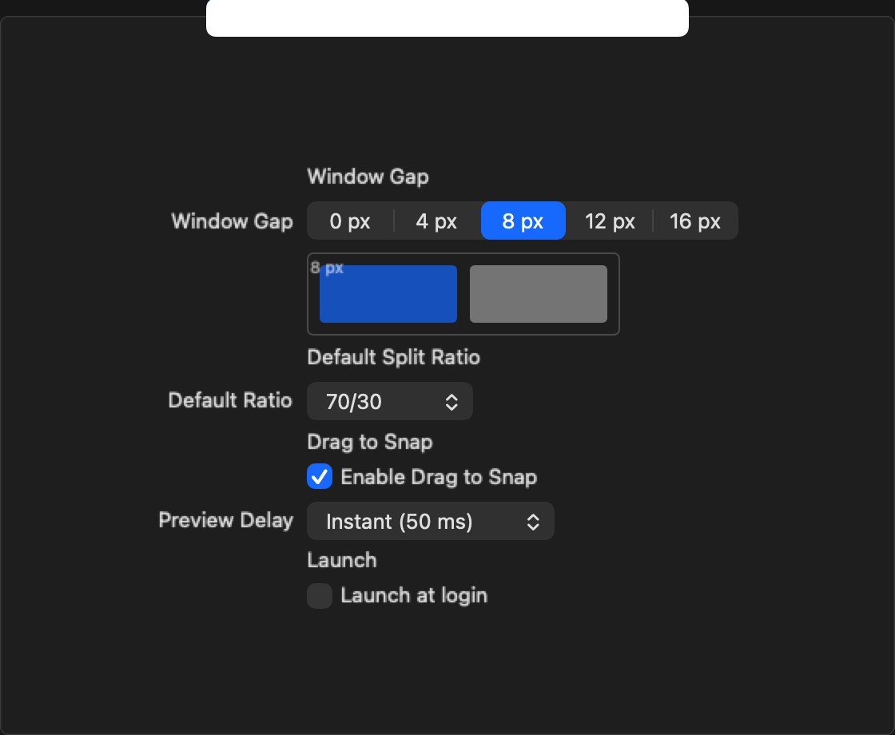
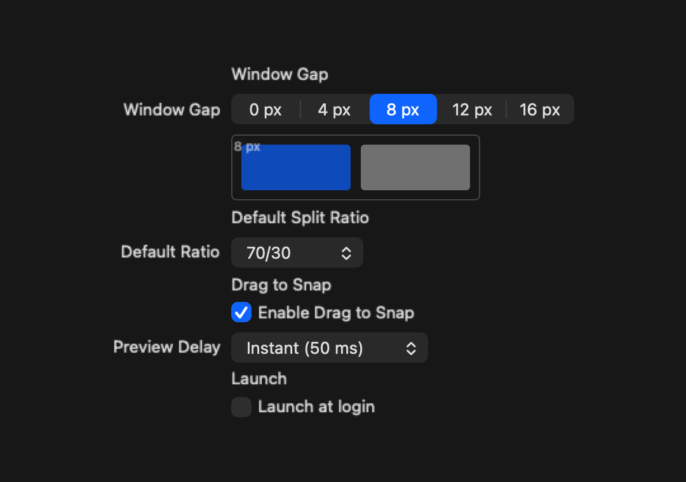
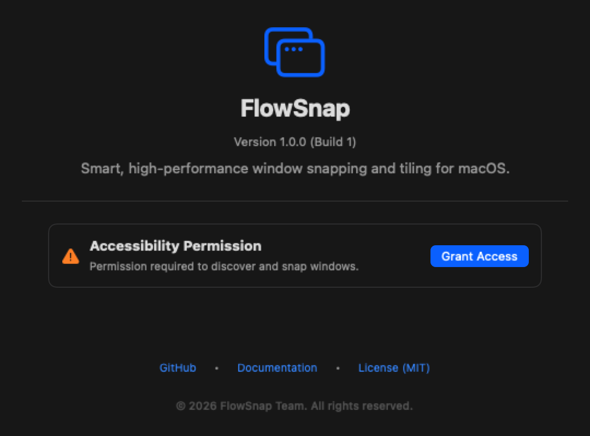

# User Guide: Settings & Shortcut Customization

FlowSnap features a clean, macOS-native Settings window designed with SwiftUI. This guide walks through configuring general settings, customizing keyboard shortcuts, adjusting drag-to-snap sensitivity, and managing per-application rules.

---

## 1. Opening Settings

You can access the Settings window at any time by:
1. Clicking the FlowSnap menu bar icon and selecting **Settings...**
2. Pressing the standard macOS preferences shortcut: `⌘,` while FlowSnap is focused.

---

## 2. General Preferences

The **General** tab lets you configure core window tiling and interaction parameters:

- **Window Gap**: Choose between `0 px` (flush snapping), `4 px` (compact default), `8 px` (standard balance), `12 px`, or `16 px` (spacious tiling). The visual box preview updates in real time to show padding geometry.
- **Default Split Ratio**: Set your preferred default partition for two-window splits (`50/50`, `60/40`, `70/30`, `80/20`, or `25/50/25` 3-column layout).
- **Drag to Snap**: Toggle edge-dragging window previews on or off, and adjust the preview activation delay (`Instant (50 ms)`, `Normal (150 ms)`, or `Relaxed (300 ms)`).
- **Launch at Login**: Enable or disable automatic launch on macOS system startup.

---

## 3. Customizing Keyboard Shortcuts

The **Shortcuts** tab provides complete freedom to bind window actions to your preferred key combinations:

### How to Record a New Shortcut
1. Click the shortcut button next to any action (e.g., **Left Half**).
2. The button will highlight with an active indicator displaying `"Type keys..."`.
3. Press your combination (e.g. `⌃⌥←` or `⌘⌥←`).
4. The shortcut is recorded immediately and begins intercepting system-wide hotkeys without restarting the app.

### Conflict Detection & Safety
- **Conflict Warning**: If a newly pressed combination is already assigned to another action, an orange warning icon (`⚠️`) appears next to the field with a tooltip explaining the conflict.
- **Cancel Recording**: Press `⎋` (Escape) to cancel recording and revert to the previous shortcut.
- **Clear / Unassign**: Press `⌫` (Delete/Backspace) or click the clear (`✕`) button to leave an action unassigned.
- **Restore Defaults**: Click **Restore Defaults** in the lower-right corner to reset all actions to default factory presets.

---

## 4. Application Rules

The **App Rules** tab allows defining custom behavior for individual applications (e.g. floating calculators, fixed-size utility windows, or video players):

---

## 5. About & Permissions

The **About** tab provides version details, documentation links, and real-time accessibility permissions status:

If Accessibility permissions are missing, click **Grant Access** to immediately open macOS System Settings and enable FlowSnap.
