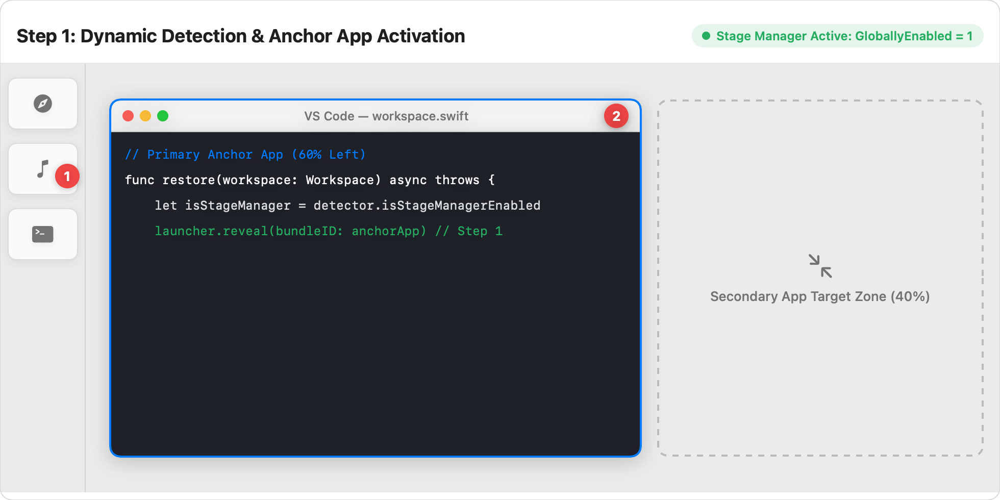
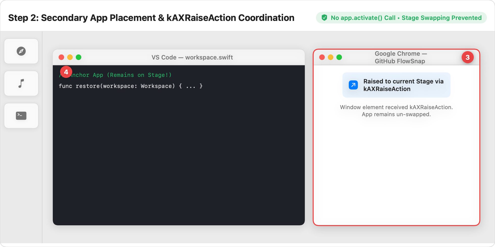
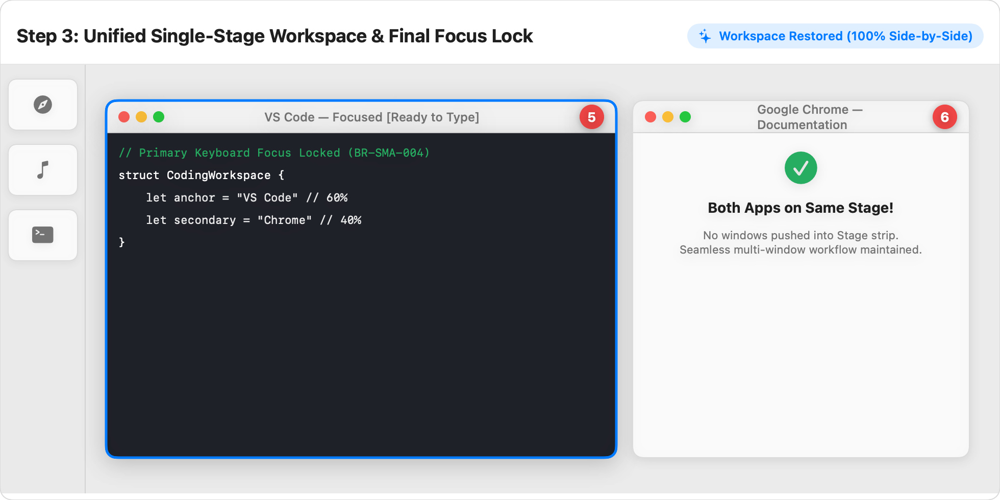

# 📖 User Guide: Stage Manager Multi-Window Auto-Grouping (US-WORK-017)

> **Target Audience:** FlowSnap Mac Users working with macOS Stage Manager, Multi-Window Workspaces, and Multi-App Workflows (e.g. Coding, Research, Writing)  
> **Applies to:** FlowSnap 1.0+ (macOS 13 Ventura, macOS 14 Sonoma & macOS 15 Sequoia)  
> **Last Updated:** September 3, 2026  
> **Feature Status:** Built-in & Fully Automated

---

## 🎯 1. Overview (in Plain English)

macOS **Stage Manager** organises open apps into distinct groups ("Stages") and keeps inactive stages in a visual strip along the left side of your screen:

- **The Problem:** By default, whenever you activate an app (`app.activate()`), macOS automatically brings that app forward into a _new_ Stage, kicking your previously open apps off the center screen and into the left sidebar strip. In earlier tools and previous versions of FlowSnap, restoring a multi-window workspace (such as VS Code 60% + Chrome 40%) would cause Chrome to kick VS Code off the stage. At the end of the restore, only Chrome would be left on your screen!
- **The FlowSnap Solution:** FlowSnap features **Smart Stage Coordination**. FlowSnap automatically checks whether Stage Manager is switched on in real-time. When it is, FlowSnap designates your primary app as the **Anchor App**, and then smoothly brings companion windows onto the _same Stage_ using macOS Accessibility (`kAXRaiseAction`) **without triggering macOS stage swapping**. Both apps remain visible side-by-side on your central stage, ready for focused work.

```
┌──────────────────────────────────────────────────────────────────────────┐
│              FLOWSNAP SMART STAGE COORDINATION ARCHITECTURE              │
├─────────────────────────────────────┬────────────────────────────────────┤
│ 🔍 Dynamic Stage Manager Detection  │ ⚓ Anchor-App Activation (Step 1)   │
│ • Reads com.apple.WindowManager     │ • Activates primary app on stage   │
│   GloballyEnabled directly (< 1ms)  │   (e.g., Code Editor at 60%)       │
├─────────────────────────────────────┼────────────────────────────────────┤
│ 🛡️ Secondary App kAXRaiseAction     │ 🔒 Primary Focus Lock (Step 3)     │
│ • Unhides and raises secondary app  │ • Re-raises anchor primary window  │
│ • Zero stage swapping / no ejection │ • Immediate keyboard input ready   │
└─────────────────────────────────────┴────────────────────────────────────┘
```

---

## 🚀 2. Step-by-Step Visual Walkthrough

### Step 1: Dynamic Detection & Anchor App Activation

When you trigger a workspace restore (from the Menu Bar or via hotkey), FlowSnap checks macOS system preferences in sub-millisecond time.



1. **① Stage Manager Sidebar Strip**: macOS keeps inactive apps in the left strip. FlowSnap detects that Stage Manager is active (`GloballyEnabled = 1`).
2. **② Anchor App Activation (`launcher.reveal`)**:
   - The first placement in the workspace (e.g. VS Code, 60% Left) is designated as the **Anchor App**.
   - FlowSnap moves the window to its 60% zone and activates the app process, anchoring the central Stage.
   - The right side (40%) is reserved for the companion secondary application.

---

### Step 2: Secondary App Placement & `kAXRaiseAction` Coordination

FlowSnap positions the secondary app (e.g., Google Chrome, 40% Right) without disrupting the Anchor App.



1. **③ Secondary App Window (`kAXRaiseAction`)**:
   - FlowSnap moves the secondary window into its target frame (Right 40%).
   - If the app was hidden (`⌘H`), FlowSnap sends `unhide()` without switching stages.
   - FlowSnap then triggers `kAXRaiseAction` directly on the window’s accessibility element.
2. **④ Stage Swapping Prevented**:
   - **Crucial Invariant:** FlowSnap strictly **does not call `app.activate()`** on secondary apps.
   - This prevents macOS WindowServer from ejecting VS Code to the left thumbnail strip. Both apps remain visible together.

---

### Step 3: Unified Single-Stage Workspace & Final Focus Lock

Both windows now co-exist seamlessly on a single Stage.



1. **⑤ Primary Keyboard Focus Locked (`BR-SMA-004`)**:
   - After all secondary windows have been positioned and raised, FlowSnap sends a final `raise` action to the primary window of the Anchor App.
   - Keyboard focus is immediately restored to your main tool (e.g. VS Code), allowing you to begin typing without touching the mouse.
2. **⑥ Side-by-Side Co-existence**:
   - Both applications live on the current Stage in the exact requested ratio (e.g., 60/40 or 50/50).
   - No apps were exiled to the sidebar strip.

---

## 💡 3. Common Workflows & Practical Tips

### Workflow A: One-Tap Restore of a Coding Workspace

1. Open FlowSnap Menu Bar icon or press your configured workspace shortcut.
2. Select **Restore "Coding"** (VS Code + Chrome + Terminal).
3. FlowSnap launches any closed apps, detects Stage Manager, and stages all three windows on your central display simultaneously.
4. Keyboard cursor is immediately placed inside VS Code.

### Workflow B: Toggling Stage Manager On and Off

- You do not need to restart FlowSnap when enabling or disabling Stage Manager in macOS Control Center.
- FlowSnap checks `GloballyEnabled` dynamically on **every restore pass**:
  - **Stage Manager ON:** Uses Smart Stage Coordination (`kAXRaiseAction`).
  - **Stage Manager OFF:** Uses standard sequential reveal for maximum compatibility.

---

## ❓ 4. Frequently Asked Questions (FAQ)

### Q1: Does FlowSnap use any private macOS APIs or hacks?

**No.** FlowSnap is built strictly adhering to Apple’s official Accessibility (`AXUIElement`) and CoreGraphics APIs. It reads preferences via public `CFPreferences` and raises windows via standard `kAXRaiseAction`.

### Q2: Why did my secondary window stay in the background in other window managers?

Most macOS window managers call `NSRunningApplication.activate(options: [.activateAllWindows])` when positioning an application. In Stage Manager, macOS interprets this as an instruction to create a new stage, which hides all other running apps. FlowSnap’s Smart Stage Coordination solves this root cause.

### Q3: What happens if an app is minimized or hidden?

FlowSnap detects hidden apps and calls `unhide` before raising the window, smoothly placing it onto your stage without popping up unexpected alerts.

---

## 🔗 5. Related Documentation

- [Universal Fullscreen Escape Guide](universal-fullscreen-escape.md)
- [Workspace Snapshot & Intent Restoration Guide](workspace-snapshot-restoration.md)
- [Window Groups & Workflow Presets Guide](window-groups-presets.md)
- [Technical Architecture: ADR-0013](../../adr/0013-stage-manager-auto-grouping.md)
