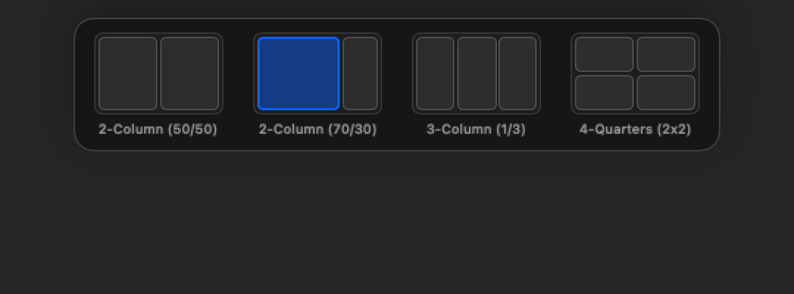
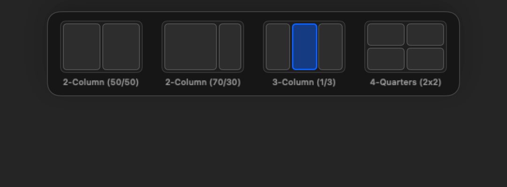

# User Guide: Top-Edge Snap Layout Picker (US-SNAP-007)

Welcome to the **FlowSnap Top-Edge Snap Layout Picker Guide**! This guide details how to trigger and use the Windows 11-style interactive top-edge layout picker flyout to partition windows into complex multi-column and asymmetrical arrangements effortlessly.

---

## 1. Overview & Top-Edge Trigger

FlowSnap provides a Windows 11-style Layout Picker flyout when dragging windows to the top-center of any connected monitor:

- **Trigger Zone**: Drag any window title bar to the top-center 40% region ($0.3 \times W \le x \le 0.7 \times W$, $y \le 24\text{px}$) of the screen.
- **Flyout Palette**: A sleek, non-activating Liquid Glass palette smoothly slides down from the top edge with 4 standard layout templates:

---

## 2. Interactive Layout Templates & Slot Hover

The Layout Picker contains 4 curated layout arrangements:

### 2.1 2-Column Equal Split (50 / 50)

- **Left Slot**: Snaps window to the left 50% half.
- **Right Slot**: Snaps window to the right 50% half.

---

### 2.2 2-Column Asymmetrical Split (70 / 30)

Ideal for primary focus workflows (e.g. Code editor on the left with terminal/documentation on the right).

- **Left Slot (70%)**: Snaps window to 70% width on the left.
- **Right Slot (30%)**: Snaps window to 30% width on the right.

---

### 2.3 3-Column Equal Split (1/3 Each)

Ideal for ultrawide displays and 3-window workflows.

- **Left Slot**: Left 33.3% column.
- **Center Slot**: Center 33.4% column.
- **Right Slot**: Right 33.3% column.

---

### 2.4 4-Quarters (2x2 Grid)

- **Top-Left / Top-Right**: 25% quadrant partitions on top.
- **Bottom-Left / Bottom-Right**: 25% quadrant partitions on bottom.

---

## 3. How to Use

1. **Summon the Picker**: Click and drag any window to the top-center edge of your screen. The layout palette will immediately fly out.
2. **Select a Slot**: Move your mouse cursor into any slot inside one of the 4 layout cards.
3. **Inspect the HUD Preview**: As your cursor hovers over a slot, FlowSnap highlights the exact target frame on your display with the translucent HUD overlay.
4. **Release to Snap**: Release your mouse button (`leftMouseUp`). The window instantly snaps to that slot's target frame, and the palette gracefully dismisses.

---

## 4. Cancelling or Reverting to Standard Snapping

- **Reverting to Edge Snapping**: If you drag out of the picker horizontally towards the corners or edges, the picker dismisses and standard edge/corner snapping resumes.
- **Cancelling the Snap**: Simply drag the cursor downwards ($> 24\text{px}$ below the picker) into the center of the display to dismiss both the picker and preview overlay.
