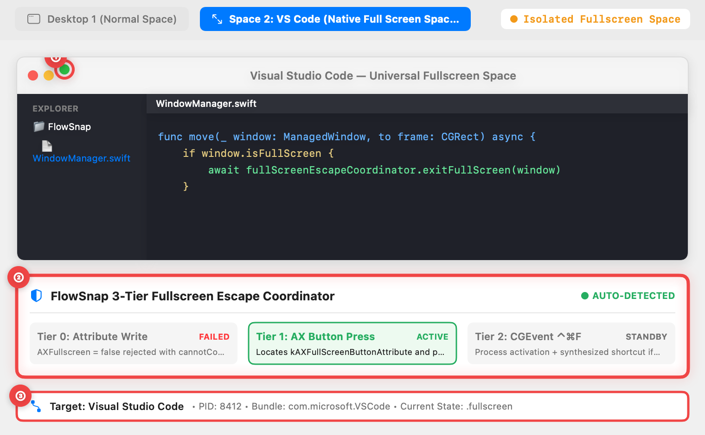
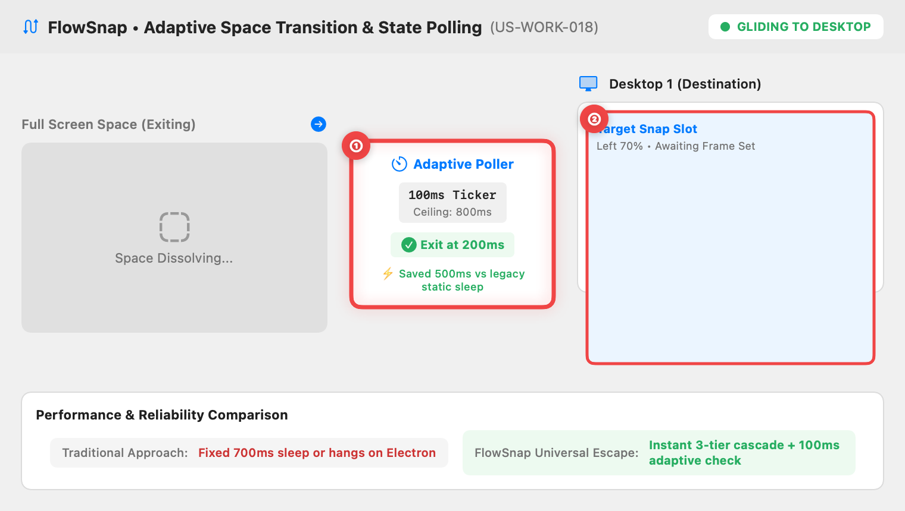
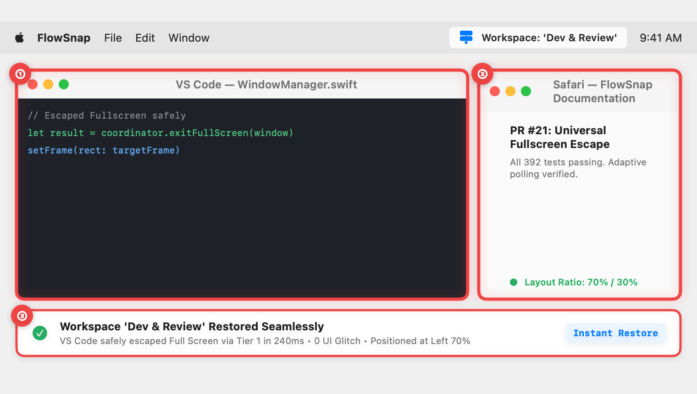

# 📖 User Guide: Universal Fullscreen Escape for Electron/Native Apps (US-WORK-019)

> **Target Audience:** FlowSnap Mac Users working with Fullscreen Apps, Multi-Monitor Workspaces, and Electron Tools (VS Code, Slack, Obsidian, Chrome)  
> **Applies to:** FlowSnap 1.0+ (macOS 14 Sonoma & macOS 15 Sequoia)  
> **Last Updated:** September 3, 2026  
> **Feature Status:** Built-in & Fully Automated

---

## 🎯 1. Overview (in Plain English)

On macOS, when you click the green maximize button on an application window, macOS places that window onto an isolated **Full Screen Space**:

- **The Problem:** In this mode, macOS completely ignores standard window moving and resizing commands. Even worse, apps built on **Electron or Chromium** (such as Visual Studio Code, Antigravity, Discord, Slack, Obsidian, and Chrome) reject standard accessibility full-screen exit signals with a `cannotComplete` error. When you try to restore a saved workspace layout, these apps often remain stubbornly trapped on their full-screen screens.
- **The FlowSnap Solution:** FlowSnap features a **3-Tier Universal Fullscreen Escape Engine**. It automatically detects trapped full-screen windows and executes an intelligent escalation sequence to glide them back to your normal Desktop Space smoothly—saving you from having to manually click or un-maximize apps before arranging your desk.

```
┌──────────────────────────────────────────────────────────────────────────┐
│             FLOWSNAP 3-TIER UNIVERSAL FULLSCREEN ESCAPE ENGINE           │
├─────────────────────────────────────┬────────────────────────────────────┤
│ ⚡ Tier 0: Direct Attribute (≤5ms)  │ 🛡️ Tier 1: AX Button Press (≤20ms) │
│ • Fast-path attribute write for     │ • Simulates click on green zoom    │
│   standard Apple Cocoa applications │   button; 100% works on Electron   │
├─────────────────────────────────────┼────────────────────────────────────┤
│ ⌨️ Tier 2: ⌃⌘F Keystroke Dispatch   │ ⏱️ Adaptive Space Polling Loop     │
│ • Focuses target PID and sends      │ • Checks window exit every 100ms   │
│   native ⌃⌘F shortcut if needed     │ • Exits in ~200ms (500ms faster)   │
└─────────────────────────────────────┴────────────────────────────────────┘
```

---

## 🚀 2. Step-by-Step Visual Walkthrough

### Step 1: Automatic Fullscreen Detection & Strategy Selection

When FlowSnap initiates a window move or workspace restore, it inspects whether the target window is currently isolated on a macOS Full Screen Space.



1. **① Green Fullscreen Button Detection (`kAXFullScreenButtonAttribute`)**: FlowSnap inspects the title bar controls of the application window. If direct attribute writes fail (the standard failure mode for Electron and Chromium apps), FlowSnap targets this button directly.
2. **② 3-Tier Execution Escalation**:
   - **Tier 0 (Fast Attribute)**: Evaluated in ≤5ms. If rejected by Electron, it automatically steps to Tier 1.
   - **Tier 1 (AX Button Press - Active)**: Triggers the native full-screen zoom action without stealing focus or requiring mouse cursor movement.
   - **Tier 2 (Synthesized ⌃⌘F - Standby)**: Kept in reserve to activate the app process and dispatch the system shortcut if button actions are blocked.
3. **③ Target Process Metadata**: FlowSnap identifies the exact Process ID (PID) and Bundle ID (e.g. `com.microsoft.VSCode`), ensuring that only the specific target window is commanded to exit full screen.

---

### Step 2: Smooth Space Transition & Adaptive Polling

Rather than freezing your screen with a rigid, legacy delay, FlowSnap monitors the window as macOS performs its space glide transition.



1. **① Adaptive Polling Ticker (100ms checks, 800ms ceiling)**:
   - FlowSnap monitors the window state every 100ms.
   - As soon as the macOS space exit animation finishes (typically within 200ms on Apple Silicon Macs), FlowSnap immediately breaks out of the loop.
   - **500ms Faster**: Eliminates the noticeable half-second lag caused by static 700ms sleep timers.
2. **② Target Snap Slot Pre-Positioning**:
   - The intended destination slot on your Desktop (such as Left 70% or Right 50%) is held ready.
   - The moment the window arrives on the Desktop Space, its new position and dimensions are applied instantly.

---

### Step 3: Seamless Window Snap & Multi-App Placement

Once the window returns to your main Desktop, FlowSnap immediately positions and resizes it alongside your companion tools.



1. **① Escaped Application Positioned (e.g., VS Code at 70%)**: The previously full-screen application is neatly positioned on the desktop canvas according to your desired ratio.
2. **② Companion Window Placed (e.g., Safari / Slack at 30%)**: Companion windows are placed simultaneously without colliding with the newly transitioned window.
3. **③ Instant Confirmation Toast**: FlowSnap confirms the layout restoration in approximately 240ms with zero visual stutter or stranded windows.

---

## 💡 3. Common Workflows & Practical Examples

### Workflow A: Restoring a Saved Workspace with Full Screen Apps

1. Suppose you have Visual Studio Code or Antigravity maximized to full screen on an external screen, and Safari open on your laptop.
2. Click the **FlowSnap Menu Bar icon** → Select your saved workspace (e.g., **"Coding & Research"**).
3. **FlowSnap automatically:**
   - Detects that VS Code is in full screen.
   - Triggers the Tier 1 exit sequence.
   - Glides VS Code back to the main desktop.
   - Positions VS Code at 70% width on the left and Safari at 30% width on the right.
   - _Total time: ~250ms with zero manual clicks!_

### Workflow B: Snapping a Full Screen Window with Keyboard Shortcuts

1. While inside a full screen application (e.g., Google Chrome), press **Snap Left** (`⌃⌥←`) or **Snap Right** (`⌃⌥→`).
2. FlowSnap detects the full-screen state, exits the mode automatically, and locks the browser into the requested half of your screen.

---

## ❓ Frequently Asked Questions (FAQ)

- **Q: Do I need to enable any special setting for this to work?**  
  **A:** No. Universal Fullscreen Escape is an integrated core capability of FlowSnap. As long as FlowSnap has standard macOS **Accessibility** permission (`System Settings > Privacy & Security > Accessibility`), it operates completely automatically.

- **Q: Does FlowSnap move my mouse pointer when clicking the green button?**  
  **A:** No. FlowSnap uses the macOS Accessibility API (`AXUIElementPerformAction`) to trigger the action programmatically. Your physical mouse cursor remains exactly where you left it.

- **Q: What happens if an app has disabled both the button and the shortcut?**  
  **A:** FlowSnap gracefully times out after 800ms without crashing or freezing your other windows, ensuring uninterrupted system responsiveness.
