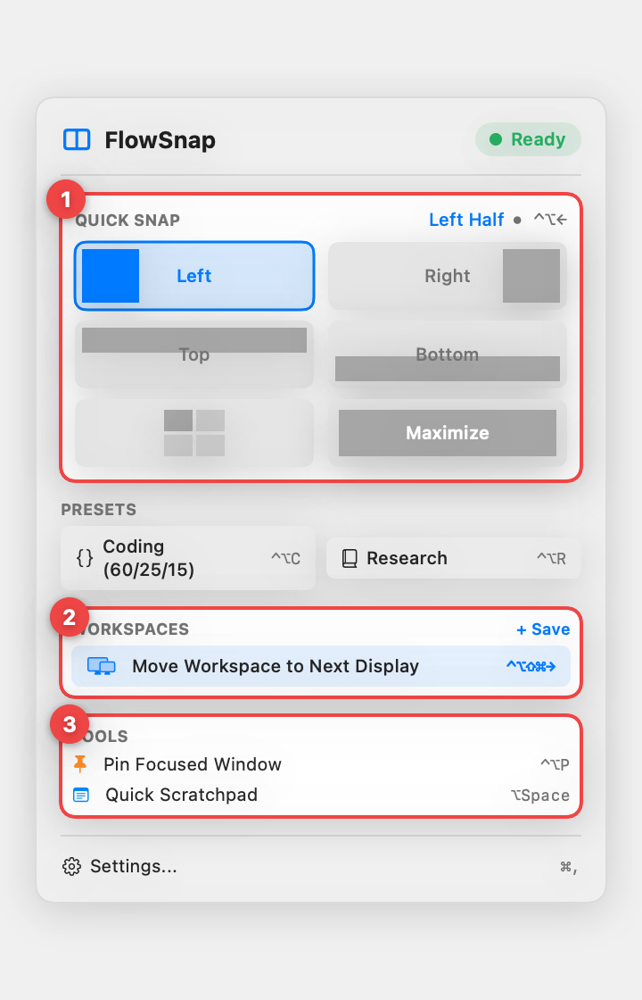
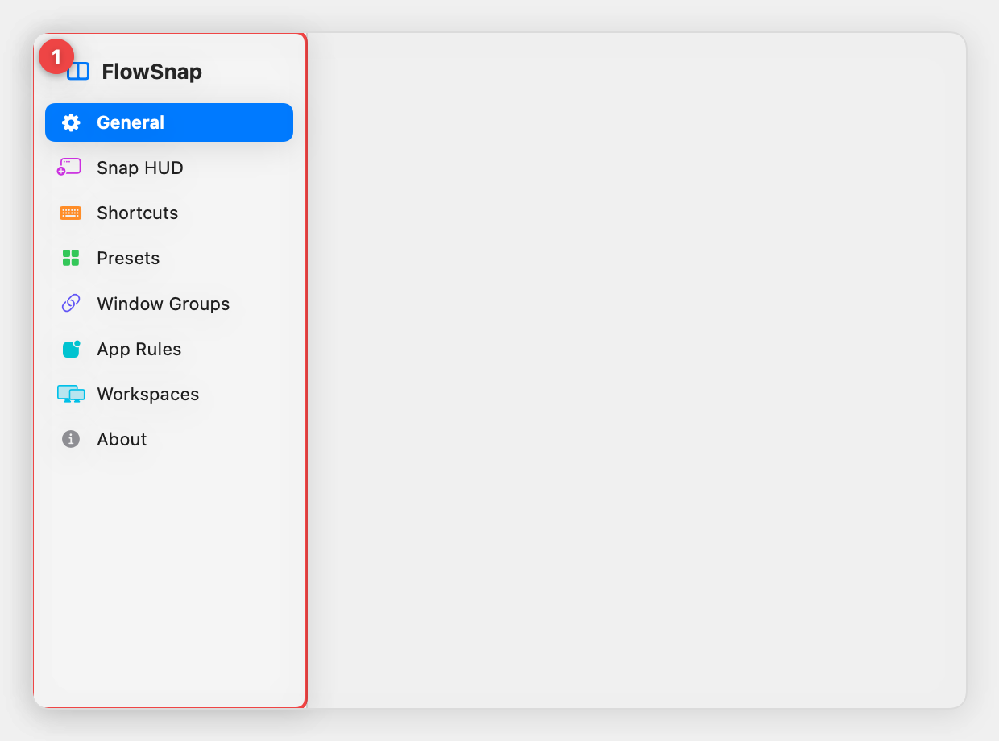
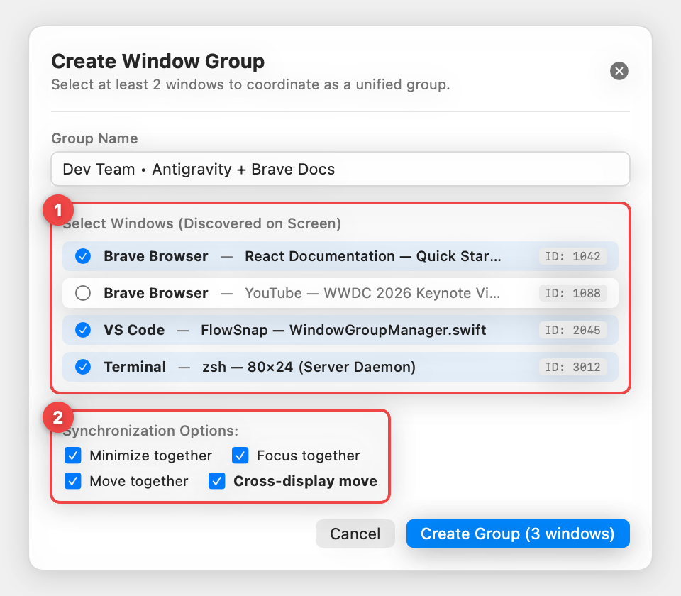
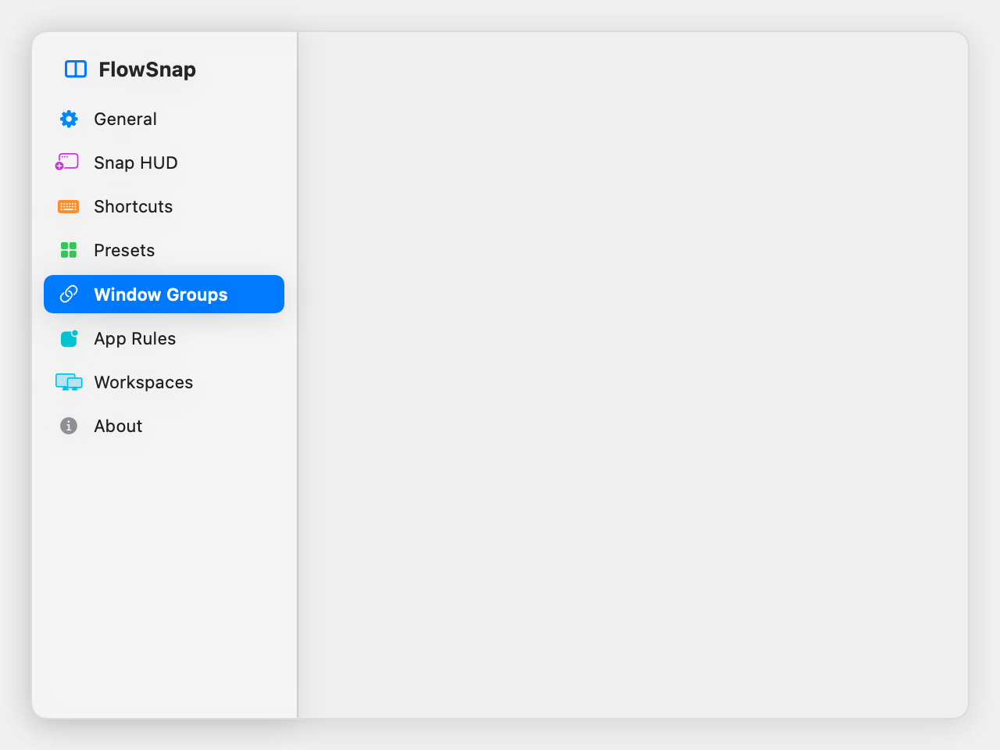
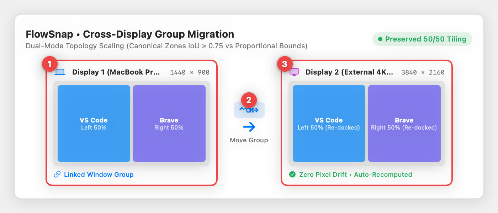

# FlowSnap — Hướng dẫn Sử dụng: Menu Trực Quan & Cài Đặt Hiện Đại

> **Tài liệu hướng dẫn người dùng cuối (User Guide)**  
> **Phiên bản:** FlowSnap 1.1.0+  
> **Áp dụng cho:** macOS 14 Sonoma & macOS 15 Sequoia  
> **Cập nhật:** Tháng 9, 2026

---

## 1. Giới thiệu tổng quan

Bản cập nhật FlowSnap mang đến một bước nhảy vọt về trải nghiệm người dùng với ngôn ngữ thiết kế hiện đại, trực quan hóa toàn diện và bổ sung các tính năng mạnh mẽ cho người dùng đa nhiệm trên máy Mac:

1. **Lưới Thao Tác Trực Quan (Visual Snap Grid)** trên Menu Bar: Thay thế danh sách menu phẳng cũ bằng bảng điều khiển dạng hình khối trực quan, hỗ trợ snap 1-chạm cực nhanh và tự động đóng menu để bạn tiếp tục công việc.
2. **Cửa Sổ Cài Đặt Hiện Đại (NavigationSplitView)**: Giao diện 2 cột chuẩn macOS Sequoia với thanh bên Sidebar trực quan, nội dung chia theo các thẻ bo góc (Grouped Cards) tinh tế, khắc phục hoàn toàn hiện tượng tràn viền.
3. **Quản Lý Nhóm Cửa Sổ Nâng Cao (Window Groups)**:
   - **Phân biệt nhiều cửa sổ cùng ứng dụng**: Dễ dàng nhận diện và chọn chính xác từng cửa sổ của Brave, VS Code, Finder hay Antigravity thông qua Tiêu đề cửa sổ (Window Title) và Window ID.
   - **Dịch chuyển toàn bộ nhóm qua lại giữa các màn hình (Cross-Display Group Migration)**: Bổ sung tùy chọn `Cross-display move`, phím tắt toàn cục `⌃⌥⌘→` / `⌃⌥⌘←` và nút bấm nhanh "Next Display" trên thẻ nhóm.
   - **Cơ chế Dual-Mode Scaling**: Giữ nguyên tỷ lệ phân chia 50/50, 70/30 khi chuyển đổi giữa màn hình MacBook (16:10) và màn hình rời (16:9 hoặc Ultrawide).
4. **Thiết Lập Không Gian Làm Việc (Workspaces Restore)**: Kế thừa giao diện chọn cửa sổ theo tiêu đề trực quan, hỗ trợ lưu và phục hồi không gian làm việc nhiều cửa sổ chính xác tuyệt đối.

---

## 2. Menu Bar Mới — Lưới Thao Tác Trực Quan (Visual Snap Grid)

Nhấp vào biểu tượng FlowSnap (`◫`) trên thanh menu macOS để mở bảng điều khiển nhanh:

- **① Lưới Quick Snap hình khối**: Các ô mô phỏng trực tiếp vị trí chia cửa sổ trên màn hình (Nửa trái, Nửa phải, Nửa trên, Nửa dưới, 4 góc, Toàn màn hình/Khôi phục). Thao tác 1-chạm lập tức căn chỉnh cửa sổ và **tự động đóng menu** để bạn không bị gián đoạn luồng làm việc.
- **② Phím tắt chuyển Workspace đa màn hình**: Nhấp vào nút `Move Workspace to Next Display` hoặc bấm phím tắt `⌃⌥⇧⌘→` để quăng toàn bộ workspace sang màn hình bên cạnh.
- **③ Bộ công cụ tiện ích**: Ghim cửa sổ nổi trên cùng (`Pin Focused Window • ⌃⌥P`) và bật bảng ghi chú nhanh (`Quick Scratchpad • ⌥Space`).

---

## 3. Cửa Sổ Cài Đặt Hiện Đại (Modern Settings Window)

Để mở Cài đặt, nhấn phím tắt **`⌘,`** hoặc chọn **Settings...** từ Menu Bar.

Giao diện mới sử dụng cấu trúc **NavigationSplitView** chuẩn macOS:

- **① Sidebar điều hướng 2 cột chuẩn macOS**: Nhóm các danh mục tính năng rõ ràng với biểu tượng màu sắc trực quan (General, Snap HUD, Shortcuts, Presets, Window Groups, App Rules, Workspaces, About).
- **② Khoảng cách cửa sổ (Window Gaps)**: Tùy chỉnh khoảng cách viền từ 0px đến 16px kèm khung mô phỏng trực quan hai cửa sổ 50/50 theo thời gian thực.
- **③ Cấu hình tỷ lệ & Hệ thống**: Lựa chọn tỷ lệ chia mặc định (50/50, 60/40, 70/30), gạt tắt/bật tích hợp cùng macOS Stage Manager và khởi động cùng máy.

---

## 4. Hướng Dẫn Chuyên Sâu: Window Groups (Nhóm Cửa Sổ)

Tính năng **Window Groups** liên kết các cửa sổ làm việc có liên quan với nhau thành một đơn vị duy nhất (ví dụ: 1 cửa sổ Code Editor + 1 cửa sổ Terminal + 1 cửa sổ Browser).

### 4.1. Cách Phân Biệt và Chọn Nhiều Cửa Sổ Của Cùng Một Ứng Dụng

**Vấn đề thường gặp trước đây:** Khi bạn mở 2 cửa sổ Brave (1 cửa sổ xem Youtube tài liệu, 1 cửa sổ đọc báo) hoặc 2 cửa sổ VS Code, danh sách chỉ hiển thị chung tên "Brave" hoặc "Code", khiến bạn không biết cửa sổ nào là cửa sổ cần gộp nhóm.

**Giải pháp trong FlowSnap mới:**

1. Mở **Settings (`⌘,`)** $\to$ chọn tab **Window Groups**.
2. Nhấn nút **`+ New Group`** (hoặc `+ Create Window Group...`).
3. Trong bảng chọn cửa sổ:
   - **① Phân biệt tiêu đề cửa sổ chi tiết**: Hiển thị rõ tiêu đề từng tab (ví dụ: `React Documentation — Quick Start Guide` phân biệt hoàn toàn với `YouTube — WWDC 2026 Keynote Video`) kèm mã định danh `ID: 1042`.
   - **② Tùy chọn đồng bộ hóa**: Dễ dàng bật/tắt các hành vi đồng bộ hóa ngay từ lúc tạo nhóm (bao gồm `Minimize together`, `Focus together`, `Move together` và `Cross-display move`).
4. Bạn chỉ cần tích chọn đúng các cửa sổ bạn muốn gộp vào nhóm và đặt tên gợi nhớ (ví dụ: "Dev Team • Antigravity + Brave Docs").

---

### 4.2. Các Hành Vi Đồng Bộ Hóa Của Nhóm Cửa Sổ

Mỗi nhóm cửa sổ cung cấp 4 tùy chọn đồng bộ hóa linh hoạt:

| Tùy Chọn                    | Tên Tiếng Anh        | Hành Vi Chi Tiết                                                                                                                                                                                                             |
| :-------------------------- | :------------------- | :--------------------------------------------------------------------------------------------------------------------------------------------------------------------------------------------------------------------------- |
| **Thu nhỏ cùng nhau**       | `Minimize together`  | Bấm nút thu nhỏ (`—` hoặc `⌘M`) trên bất kỳ cửa sổ nào trong nhóm $\to$ tất cả các cửa sổ còn lại trong nhóm sẽ đồng loạt thu nhỏ xuống Dock. Khi bấm vào 1 cửa sổ dưới Dock hoặc `⌘Tab`, cả nhóm sẽ cùng xuất hiện trở lại. |
| **Focus cùng nhau**         | `Focus together`     | Khi bạn click vào một cửa sổ trong nhóm đang nằm dưới các ứng dụng khác, FlowSnap sẽ nâng tất cả các cửa sổ của nhóm lên bề mặt, đồng thời đưa cửa sổ bạn vừa click lên vị trí trên cùng (bảo toàn z-order).                 |
| **Dịch chuyển cùng nhau**   | `Move together`      | Khi kéo di chuyển một cửa sổ trong nhóm trên cùng một màn hình, các cửa sổ khác sẽ dịch chuyển theo khoảng cách tương ứng.                                                                                                   |
| **Dịch chuyển đa màn hình** | `Cross-display move` | **MỚI**: Cho phép đưa toàn bộ nhóm cửa sổ bay qua lại giữa màn hình Laptop và màn hình ngoài chỉ bằng một thao tác duy nhất.                                                                                                 |

---

### 4.3. Dịch Chuyển Nhóm Qua Lại Giữa Các Màn Hình (Cross-Display Throw)

Khi bạn sử dụng máy Mac kết nối với màn hình rời (External Monitor):

- **① Thẻ quản lý nhóm**: Liệt kê tên nhóm, số lượng cửa sổ (`3 windows`) và từng cửa sổ thành viên kèm Window ID.
- **② Nút thao tác nhanh `[→ Next Display]`**: Khi phát hiện có từ 2 màn hình trở lên, nhấp vào nút này trên thẻ nhóm để quăng toàn bộ nhóm sang màn hình kế tiếp chỉ với 1 click.
- **③ Tùy chọn `[✓] Cross-display move`**: Đánh dấu chọn tùy chọn này để khi bạn throw bất kỳ 1 cửa sổ thành viên nào, toàn bộ các cửa sổ còn lại sẽ tự động đi theo.

#### Các phương thức dịch chuyển nhóm:

#### Cách 1: Sử dụng phím tắt toàn cục chuyên dụng

- **`⌃⌥⌘→` (Control + Option + Command + Mũi tên phải)**: Quăng toàn bộ nhóm cửa sổ đang active sang màn hình kế tiếp.
- **`⌃⌥⌘←` (Control + Option + Command + Mũi tên trái)**: Quăng toàn bộ nhóm cửa sổ đang active sang màn hình trước đó.

#### Cách 2: Tự động di chuyển cả nhóm bằng phím tắt Snap cửa sổ thường

1. Trong **Settings > Window Groups**, đảm bảo đã tích chọn **`[✓] Cross-display move`** cho nhóm cửa sổ đó.
2. Khi đang làm việc ở bất kỳ cửa sổ nào trong nhóm, bạn chỉ cần bấm phím tắt quăng cửa sổ quen thuộc:
   - **`⌃⌥→`** (Throw to Next Display) hoặc **`⌃⌥←`** (Throw to Previous Display).
3. FlowSnap sẽ tự động nhận diện cửa sổ này thuộc một nhóm có bật `Cross-display move` và di chuyển **toàn bộ các cửa sổ thành viên** sang màn hình đích cùng lúc!

#### Cách 3: Thao tác 1-Click trên giao diện Cài đặt

- Nhấp trực tiếp vào nút **`[→ Next Display]`** (mục ② trên hình ảnh) ở góc phải thẻ nhóm.

---

### 4.4. Cơ Chế Thích Ứng Tỷ Lệ Thông Minh (Dual-Mode Scaling)

Khi chuyển một nhóm cửa sổ từ màn hình MacBook (tỷ lệ 16:10, độ phân giải Retina) sang màn hình rời (16:9, 4K hoặc Ultrawide):

- **① Bố cục ban đầu trên MacBook**: Hai cửa sổ VS Code và Brave Browser được chia đôi 50/50 trên màn hình 16:10 (1440×900).
- **② Lệnh quăng nhóm `⌃⌥⌘→`**: Kích hoạt dịch chuyển toàn bộ nhóm sang màn hình ngoài.
- **③ Khớp hoàn hảo trên màn hình 4K (3840×2160)**: Thuật toán nhận diện vùng canonical zone ($\text{IoU} \ge 0.75$) tự động dock lại cửa sổ nửa trái và nửa phải chính xác tuyệt đối theo không gian thực tế của màn hình 4K mà không bị méo, biến dạng hay lệch vị trí. Với các cửa sổ kích thước tự do, FlowSnap áp dụng `RelativeFrameScaler` để scale tỷ lệ bounding-box tương đối.

---

### 4.5. Cơ Chế Tự Động Giải Tán Nhóm (Self-Pruning)

- Bạn không cần lo lắng về việc quản lý rác bộ nhớ: Nếu bạn đóng một cửa sổ trong nhóm (`⌘W` hoặc tắt ứng dụng `⌘Q`), FlowSnap sẽ phát hiện ngay lập tức.
- Nếu số cửa sổ còn lại trong nhóm ít hơn 2 cửa sổ, nhóm sẽ **tự động giải tán** mà bạn không cần phải bấm xóa thủ công.
- Muốn chủ động giải tán nhóm bất cứ lúc nào? Nhấp nút **`[✕]`** (Ungroup) ở góc phải thẻ nhóm trong Settings.

---

## 5. Thiết Lập Không Gian Làm Việc (Workspaces)

Tab **Workspaces** trong Cài đặt và Menu Bar cho phép bạn lưu lại toàn bộ trạng thái bố trí cửa sổ trên tất cả các màn hình:

1. **Lưu Workspace Mới**:
   - Sắp xếp các cửa sổ trên màn hình theo ý bạn.
   - Mở Menu Bar $\to$ nhấp **`+ Save`** trong mục WORKSPACES, hoặc vào **Settings > Workspaces** bấm **`+ Capture Workspace`**.
   - Bảng chọn cửa sổ sẽ liệt kê danh sách chi tiết các cửa sổ đang mở kèm **Tên tiêu đề cửa sổ (Title)** và **Biểu tượng ứng dụng (Icon)**, giúp bạn dễ dàng loại trừ các cửa sổ không mong muốn (như cửa sổ chat tạm thời).
2. **Khôi Phục Workspace**:
   - Nhấp vào tên Workspace đã lưu trên Menu Bar hoặc gán phím tắt nhanh để toàn bộ các ứng dụng tự động mở lại và bay về đúng vị trí đã lưu.
3. **Di Chuyển Cả Workspace Sang Màn Hình Khác**:
   - Nhấn tổ hợp phím **`⌃⌥⇧⌘→`** hoặc chọn từ mục Workspaces trên Menu Bar để dịch chuyển toàn bộ các cửa sổ của workspace sang màn hình tiếp theo.

---

## 6. Giải Đáp Thắc Mắc & Xử Lý Tình Huống Thực Tế

### Câu hỏi 1: Tại sao sau khi chia màn hình (ví dụ 50/50), lần đầu click vào một cửa sổ thì cửa sổ đó lại bị phóng to toàn màn hình (Snap Full)?

**Nguyên nhân:**

1. **Double-click vào thanh tiêu đề của macOS**: Trong macOS, thao tác nhấn đúp (double-click) vào thanh tiêu đề của cửa sổ (Title Bar) mặc định sẽ kích hoạt lệnh phóng to (Zoom/Maximize) của hệ điều hành. Khi vừa chia đôi màn hình xong, nếu bạn nhấp đúp chuột vào thanh tiêu đề để chọn cửa sổ, macOS sẽ tự động bung cửa sổ ra toàn màn hình.
2. **Cơ chế khôi phục (Restore on Maximize)**: Nếu bạn sử dụng phím tắt hoặc thanh chọn tỷ lệ ở mép trên (Top-Edge Picker), hãy chú ý click vào phần nội dung làm việc của ứng dụng thay vì double-click vào thanh tiêu đề.

**Cách khắc phục:**

- Để kích hoạt cửa sổ, chỉ cần **click 1 lần đơn (single click)** vào bất kỳ vị trí nào trong nội dung cửa sổ.
- Nếu muốn vô hiệu hóa tính năng phóng to khi click đúp thanh tiêu đề của macOS: Vào **System Settings > Desktop & Dock** $\to$ tìm mục _Double-click a window's title bar to_ $\to$ chọn **Do nothing** hoặc **Minimize**.

---

### Câu hỏi 2: Tại sao 2 ứng dụng đã được gộp vào nhóm mà khi thu nhỏ (Minimize) chỉ có 1 ứng dụng thu nhỏ, các ứng dụng khác vẫn ở trên màn hình?

**Nguyên nhân & Cách kiểm tra:**

1. **Kiểm tra tùy chọn đồng bộ trong Settings**:
   - Mở **Settings (`⌘,`)** $\to$ chọn **Window Groups**.
   - Tìm đến nhóm của bạn và kiểm tra xem tùy chọn **`[✓] Minimize together`** đã được bật hay chưa. Nếu checkbox này chưa được đánh dấu, các cửa sổ trong nhóm sẽ hoạt động độc lập khi thu nhỏ.
2. **Tác động của Stage Manager (Quản lý màn hình)**:
   - Nếu bạn đang bật tính năng **Stage Manager** của macOS: macOS quản lý cửa sổ theo cụm thanh bên (strip). Để đạt trải nghiệm tốt nhất với FlowSnap Window Groups, FlowSnap đã tích hợp bộ điều phối tự động gom nhóm cho Stage Manager (có thể bật trong **Settings > General > Stage Manager Co-existence**).
3. **Quyền Trợ năng (Accessibility)**:
   - Nếu quyền Trợ năng bị gián đoạn, FlowSnap không thể gửi lệnh thu nhỏ cho các cửa sổ chạy ngầm. Hãy kiểm tra trạng thái xanh `● Ready` trên Menu Bar.

---

### Câu hỏi 3: Tôi mở 2 cửa sổ Brave (1 bên tài liệu, 1 bên video), làm sao để chắc chắn tôi nhóm đúng cửa sổ Brave tài liệu với VS Code?

**Cách làm:**

- Trong **Settings > Window Groups**, nhấp `+ Create Group`.
- FlowSnap liệt kê danh sách cửa sổ kèm tiêu đề trang web đang mở của từng cửa sổ Brave (ví dụ: `Swift Concurrency Guide - Brave` vs `YouTube - Brave`).
- Bạn chỉ cần tích chọn đúng ô có tiêu đề `Swift Concurrency Guide` và tích chọn `Visual Studio Code`. Nhóm được tạo sẽ liên kết chính xác 2 cửa sổ này.

---

## 7. Bảng Tổng Hợp Phím Tắt Tiện Ích

| Phím Tắt     | Tác Vụ                             | Mô Tả                                                       |
| :----------- | :--------------------------------- | :---------------------------------------------------------- |
| **`⌃⌥←`**    | Snap Nửa Trái                      | Căn cửa sổ sang nửa trái 50%                                |
| **`⌃⌥→`**    | Snap Nửa Phải                      | Căn cửa sổ sang nửa phải 50%                                |
| **`⌃⌥↑`**    | Maximize / Full                    | Phóng to cửa sổ chiếm trọn màn hình                         |
| **`⌃⌥↓`**    | Restore                            | Khôi phục cửa sổ về vị trí trước khi snap                   |
| **`⌃⌥⌘→`**   | **Move Group to Next Display**     | **Dịch chuyển toàn bộ Window Group sang màn hình kế tiếp**  |
| **`⌃⌥⌘←`**   | **Move Group to Previous Display** | **Dịch chuyển toàn bộ Window Group sang màn hình trước đó** |
| **`⌃⌥⇧⌘→`**  | Move Workspace to Next Display     | Dịch chuyển toàn bộ Workspace sang màn hình kế tiếp         |
| **`⌃⌥P`**    | Pin Window                         | Ghim cửa sổ nổi trên cùng (Always on Top)                   |
| **`⌥Space`** | Quick Scratchpad                   | Bật/tắt nhanh cửa sổ ghi chú tức thì                        |
| **`⌘,`**     | Settings                           | Mở bảng Cài đặt FlowSnap                                    |
