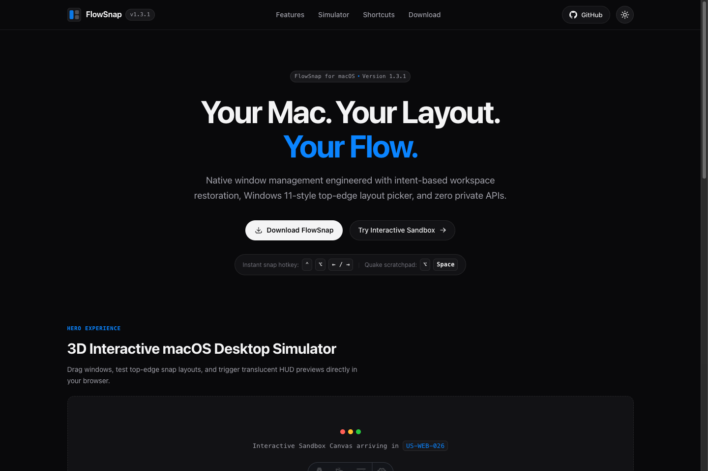
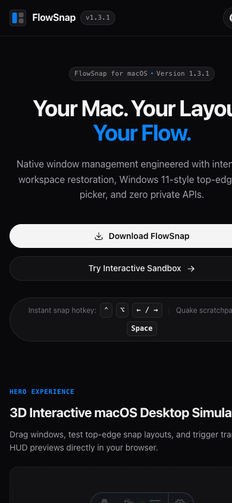

# FlowSnap Web Portal & Design System Guide (`web-baseline-layout`)

Welcome to the official web showcase and distribution portal for **FlowSnap**, the native macOS window manager designed for focus, intent, and snap precision.

---

## 1. Visual Design Philosophy & Apple HIG Harmony

The FlowSnap web portal is designed to mirror the native macOS experience directly inside your browser:

- **Obsidian Dark Mode by Default**: FlowSnap greets visitors with a deep obsidian dark theme (`#09090b`), reflecting the developer-first aesthetic of the native app.
- **1px Hairline Precision**: Borders and dividers use subtle, elegant hairlines (`rgba(255, 255, 255, 0.08)` in dark mode and `#e4e4e7` in light mode), avoiding heavy shadows or generic gradients.
- **Zero Latency Typography**: By utilizing Apple's system font hierarchy (`SF Pro Display`, `SF Pro Text`, `SF Mono`), the web page loads instantly with zero font jitter (Zero FOIT/FOUT).

_Figure 1: Desktop Landing Page Baseline displaying the macOS liquid glass header, brand badge, hero slogan, action pills, and section anchor layout in Obsidian Dark mode._

---

## 2. Interactive Theme Switching

FlowSnap includes a responsive theme toggle that adapts to your preferred working environment:

1. **Location**: Located at the top right of the sticky header.
2. **Behavior**:
   - In Dark mode, the button shows a **Sun icon**. Clicking it smoothly transitions the interface to Light mode.
   - In Light mode, the button shows a **Moon icon**. Clicking it reverts to Obsidian Dark mode.
3. **Zero FOUC (Flash of Unstyled Content)**: Your choice is automatically persisted to `localStorage` under `flowsnap-theme`. When you revisit or refresh, an inline script initializes your theme before the page paints, guaranteeing zero visual flicker.

---

## 3. Navigation & Section Anchors

The header is pinned to the top of the viewport (`position: sticky`) with a translucent liquid glass effect (`backdrop-filter: blur(20px)`):

- **Brand Logo & Version**: Shows the FlowSnap squircle icon and current release badge (`v1.3.1`).
- **Features (`#features`)**: Anchors to the forthcoming 6-pillar Bento Grid showcase (`US-WEB-027`).
- **Simulator (`#showcase`)**: Anchors to the interactive 3D macOS desktop simulator (`US-WEB-026`).
- **Shortcuts (`#shortcuts`)**: Anchors to the interactive shortcut matrix (`US-WEB-027`).
- **Download (`#download`)**: Anchors to the 1-click terminal installer and DMG hub (`US-WEB-028`).
- **GitHub Button**: Opens the official GitHub repository at `https://github.com/ahauy/FlowSnap`.

_Figure 2: Mobile responsive view (< 640px) demonstrating collapsed navigation text, centered touch actions, and zero horizontal overflow._

---

## 4. Open-Source Transparency & Manifesto

At the bottom of the page, the footer highlights:

- **MIT License**: FlowSnap is 100% open-source software.
- **Architectural Core**: Swift 6 Strict Concurrency, Zero Private APIs, and Apple HIG Compliance.
- **Author Attribution**: Created by `@ahauy` with links to documentation and release archives.
