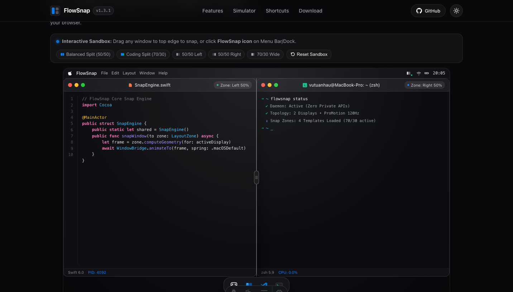
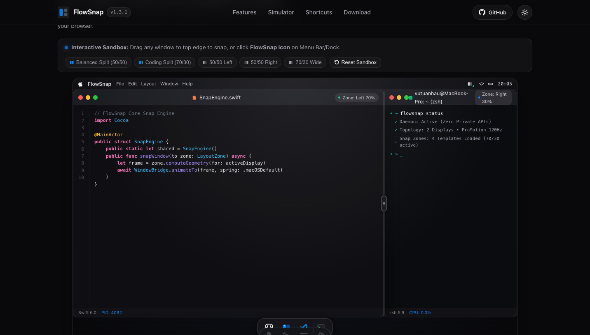

# FlowSnap 3D Desktop Simulator User Guide (`web-desktop-sandbox`)

Welcome to the **Interactive macOS Desktop Simulator** on the FlowSnap web portal (`#showcase`). This simulator provides visitors with a live, hands-on playground to test FlowSnap's core snap physics, top-edge layout picker, and snap zones directly in any web browser without needing to download or install the app first.

---

## 1. The Virtual macOS Environment

The simulator recreates a sleek, 16:10 Apple macOS desktop environment within your browser:

- **Hardware-Accelerated 3D Tilt**: Moving your cursor across the showcase area creates a subtle, tactile 3D perspective tilt (`rotateX`, `rotateY` clamped to `±4.5deg`), complemented by a shifting specular glare reflection across the bezel.
- **macOS Menu Bar**: Pinned to the top of the virtual display, featuring the Apple icon, FlowSnap title, navigation menus, active menu bar status item, and a simulated live clock.
- **Floating Dock**: Pinned to the bottom with an authentic liquid glass blur (`backdrop-filter: blur(20px)`), housing icons for Finder, FlowSnap, VS Code, and Terminal.

---

## 2. Multi-Window Workspace & Drag-to-Snap

Inside the virtual desktop, users can interact with **two concurrent mock windows**:

- **VS Code (`SnapEngine.swift`)**: Mini Code Editor with Swift 6 syntax highlighting.
- **macOS Terminal (`flowsnap-cli`)**: Terminal displaying live FlowSnap daemon status and zsh prompt.

1. **Freeform Dragging & Focus**:
   - Click and drag either window's dark title bar (`mock-titlebar`).
   - Clicking a window immediately focuses it and raises its `z-index` to the foreground.
   - The drag engine uses HTML5 Pointer Events with `setPointerCapture` to guarantee zero cursor slip even during rapid multi-directional mouse movement.
2. **Dock App Launching**:
   - Click the **VS Code** icon on the Dock to summon or focus the Code Editor.
   - Click the **Terminal** icon on the Dock to summon or focus the Terminal.
   - Click the **FlowSnap** icon to open the native Menu Bar popover.
3. **Traffic Lights**:
   - **Red Button**: Closes the window (re-openable via Dock).
   - **Yellow Button**: Minimizes the window to the Dock.
   - **Green Button**: Toggles between Maximize and restoring to floating state.
4. **Live Snap Badge**:
   - Indicates the active layout zone (e.g., `Zone: Free Float`, `Zone: Left 70%`, `Zone: Right 30%`).

---

## 3. FlowSnap Native Menu Bar Popover

Clicking the **FlowSnap status item** in the virtual Menu Bar (or the FlowSnap icon on the Dock) opens the native FlowSnap dropdown popover:

- **Visual Snap Grid**: Instant 1-click snap tiles (Left 1/2, Right 1/2, Left 70%, Right 30%, Center 50%, Maximize) targeting the currently active window.
- **Dual Window Presets**:
  - **Coding Workspace (`⌃⌥C`)**: Simultaneously snaps the Code Editor to Left 70% and Terminal to Right 30%!
  - **Balanced Side-by-Side (`⌃⌥R`)**: Snaps Code Editor to Left 50% and Terminal to Right 50%.
- Click anywhere outside the popover to dismiss it naturally.

---

## 4. Windows 11-Style Top-Edge Snap Picker

FlowSnap's signature feature is brought to life inside the browser:

1. **Triggering the Picker**:
   - Drag the mock window title bar toward the virtual top edge (within `32px` of the top menu bar).
   - A translucent flyout tray smoothly slides down from the top edge.
2. **Selecting a Layout Template**:
   - The picker provides 4 canonical FlowSnap layout templates:
     - **2 Columns (50 / 50)**: Standard split screen.
     - **2 Columns (70 / 30)**: Asymmetric focus layout with a wide main window and narrow sidebar.
     - **3 Columns (25 / 50 / 25)**: Center-stage layout ideal for ultra-wide displays.
     - **4 Quarters (25% each)**: 2x2 multi-tasking grid.
3. **Liquid Glass HUD Preview**:
   - Hover over any zone card inside the template tray.
   - A translucent liquid glass overlay with glowing blue border (`--accent-blue`) expands over the exact quadrant of the virtual desktop.
   - **Release to Snap**: Let go of your mouse button while hovering over a zone to snap the window into that quadrant instantly with an authentic spring animation (`cubic-bezier(0.16, 1, 0.3, 1)`).

---

## 4. Direct Edge Snapping

Just like native FlowSnap on macOS:

- Drag the mock window toward the **far left edge** (`<= 24px`) to trigger a 50% Left snap preview.
- Drag toward the **far right edge** (`<= 24px`) to trigger a 50% Right snap preview.
- Release the pointer to snap.

---

## 5. Interactive Adaptive Split Divider Bar (EPIC 08 Demo)

When both windows are tiled side-by-side (via **Balanced Split 50/50**, **Coding Split 70/30**, or dragging windows to opposite edges):

1. **Divider Bar Appearance**:
   - An interactive vertical divider bar with a rounded handle pill appears between the two windows.
   - Hovering over the divider highlights it in FlowSnap accent blue (`#0a84ff`) and changes the cursor to `col-resize`.
2. **Real-Time Dual Window Resizing**:
   - Click and drag the divider handle left or right.
   - Both windows resize inversely in real-time with zero lag (clamped between 20% and 80%).
   - The status badges update dynamically (e.g. `Zone: Left 62%`, `Zone: Right 38%`).
3. **Double-Click Reset**:
   - Double-clicking the divider handle smoothly resets both windows back to a balanced 50/50 split.

_Figure 1: Virtual macOS desktop showcasing dual-window split with the active interactive screen divider bar between VS Code and Terminal._

_Figure 2: Real-time inverse resizing demonstrating 70/30 split ratio with glowing FlowSnap blue divider handle and responsive window geometry._

---

## 6. Mobile & Touch Device Fallback

For visitors on smartphones or touch tablets where precision mouse dragging may be difficult:

- **Quick Snap Presets Toolbar**: Positioned conveniently above the simulator.
- Tap **Balanced Split (50/50)**, **Coding Split (70/30)**, **50/50 Left**, **50/50 Right**, or **70/30 Wide** to immediately snap windows with a single tap.
- Tap **Reset Sandbox** at any time to return to the neutral floating state.

---

## 7. Zero-CPU Idle Guarantee

FlowSnap's web simulator respects your system resources and battery life:

- When you scroll away from the `#showcase` section, an internal `IntersectionObserver` immediately suspends mouse tilt calculations, pointer listeners, and clock intervals.
- The component uses **0.0% CPU** while scrolled off-screen.
- Automatically disables 3D tilt if your operating system has "Reduce Motion" enabled.
