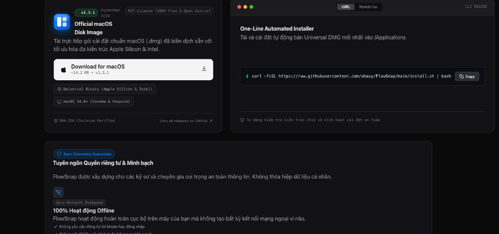

# User Guide: FlowSnap Distribution Hub, 1-Click Install & Privacy

## Giới thiệu Trung tâm Phân phối FlowSnap

Khu vực **Distribution Hub** (`#download`) trên trang chủ chính thức của FlowSnap cung cấp đầy đủ các phương thức cài đặt nhanh chóng, minh bạch và an toàn cho người dùng macOS.



---

## 1. Tải và cài đặt qua File DMG trực tiếp (Khuyên dùng cho người dùng phổ thông)

1. Cuộn đến khu vực **Get Started with FlowSnap** (`#download`) trên trang web.
2. Nhấp vào nút **Download for macOS**. Tệp `FlowSnap.dmg` phiên bản mới nhất sẽ tự động được tải về từ GitHub Releases.
3. Mở tệp `FlowSnap.dmg` đã tải và kéo biểu tượng **FlowSnap** vào thư mục **Applications**.
4. Mở FlowSnap từ **Spotlight** (`⌘Space`) hoặc **Launchpad**.

---

## 2. Cài đặt tự động bằng 1 dòng lệnh Terminal (Khuyên dùng cho Developers)

FlowSnap cung cấp khung Terminal One-Line Installer hỗ trợ 2 công cụ phổ biến:

### Cách 1: Sử dụng lệnh cURL (Mặc định)

1. Trong khung Terminal Installer, chọn tab **cURL**.
2. Nhấp nút **Copy** (hoặc chọn toàn bộ câu lệnh):
   ```bash
   curl -fsSL https://raw.githubusercontent.com/ahauy/FlowSnap/main/install.sh | bash
   ```
3. Mở ứng dụng Terminal trên máy Mac của bạn (`Terminal`, `iTerm2` hoặc `Ghostty`), dán lệnh và nhấn **Enter**.
4. Script cài đặt sẽ tự động tải phiên bản Universal mới nhất, mount disk image, sao chép `FlowSnap.app` vào `/Applications` và dọn dẹp bộ nhớ tạm.

### Cách 2: Sử dụng Homebrew Cask

1. Trong khung Terminal Installer, chuyển sang tab **Homebrew**.
2. Nhấp nút **Copy** để sao chép câu lệnh:
   ```bash
   brew install --cask ahauy/tap/flowsnap
   ```
3. Dán vào Terminal và nhấn **Enter**. Homebrew sẽ quản lý vòng đời và cập nhật phiên bản cho FlowSnap.

---

## 3. Khắc phục cảnh báo macOS Gatekeeper ("Unidentified Developer")

Vì FlowSnap là một dự án mã nguồn mở cộng đồng phi thương mại (không mua chứng chỉ lập trình viên Apple Developer trả phí), macOS Gatekeeper sẽ gắn cờ cách ly (`com.apple.quarantine`) trên tệp tải về từ Internet.

Để khắc phục trong 5 giây:

1. Nhấp mở khối **"Gặp cảnh báo 'Unidentified Developer' từ macOS Gatekeeper?"** ngay bên dưới mục tải app.
2. Nhấp nút **Copy** bên cạnh câu lệnh:
   ```bash
   xattr -cr /Applications/FlowSnap.app
   ```
3. Mở Terminal, dán câu lệnh và nhấn **Enter**.
4. Khởi chạy FlowSnap bình thường. Cảnh báo cách ly sẽ hoàn toàn biến mất.

---

## 4. Cam kết Quyền riêng tư & Bảo mật Tuyệt đối (Privacy Manifesto)

Khi cấp quyền Trợ năng (**Accessibility**) cho FlowSnap, bạn hoàn toàn an tâm với 3 nguyên tắc bảo mật không thể xâm phạm:

1. **100% Offline**: FlowSnap không bao giờ tạo kết nối mạng ra bên ngoài. Bạn có thể sử dụng trọn vẹn mọi tính năng ngay cả khi ngắt toàn bộ Internet.
2. **Zero Telemetry**: Tuyệt đối không tích hợp Google Analytics, Sentry hay bất kỳ SDK theo dõi hành vi người dùng nào.
3. **Chỉ sử dụng API Trợ Năng `AXUIElement`**: FlowSnap chỉ tương tác với các thuộc tính kích thước (`kAXSizeAttribute`) và vị trí (`kAXPositionAttribute`) của cửa sổ. **Tuyệt đối không bao giờ ghi nhận hay theo dõi nội dung gõ phím của người dùng (Zero Keylogging).**
4. **Mã nguồn mở minh bạch**: Toàn bộ mã nguồn được công khai tại [github.com/ahauy/FlowSnap](https://github.com/ahauy/FlowSnap) để bất kỳ ai trong cộng đồng đều có thể tự do kiểm toán.
