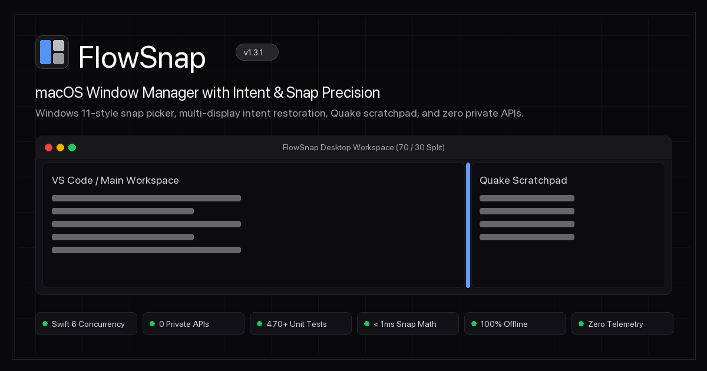

# User & Maintainer Guide: FlowSnap SEO, Social Sharing & Automated GitHub Pages CI/CD

## Giới thiệu về Tính năng SEO & Xuất bản Tự động

Tính năng **SEO, OpenGraph, JSON-LD Schema & Automated GitHub Pages CI/CD** (`US-WEB-029`) trang bị cho trang chủ FlowSnap khả năng xuất hiện tối ưu trên các công cụ tìm kiếm, thẻ xem trước mạng xã hội chuẩn mực độ phân giải cao và một quy trình tự động xuất bản (deploy) lên GitHub Pages mà không cần thao tác thủ công.

---



## 1. Chia sẻ Liên kết trên Mạng Xã Hội (Social Sharing)

Khi bạn dán liên kết `https://ahauy.github.io/FlowSnap` lên Twitter/X, Facebook, LinkedIn, Slack, Telegram, Discord hoặc iMessage:

1. Nền tảng sẽ tự động nhận diện thẻ `twitter:card = summary_large_image` và `og:image`.
2. Ảnh đại diện xã hội tĩnh độ phân giải cao (`og-preview.png`, kích thước chuẩn 1200x630 pixel) sẽ hiển thị nổi bật với:
   - Logo thương hiệu FlowSnap và phiên bản mới nhất `v1.3.1`.
   - Tiêu đề định vị: _"FlowSnap — macOS Window Manager with Intent & Snap Precision"_.
   - Khung minh họa cửa sổ macOS trực quan với bố cục snap 70/30 và thanh phân cách collinear.
   - Các huy hiệu bảo chứng kỹ thuật: Swift 6 Strict Concurrency, 0 Private APIs, 470+ Tests, < 1ms Snap Math.
3. Không bị vỡ ảnh hay thu nhỏ thành icon vuông nhỏ nhờ thẻ kích thước tường minh (`og:image:width: 1200`, `og:image:height: 630`).

---

## 2. Tìm kiếm trên Google & Dữ liệu có Cấu trúc (JSON-LD Rich Snippet)

Trang web nhúng sẵn dữ liệu có cấu trúc theo chuẩn quốc tế Schema.org `SoftwareApplication`:

```json
{
  "@context": "https://schema.org",
  "@type": "SoftwareApplication",
  "name": "FlowSnap",
  "operatingSystem": "macOS 14.0+",
  "applicationCategory": "UtilitiesApplication",
  "softwareVersion": "1.3.1",
  "offers": {
    "@type": "Offer",
    "price": "0",
    "priceCurrency": "USD"
  },
  "author": {
    "@type": "Person",
    "name": "ahauy"
  }
}
```

- **Googlebot & Bingbot** sẽ hiểu ngay FlowSnap là tiện ích phần mềm cho macOS 14.0+ (Sonoma & Sequoia).
- Hiển thị kết quả tìm kiếm kèm giá miễn phí (0$), phiên bản và liên kết tải về an toàn từ GitHub Releases.
- Tệp `robots.txt` cho phép toàn bộ crawler tiếp cận và trỏ thẳng tới `sitemap.xml`.

---

## 3. Quy trình Tự động Xuất bản (GitHub Pages CI/CD)

Dự án sử dụng GitHub Actions workflow tại `.github/workflows/deploy-pages.yml` để hoàn toàn tự động hóa việc đưa trang web lên môi trường trực tiếp:

### Cách kích hoạt tự động:

- Mỗi khi bạn merge hoặc push commit vào nhánh `main` mà có sửa đổi trong thư mục `web/**` hoặc file workflow, GitHub Actions sẽ tự động chạy.
- Nếu bạn commit mã nguồn thuần Swift (không sửa web), workflow sẽ tự động bỏ qua (path filtering) để tiết kiệm thời gian chạy CI.

### Các bước kiểm duyệt chất lượng tự động:

1. **Kiểm tra môi trường**: Cài đặt Node.js 22 và các gói thư viện qua `npm ci`.
2. **Cổng kiểm thử bắt buộc (Test Gate)**: Chạy lệnh `npm test` kiểm tra toàn bộ 4 bộ test suites (Desktop Simulator, Bento Grid & Shortcuts, Distribution Hub, SEO & CI/CD). **Nếu có bất kỳ lỗi nào, quy trình lập tức dừng lại, ngăn chặn việc deploy phiên bản lỗi**.
3. **Biên dịch tĩnh (Astro Build)**: Sinh mã HTML/CSS/JS thuần túy vào thư mục `web/dist/` trong vòng dưới 400ms.
4. **Triển khai an toàn**: Upload artifact và cập nhật website tại địa chỉ:
   `https://ahauy.github.io/FlowSnap/`

### Kích hoạt thủ công khi cần (Manual Dispatch):

- Truy cập vào tab **Actions** trên GitHub repository `ahauy/FlowSnap`.
- Chọn workflow **Deploy FlowSnap Web to GitHub Pages**.
- Nhấp nút **Run workflow** trên nhánh `main`.

---

## 4. Thiết lập Custom Domain (Tùy chọn)

Nếu sau này bạn gắn tên miền riêng cho FlowSnap (ví dụ: `https://flowsnap.app`):

- Bạn chỉ cần cấu hình biến môi trường `BASE_PATH=""` trong GitHub Secrets/Variables hoặc sửa lại tệp `web/astro.config.mjs`.
- Toàn bộ đường dẫn tài nguyên sẽ tự động chuyển từ `/FlowSnap/...` sang gốc `/...` mà không cần sửa mã nguồn giao diện.
