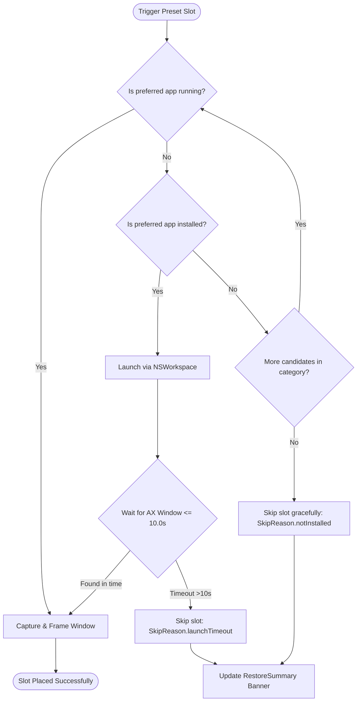

# 📖 User Guide: Window Groups & Workspace Presets (US-WORK-012)

> **Target Audience:** FlowSnap Mac Users (Engineers, Researchers, Writers, Designers & Multitaskers)  
> **Applies to:** FlowSnap 1.0+ (macOS 14 Sonoma & macOS 15 Sequoia)  
> **Last Updated:** September 1, 2026

---

## 🎯 1. Overview & Core Concepts

FlowSnap's **Window Groups & Workspace Presets** feature elevates your Mac desktop into an automated, coordinated multi-window environment. Instead of dragging and snapping individual windows one by one every time you switch tasks, FlowSnap lets you configure and synchronize complete multi-app workflows with a single keystroke.

```
┌──────────────────────────────────────────────────────────────────────────┐
│                         FLOWSNAP WORKSPACE ENGINE                        │
├────────────────────────────────────┬─────────────────────────────────────┤
│      🎨 Curated Workflow Presets   │      🔗 Linked Window Groups        │
│  • Instant 1-tap desktop layout    │  • Coordinated minimize & un-min    │
│  • Smart app category fallbacks    │  • Synchronized group focus/raise   │
│  • Resolution & gap aware math     │  • Cohesive spatial window movement │
└────────────────────────────────────┴─────────────────────────────────────┘
```

### Key Capabilities

1. **Curated Workflow Presets**: 4 built-in, production-ready presets (**Coding**, **Research**, **Writing**, and **Design**) crafted with optimal ergonomic ratios and zone placements.
2. **Smart Category Fallback**: Don't use VS Code? FlowSnap automatically falls back to Xcode, Nova, or TextEdit. Missing Figma? FlowSnap smoothly checks Sketch or Illustrator.
3. **Resilient Auto-Launch**: Automatically opens closed workflow apps and places their windows the moment they appear—with a 10-second non-blocking safety timer.
4. **Linked Window Groups**: Automatically groups cooperating windows together. Minimizing, restoring, or focusing one window synchronizes the entire group seamlessly.
5. **Conflict-Free Global Hotkeys**: Dedicated hotkeys (`⌃⌥C`, `⌃⌥R`, `⌃⌥W`, `⌃⌥D`) with built-in duplicate detection and inline warnings in Settings.

---

## 📐 2. Visual Layout Diagrams of Curated Presets

FlowSnap comes pre-loaded with four standardized layout archetypes. Each preset maps logical application categories into proportional screen zones.

---

### 1. 💻 Coding Preset (`builtin.coding`)

- **Default Shortcut:** `⌃⌥C` (`Control + Option + C`)
- **Ratio Configuration:** `60% / 25% / 15%` Asymmetric Split
- **Best For:** Full-stack development, debugging, and terminal workflows.

```
┌──────────────────────────────────────┬───────────────────────────────────┐
│                                      │                                   │
│                                      │     Documentation / Web Browser   │
│                                      │     Zone: Top-Right (40%w x 60%h) │
│                                      │     Candidates: Chrome, Safari,   │
│         Primary Code Editor          │                 Arc, Brave        │
│                                      │                                   │
│        Zone: Left 60% (.left60_40)   ├───────────────────────────────────┤
│        Candidates: VS Code, Xcode,   │                                   │
│                    Nova, TextEdit    │     Terminal / Debug Console      │
│                                      │     Zone: Bottom-Right (40%w x 40%h)│
│                                      │     Candidates: Terminal, iTerm2, │
│                                      │                 Ghostty, Alacritty│
└──────────────────────────────────────┴───────────────────────────────────┘
```

| Slot Role                    | Category    | Primary App                         | Fallback Candidates        | Target Zone    | Proportions              |
| :--------------------------- | :---------- | :---------------------------------- | :------------------------- | :------------- | :----------------------- |
| **Primary Code Editor**      | `.editor`   | VS Code (`com.microsoft.VSCode`)    | Xcode, Nova, TextEdit      | `.left60_40`   | `60% Width, 100% Height` |
| **Documentation / Browser**  | `.browser`  | Google Chrome (`com.google.Chrome`) | Safari, Arc, Brave         | `.topRight`    | `40% Width, 60% Height`  |
| **Terminal / Debug Console** | `.terminal` | Terminal (`com.apple.Terminal`)     | iTerm2, Ghostty, Alacritty | `.bottomRight` | `40% Width, 40% Height`  |

---

### 2. 📚 Research Preset (`builtin.research`)

- **Default Shortcut:** `⌃⌥R` (`Control + Option + R`)
- **Ratio Configuration:** `50% / 25% / 25%` Split
- **Best For:** Literature review, academic study, cross-referencing papers, and note-taking.

```
┌──────────────────────────────────────┬───────────────────────────────────┐
│                                      │                                   │
│                                      │     Notes & Knowledge Base        │
│                                      │     Zone: Top-Right (50%w x 50%h) │
│       Primary Research Browser       │     Candidates: Apple Notes,      │
│                                      │                 Notion, Obsidian  │
│        Zone: Left 50% (.leftHalf)    │                                   │
│        Candidates: Chrome, Safari,   ├───────────────────────────────────┤
│                    Arc               │                                   │
│                                      │     Reference & Sources Browser   │
│                                      │     Zone: Bottom-Right (50%w x 50%h)│
│                                      │     Candidates: Safari, Chrome,   │
│                                      │                 Brave             │
└──────────────────────────────────────┴───────────────────────────────────┘
```

| Slot Role                    | Category   | Primary App                     | Fallback Candidates | Target Zone    | Proportions              |
| :--------------------------- | :--------- | :------------------------------ | :------------------ | :------------- | :----------------------- |
| **Primary Research Browser** | `.browser` | Google Chrome                   | Safari, Arc         | `.leftHalf`    | `50% Width, 100% Height` |
| **Notes & Knowledge Base**   | `.notes`   | Apple Notes (`com.apple.Notes`) | Notion, Obsidian    | `.topRight`    | `50% Width, 50% Height`  |
| **Reference & Sources**      | `.browser` | Safari (`com.apple.Safari`)     | Chrome, Brave       | `.bottomRight` | `50% Width, 50% Height`  |

---

### 3. ✍️ Writing Preset (`builtin.writing`)

- **Default Shortcut:** `⌃⌥W` (`Control + Option + W`)
- **Ratio Configuration:** `70% / 30%` Asymmetric Split
- **Best For:** Distraction-free article authoring, report composition, and book drafting.

```
┌─────────────────────────────────────────────────────┬────────────────────┐
│                                                     │                    │
│                                                     │  Reference Browser │
│               Focused Document Editor               │                    │
│                                                     │  Zone: Right 30%   │
│             Zone: Left 70% (.left70_30)             │  (.rightOneThird)  │
│                                                     │                    │
│          Candidates: Pages, Word, Obsidian,         │  Candidates:       │
│                      TextEdit                       │  Safari, Chrome,   │
│                                                     │  Arc               │
│                                                     │                    │
└─────────────────────────────────────────────────────┴────────────────────┘
```

| Slot Role                   | Category   | Primary App                     | Fallback Candidates                | Target Zone      | Proportions              |
| :-------------------------- | :--------- | :------------------------------ | :--------------------------------- | :--------------- | :----------------------- |
| **Focused Document Editor** | `.writing` | Apple Pages (`com.apple.Pages`) | Microsoft Word, Obsidian, TextEdit | `.left70_30`     | `70% Width, 100% Height` |
| **Reference & Research**    | `.browser` | Safari (`com.apple.Safari`)     | Google Chrome, Arc                 | `.rightOneThird` | `30% Width, 100% Height` |

---

### 4. 🎨 Design Preset (`builtin.design`)

- **Default Shortcut:** `⌃⌥D` (`Control + Option + D`)
- **Ratio Configuration:** `70% / 30%` Asymmetric Split
- **Best For:** UI/UX prototyping, vector illustration, and asset previewing.

```
┌─────────────────────────────────────────────────────┬────────────────────┐
│                                                     │                    │
│                                                     │  Assets & Preview  │
│                UI & Vector Design Tool              │                    │
│                                                     │  Zone: Right 30%   │
│             Zone: Left 70% (.left70_30)             │  (.rightOneThird)  │
│                                                     │                    │
│          Candidates: Figma, Sketch, Illustrator     │  Candidates:       │
│                                                     │  Safari, Chrome    │
│                                                     │                    │
└─────────────────────────────────────────────────────┴────────────────────┘
```

| Slot Role                      | Category   | Primary App                         | Fallback Candidates       | Target Zone      | Proportions              |
| :----------------------------- | :--------- | :---------------------------------- | :------------------------ | :--------------- | :----------------------- |
| **UI & Vector Design Tool**    | `.design`  | Figma Desktop (`com.figma.Desktop`) | Sketch, Adobe Illustrator | `.left70_30`     | `70% Width, 100% Height` |
| **Assets & Prototype Preview** | `.browser` | Safari (`com.apple.Safari`)         | Google Chrome             | `.rightOneThird` | `30% Width, 100% Height` |

---

## 🚀 3. Step-by-Step Walkthrough Guides

### Method 1: Instant Activation via Global Hotkeys

The fastest way to transform your desktop is using system-wide hotkeys:

1. **Press the hotkey** for your desired workflow:
   - **Coding:** `⌃⌥C` (Control + Option + C)
   - **Research:** `⌃⌥R` (Control + Option + R)
   - **Writing:** `⌃⌥W` (Control + Option + W)
   - **Design:** `⌃⌥D` (Control + Option + D)
2. **Observe FlowSnap in action**:
   - FlowSnap identifies eligible running or installed applications matching the preset's slots.
   - Windows are calculated against your **active display's visible bounds** (preserving your Menu Bar, Dock, and Window Gap settings).
   - Windows smoothly animate to their target zones.
   - Placed windows are automatically linked into an active **Window Group**.
3. **Check the Status Banner**:
   - A non-blocking toast surfaces confirmation:  
     `Restored Coding Preset (3/3 windows)`

> [!TIP]
> **Multi-Monitor Display Awareness:** Presets apply to the display where your mouse cursor or active window is currently located. Focus a window on your secondary 4K display and press `⌃⌥C` to frame the layout on that screen!

---

### Method 2: Launching from the Menu Bar

If you prefer mouse navigation or want to check preset shortcuts visually:

```
┌──────────────────────────────┐
│  ◫ FlowSnap            Ready │
├──────────────────────────────┤
│  QUICK SNAP                  │
│  [ Left ]       [ Right ]    │
│  [ Top ]        [ Bottom ]   │
│  [ Maximize ]   [ Restore ]  │
├──────────────────────────────┤
│  PRESETS                     │
│  [ </> Coding     ⌃⌥C ]      │
│  [ 📚 Research   ⌃⌥R ]      │
│  [ ✍️ Writing    ⌃⌥W ]      │
│  [ 🎨 Design     ⌃⌥D ]      │
│  Restored Coding (3/3)  [✕]  │
├──────────────────────────────┤
│  ⚙️ Settings...           ⌘, │
│  ⏻ Quit FlowSnap         ⌘Q │
└──────────────────────────────┘
```

1. Click the **FlowSnap icon** (`◫`) in your macOS Menu Bar.
2. Locate the **PRESETS** section in the dropdown menu.
3. Click any preset button (e.g. **Coding** or **Research**).
4. FlowSnap applies the layout and displays the inline result banner.

---

### Method 3: Inspecting & Customizing in Settings > Presets Gallery

You can customize shortcuts, inspect slot assignments, and preview layout schematics in FlowSnap Preferences:

1. Open FlowSnap Settings by pressing **`⌘,`** or clicking **Settings...** in the Menu Bar popover.
2. Select the **Presets** tab.
3. Review each preset card:
   - **Visual Schematic Preview:** Color-coded layout diagrams representing the spatial zones.
   - **Slot Breakdown:** Lists each slot's role and preferred apps.
   - **Shortcut Recorder Field:** Click to capture your personalized key combo.
   - **Auto-Grouped Badge:** Indicates whether windows are automatically linked upon placement.
   - **Apply Button:** Click to test the layout immediately from Settings.

```
┌─────────────────────────────────────────────────────────────────────────────┐
│  General   Snap HUD   Shortcuts   Presets   Window Groups   Workspaces      │
├─────────────────────────────────────────────────────────────────────────────┤
│  Workflow Presets                                                           │
│  Multi-window workspaces tailored for coding, research, writing, and design │
│                                                                             │
│  ┌───────────────────────────────────────────────────────────────────────┐  │
│  │ </>  Coding                     Editor (60%), Browser (25%), Term...  │  │
│  │      [ Apply ]                                                        │  │
│  │ ───────────────────────────────────────────────────────────────────── │  │
│  │  ┌───────────┐  • Primary Code Editor (VS Code, Xcode, Nova)          │  │
│  │  │ [Code] [W]│  • Documentation / Web (Chrome, Safari, Arc)           │  │
│  │  │        [T]│  • Terminal / Debug Console (Terminal, iTerm2)         │  │
│  │  └───────────┘                                                        │  │
│  │ ───────────────────────────────────────────────────────────────────── │  │
│  │  Shortcut: [ ⌃⌥C ] [Reset]                           🔗 Auto-grouped   │  │
│  └───────────────────────────────────────────────────────────────────────┘  │
└─────────────────────────────────────────────────────────────────────────────┘
```

#### Changing a Preset Shortcut & Collision Protection

1. In the preset card footer, click inside the **Shortcut Recorder** field.
2. Press your desired modifier keys and letter (e.g. `⌃⌥⇧C`).
3. If you accidentally press a key combination already in use (e.g. `⌃⌥←` for _Snap Left Half_):
   - FlowSnap **rejects the shortcut** immediately.
   - Displays an inline warning banner: `⚠️ Cannot assign ⌃⌥←: Shortcut already in use by Left Half`.
   - Your previous working shortcut remains intact.
4. Click **Reset** at any time to revert back to the factory default shortcut.

---

## 🔗 4. Managing Linked Window Groups

When FlowSnap activates a preset (or when windows are grouped together), member windows form a unified **Window Group**.

### Coordinated Group Behaviors

```
              ┌──────────────────────────┐
              │   Window Group Manager   │
              └────────────┬─────────────┘
          ┌────────────────┼────────────────┐
          ▼                ▼                ▼
   [ 🟡 Minimize ]   [ 🎯 Focus ]     [ ✥ Move ]
   Minimizes all     Brings all to    Translates all
   members at once   front, keeping   members with
                     target on top    spatial cohesion
```

1. **Simultaneous Minimize & Un-minimize**:
   - Click the yellow **minimize** (`—`) button on _any_ member window (or press `⌘M`).
   - FlowSnap immediately minimizes all linked windows into the Dock simultaneously.
   - Click the app icon in the Dock or switch to it via `⌘Tab` to un-minimize all group members together.
2. **Simultaneous Group Focus (Preserving Z-Order)**:
   - When you click on any background window belonging to an active group, FlowSnap raises all fellow group members to the foreground, while keeping the clicked window on top.
3. **Synchronized Spatial Move**:
   - Moving or snapping the anchor window shifts associated member windows smoothly across the display.

---

### Configuring Groups in Settings > Window Groups

1. Open **Settings (`⌘,`)** and click the **Window Groups** tab.
2. View all currently active groups, member window counts, and individual sync options:

```
┌─────────────────────────────────────────────────────────────────────────────┐
│  General   Snap HUD   Shortcuts   Presets   Window Groups   Workspaces      │
├─────────────────────────────────────────────────────────────────────────────┤
│  Active Window Groups                                                       │
│  Linked window groups coordinate minimize, focus, and move behaviors.      │
│                                                                             │
│  ┌───────────────────────────────────────────────────────────────────────┐  │
│  │ ◫  Coding  [ 3 windows ]                                 [ Ungroup ]  │  │
│  │ ───────────────────────────────────────────────────────────────────── │  │
│  │  Synchronization Behavior:                                            │  │
│  │  [✓] Minimize together     [✓] Focus together     [✓] Move together   │  │
│  └───────────────────────────────────────────────────────────────────────┘  │
└─────────────────────────────────────────────────────────────────────────────┘
```

- **Toggle Sync Options**: Check or uncheck `Minimize together`, `Focus together`, or `Move together` to customize group behavior.
- **Ungroup Action**: Click **"Ungroup"** to dissolve the link and return all windows to independent standalone behavior.

> [!NOTE]
> **Automatic Group Lifecycle (Self-Pruning):** When you close a grouped window (`⌘W` or `⌘Q`), FlowSnap automatically detects its removal. If a group falls below 2 windows, it **automatically dissolves** without requiring manual cleanup.

---

## ⚙️ 5. Smart App Resolution & Resilient Fallbacks

FlowSnap does not require specific apps to be installed. When a preset is activated, the **Smart Category Fallback Engine** resolves applications according to the following priority waterfall:



### Resolution Examples

| Scenario                      | What Happens                                                                                                                         | Result Banner                               |
| :---------------------------- | :----------------------------------------------------------------------------------------------------------------------------------- | :------------------------------------------ |
| **All preferred apps open**   | VS Code, Chrome, and Terminal are already running.                                                                                   | `Restored Coding Preset (3/3 windows)`      |
| **Alternative app installed** | You use Xcode instead of VS Code. Xcode is launched and placed in the 60% slot.                                                      | `Restored Coding Preset (3/3 windows)`      |
| **Design tool missing**       | Neither Figma, Sketch, nor Illustrator is installed. The design slot is gracefully skipped while the browser is framed normally.     | `Restored 1/2 — Design Tool not installed`  |
| **App startup delayed**       | A heavy IDE takes >10 seconds to open its first window. FlowSnap times out the slot safely without hanging macOS or freezing the UI. | `Restored 2/3 — Timeout waiting for window` |

---

## ⚡ 6. Default Keyboard Shortcuts & Quick Reference

| Shortcut  | Preset / Action     | Description & Target Zones                                                            |
| :-------- | :------------------ | :------------------------------------------------------------------------------------ |
| **`⌃⌥C`** | **Coding Preset**   | Editor (`60%` Left), Browser (`25%` Top-Right), Terminal (`15%` Bottom-Right)         |
| **`⌃⌥R`** | **Research Preset** | Primary Browser (`50%` Left), Notes (`25%` Top-Right), Reference (`25%` Bottom-Right) |
| **`⌃⌥W`** | **Writing Preset**  | Document Editor (`70%` Left), Reference Browser (`30%` Right)                         |
| **`⌃⌥D`** | **Design Preset**   | Design Canvas (`70%` Left), Preview Browser (`30%` Right)                             |
| **`⌃⌥←`** | **Snap Left Half**  | Standard 50% left snap (Standard Snap action)                                         |
| **`⌃⌥→`** | **Snap Right Half** | Standard 50% right snap (Standard Snap action)                                        |
| **`⌃⌥↑`** | **Maximize**        | Maximize active window across full screen                                             |
| **`⌃⌥↓`** | **Restore**         | Return active window to pre-snap frame                                                |
| **`⌘,`**  | **Settings**        | Open FlowSnap Preferences                                                             |
| **`⌘Q`**  | **Quit FlowSnap**   | Quit application and release system hotkeys                                           |

---

## 🛡️ 7. Architecture Safeguards (Behind the Scenes)

1. **Re-Entrancy Echo Loop Guard**: Programmatically minimizing 3 linked windows generates 3 incoming macOS Accessibility notifications. FlowSnap uses an atomic synchronization generation counter to swallow event echoes and prevent infinite feedback loops.
2. **Zero Private API Policy**: All window querying and framing uses public `Accessibility` (`AXUIElement`) APIs, ensuring full compatibility with macOS Sonoma, Sequoia, and future macOS versions.
3. **Display-Aware Math**: Preset frames are computed at restore time based on the active screen's resolution and respect user-configured Window Gaps (`0px` to `16px`).
4. **Non-Blocking UI**: App launches and Accessibility window polling run asynchronously in background tasks, ensuring 60fps responsiveness throughout the operating system.

---

## ❓ 8. Frequently Asked Questions (FAQ) & Troubleshooting

### Q1: What happens if I have multiple windows of the same app open (e.g. 3 Safari windows)?

**A:** FlowSnap intelligently selects the primary active window and assigns secondary windows to subsequent matching slots (e.g., in the Research preset, the first Safari window is placed in the Left Half, and a second Safari window is placed in the Bottom-Right Reference slot).

### Q2: Why does FlowSnap show "Accessibility Required"?

**A:** macOS requires explicit Accessibility permissions for third-party apps to reposition windows. If untrusted, open **System Settings > Privacy & Security > Accessibility** and ensure **FlowSnap** is enabled.

### Q3: Can I create my own custom preset layouts?

**A:** Yes! You can use **FlowSnap Workspaces** (`US-WORK-011`) to arrange any arbitrary set of open windows on your screen, click **`+`** in the Menu Bar or Settings, and save it as a permanent custom Workspace with custom ratios and SF Symbols.

### Q4: If I move a grouped window to an external monitor, does the rest of the group follow?

**A:** When `Move together` is enabled, moving the anchor window coordinates relative delta translation for fellow group members, shifting them cohesively onto the new monitor.

### Q5: How do I disable auto-grouping if I want preset windows to behave independently?

**A:** You can simply click **"Ungroup"** in **Settings > Window Groups** at any time, or uncheck the synchronization toggles (`Minimize together`, `Focus together`, `Move together`).
