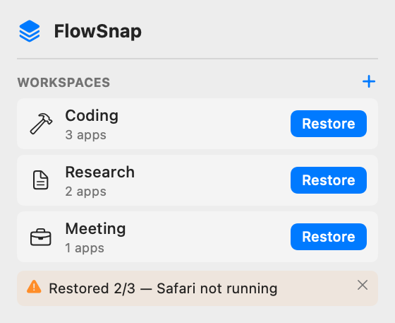
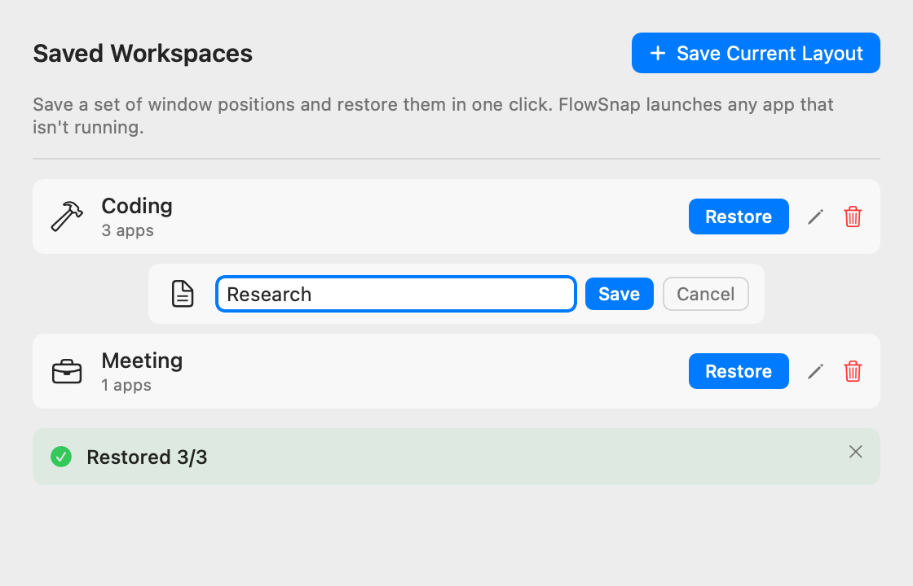

# 📖 Hướng Dẫn Sử Dụng: Lưu & Khôi Phục Bố Cục Workspace (US-WORK-011)

# User Guide: Workspace Snapshot & Intent-Based Multi-Window Restoration

> **Đối tượng:** Người dùng FlowSnap trên macOS (macOS 14 Sonoma & macOS 15 Sequoia)  
> **Tính năng:** Workspace Snapshot & Intent-Based Restoration (US-WORK-011)  
> **Cập nhật:** 31/08/2026

---

## 🎯 1. Tổng Quan (Overview)

Tính năng **Workspace (Không gian làm việc)** biến FlowSnap từ công cụ chia đôi/chia tư cửa sổ đơn lẻ thành một **Trình điều phối không gian làm việc đa nhiệm chuyên nghiệp**:

- **Lưu theo ý định bố cục & Bảo toàn tỉ lệ tùy biến (Normalized Intent Snapshot)**: FlowSnap ghi nhớ _ứng dụng nào_ nằm ở _phân vùng nào_ và _tỉ lệ kích thước thực tế_ (ví dụ: 80% / 20%, 70% / 30%, 65% / 35%, 1/3, 2/3, 1/4...). Bạn lưu trên màn hình MacBook nhỏ nhưng khi cắm ra màn hình ngoài 4K/UltraWide lớn, bố cục vẫn được tái tạo chuẩn xác 100%.
- **Khôi phục 1-Chạm (1-Tap Restore)**: Chỉ với một cú click, FlowSnap tự động đưa tất cả cửa sổ về đúng vị trí và tỉ lệ đã lưu.
- **Tự động mở ứng dụng đã tắt (Auto-launch Offline Apps)**: Nếu một ứng dụng trong Workspace đang bị tắt hoàn toàn, FlowSnap sẽ tự khởi chạy ứng dụng đó và tự động xếp vào đúng vị trí ngay khi cửa sổ xuất hiện.
- **Vách ngăn thông minh (Zero-Distraction Adaptive Divider)**: Vách ngăn giữa các cửa sổ chỉ sáng lên khi bạn rê chuột hoặc kéo điều chỉnh và sẽ tự động biến mất khi bạn làm việc bình thường hoặc chuyển sang màn hình khác.
- **Bảo toàn cửa sổ khác (Additive Restore)**: Chỉ các cửa sổ thuộc Workspace được sắp xếp, các cửa sổ ứng dụng khác của bạn được giữ nguyên vị trí.

---

## 🚀 2. Hướng Dẫn Chi Tiết Từng Bước

### Bước 1: Sắp xếp các cửa sổ ứng dụng theo ý muốn

Mở các ứng dụng bạn thường dùng cùng nhau (ví dụ: Trình duyệt bên trái chiếm 80% màn hình, Ghi chú/Terminal bên phải chiếm 20%) và sử dụng phím tắt hoặc kéo vách ngăn Adaptive Divider để đạt tỉ lệ hoàn hảo.

---

### Bước 2: Mở hộp thoại Lưu Workspace (Save Workspace Sheet)

Bạn có thể mở hộp thoại Lưu Workspace từ 2 nơi:

1. **Từ thanh Menu Bar**: Click vào icon FlowSnap trên Menu Bar -> Nhấn nút **`+`** ở tiêu đề mục **WORKSPACES**.
2. **Từ cửa sổ Settings**: Mở **Settings...** (`⌘,`) -> Chọn tab **Workspaces** -> Bấm **"Save Current Layout"**.

---

### Bước 3: Đặt tên, chọn Icon và chọn Cửa sổ

Hộp thoại **Save Workspace** sẽ hiển thị các trường sau:

| Thành phần                     | Ý nghĩa & Hướng dẫn                                                                                                                                               |
| :----------------------------- | :---------------------------------------------------------------------------------------------------------------------------------------------------------------- |
| **NAME (Tên Workspace)**       | Nhập tên đại diện (ví dụ: `Coding`, `Research`, `Họp trực tuyến`). Tên không được để trống và không được trùng với workspace đã có.                               |
| **ICON (Biểu tượng)**          | Chọn một biểu tượng trực quan từ bộ 12 icon SF Symbols (Cái búa, Cặp tài liệu, Tay cầm game, Máy ảnh, Nốt nhạc, Bút vẽ, Biểu đồ, Tài liệu...).                    |
| **WINDOWS (Danh sách cửa sổ)** | Hiển thị toàn bộ các cửa sổ ứng dụng đang mở trên màn hình. Mặc định tất cả đều được tích chọn (`✓`). Bạn có thể bỏ tích các cửa sổ không muốn đưa vào workspace. |

---

### Bước 4: Nhấn "Save Workspace"

Nhấn nút **"Save Workspace"** màu xanh để lưu. FlowSnap sẽ lưu bố cục và tỉ lệ khung hình ngay lập tức vào bộ nhớ an toàn.

---

## 🔄 3. Khôi Phục Bố Cục (Restoring a Workspace)

Khi muốn quay lại không gian làm việc đã lưu:

1. Nhấn vào icon **FlowSnap** trên Menu Bar (hoặc mở cửa sổ **Settings → Workspaces**).
2. Nhấn nút **"Restore"** bên cạnh Workspace bạn muốn mở.
3. FlowSnap sẽ tự động:
   - Nhận diện màn hình đang hoạt động (màn hình chứa con trỏ chuột hoặc cửa sổ đang active).
   - Tự động khởi chạy các ứng dụng chưa mở (kể cả khi đã bị `Quit`).
   - Đưa các cửa sổ về đúng phân vùng và đúng tỉ lệ kích thước (ví dụ 80/20) với khoảng cách khe hở (_Window Gap_) hiện tại.
   - **Đưa ứng dụng lên trước mặt**: nếu một ứng dụng đang bị ẩn (Cmd+H) hoặc cửa sổ của nó nằm trên một Space khác, FlowSnap sẽ bỏ ẩn và kích hoạt nó sau khi đã xếp xong cửa sổ — để bạn thực sự nhìn thấy bố cục vừa khôi phục, thay vì chỉ nhận thông báo "đã khôi phục" mà màn hình không thay đổi.
4. Một banner thông báo kết quả sẽ hiện ra (ví dụ: `Restored 2/2 windows`).

---

## ⚙️ 4. Quản Lý Workspace (Đổi tên, Đổi Icon, Xoá)

Mở **Settings...** (`⌘,`) -> chuyển sang tab **Workspaces**:

- **Đổi tên / Sửa Workspace**: Nhấn vào biểu tượng cây bút chì cạnh tên workspace để chỉnh sửa trực tiếp.
- **Xoá Workspace**: Nhấn vào biểu tượng thùng rác (hệ thống sẽ hiển thị hộp thoại xác nhận trước khi xoá).
- **Khôi phục**: Nút **Restore** luôn sẵn sàng để kích hoạt nhanh.

---

## 💡 5. Các Mẹo & Lưu Ý Quan Trọng (Tips & Notes)

- **Tỉ lệ tùy biến (Custom Split Ratio)**: Khi bạn dùng chuột kéo vách ngăn Adaptive Divider để chia màn hình theo tỉ lệ bất kỳ (như 80/20, 75/25, 60/40...), FlowSnap tự động ghi nhớ chính xác tỉ lệ % đó thay vì ép về 50/50.
- **Tự động ẩn vách ngăn (Clean Workspace)**: Khi bạn không rê chuột vào đường tiếp giáp giữa 2 cửa sổ, vách ngăn sẽ ẩn đi hoàn toàn, giữ cho màn hình làm việc luôn sạch sẽ và không gây xao nhãng.
- **Quyền Trợ năng (Accessibility)**: FlowSnap cần quyền Trợ năng để đọc và sắp xếp cửa sổ. Nếu quyền bị tắt, FlowSnap sẽ hiển thị nút **Grant Permission** để hướng dẫn bạn bật lại.
- **Lưu trữ an toàn (Atomic JSON Persistence)**: Dữ liệu Workspace được lưu trữ tại `~/Library/Application Support/FlowSnap/workspaces.json` với cơ chế bảo vệ chống hỏng dữ liệu.
